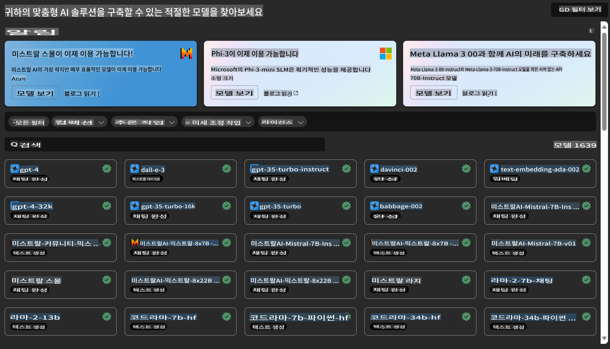
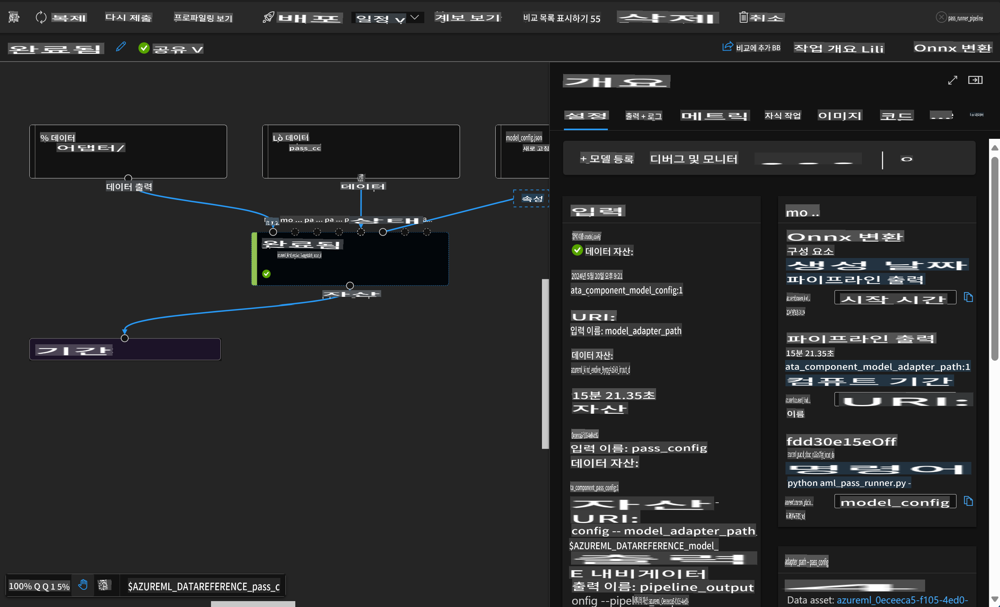

# **Azure Machine Learning 서비스 소개**

[Azure Machine Learning](https://ml.azure.com?WT.mc_id=aiml-138114-kinfeylo)은 기계 학습(ML) 프로젝트 수명 주기를 가속화하고 관리하는 클라우드 서비스입니다.

ML 전문가, 데이터 과학자, 엔지니어는 일상적인 워크플로에서 이를 사용할 수 있습니다:

- 모델을 훈련하고 배포합니다.
- 기계 학습 운영(MLOps)을 관리합니다.
- Azure Machine Learning에서 모델을 만들거나 PyTorch, TensorFlow, scikit-learn과 같은 오픈 소스 플랫폼에서 만든 모델을 사용할 수 있습니다.
- MLOps 도구는 모델을 모니터링하고, 재훈련하며, 다시 배포할 수 있게 도와줍니다.

## Azure Machine Learning은 누구를 위한 것인가?

**데이터 과학자 및 ML 엔지니어**

일상적인 워크플로를 가속화하고 자동화할 수 있는 도구를 사용할 수 있습니다.
Azure ML은 공정성, 설명 가능성, 추적성, 감사 가능성을 위한 기능을 제공합니다.
애플리케이션 개발자:
애플리케이션이나 서비스에 모델을 원활하게 통합할 수 있습니다.

**플랫폼 개발자**

내구성 있는 Azure Resource Manager API가 지원하는 강력한 도구 세트를 사용할 수 있습니다.
이 도구들은 고급 ML 도구를 구축할 수 있게 합니다.

**기업**

Microsoft Azure 클라우드에서 작업하는 기업은 익숙한 보안 및 역할 기반 액세스 제어의 혜택을 누릴 수 있습니다.
프로젝트를 설정하여 보호된 데이터 및 특정 작업에 대한 액세스를 제어할 수 있습니다.

## 팀의 모든 사람을 위한 생산성
ML 프로젝트는 종종 다양한 기술 세트를 가진 팀이 필요합니다.

Azure ML은 다음과 같은 도구를 제공합니다:
- 공유 노트북, 컴퓨팅 리소스, 서버리스 컴퓨팅, 데이터 및 환경을 통해 팀과 협업할 수 있습니다.
- 공정성, 설명 가능성, 추적성, 감사 가능성을 갖춘 모델을 개발하여 계보 및 감사 준수 요구 사항을 충족시킬 수 있습니다.
- ML 모델을 빠르고 쉽게 대규모로 배포하고, MLOps를 통해 효율적으로 관리 및 통제할 수 있습니다.
- 내장된 거버넌스, 보안 및 준수 기능을 사용하여 어디서나 기계 학습 워크로드를 실행할 수 있습니다.

## 교차 호환 플랫폼 도구

ML 팀의 누구나 선호하는 도구를 사용하여 작업을 수행할 수 있습니다.
빠른 실험, 하이퍼파라미터 튜닝, 파이프라인 구축 또는 추론 관리를 하든지 간에, 다음과 같은 익숙한 인터페이스를 사용할 수 있습니다:
- Azure Machine Learning Studio
- Python SDK (v2)
- Azure CLI (v2)
- Azure Resource Manager REST API

모델을 정제하고 개발 주기 동안 협업하면서 Azure Machine Learning studio UI 내에서 자산, 리소스 및 메트릭을 공유하고 찾을 수 있습니다.

## **Azure ML의 LLM/SLM**

Azure ML은 많은 LLM/SLM 관련 기능을 추가하여 LLMOps와 SLMOps를 결합해 기업 전반의 생성형 인공지능 기술 플랫폼을 구축했습니다.

### **모델 카탈로그**

기업 사용자는 모델 카탈로그를 통해 다양한 비즈니스 시나리오에 따라 다양한 모델을 배포하고, 기업 개발자나 사용자가 접근할 수 있도록 Model as Service로 서비스를 제공합니다.

Azure Machine Learning studio의 모델 카탈로그는 생성형 AI 애플리케이션을 구축할 수 있게 해주는 다양한 모델을 발견하고 사용할 수 있는 허브입니다. 모델 카탈로그는 Azure OpenAI 서비스, Mistral, Meta, Cohere, Nvidia, Hugging Face, Microsoft에서 훈련한 모델을 포함한 다양한 모델 제공자의 수백 개 모델을 특징으로 합니다. Microsoft 이외의 제공자의 모델은 Microsoft의 제품 약관에 정의된 비Microsoft 제품이며, 모델과 함께 제공된 약관의 적용을 받습니다.

### **작업 파이프라인**

기계 학습 파이프라인의 핵심은 완전한 기계 학습 작업을 다단계 워크플로로 분할하는 것입니다. 각 단계는 개별적으로 개발, 최적화, 구성 및 자동화할 수 있는 관리 가능한 구성 요소입니다. 단계는 잘 정의된 인터페이스를 통해 연결됩니다. Azure Machine Learning 파이프라인 서비스는 파이프라인 단계 간의 모든 종속성을 자동으로 조정합니다.

SLM / LLM의 미세 조정에서 파이프라인을 통해 데이터, 훈련 및 생성 프로세스를 관리할 수 있습니다.

### **프롬프트 흐름**

Azure Machine Learning 프롬프트 흐름 사용의 이점
Azure Machine Learning 프롬프트 흐름은 사용자들이 아이디어 단계에서 실험 단계로, 궁극적으로는 생산 준비가 된 LLM 기반 애플리케이션으로 전환할 수 있도록 다양한 이점을 제공합니다:

**프롬프트 엔지니어링 민첩성**

인터랙티브 저작 경험: Azure Machine Learning 프롬프트 흐름은 흐름의 구조를 시각적으로 표현하여 사용자가 프로젝트를 쉽게 이해하고 탐색할 수 있도록 합니다. 또한 효율적인 흐름 개발 및 디버깅을 위한 노트북과 같은 코딩 경험을 제공합니다.
프롬프트 튜닝을 위한 변형: 사용자는 여러 프롬프트 변형을 생성하고 비교하여 반복적인 정제 과정을 촉진할 수 있습니다.

평가: 내장된 평가 흐름을 통해 사용자는 프롬프트와 흐름의 품질과 효과를 평가할 수 있습니다.

종합적인 리소스: Azure Machine Learning 프롬프트 흐름은 개발의 출발점이 되는 내장 도구, 샘플 및 템플릿 라이브러리를 포함하여 창의성을 고취시키고 과정을 가속화합니다.

**LLM 기반 애플리케이션의 기업 준비**

협업: Azure Machine Learning 프롬프트 흐름은 팀 협업을 지원하여 여러 사용자가 프롬프트 엔지니어링 프로젝트에서 함께 작업하고 지식을 공유하며 버전 관리를 유지할 수 있도록 합니다.

올인원 플랫폼: Azure Machine Learning 프롬프트 흐름은 개발, 평가에서 배포 및 모니터링에 이르기까지 전체 프롬프트 엔지니어링 프로세스를 간소화합니다. 사용자는 흐름을 Azure Machine Learning 엔드포인트로 쉽게 배포하고 실시간으로 성능을 모니터링하여 최적의 운영 및 지속적인 개선을 보장할 수 있습니다.

Azure Machine Learning 기업 준비 솔루션: 프롬프트 흐름은 Azure Machine Learning의 강력한 기업 준비 솔루션을 활용하여 흐름 개발, 실험 및 배포를 위한 안전하고 확장 가능하며 신뢰할 수 있는 기반을 제공합니다.

Azure Machine Learning 프롬프트 흐름을 사용하면 사용자들은 프롬프트 엔지니어링 민첩성을 발휘하고, 효과적으로 협업하며, LLM 기반 애플리케이션 개발 및 배포의 성공을 위한 기업급 솔루션을 활용할 수 있습니다.

Azure ML의 컴퓨팅 파워, 데이터 및 다양한 구성 요소를 결합하여 기업 개발자들은 손쉽게 자신만의 인공지능 애플리케이션을 구축할 수 있습니다.

면책 조항: 이 번역은 원본을 AI 모델에 의해 번역된 것이며 완벽하지 않을 수 있습니다. 
출력을 검토하고 필요한 수정을 해주시기 바랍니다.