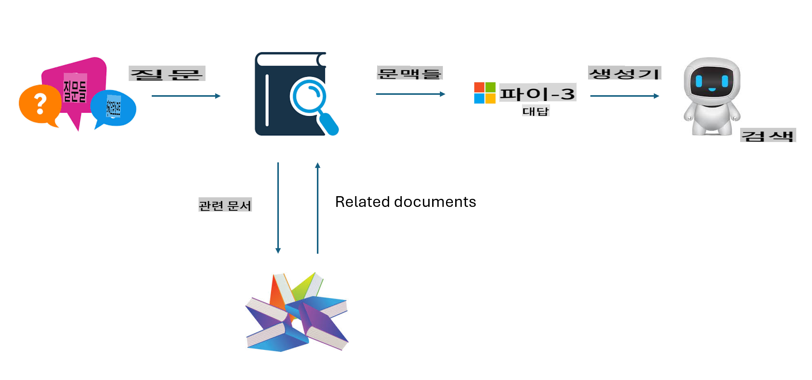
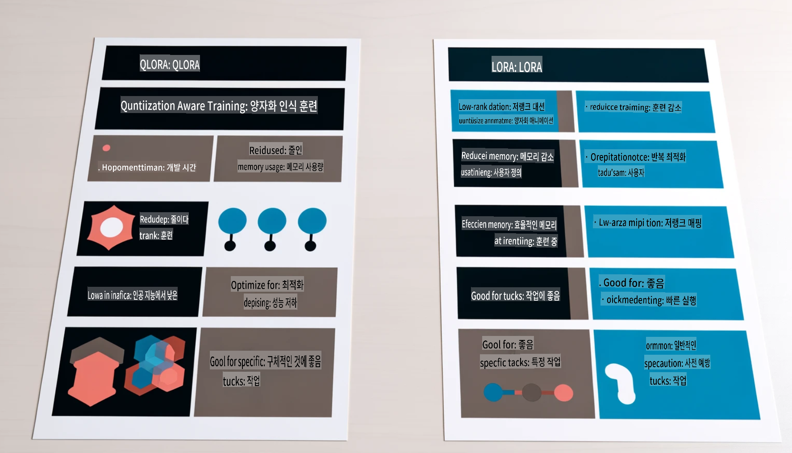

# **Phi-3를 산업 전문가로 만들기**

Phi-3 모델을 산업에 적용하려면 산업 비즈니스 데이터를 Phi-3 모델에 추가해야 합니다. 두 가지 옵션이 있는데, 첫 번째는 RAG(Retrieval Augmented Generation)이고 두 번째는 Fine Tuning입니다.

## **RAG vs Fine-Tuning**

### **Retrieval Augmented Generation**

RAG는 데이터 검색 + 텍스트 생성입니다. 기업의 구조화된 데이터와 비구조화된 데이터를 벡터 데이터베이스에 저장합니다. 관련 콘텐츠를 검색할 때, 관련 요약과 콘텐츠를 찾아 컨텍스트를 형성하고 LLM/SLM의 텍스트 완성 기능을 결합하여 콘텐츠를 생성합니다.

### **Fine-tuning**

Fine-tuning은 특정 모델의 개선을 기반으로 합니다. 모델 알고리즘에서 시작할 필요는 없지만 데이터를 지속적으로 축적해야 합니다. 산업 응용 프로그램에서 더 정밀한 용어와 언어 표현이 필요하다면, Fine-tuning이 더 나은 선택입니다. 하지만 데이터가 자주 변경된다면, Fine-tuning은 복잡해질 수 있습니다.

### **어떻게 선택할까**

1. 외부 데이터를 도입해야 하는 경우, RAG가 최선의 선택입니다.

2. 안정적이고 정밀한 산업 지식 출력을 원한다면, Fine-tuning이 좋은 선택입니다. RAG는 관련 콘텐츠를 우선적으로 가져오지만, 항상 특화된 뉘앙스를 정확히 전달하지 못할 수 있습니다.

3. Fine-tuning은 고품질 데이터 세트가 필요하며, 데이터 범위가 작다면 큰 차이를 만들지 못합니다. RAG는 더 유연합니다.

4. Fine-tuning은 블랙박스와 같아서 내부 메커니즘을 이해하기 어렵습니다. 하지만 RAG는 데이터의 출처를 쉽게 찾을 수 있어 환각이나 콘텐츠 오류를 효과적으로 조정하고 더 나은 투명성을 제공합니다.

### **시나리오**

1. 특정 전문 용어와 표현이 필요한 수직 산업에서는 ***Fine-tuning***이 최선의 선택입니다.

2. 다양한 지식 포인트를 통합하는 QA 시스템에서는 ***RAG***가 최선의 선택입니다.

3. 자동화된 비즈니스 흐름의 조합에서는 ***RAG + Fine-tuning***이 최선의 선택입니다.

## **RAG 사용법**

벡터 데이터베이스는 수학적 형태로 저장된 데이터의 모음입니다. 벡터 데이터베이스는 기계 학습 모델이 이전 입력을 기억하기 쉽게 하여 검색, 추천, 텍스트 생성과 같은 사용 사례를 지원할 수 있게 합니다. 데이터는 정확한 일치 대신 유사성 메트릭을 기반으로 식별될 수 있어 컴퓨터 모델이 데이터의 컨텍스트를 이해할 수 있게 합니다.

벡터 데이터베이스는 RAG를 실현하는 핵심입니다. text-embedding-3, jina-ai-embedding 등과 같은 벡터 모델을 통해 데이터를 벡터 저장으로 변환할 수 있습니다.

RAG 애플리케이션 생성에 대해 자세히 알아보세요 [https://github.com/microsoft/Phi-3CookBook](https://github.com/microsoft/Phi-3CookBook?WT.mc_id=aiml-138114-kinfeylo) 

## **Fine-tuning 사용법**

Fine-tuning에서 일반적으로 사용되는 알고리즘은 Lora와 QLora입니다. 어떻게 선택할까요?
- [이 샘플 노트북으로 더 알아보기](../../../../code/04.Finetuning/Phi_3_Inference_Finetuning.ipynb)
- [Python FineTuning 샘플 예제](../../../../code/04.Finetuning/FineTrainingScript.py)

### **Lora와 QLora**

LoRA (Low-Rank Adaptation)와 QLoRA (Quantized Low-Rank Adaptation)는 모두 Parameter Efficient Fine Tuning (PEFT)을 사용하여 대형 언어 모델(LLM)을 미세 조정하는 기술입니다. PEFT 기술은 전통적인 방법보다 모델을 더 효율적으로 훈련시키도록 설계되었습니다. 
LoRA는 가중치 업데이트 매트릭스에 저순위 근사를 적용하여 메모리 사용량을 줄이는 독립형 미세 조정 기술입니다. 빠른 훈련 시간을 제공하며 전통적인 미세 조정 방법과 비슷한 성능을 유지합니다. 

QLoRA는 LoRA의 확장 버전으로, 메모리 사용량을 더욱 줄이기 위해 양자화 기술을 통합합니다. QLoRA는 사전 훈련된 LLM의 가중치 매개변수의 정밀도를 4비트로 양자화하여 메모리 효율성을 높입니다. 그러나 추가적인 양자화 및 역양자화 단계로 인해 QLoRA 훈련은 LoRA 훈련보다 약 30% 느립니다.

QLoRA는 양자화 과정에서 발생하는 오류를 수정하기 위해 LoRA를 보조 도구로 사용합니다. QLoRA는 상대적으로 작고 쉽게 구할 수 있는 GPU로 수십억 개의 매개변수를 가진 대형 모델을 미세 조정할 수 있게 합니다. 예를 들어, QLoRA는 36개의 GPU가 필요한 70B 매개변수 모델을 단 2개의 GPU로 미세 조정할 수 있습니다.

면책 조항: 이 번역은 원본을 AI 모델이 번역한 것으로 완벽하지 않을 수 있습니다.
출력을 검토하시고 필요한 수정 사항이 있으면 수정해 주시기 바랍니다.