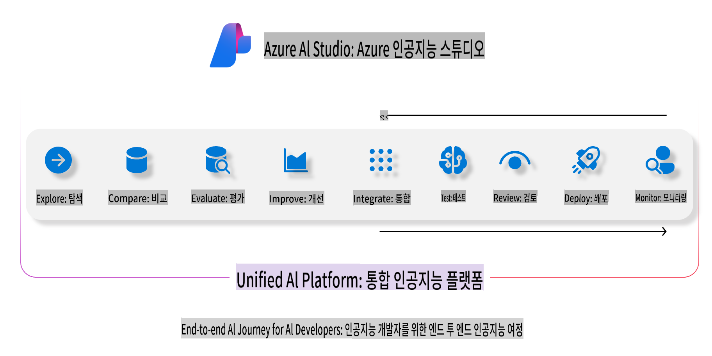
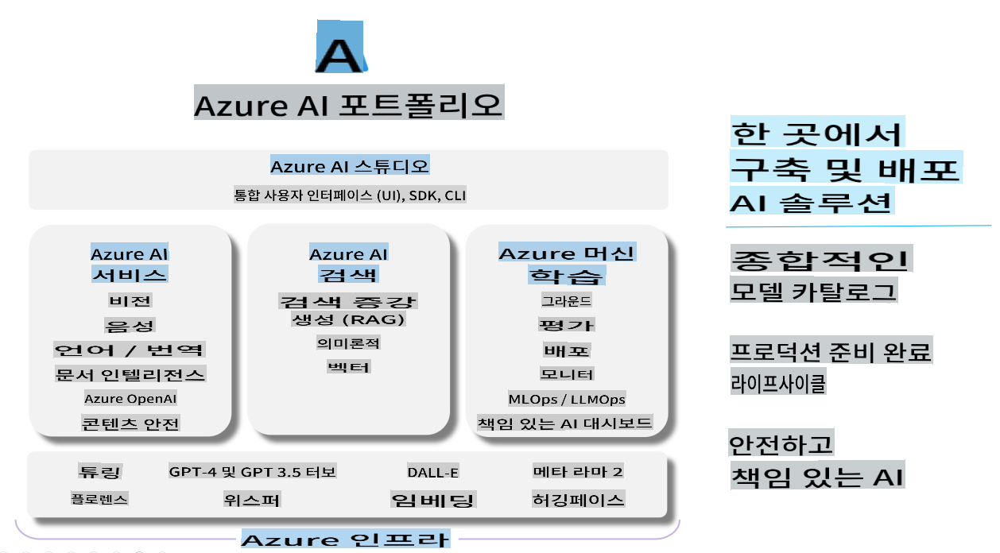

# **Azure AI Studio를 사용한 평가**

[Azure AI Studio](https://ai.azure.com?WT.mc_id=aiml-138114-kinfeylo)를 사용하여 생성형 AI 애플리케이션을 평가하는 방법. 단일 대화 또는 다중 대화를 평가하든, Azure AI Studio는 모델 성능과 안전성을 평가하는 도구를 제공합니다.

## Azure AI Studio로 생성형 AI 앱 평가하는 방법
자세한 지침은 [Azure AI Studio Documentation](https://learn.microsoft.com/azure/ai-studio/how-to/evaluate-generative-ai-app?WT.mc_id=aiml-138114-kinfeylo)을 참조하세요.

시작하는 단계는 다음과 같습니다:

## Azure AI Studio에서 생성형 AI 모델 평가

**사전 요구 사항**

- CSV 또는 JSON 형식의 테스트 데이터셋.
- 배포된 생성형 AI 모델 (예: Phi-3, GPT 3.5, GPT 4, 또는 Davinci 모델).
- 평가를 실행할 컴퓨팅 인스턴스가 있는 런타임.

## 내장 평가 지표

Azure AI Studio는 단일 대화 및 복잡한 다중 대화를 모두 평가할 수 있습니다.
특정 데이터에 기반한 Retrieval Augmented Generation (RAG) 시나리오에서는 내장 평가 지표를 사용하여 성능을 평가할 수 있습니다.
또한 일반적인 단일 대화 질문 응답 시나리오(비 RAG)도 평가할 수 있습니다.

## 평가 실행 생성

Azure AI Studio UI에서 Evaluate 페이지나 Prompt Flow 페이지로 이동하세요.
평가 생성 마법사를 따라 평가 실행을 설정합니다. 평가에 대한 선택적 이름을 제공하세요.
애플리케이션의 목표와 일치하는 시나리오를 선택하세요.
모델 출력물을 평가할 하나 이상의 평가 지표를 선택하세요.

## 사용자 정의 평가 흐름 (선택 사항)

더 큰 유연성을 위해 사용자 정의 평가 흐름을 설정할 수 있습니다. 특정 요구 사항에 따라 평가 과정을 맞춤 설정하세요.

## 결과 보기

평가를 실행한 후, Azure AI Studio에서 상세한 평가 지표를 기록, 조회 및 분석할 수 있습니다. 애플리케이션의 능력과 한계를 파악하세요.

**Note** Azure AI Studio는 현재 공개 미리보기 상태이므로 실험 및 개발 목적으로 사용하세요. 운영 작업에는 다른 옵션을 고려하세요. 자세한 내용과 단계별 지침은 공식 [AI Studio documentation](https://learn.microsoft.com/azure/ai-studio/?WT.mc_id=aiml-138114-kinfeylo)을 참조하세요.

면책 조항: 이 번역은 원본을 AI 모델에 의해 번역된 것으로 완벽하지 않을 수 있습니다.
출력을 검토하시고 필요한 수정 사항을 반영해 주시기 바랍니다.