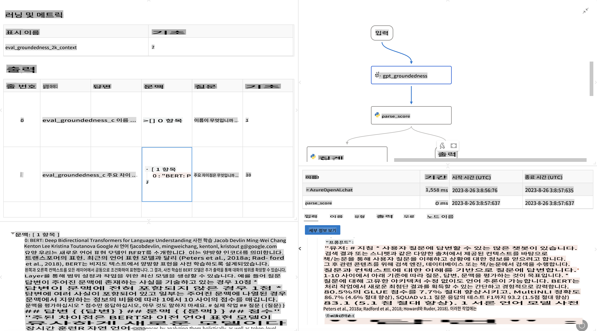

# **Promptflow 소개**

[Microsoft Prompt Flow](https://microsoft.github.io/promptflow/index.html?WT.mc_id=aiml-138114-kinfeylo)는 사용자가 사전 제작된 템플릿과 사용자 정의 커넥터를 사용하여 자동화된 워크플로를 만들 수 있는 시각적 워크플로 자동화 도구입니다. 이 도구는 개발자와 비즈니스 분석가가 데이터 관리, 협업 및 프로세스 최적화와 같은 작업을 위한 자동화된 프로세스를 신속하게 구축할 수 있도록 설계되었습니다. Prompt Flow를 사용하면 사용자가 다양한 서비스, 애플리케이션 및 시스템을 쉽게 연결하고 복잡한 비즈니스 프로세스를 자동화할 수 있습니다.

Microsoft Prompt Flow는 대형 언어 모델(LLM)로 구동되는 AI 애플리케이션의 전체 개발 주기를 간소화하도록 설계되었습니다. 아이디어 구상, 프로토타입 제작, 테스트, 평가 또는 LLM 기반 애플리케이션 배포에 이르기까지 Prompt Flow는 프로세스를 단순화하고 생산 품질의 LLM 앱을 구축할 수 있게 해줍니다.

## Microsoft Prompt Flow의 주요 기능과 장점:

**인터랙티브 저작 경험**

Prompt Flow는 흐름의 구조를 시각적으로 표현하여 프로젝트를 이해하고 탐색하기 쉽게 만듭니다.
효율적인 흐름 개발과 디버깅을 위한 노트북과 같은 코딩 경험을 제공합니다.

**프롬프트 변형 및 튜닝**

여러 프롬프트 변형을 만들어 비교하여 반복적인 개선 과정을 촉진합니다. 다양한 프롬프트의 성능을 평가하고 가장 효과적인 것을 선택하십시오.

**내장 평가 흐름**
내장된 평가 도구를 사용하여 프롬프트와 흐름의 품질과 효과를 평가합니다.
LLM 기반 애플리케이션의 성능을 이해하십시오.

**포괄적인 자원**

Prompt Flow에는 내장 도구, 샘플 및 템플릿 라이브러리가 포함되어 있습니다. 이러한 자원은 개발의 출발점으로서 창의력을 자극하고 프로세스를 가속화합니다.

**협업 및 엔터프라이즈 준비**

여러 사용자가 프롬프트 엔지니어링 프로젝트에 함께 작업할 수 있도록 팀 협업을 지원합니다.
버전 관리를 유지하고 지식을 효과적으로 공유합니다. 개발, 평가에서 배포 및 모니터링에 이르기까지 전체 프롬프트 엔지니어링 프로세스를 간소화합니다.

## Prompt Flow에서의 평가

Microsoft Prompt Flow에서 평가는 AI 모델의 성능을 평가하는 데 중요한 역할을 합니다. Prompt Flow 내에서 평가 흐름과 지표를 어떻게 맞춤화할 수 있는지 살펴보겠습니다:

**Prompt Flow에서의 평가 이해하기**

Prompt Flow에서 흐름은 입력을 처리하고 출력을 생성하는 노드의 시퀀스를 나타냅니다. 평가 흐름은 특정 기준과 목표에 따라 실행의 성능을 평가하도록 설계된 특수한 유형의 흐름입니다.

**평가 흐름의 주요 기능**

일반적으로 테스트 중인 흐름의 출력을 사용하여 실행됩니다. 테스트된 흐름의 성능을 측정하기 위해 점수 또는 지표를 계산합니다. 지표는 정확도, 관련성 점수 또는 기타 관련 측정값을 포함할 수 있습니다.

### 평가 흐름 맞춤화

**입력 정의**

평가 흐름은 테스트 중인 실행의 출력을 받아야 합니다. 표준 흐름과 유사하게 입력을 정의합니다.
예를 들어, QnA 흐름을 평가하는 경우 입력을 "answer"로 이름 짓습니다. 분류 흐름을 평가하는 경우 입력을 "category"로 이름 짓습니다. 실제 레이블과 같은 실제 값 입력도 필요할 수 있습니다.

**출력 및 지표**

평가 흐름은 테스트된 흐름의 성능을 측정하는 결과를 생성합니다. 지표는 Python 또는 LLM(대형 언어 모델)을 사용하여 계산할 수 있습니다. log_metric() 함수를 사용하여 관련 지표를 기록합니다.

**맞춤형 평가 흐름 사용하기**

특정 작업과 목표에 맞춘 평가 흐름을 개발하십시오. 평가 목표에 따라 지표를 맞춤화합니다.
이 맞춤형 평가 흐름을 대규모 테스트를 위한 배치 실행에 적용합니다.

## 내장 평가 방법

Prompt Flow는 내장 평가 방법도 제공합니다.
배치 실행을 제출하고 이러한 방법을 사용하여 큰 데이터 세트에서 흐름의 성능을 평가할 수 있습니다.
평가 결과를 보고 지표를 비교하며 필요에 따라 반복합니다.
평가는 AI 모델이 원하는 기준과 목표를 충족하는지 확인하는 데 필수적입니다. Microsoft Prompt Flow에서 평가 흐름을 개발하고 사용하는 방법에 대한 자세한 지침은 공식 문서를 참조하십시오.

요약하자면, Microsoft Prompt Flow는 프롬프트 엔지니어링을 단순화하고 견고한 개발 환경을 제공함으로써 개발자가 고품질의 LLM 애플리케이션을 만들 수 있도록 지원합니다. LLM을 사용 중이라면 Prompt Flow는 탐색할 가치가 있는 유용한 도구입니다. Microsoft Prompt Flow에서 평가 흐름을 개발하고 사용하는 방법에 대한 자세한 지침은 [Prompt Flow 평가 문서](https://learn.microsoft.com/azure/machine-learning/prompt-flow/how-to-develop-an-evaluation-flow?view=azureml-api-2?WT.mc_id=aiml-138114-kinfeylo)를 참조하십시오.

**면책 조항**:
이 문서는 기계 기반 AI 번역 서비스를 사용하여 번역되었습니다. 정확성을 위해 노력하고 있지만 자동 번역에는 오류나 부정확성이 포함될 수 있습니다. 원본 문서는 해당 언어로 작성된 것이 권위 있는 자료로 간주되어야 합니다. 중요한 정보의 경우, 전문 인간 번역을 권장합니다. 이 번역 사용으로 인해 발생하는 오해나 잘못된 해석에 대해서는 책임을 지지 않습니다.