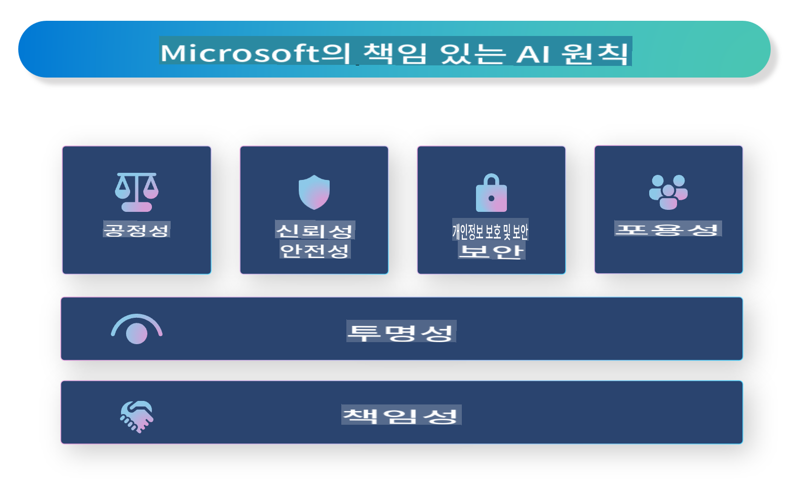

# **책임 있는 AI 소개**

[Microsoft Responsible AI](https://www.microsoft.com/ai/responsible-ai?WT.mc_id=aiml-138114-kinfeylo)는 개발자와 조직이 투명하고 신뢰할 수 있으며 책임감 있는 AI 시스템을 구축하도록 돕는 것을 목표로 하는 이니셔티브입니다. 이 이니셔티브는 프라이버시, 공정성, 투명성 등 윤리적 원칙에 맞춘 책임 있는 AI 솔루션을 개발하기 위한 지침과 자원을 제공합니다. 또한 책임 있는 AI 시스템을 구축하는 데 따르는 몇 가지 도전과제와 모범 사례에 대해 살펴보겠습니다.

## Microsoft Responsible AI 개요

**윤리적 원칙**

Microsoft Responsible AI는 프라이버시, 공정성, 투명성, 책임감, 안전성 등의 윤리적 원칙에 따라 운영됩니다. 이러한 원칙은 AI 시스템이 윤리적이고 책임감 있게 개발되도록 설계되었습니다.

**투명한 AI**

Microsoft Responsible AI는 AI 시스템의 투명성을 강조합니다. 여기에는 AI 모델이 어떻게 작동하는지 명확하게 설명하고 데이터 소스와 알고리즘을 공개하는 것이 포함됩니다.

**책임 있는 AI**

[Microsoft Responsible AI](https://www.microsoft.com/ai/responsible-ai?WT.mc_id=aiml-138114-kinfeylo)는 AI 모델이 어떻게 결정을 내리는지에 대한 통찰력을 제공할 수 있는 책임 있는 AI 시스템의 개발을 촉진합니다. 이는 사용자가 AI 시스템의 출력을 이해하고 신뢰하는 데 도움이 됩니다.

**포용성**

AI 시스템은 모두에게 혜택을 주도록 설계되어야 합니다. Microsoft는 다양한 관점을 고려하고 편견이나 차별을 피하는 포용적인 AI를 만들기 위해 노력합니다.

**신뢰성과 안전성**

AI 시스템이 신뢰할 수 있고 안전한지 확인하는 것은 매우 중요합니다. Microsoft는 일관되게 성능을 발휘하고 유해한 결과를 피하는 견고한 모델을 구축하는 데 중점을 둡니다.

**AI의 공정성**

Microsoft Responsible AI는 AI 시스템이 편향된 데이터나 알고리즘으로 훈련될 경우 편견을 영속화할 수 있다는 점을 인식합니다. 이 이니셔티브는 인종, 성별, 나이와 같은 요소에 기반한 차별을 하지 않는 공정한 AI 시스템을 개발하기 위한 지침을 제공합니다.

**프라이버시와 보안**

Microsoft Responsible AI는 AI 시스템에서 사용자 프라이버시와 데이터 보안을 보호하는 것의 중요성을 강조합니다. 여기에는 강력한 데이터 암호화와 접근 제어를 구현하고 정기적으로 AI 시스템의 취약성을 감사하는 것이 포함됩니다.

**책임과 책임감**

Microsoft Responsible AI는 AI 개발 및 배포에서 책임과 책임감을 촉진합니다. 여기에는 개발자와 조직이 AI 시스템과 관련된 잠재적 위험을 인식하고 그 위험을 완화하기 위한 조치를 취하는 것이 포함됩니다.

## 책임 있는 AI 시스템 구축을 위한 모범 사례

**다양한 데이터 세트를 사용하여 AI 모델 개발**

AI 시스템에서 편향을 피하기 위해서는 다양한 관점과 경험을 대표하는 다양한 데이터 세트를 사용하는 것이 중요합니다.

**설명 가능한 AI 기술 사용**

설명 가능한 AI 기술은 사용자가 AI 모델이 어떻게 결정을 내리는지 이해하는 데 도움을 줄 수 있으며, 이는 시스템에 대한 신뢰를 높일 수 있습니다.

**정기적으로 AI 시스템의 취약성 감사**

AI 시스템의 정기적인 감사는 해결해야 할 잠재적 위험과 취약성을 식별하는 데 도움이 될 수 있습니다.

**강력한 데이터 암호화 및 접근 제어 구현**

데이터 암호화 및 접근 제어는 AI 시스템에서 사용자 프라이버시와 보안을 보호하는 데 도움이 될 수 있습니다.

**AI 개발에서 윤리적 원칙 준수**

공정성, 투명성, 책임감과 같은 윤리적 원칙을 준수하면 AI 시스템에 대한 신뢰를 구축하고 책임감 있게 개발되도록 할 수 있습니다.

## 책임 있는 AI를 위한 AI Foundry 사용

[Azure AI Foundry](https://ai.azure.com?WT.mc_id=aiml-138114-kinfeylo)는 개발자와 조직이 지능적이고 최첨단의 시장 준비된 책임 있는 애플리케이션을 신속하게 만들 수 있도록 하는 강력한 플랫폼입니다. Azure AI Foundry의 주요 기능과 능력은 다음과 같습니다:

**즉시 사용 가능한 API 및 모델**

Azure AI Foundry는 생성 AI, 대화용 자연어 처리, 검색, 모니터링, 번역, 음성, 비전 및 의사 결정을 포함한 다양한 AI 작업을 다루는 사전 구축 및 맞춤형 API 및 모델을 제공합니다.

**Prompt Flow**

Azure AI Foundry의 Prompt Flow를 사용하면 대화형 AI 경험을 만들 수 있습니다. 이를 통해 챗봇, 가상 비서 및 기타 인터랙티브 애플리케이션을 쉽게 구축할 수 있습니다.

**Retrieval Augmented Generation (RAG)**

RAG는 검색 기반 및 생성 기반 접근 방식을 결합한 기술입니다. 사전 지식(검색)과 창의적 생성(생성)을 활용하여 생성된 응답의 품질을 향상시킵니다.

**생성 AI 평가 및 모니터링 메트릭**

Azure AI Foundry는 생성 AI 모델을 평가하고 모니터링할 수 있는 도구를 제공합니다. 이를 통해 성능, 공정성 및 기타 중요한 메트릭을 평가하여 책임 있는 배포를 보장할 수 있습니다. 또한 대시보드를 생성한 경우, Azure Machine Learning Studio의 코드 없는 UI를 사용하여 [Repsonsible AI Toolbox](https://responsibleaitoolbox.ai/?WT.mc_id=aiml-138114-kinfeylo) Python 라이브러리를 기반으로 책임 있는 AI 대시보드 및 관련 성적표를 맞춤화하고 생성할 수 있습니다. 이 성적표는 공정성, 기능 중요성 및 기타 책임 있는 배포 고려 사항과 관련된 주요 통찰력을 기술 및 비기술 이해관계자와 공유하는 데 도움이 됩니다.

책임 있는 AI와 함께 AI Foundry를 사용하려면 다음 모범 사례를 따를 수 있습니다:

**AI 시스템의 문제와 목표 정의**

개발 프로세스를 시작하기 전에 AI 시스템이 해결하려는 문제나 목표를 명확히 정의하는 것이 중요합니다. 이는 효과적인 모델을 구축하는 데 필요한 데이터, 알고리즘 및 자원을 식별하는 데 도움이 됩니다.

**관련 데이터 수집 및 전처리**

AI 시스템의 성능에 영향을 미칠 수 있는 데이터의 품질과 양이 중요합니다. 따라서 관련 데이터를 수집하고, 정리하고, 전처리하여 해결하려는 문제나 인구를 대표하는지 확인하는 것이 중요합니다.

**적절한 평가 알고리즘 선택**

다양한 평가 알고리즘이 있습니다. 데이터와 문제에 가장 적합한 알고리즘을 선택하는 것이 중요합니다.

**모델 평가 및 해석**

AI 모델을 구축한 후에는 적절한 메트릭을 사용하여 성능을 평가하고 결과를 투명하게 해석하는 것이 중요합니다. 이는 모델의 편향이나 한계를 식별하고 필요한 경우 개선하는 데 도움이 됩니다.

**투명성과 설명 가능성 확보**

AI 시스템은 사용자들이 시스템이 어떻게 작동하고 결정을 내리는지 이해할 수 있도록 투명하고 설명 가능해야 합니다. 이는 특히 의료, 금융 및 법률 시스템과 같은 인간의 삶에 큰 영향을 미치는 애플리케이션에 중요합니다.

**모델 모니터링 및 업데이트**

AI 시스템은 시간이 지남에 따라 정확하고 효과적으로 유지되도록 지속적으로 모니터링하고 업데이트해야 합니다. 이는 모델의 지속적인 유지보수, 테스트 및 재훈련을 요구합니다.

결론적으로, Microsoft Responsible AI는 개발자와 조직이 투명하고 신뢰할 수 있으며 책임감 있는 AI 시스템을 구축하도록 돕는 이니셔티브입니다. 책임 있는 AI 구현은 매우 중요하며, Azure AI Foundry는 이를 실질적으로 구현할 수 있도록 돕습니다. 윤리적 원칙과 모범 사례를 따름으로써 AI 시스템이 사회 전체에 혜택을 주는 방식으로 책임감 있게 개발되고 배포될 수 있습니다.

**면책 조항**:
이 문서는 기계 기반 AI 번역 서비스를 사용하여 번역되었습니다. 정확성을 위해 노력하고 있지만, 자동 번역에는 오류나 부정확성이 있을 수 있습니다. 원본 문서를 권위 있는 출처로 간주해야 합니다. 중요한 정보의 경우, 전문적인 인간 번역을 권장합니다. 이 번역 사용으로 인해 발생하는 오해나 잘못된 해석에 대해 책임을 지지 않습니다.