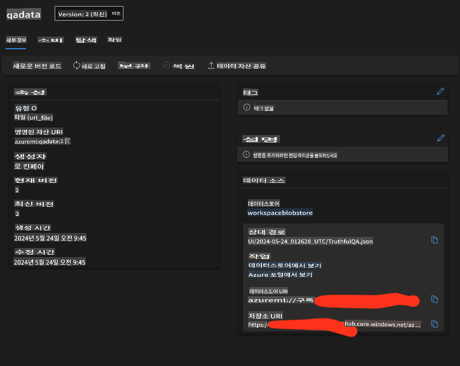

# **산업 데이터를 준비하세요**

우리는 Phi-3-mini를 [TruthfulQA의 데이터](https://github.com/sylinrl/TruthfulQA/blob/main/TruthfulQA.csv)에 주입하고자 합니다. 첫 번째 단계는 TruthfulQA의 데이터를 가져오는 것입니다.

### **1. 데이터를 csv로 로드하고 json으로 저장하기**

```python

import csv
import json

csvfile = open('./datasets/TruthfulQA.csv', 'r')
jsonfile = open('./output/TruthfulQA.json', 'w')

fieldnames = ("Type","Category","Question","Best Answer","Correct Answers","Incorrect Answers","Source")

reader = csv.DictReader(csvfile, fieldnames)

for row in reader:
    json.dump(row, jsonfile)
    jsonfile.write('\n')

i = 1
data = []
with open('./output/TruthfulQA.json', 'r') as file:
    for line in file:
        print(line)
        data.append(json.loads(line))
        print(str(i))
        i+=1

```

### **2. 데이터를 Azure ML 데이터스토어에 업로드하기**



### **축하합니다!**

데이터가 성공적으로 로드되었습니다. 이제 Microsoft Olive를 통해 데이터를 구성하고 관련 알고리즘을 설정하세요 [E2E_LoRA&QLoRA_Config_With_Olive.md](./E2E_LoRA&QLoRA_Config_With_Olive.md)

면책 조항: 이 번역은 AI 모델에 의해 원문에서 번역되었으며 완벽하지 않을 수 있습니다.
출력을 검토하고 필요한 수정을 해주시기 바랍니다.