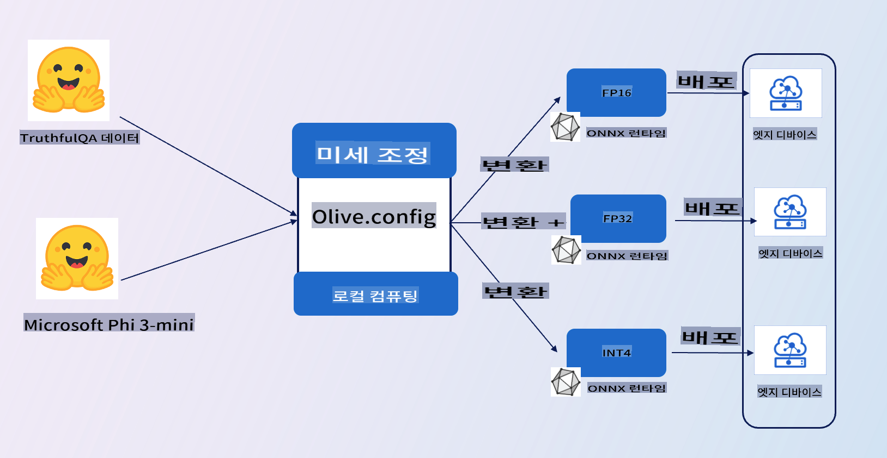

# **E2E 샘플 소개**

이 샘플은 [TruthfulQA의 데이터](https://github.com/sylinrl/TruthfulQA/blob/main/TruthfulQA.csv)를 가져와 Phi-3-mini 모델을 파인튜닝하는 예제입니다. 아키텍처는 다음과 같습니다.

## **소개**

우리는 [TruthfulQA의 데이터](https://github.com/sylinrl/TruthfulQA/blob/main/TruthfulQA.csv) 세트를 사용하여 Phi-3-mini가 우리의 질문에 더 전문적으로 답변할 수 있도록 하고자 합니다. 이것은 Phi-3-mini를 사용한 첫 번째 E2E 프로젝트입니다.

### **요구 사항**

1. Python 3.10+
2. CUDA 12.1
3. Linux / WSL
4. Azure ML
5. Azure Compute A100

### **지식**

1. [Phi-3에 대해 배우기](../01.Introduce/Phi3Family.md)
2. [Microsoft Olive을 사용하여 파인튜닝하는 방법 배우기](../04.Fine-tuning/FineTuning_MicrosoftOlive.md)
3. [생성형 AI를 위한 ONNX Runtime에 대해 배우기](https://github.com/microsoft/onnxruntime-genai)

**면책 조항**:
이 문서는 기계 기반 AI 번역 서비스를 사용하여 번역되었습니다. 정확성을 위해 노력하지만 자동 번역에는 오류나 부정확성이 있을 수 있음을 유의하시기 바랍니다. 원어로 작성된 원본 문서를 권위 있는 자료로 간주해야 합니다. 중요한 정보에 대해서는 전문 인간 번역을 권장합니다. 이 번역 사용으로 인해 발생하는 오해나 오역에 대해 당사는 책임을 지지 않습니다.