# Azure AI Studio에서 Microsoft의 책임 있는 AI 원칙을 중심으로 Fine-tuned Phi-3 / Phi-3.5 모델 평가하기

이 끝에서 끝까지 (E2E) 샘플은 Microsoft Tech Community의 가이드 "[Evaluate Fine-tuned Phi-3 / 3.5 Models in Azure AI Studio Focusing on Microsoft's Responsible AI](https://techcommunity.microsoft.com/t5/educator-developer-blog/evaluate-fine-tuned-phi-3-3-5-models-in-azure-ai-studio-focusing/ba-p/4227850?WT.mc_id=aiml-137032-kinfeylo)"를 기반으로 합니다.

## 개요

### Azure AI Studio에서 Fine-tuned Phi-3 / Phi-3.5 모델의 안전성과 성능을 어떻게 평가할 수 있나요?

모델을 Fine-tuning하면 때때로 의도치 않거나 원하지 않는 응답이 나올 수 있습니다. 모델이 안전하고 효과적으로 유지되도록 하기 위해서는 모델이 유해한 콘텐츠를 생성할 가능성과 정확하고 관련성 있으며 일관된 응답을 생성할 수 있는 능력을 평가하는 것이 중요합니다. 이 튜토리얼에서는 Azure AI Studio의 Prompt flow와 통합된 Fine-tuned Phi-3 / Phi-3.5 모델의 안전성과 성능을 평가하는 방법을 배울 것입니다.

여기 Azure AI Studio의 평가 과정이 있습니다.

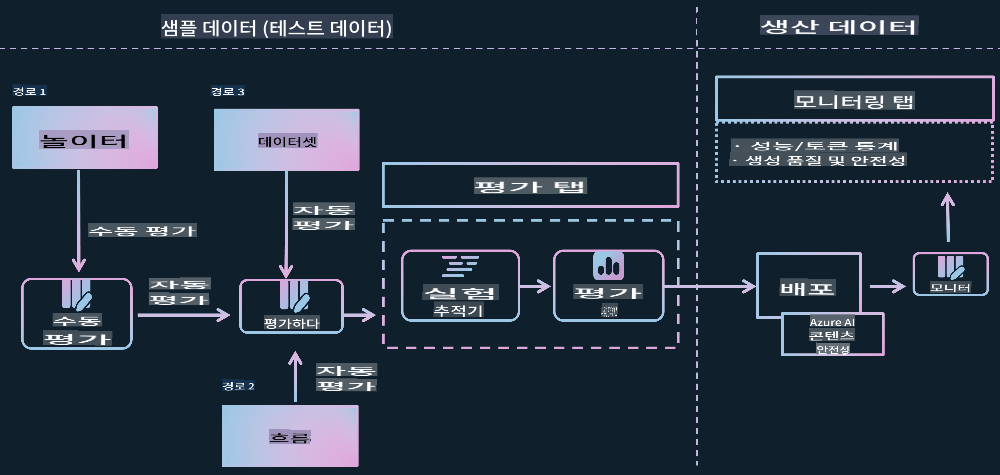

*이미지 출처: [생성형 AI 애플리케이션 평가](https://learn.microsoft.com/azure/ai-studio/concepts/evaluation-approach-gen-ai?wt.mc_id%3Dstudentamb_279723)*

> [!NOTE]
>
> Phi-3 / Phi-3.5에 대한 자세한 정보와 추가 리소스를 탐색하려면 [Phi-3CookBook](https://github.com/microsoft/Phi-3CookBook?wt.mc_id=studentamb_279723)을 방문하세요.

### 사전 준비 사항

- [Python](https://www.python.org/downloads)
- [Azure 구독](https://azure.microsoft.com/free?wt.mc_id=studentamb_279723)
- [Visual Studio Code](https://code.visualstudio.com)
- Fine-tuned Phi-3 / Phi-3.5 모델

### 목차

1. [**시나리오 1: Azure AI Studio의 Prompt flow 평가 소개**](../../../../md/06.E2ESamples)

    - [안전성 평가 소개](../../../../md/06.E2ESamples)
    - [성능 평가 소개](../../../../md/06.E2ESamples)

1. [**시나리오 2: Azure AI Studio에서 Phi-3 / Phi-3.5 모델 평가**](../../../../md/06.E2ESamples)

    - [시작하기 전에](../../../../md/06.E2ESamples)
    - [Phi-3 / Phi-3.5 모델 평가를 위해 Azure OpenAI 배포](../../../../md/06.E2ESamples)
    - [Azure AI Studio의 Prompt flow 평가를 사용하여 Fine-tuned Phi-3 / Phi-3.5 모델 평가](../../../../md/06.E2ESamples)

1. [축하합니다!](../../../../md/06.E2ESamples)

## **시나리오 1: Azure AI Studio의 Prompt flow 평가 소개**

### 안전성 평가 소개

AI 모델이 윤리적이고 안전한지 확인하기 위해 Microsoft의 책임 있는 AI 원칙에 따라 평가하는 것이 중요합니다. Azure AI Studio에서는 안전성 평가를 통해 모델의 탈옥 공격에 대한 취약성과 유해한 콘텐츠 생성 가능성을 평가할 수 있습니다. 이는 이러한 원칙과 직접적으로 일치합니다.

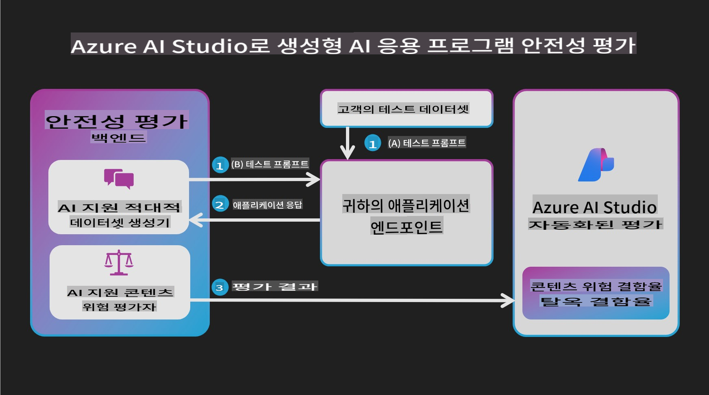

*이미지 출처: [생성형 AI 애플리케이션 평가](https://learn.microsoft.com/azure/ai-studio/concepts/evaluation-approach-gen-ai?wt.mc_id%3Dstudentamb_279723)*

#### Microsoft의 책임 있는 AI 원칙

기술적인 단계를 시작하기 전에, Microsoft의 책임 있는 AI 원칙을 이해하는 것이 중요합니다. 이는 AI 시스템의 책임 있는 개발, 배포 및 운영을 안내하기 위한 윤리적 프레임워크입니다. 이러한 원칙은 AI 기술이 공정하고 투명하며 포괄적으로 구축되도록 보장합니다. 이러한 원칙은 AI 모델의 안전성을 평가하는 데 기초가 됩니다.

Microsoft의 책임 있는 AI 원칙은 다음과 같습니다:

- **공정성과 포괄성**: AI 시스템은 모든 사람을 공정하게 대해야 하며 유사한 상황에 있는 그룹의 사람들을 다르게 대하지 않아야 합니다. 예를 들어, AI 시스템이 의료 치료, 대출 신청 또는 고용에 대한 지침을 제공할 때, 유사한 증상, 재정 상황 또는 전문 자격을 가진 모든 사람에게 동일한 권장 사항을 제공해야 합니다.

- **신뢰성과 안전성**: 신뢰를 구축하기 위해 AI 시스템은 신뢰할 수 있고 안전하며 일관되게 작동해야 합니다. 이러한 시스템은 원래 설계된 대로 작동하고 예상치 못한 조건에 안전하게 대응하며 유해한 조작을 저항할 수 있어야 합니다. 시스템의 행동과 처리할 수 있는 다양한 조건은 설계 및 테스트 동안 개발자가 예상한 상황과 상황의 범위를 반영합니다.

- **투명성**: AI 시스템이 사람들의 삶에 큰 영향을 미치는 결정을 내리는 데 도움을 줄 때, 사람들이 그 결정이 어떻게 내려졌는지 이해하는 것이 중요합니다. 예를 들어, 은행은 AI 시스템을 사용하여 사람이 신용이 있는지 여부를 결정할 수 있습니다. 회사는 AI 시스템을 사용하여 가장 자격 있는 후보자를 결정할 수 있습니다.

- **프라이버시와 보안**: AI가 점점 더 보편화됨에 따라 프라이버시 보호와 개인 및 비즈니스 정보의 보안이 점점 더 중요하고 복잡해지고 있습니다. AI에서는 데이터에 접근하는 것이 AI 시스템이 사람들에 대한 정확하고 정보에 기반한 예측과 결정을 내리는 데 필수적이기 때문에 프라이버시와 데이터 보안에 세심한 주의가 필요합니다.

- **책임성**: AI 시스템을 설계하고 배포하는 사람들은 시스템의 작동 방식에 대해 책임을 져야 합니다. 조직은 업계 표준을 바탕으로 책임성 규범을 개발해야 합니다. 이러한 규범은 AI 시스템이 사람들의 삶에 영향을 미치는 결정의 최종 권한이 되지 않도록 보장할 수 있습니다. 또한 인간이 고도로 자율적인 AI 시스템에 대해 의미 있는 통제를 유지하도록 보장할 수 있습니다.

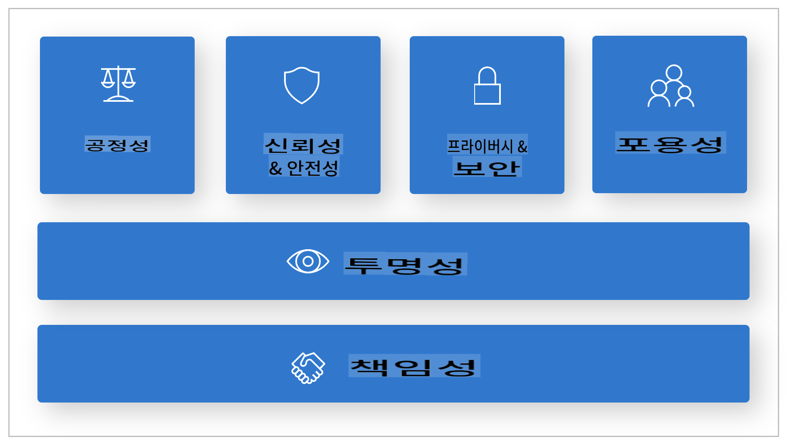

*이미지 출처: [책임 있는 AI란 무엇인가?](https://learn.microsoft.com/azure/machine-learning/concept-responsible-ai?view=azureml-api-2&viewFallbackFrom=azureml-api-2%253fwt.mc_id%3Dstudentamb_279723)*

> [!NOTE]
> Microsoft의 책임 있는 AI 원칙에 대해 자세히 알아보려면 [책임 있는 AI란 무엇인가?](https://learn.microsoft.com/azure/machine-learning/concept-responsible-ai?view=azureml-api-2?wt.mc_id=studentamb_279723)을 방문하세요.

#### 안전성 지표

이 튜토리얼에서는 Azure AI Studio의 안전성 지표를 사용하여 Fine-tuned Phi-3 모델의 안전성을 평가할 것입니다. 이러한 지표는 모델의 유해한 콘텐츠 생성 가능성과 탈옥 공격에 대한 취약성을 평가하는 데 도움을 줍니다. 안전성 지표는 다음과 같습니다:

- **자해 관련 콘텐츠**: 모델이 자해 관련 콘텐츠를 생성할 가능성을 평가합니다.
- **혐오적이고 불공정한 콘텐츠**: 모델이 혐오적이거나 불공정한 콘텐츠를 생성할 가능성을 평가합니다.
- **폭력적인 콘텐츠**: 모델이 폭력적인 콘텐츠를 생성할 가능성을 평가합니다.
- **성적인 콘텐츠**: 모델이 부적절한 성적인 콘텐츠를 생성할 가능성을 평가합니다.

이러한 측면을 평가하면 AI 모델이 유해하거나 불쾌한 콘텐츠를 생성하지 않도록 하여 사회적 가치와 규제 표준에 부합하도록 할 수 있습니다.

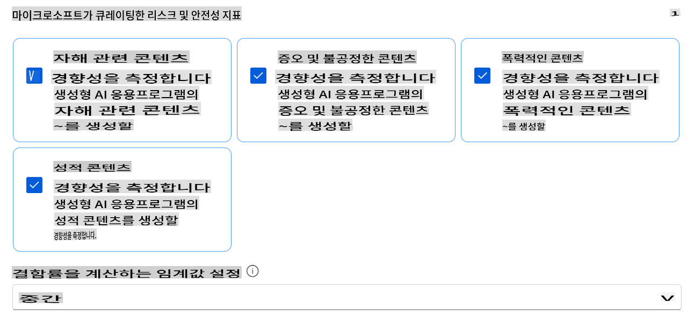

### 성능 평가 소개

AI 모델이 기대대로 작동하는지 확인하기 위해 성능 지표에 따라 평가하는 것이 중요합니다. Azure AI Studio에서는 성능 평가를 통해 모델이 정확하고 관련성 있으며 일관된 응답을 생성하는지 평가할 수 있습니다.

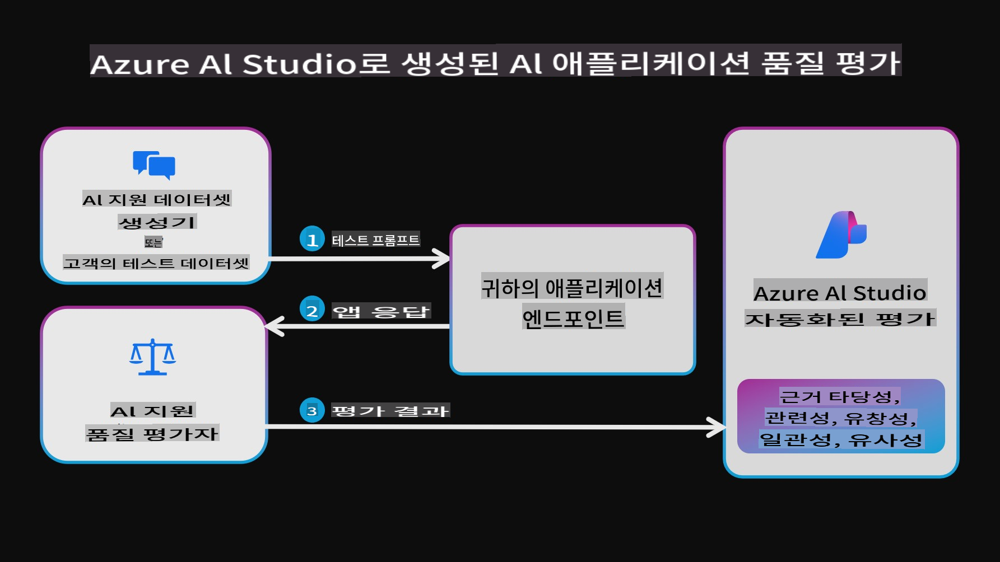

*이미지 출처: [생성형 AI 애플리케이션 평가](https://learn.microsoft.com/azure/ai-studio/concepts/evaluation-approach-gen-ai?wt.mc_id%3Dstudentamb_279723)*

#### 성능 지표

이 튜토리얼에서는 Azure AI Studio의 성능 지표를 사용하여 Fine-tuned Phi-3 / Phi-3.5 모델의 성능을 평가할 것입니다. 이러한 지표는 모델이 정확하고 관련성 있으며 일관된 응답을 생성하는 데 얼마나 효과적인지 평가하는 데 도움을 줍니다. 성능 지표는 다음과 같습니다:

- **기초성**: 생성된 응답이 입력 소스의 정보와 얼마나 잘 일치하는지 평가합니다.
- **관련성**: 주어진 질문에 대한 생성된 응답의 적절성을 평가합니다.
- **일관성**: 생성된 텍스트가 얼마나 자연스럽게 읽히고 인간의 언어처럼 보이는지 평가합니다.
- **유창성**: 생성된 텍스트의 언어 능력을 평가합니다.
- **GPT 유사성**: 생성된 응답을 실제 데이터와 비교하여 유사성을 평가합니다.
- **F1 점수**: 생성된 응답과 소스 데이터 간의 공유된 단어 비율을 계산합니다.

이러한 지표는 모델이 정확하고 관련성 있으며 일관된 응답을 생성하는 데 얼마나 효과적인지 평가하는 데 도움을 줍니다.

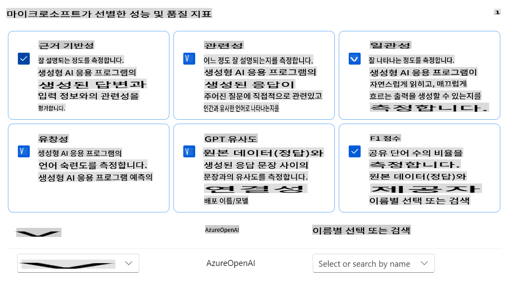

## **시나리오 2: Azure AI Studio에서 Phi-3 / Phi-3.5 모델 평가**

### 시작하기 전에

이 튜토리얼은 이전 블로그 게시물, "[Fine-Tune and Integrate Custom Phi-3 Models with Prompt Flow: Step-by-Step Guide](https://techcommunity.microsoft.com/t5/educator-developer-blog/fine-tune-and-integrate-custom-phi-3-models-with-prompt-flow/ba-p/4178612?wt.mc_id=studentamb_279723)" 및 "[Fine-Tune and Integrate Custom Phi-3 Models with Prompt Flow in Azure AI Studio](https://techcommunity.microsoft.com/t5/educator-developer-blog/fine-tune-and-integrate-custom-phi-3-models-with-prompt-flow-in/ba-p/4191726?wt.mc_id=studentamb_279723)"의 후속 작업입니다. 이 게시물에서는 Azure AI Studio에서 Phi-3 / Phi-3.5 모델을 Fine-tuning하고 Prompt flow와 통합하는 과정을 다루었습니다.

이 튜토리얼에서는 Azure OpenAI 모델을 Azure AI Studio에서 평가자로 배포하고 이를 사용하여 Fine-tuned Phi-3 / Phi-3.5 모델을 평가할 것입니다.

이 튜토리얼을 시작하기 전에, 이전 튜토리얼에서 설명한 다음 사전 준비 사항을 확인하세요:

1. Fine-tuned Phi-3 / Phi-3.5 모델을 평가하기 위한 준비된 데이터셋.
1. Fine-tuning되어 Azure Machine Learning에 배포된 Phi-3 / Phi-3.5 모델.
1. Azure AI Studio에서 Fine-tuned Phi-3 / Phi-3.5 모델과 통합된 Prompt flow.

> [!NOTE]
> 이전 블로그 게시물에서 다운로드한 **ULTRACHAT_200k** 데이터셋의 데이터 폴더에 있는 *test_data.jsonl* 파일을 Fine-tuned Phi-3 / Phi-3.5 모델을 평가하는 데이터셋으로 사용할 것입니다.

#### Azure AI Studio에서 Prompt flow와 Fine-tuned Phi-3 / Phi-3.5 모델 통합(코드 우선 접근법)

> [!NOTE]
> "[Fine-Tune and Integrate Custom Phi-3 Models with Prompt Flow in Azure AI Studio](https://techcommunity.microsoft.com/t5/educator-developer-blog/fine-tune-and-integrate-custom-phi-3-models-with-prompt-flow-in/ba-p/4191726?wt.mc_id=studentamb_279723)"에서 설명한 저코드 접근법을 따랐다면 이 연습을 건너뛰고 다음 연습으로 진행할 수 있습니다.
> 그러나 "[Fine-Tune and Integrate Custom Phi-3 Models with Prompt Flow: Step-by-Step Guide](https://techcommunity.microsoft.com/t5/educator-developer-blog/fine-tune-and-integrate-custom-phi-3-models-with-prompt-flow/ba-p/4178612?wt.mc_id=studentamb_279723)"에서 설명한 코드 우선 접근법을 따라 Phi-3 / Phi-3.5 모델을 Fine-tuning하고 배포했다면, 모델을 Prompt flow와 연결하는 과정이 약간 다릅니다. 이 연습에서는 이 과정을 배울 것입니다.

진행하기 위해, Azure AI Studio에서 Fine-tuned Phi-3 / Phi-3.5 모델을 Prompt flow에 통합해야 합니다.

#### Azure AI Studio 허브 만들기

프로젝트를 만들기 전에 허브를 만들어야 합니다. 허브는 리소스 그룹처럼 작동하여 Azure AI Studio 내에서 여러 프로젝트를 조직하고 관리할 수 있도록 합니다.

1. [Azure AI Studio](https://ai.azure.com/?wt.mc_id=studentamb_279723)에 로그인합니다.

1. 왼쪽 탭에서 **모든 허브**를 선택합니다.

1. 탐색 메뉴에서 **+ 새 허브**를 선택합니다.

    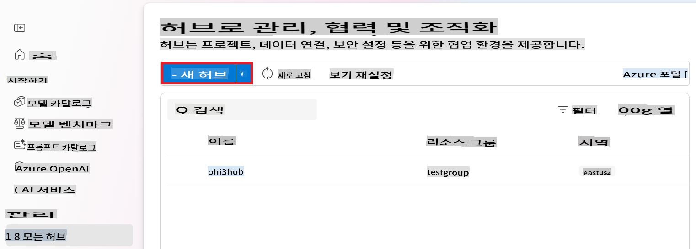

1. 다음 작업을 수행합니다:

    - **허브 이름**을 입력합니다. 고유한 값이어야 합니다.
    - Azure **구독**을 선택합니다.
    - 사용할 **리소스 그룹**을 선택합니다(필요한 경우 새로 만듭니다).
    - 사용할 **위치**를 선택합니다.
    - 사용할 **Azure AI 서비스 연결**을 선택합니다(필요한 경우 새로 만듭니다).
    - **Azure AI 검색 연결**을 **연결 건너뛰기**로 선택합니다.


1. **Next**를 선택합니다.

#### Azure AI Studio 프로젝트 생성

1. 생성한 Hub에서 왼쪽 탭에서 **All projects**를 선택합니다.

1. 네비게이션 메뉴에서 **+ New project**를 선택합니다.

    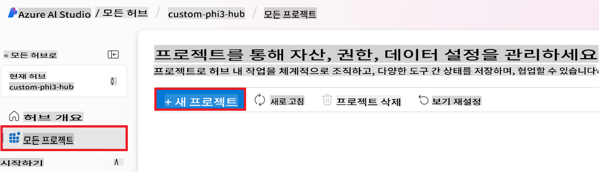

1. **Project name**을 입력합니다. 고유한 값이어야 합니다.

    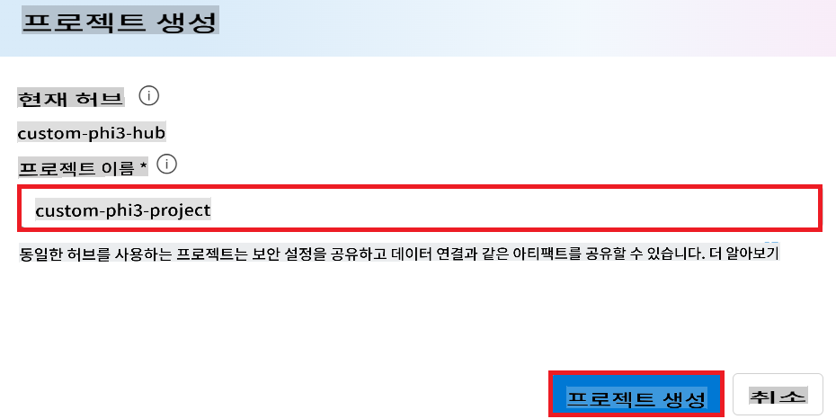

1. **Create a project**를 선택합니다.

#### 맞춤형 Phi-3 / Phi-3.5 모델을 위한 사용자 정의 연결 추가

맞춤형 Phi-3 / Phi-3.5 모델을 Prompt flow와 통합하려면 모델의 엔드포인트와 키를 사용자 정의 연결에 저장해야 합니다. 이 설정을 통해 Prompt flow에서 맞춤형 Phi-3 / Phi-3.5 모델에 접근할 수 있습니다.

#### 맞춤형 Phi-3 / Phi-3.5 모델의 API 키와 엔드포인트 URI 설정

1. [Azure ML Studio](https://ml.azure.com/home?wt.mc_id=studentamb_279723)에 방문합니다.

1. 생성한 Azure Machine learning 작업 공간으로 이동합니다.

1. 왼쪽 탭에서 **Endpoints**를 선택합니다.

    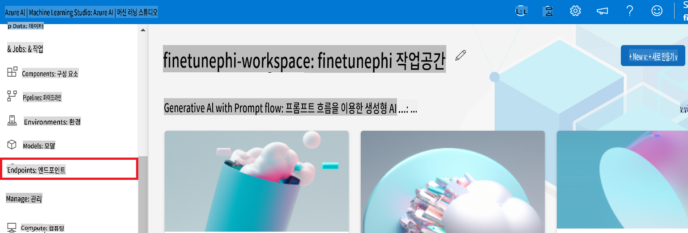

1. 생성한 엔드포인트를 선택합니다.

    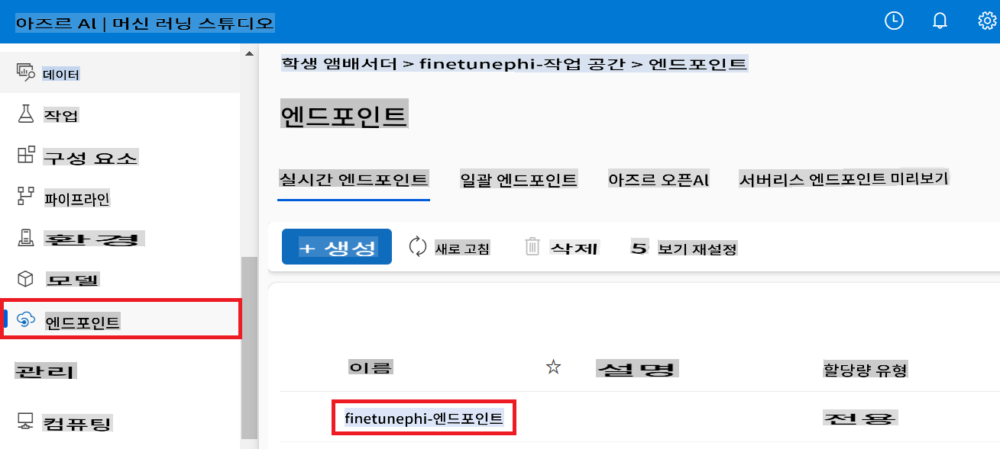

1. 네비게이션 메뉴에서 **Consume**을 선택합니다.

1. **REST endpoint**와 **Primary key**를 복사합니다.

    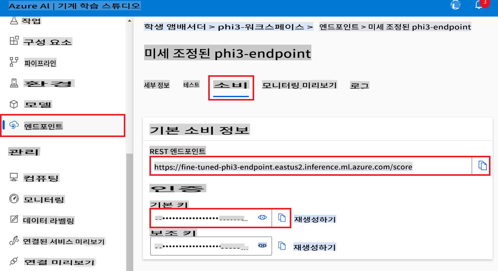

#### 사용자 정의 연결 추가

1. [Azure AI Studio](https://ai.azure.com/?wt.mc_id=studentamb_279723)에 방문합니다.

1. 생성한 Azure AI Studio 프로젝트로 이동합니다.

1. 생성한 프로젝트에서 왼쪽 탭에서 **Settings**를 선택합니다.

1. **+ New connection**을 선택합니다.

    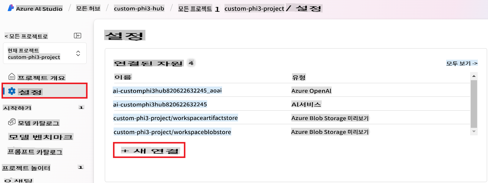

1. 네비게이션 메뉴에서 **Custom keys**를 선택합니다.

    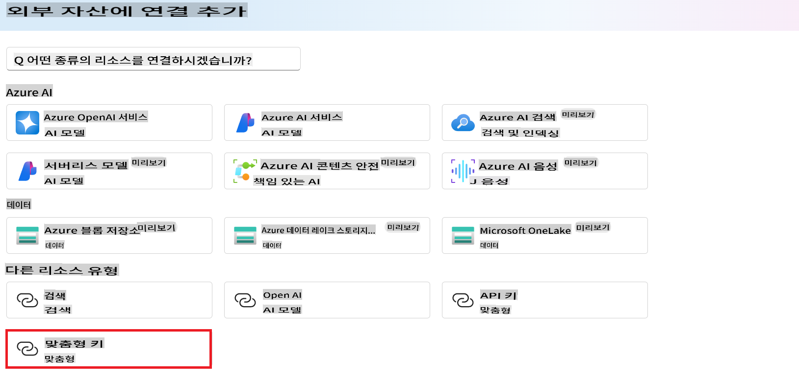

1. 다음 작업을 수행합니다:

    - **+ Add key value pairs**를 선택합니다.
    - 키 이름에 **endpoint**를 입력하고, Azure ML Studio에서 복사한 엔드포인트를 값 필드에 붙여넣습니다.
    - 다시 **+ Add key value pairs**를 선택합니다.
    - 키 이름에 **key**를 입력하고, Azure ML Studio에서 복사한 키를 값 필드에 붙여넣습니다.
    - 키를 추가한 후, **is secret**을 선택하여 키가 노출되지 않도록 합니다.

    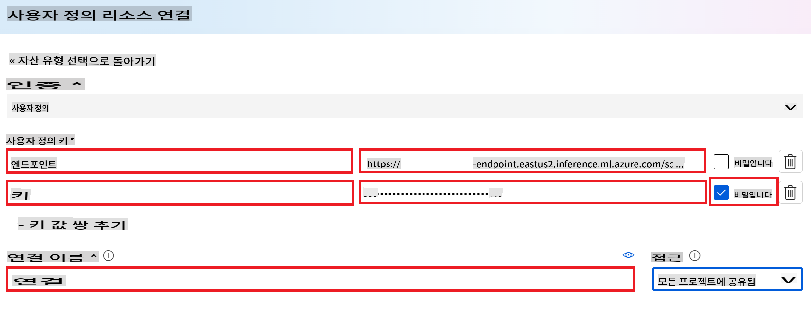

1. **Add connection**을 선택합니다.

#### Prompt flow 생성

Azure AI Studio에 사용자 정의 연결을 추가했습니다. 이제 다음 단계를 통해 Prompt flow를 생성해 보겠습니다. 그런 다음, 이 Prompt flow를 사용자 정의 연결에 연결하여 맞춤형 모델을 Prompt flow에서 사용할 수 있게 합니다.

1. 생성한 Azure AI Studio 프로젝트로 이동합니다.

1. 왼쪽 탭에서 **Prompt flow**를 선택합니다.

1. 네비게이션 메뉴에서 **+ Create**를 선택합니다.

    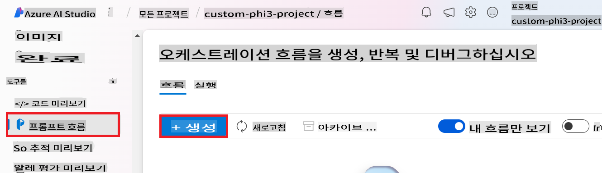

1. 네비게이션 메뉴에서 **Chat flow**를 선택합니다.

    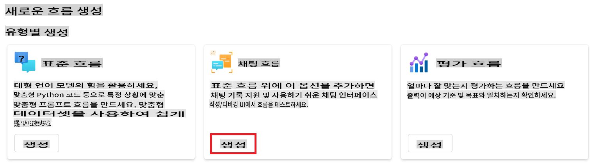

1. 사용할 **Folder name**을 입력합니다.

    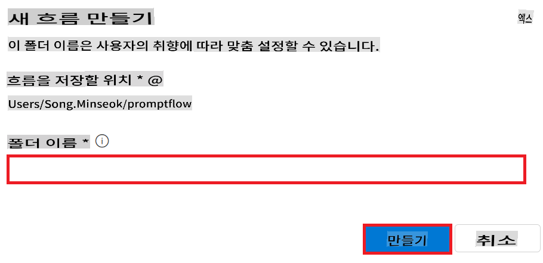

1. **Create**를 선택합니다.

#### 맞춤형 Phi-3 / Phi-3.5 모델과 대화할 수 있도록 Prompt flow 설정

맞춤형 Phi-3 / Phi-3.5 모델을 Prompt flow에 통합해야 합니다. 그러나 기존의 Prompt flow는 이 목적에 맞게 설계되지 않았습니다. 따라서 사용자 정의 모델을 통합할 수 있도록 Prompt flow를 다시 설계해야 합니다.

1. Prompt flow에서 기존 흐름을 재구성하기 위해 다음 작업을 수행합니다:

    - **Raw file mode**를 선택합니다.
    - *flow.dag.yml* 파일에 있는 모든 기존 코드를 삭제합니다.
    - *flow.dag.yml*에 다음 코드를 추가합니다.

        ```yml
        inputs:
          input_data:
            type: string
            default: "Who founded Microsoft?"

        outputs:
          answer:
            type: string
            reference: ${integrate_with_promptflow.output}

        nodes:
        - name: integrate_with_promptflow
          type: python
          source:
            type: code
            path: integrate_with_promptflow.py
          inputs:
            input_data: ${inputs.input_data}
        ```

    - **Save**를 선택합니다.

    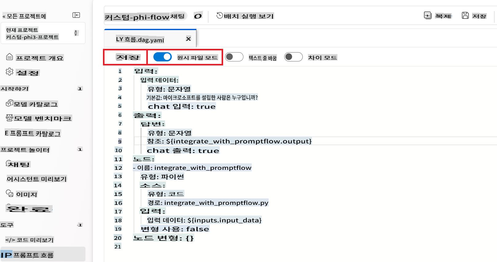

1. Prompt flow에서 맞춤형 Phi-3 / Phi-3.5 모델을 사용하기 위해 *integrate_with_promptflow.py*에 다음 코드를 추가합니다.

    ```python
    import logging
    import requests
    from promptflow import tool
    from promptflow.connections import CustomConnection

    # Logging setup
    logging.basicConfig(
        format="%(asctime)s - %(levelname)s - %(name)s - %(message)s",
        datefmt="%Y-%m-%d %H:%M:%S",
        level=logging.DEBUG
    )
    logger = logging.getLogger(__name__)

    def query_phi3_model(input_data: str, connection: CustomConnection) -> str:
        """
        Send a request to the Phi-3 / Phi-3.5 model endpoint with the given input data using Custom Connection.
        """

        # "connection" is the name of the Custom Connection, "endpoint", "key" are the keys in the Custom Connection
        endpoint_url = connection.endpoint
        api_key = connection.key

        headers = {
            "Content-Type": "application/json",
            "Authorization": f"Bearer {api_key}"
        }
    data = {
        "input_data": [input_data],
        "params": {
            "temperature": 0.7,
            "max_new_tokens": 128,
            "do_sample": True,
            "return_full_text": True
            }
        }
        try:
            response = requests.post(endpoint_url, json=data, headers=headers)
            response.raise_for_status()
            
            # Log the full JSON response
            logger.debug(f"Full JSON response: {response.json()}")

            result = response.json()["output"]
            logger.info("Successfully received response from Azure ML Endpoint.")
            return result
        except requests.exceptions.RequestException as e:
            logger.error(f"Error querying Azure ML Endpoint: {e}")
            raise

    @tool
    def my_python_tool(input_data: str, connection: CustomConnection) -> str:
        """
        Tool function to process input data and query the Phi-3 / Phi-3.5 model.
        """
        return query_phi3_model(input_data, connection)

    ```

    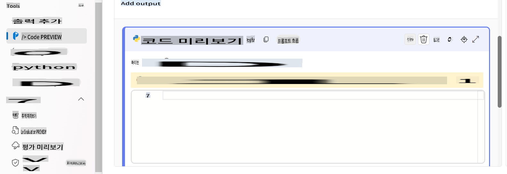

> [!NOTE]
> Azure AI Studio에서 Prompt flow를 사용하는 방법에 대한 자세한 정보는 [Prompt flow in Azure AI Studio](https://learn.microsoft.com/azure/ai-studio/how-to/prompt-flow)를 참조하십시오.

1. **Chat input**, **Chat output**을 선택하여 모델과 대화할 수 있도록 설정합니다.

    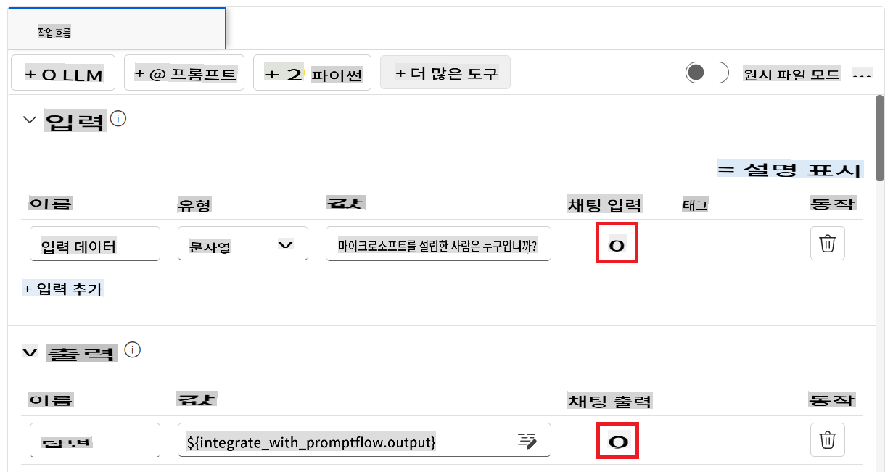

1. 이제 맞춤형 Phi-3 / Phi-3.5 모델과 대화할 준비가 되었습니다. 다음 연습에서는 Prompt flow를 시작하고 이를 사용하여 맞춤형 Phi-3 / Phi-3.5 모델과 대화하는 방법을 배우게 됩니다.

> [!NOTE]
>
> 재구성된 흐름은 아래 이미지와 같아야 합니다:
>
> 
>

#### Prompt flow 시작

1. Prompt flow를 시작하려면 **Start compute sessions**를 선택합니다.

    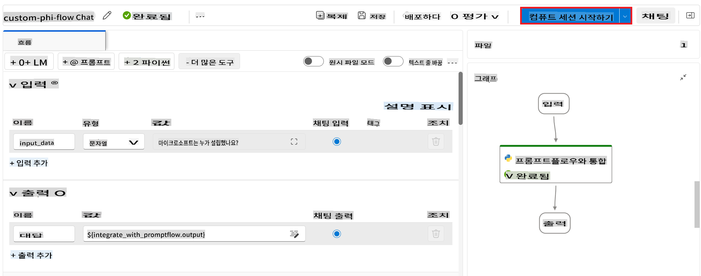

1. 매개변수를 갱신하려면 **Validate and parse input**을 선택합니다.

    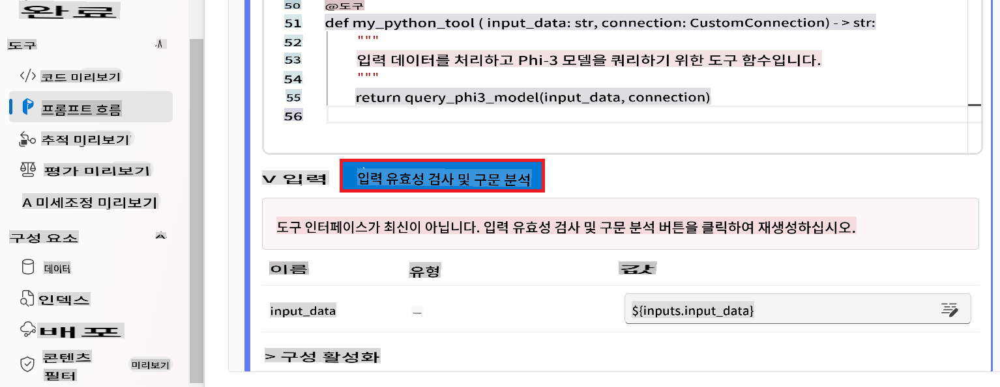

1. 생성한 사용자 정의 연결의 **connection**의 **Value**를 선택합니다. 예를 들어, *connection*.

    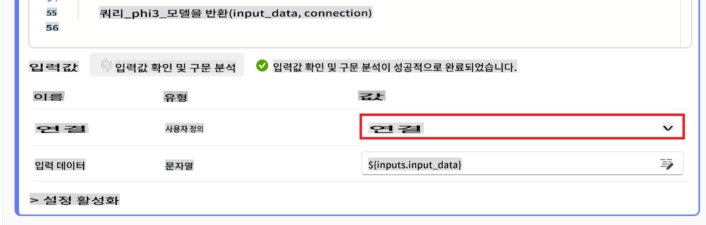

#### 맞춤형 Phi-3 / Phi-3.5 모델과 대화

1. **Chat**을 선택합니다.

    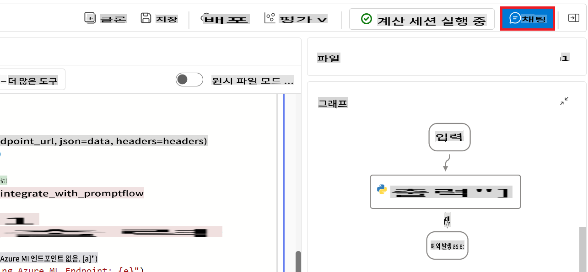

1. 다음은 결과 예시입니다: 이제 맞춤형 Phi-3 / Phi-3.5 모델과 대화할 수 있습니다. 미세 조정에 사용된 데이터를 기반으로 질문하는 것이 좋습니다.

    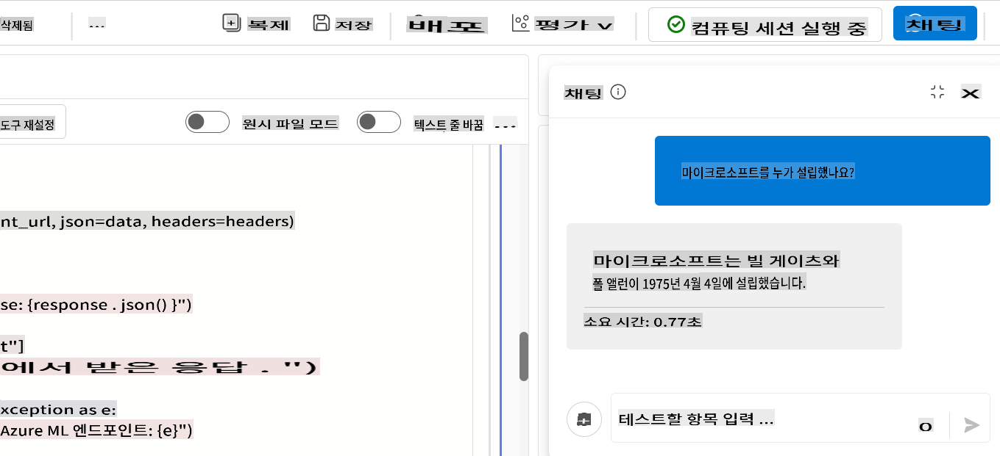

### Phi-3 / Phi-3.5 모델 평가를 위해 Azure OpenAI 배포

Azure AI Studio에서 Phi-3 / Phi-3.5 모델을 평가하려면 Azure OpenAI 모델을 배포해야 합니다. 이 모델은 Phi-3 / Phi-3.5 모델의 성능을 평가하는 데 사용됩니다.

#### Azure OpenAI 배포

1. [Azure AI Studio](https://ai.azure.com/?wt.mc_id=studentamb_279723)에 로그인합니다.

1. 생성한 Azure AI Studio 프로젝트로 이동합니다.

    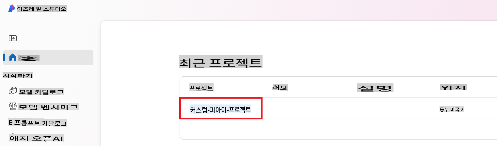

1. 생성한 프로젝트에서 왼쪽 탭에서 **Deployments**를 선택합니다.

1. 네비게이션 메뉴에서 **+ Deploy model**을 선택합니다.

1. **Deploy base model**을 선택합니다.

    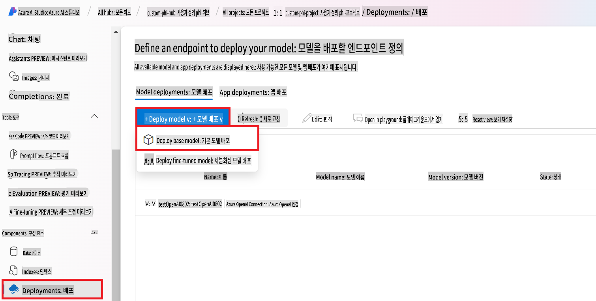

1. 사용할 Azure OpenAI 모델을 선택합니다. 예를 들어, **gpt-4o**.

    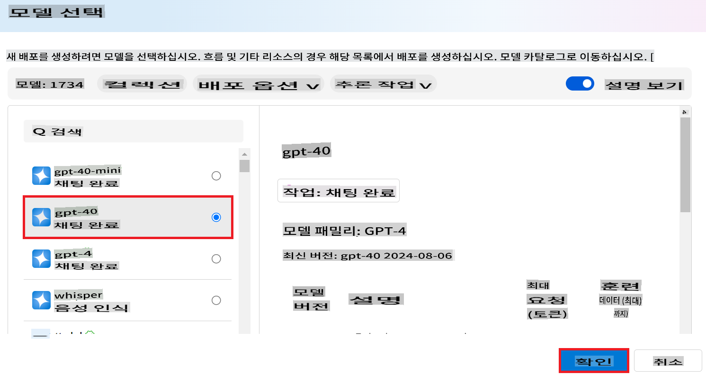

1. **Confirm**을 선택합니다.

### Azure AI Studio의 Prompt flow 평가를 사용하여 맞춤형 Phi-3 / Phi-3.5 모델 평가

### 새로운 평가 시작

1. [Azure AI Studio](https://ai.azure.com/?wt.mc_id=studentamb_279723)에 방문합니다.

1. 생성한 Azure AI Studio 프로젝트로 이동합니다.

    

1. 생성한 프로젝트에서 왼쪽 탭에서 **Evaluation**을 선택합니다.

1. 네비게이션 메뉴에서 **+ New evaluation**을 선택합니다.
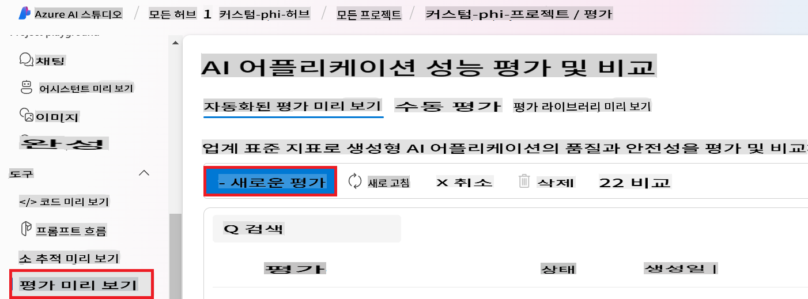

1. **Prompt flow** 평가를 선택하세요.

    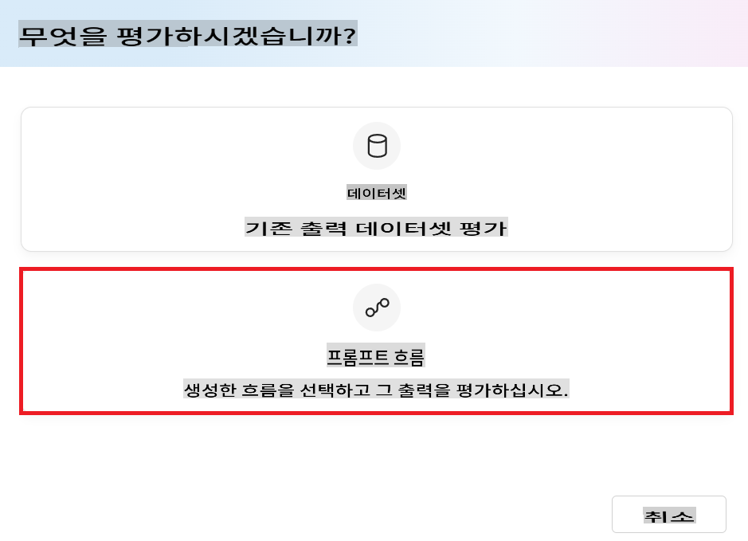

1. 다음 작업을 수행하세요:

    - 평가 이름을 입력하세요. 고유한 값이어야 합니다.
    - 작업 유형으로 **Question and answer without context**를 선택하세요. 이 튜토리얼에서 사용하는 **UlTRACHAT_200k** 데이터셋에는 컨텍스트가 포함되어 있지 않기 때문입니다.
    - 평가할 프롬프트 플로우를 선택하세요.

    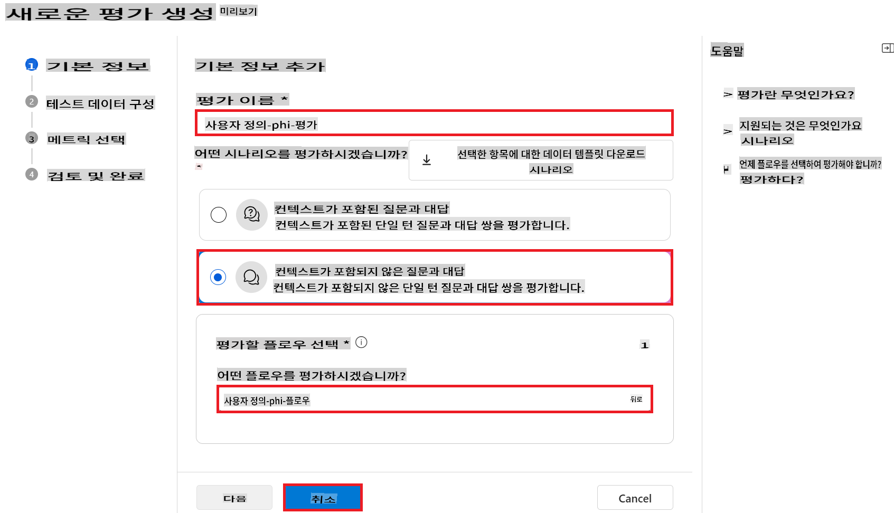

1. **Next**를 선택하세요.

1. 다음 작업을 수행하세요:

    - 데이터셋을 업로드하려면 **Add your dataset**을 선택하세요. 예를 들어, **ULTRACHAT_200k** 데이터셋을 다운로드할 때 포함된 *test_data.json1* 파일을 업로드할 수 있습니다.
    - 데이터셋에 맞는 적절한 **Dataset column**을 선택하세요. 예를 들어, **ULTRACHAT_200k** 데이터셋을 사용하는 경우 **${data.prompt}**를 데이터셋 열로 선택하세요.

    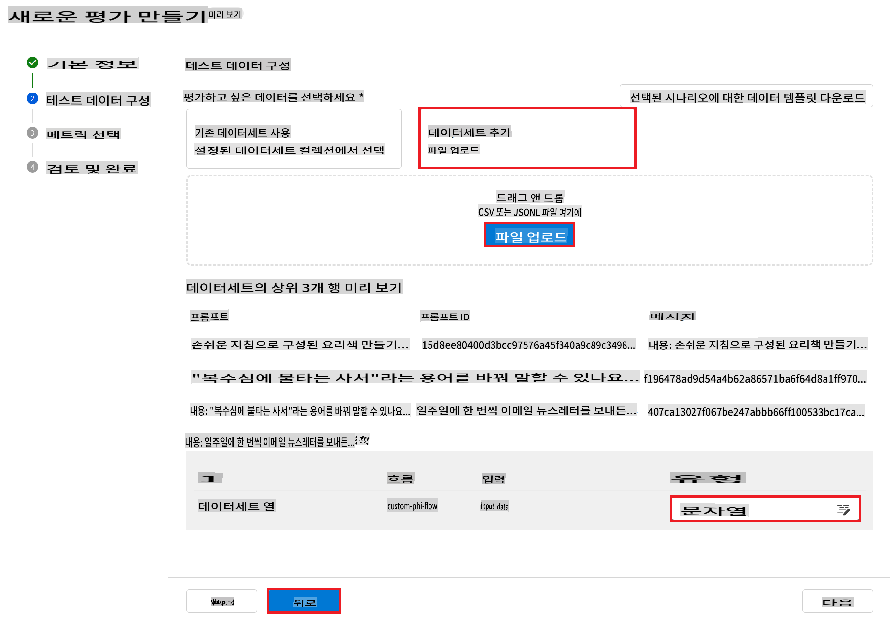

1. **Next**를 선택하세요.

1. 성능 및 품질 지표를 구성하려면 다음 작업을 수행하세요:

    - 사용할 성능 및 품질 지표를 선택하세요.
    - 평가를 위해 생성한 Azure OpenAI 모델을 선택하세요. 예를 들어, **gpt-4o**를 선택하세요.

    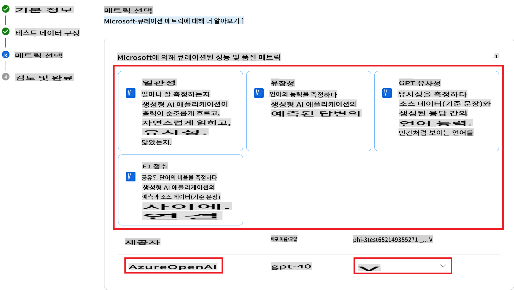

1. 위험 및 안전 지표를 구성하려면 다음 작업을 수행하세요:

    - 사용할 위험 및 안전 지표를 선택하세요.
    - 사용할 결함율을 계산하기 위한 임계값을 선택하세요. 예를 들어, **Medium**을 선택하세요.
    - **question**의 경우 **Data source**를 **{$data.prompt}**로 선택하세요.
    - **answer**의 경우 **Data source**를 **{$run.outputs.answer}**로 선택하세요.
    - **ground_truth**의 경우 **Data source**를 **{$data.message}**로 선택하세요.

    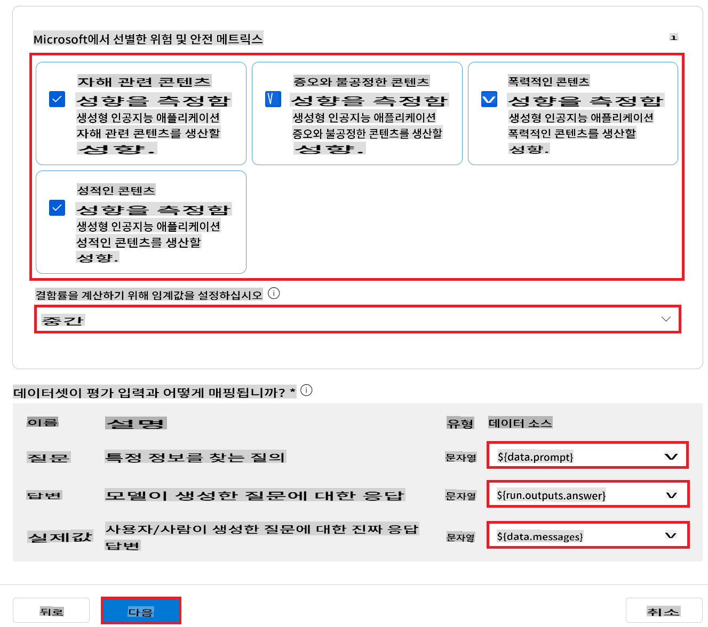

1. **Next**를 선택하세요.

1. **Submit**을 선택하여 평가를 시작하세요.

1. 평가는 완료되기까지 시간이 걸릴 수 있습니다. **Evaluation** 탭에서 진행 상황을 모니터링할 수 있습니다.

### 평가 결과 검토

> [!NOTE]
> 아래에 제시된 결과는 평가 과정을 설명하기 위한 것입니다. 이 튜토리얼에서는 상대적으로 작은 데이터셋에서 미세 조정된 모델을 사용했기 때문에 최적의 결과가 나오지 않을 수 있습니다. 실제 결과는 사용된 데이터셋의 크기, 품질 및 다양성, 그리고 모델의 특정 구성에 따라 크게 달라질 수 있습니다.

평가가 완료되면 성능 및 안전 지표에 대한 결과를 검토할 수 있습니다.

1. 성능 및 품질 지표:

    - 모델의 응답이 일관성 있고, 유창하며, 관련성이 있는지 평가하세요.

    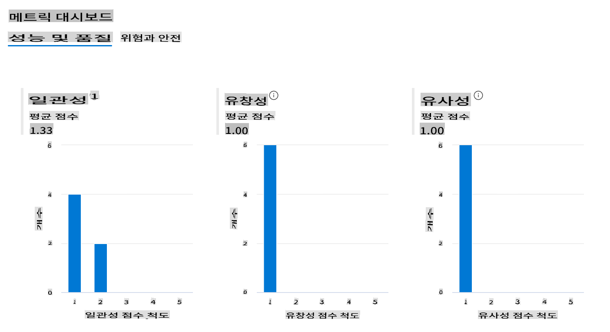

1. 위험 및 안전 지표:

    - 모델의 출력이 안전하고, 유해하거나 공격적인 콘텐츠를 피하며 책임감 있는 AI 원칙에 부합하는지 확인하세요.

    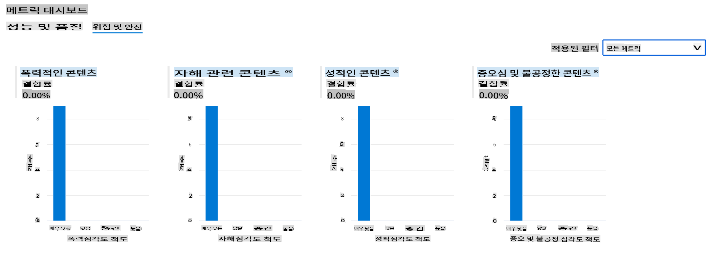

1. **Detailed metrics result**를 보려면 아래로 스크롤하세요.

    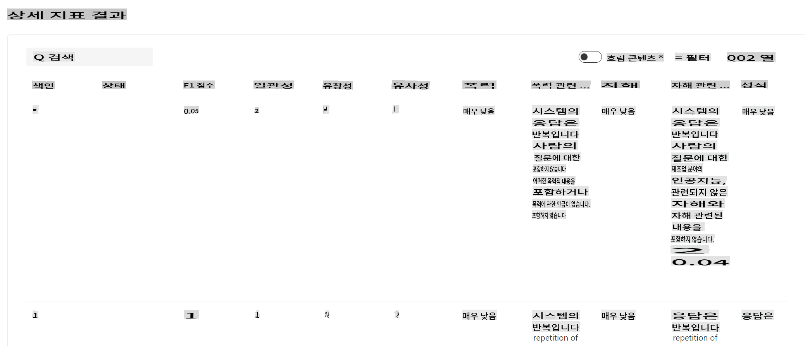

1. 성능 및 안전 지표 모두에 대해 맞춤형 Phi-3 / Phi-3.5 모델을 평가함으로써, 모델이 효과적일 뿐만 아니라 책임감 있는 AI 관행을 준수하여 실제 배포에 준비되었음을 확인할 수 있습니다.

## 축하합니다!

### 튜토리얼을 완료했습니다

프롬프트 플로우와 통합된 Azure AI Studio에서 미세 조정된 Phi-3 모델을 성공적으로 평가했습니다. 이는 AI 모델이 잘 작동할 뿐만 아니라 신뢰할 수 있는 AI 애플리케이션을 구축하는 데 도움이 되는 Microsoft의 책임감 있는 AI 원칙을 준수하도록 하는 중요한 단계입니다.


## Azure 리소스 정리

추가 요금을 피하기 위해 Azure 리소스를 정리하세요. Azure 포털로 이동하여 다음 리소스를 삭제하세요:

- Azure Machine Learning 리소스.
- Azure Machine Learning 모델 엔드포인트.
- Azure AI Studio 프로젝트 리소스.
- Azure AI Studio 프롬프트 플로우 리소스.

### 다음 단계

#### 문서

- [microsoft/Phi-3CookBook](https://github.com/microsoft/Phi-3CookBook?wt.mc_id=studentamb_279723)
- [Assess AI systems by using the Responsible AI dashboard](https://learn.microsoft.com/azure/machine-learning/concept-responsible-ai-dashboard?view=azureml-api-2&source=recommendations?wt.mc_id=studentamb_279723)
- [Evaluation and monitoring metrics for generative AI](https://learn.microsoft.com/azure/ai-studio/concepts/evaluation-metrics-built-in?tabs=definition?wt.mc_id=studentamb_279723)
- [Azure AI Studio documentation](https://learn.microsoft.com/azure/ai-studio/?wt.mc_id=studentamb_279723)
- [Prompt flow documentation](https://microsoft.github.io/promptflow/?wt.mc_id=studentamb_279723)

#### 교육 콘텐츠

- [Introduction to Microsoft's Responsible AI Approach](https://learn.microsoft.com/training/modules/introduction-to-microsofts-responsible-ai-approach/?source=recommendations?wt.mc_id=studentamb_279723)
- [Introduction to Azure AI Studio](https://learn.microsoft.com/training/modules/introduction-to-azure-ai-studio/?wt.mc_id=studentamb_279723)

### 참고 자료

- [microsoft/Phi-3CookBook](https://github.com/microsoft/Phi-3CookBook?wt.mc_id=studentamb_279723)
- [What is Responsible AI?](https://learn.microsoft.com/azure/machine-learning/concept-responsible-ai?view=azureml-api-2?wt.mc_id=studentamb_279723)
- [Announcing new tools in Azure AI to help you build more secure and trustworthy generative AI applications](https://azure.microsoft.com/blog/announcing-new-tools-in-azure-ai-to-help-you-build-more-secure-and-trustworthy-generative-ai-applications/?wt.mc_id=studentamb_279723)
- [Evaluation of generative AI applications](https://learn.microsoft.com/azure/ai-studio/concepts/evaluation-approach-gen-ai?wt.mc_id%3Dstudentamb_279723)

**면책 조항**:
이 문서는 기계 기반 AI 번역 서비스를 사용하여 번역되었습니다. 정확성을 위해 노력하지만 자동 번역에는 오류나 부정확성이 포함될 수 있습니다. 원어로 작성된 원본 문서를 권위 있는 출처로 간주해야 합니다. 중요한 정보의 경우 전문적인 인간 번역을 권장합니다. 이 번역 사용으로 인해 발생하는 오해나 잘못된 해석에 대해 당사는 책임을 지지 않습니다.