# Fine-tune and Integrate custom Phi-3 models with Prompt flow

이 E2E(End-to-End) 샘플은 Microsoft Tech Community의 가이드 "[Fine-Tune and Integrate Custom Phi-3 Models with Prompt Flow: Step-by-Step Guide](https://techcommunity.microsoft.com/t5/educator-developer-blog/fine-tune-and-integrate-custom-phi-3-models-with-prompt-flow/ba-p/4178612?WT.mc_id=aiml-137032-kinfeylo)"를 기반으로 합니다. 이 가이드는 Prompt flow를 사용하여 맞춤형 Phi-3 모델을 미세 조정하고 배포하며 통합하는 과정을 소개합니다.

## 개요

이 E2E 샘플에서는 Phi-3 모델을 미세 조정하고 Prompt flow와 통합하는 방법을 배웁니다. Azure Machine Learning과 Prompt flow를 활용하여 맞춤형 AI 모델을 배포하고 사용하는 워크플로를 구축할 수 있습니다. 이 E2E 샘플은 세 가지 시나리오로 나뉩니다:

**시나리오 1: Azure 리소스 설정 및 미세 조정을 위한 준비**

**시나리오 2: Phi-3 모델 미세 조정 및 Azure Machine Learning Studio에 배포**

**시나리오 3: Prompt flow와 통합 및 맞춤형 모델과 채팅**

다음은 이 E2E 샘플의 개요입니다.

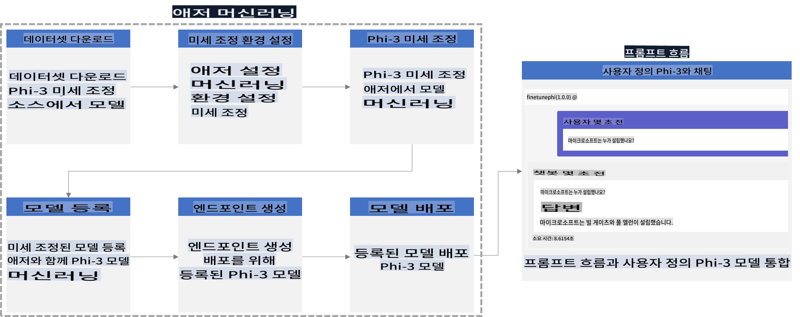

### 목차

1. **[시나리오 1: Azure 리소스 설정 및 미세 조정을 위한 준비](../../../../md/06.E2ESamples)**
    - [Azure Machine Learning Workspace 생성](../../../../md/06.E2ESamples)
    - [Azure 구독에서 GPU 쿼터 요청](../../../../md/06.E2ESamples)
    - [역할 할당 추가](../../../../md/06.E2ESamples)
    - [프로젝트 설정](../../../../md/06.E2ESamples)
    - [미세 조정을 위한 데이터셋 준비](../../../../md/06.E2ESamples)

1. **[시나리오 2: Phi-3 모델 미세 조정 및 Azure Machine Learning Studio에 배포](../../../../md/06.E2ESamples)**
    - [Azure CLI 설정](../../../../md/06.E2ESamples)
    - [Phi-3 모델 미세 조정](../../../../md/06.E2ESamples)
    - [미세 조정된 모델 배포](../../../../md/06.E2ESamples)

1. **[시나리오 3: Prompt flow와 통합 및 맞춤형 모델과 채팅](../../../../md/06.E2ESamples)**
    - [맞춤형 Phi-3 모델을 Prompt flow와 통합](../../../../md/06.E2ESamples)
    - [맞춤형 모델과 채팅](../../../../md/06.E2ESamples)

## 시나리오 1: Azure 리소스 설정 및 미세 조정을 위한 준비

### Azure Machine Learning Workspace 생성

1. 포털 페이지 상단의 **검색창**에 *azure machine learning*을 입력하고 나타나는 옵션에서 **Azure Machine Learning**을 선택합니다.

    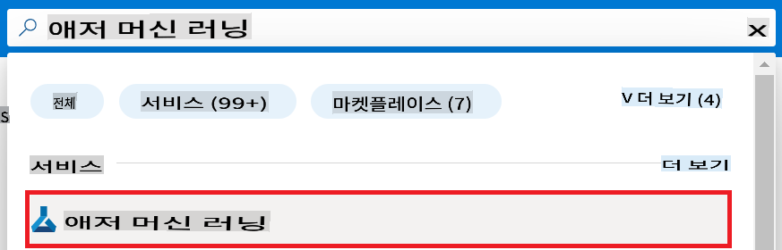

1. 내비게이션 메뉴에서 **+ Create**를 선택합니다.

1. 내비게이션 메뉴에서 **New workspace**를 선택합니다.

    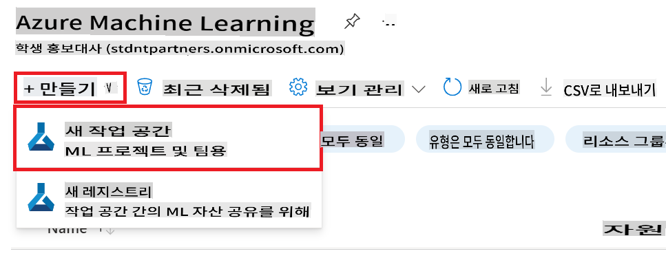

1. 다음 작업을 수행합니다:

    - Azure **구독**을 선택합니다.
    - 사용할 **리소스 그룹**을 선택합니다(필요시 새로 생성).
    - **워크스페이스 이름**을 입력합니다. 고유한 값이어야 합니다.
    - 사용할 **지역**을 선택합니다.
    - 사용할 **스토리지 계정**을 선택합니다(필요시 새로 생성).
    - 사용할 **키 자물쇠**를 선택합니다(필요시 새로 생성).
    - 사용할 **애플리케이션 인사이트**를 선택합니다(필요시 새로 생성).
    - 사용할 **컨테이너 레지스트리**를 선택합니다(필요시 새로 생성).

    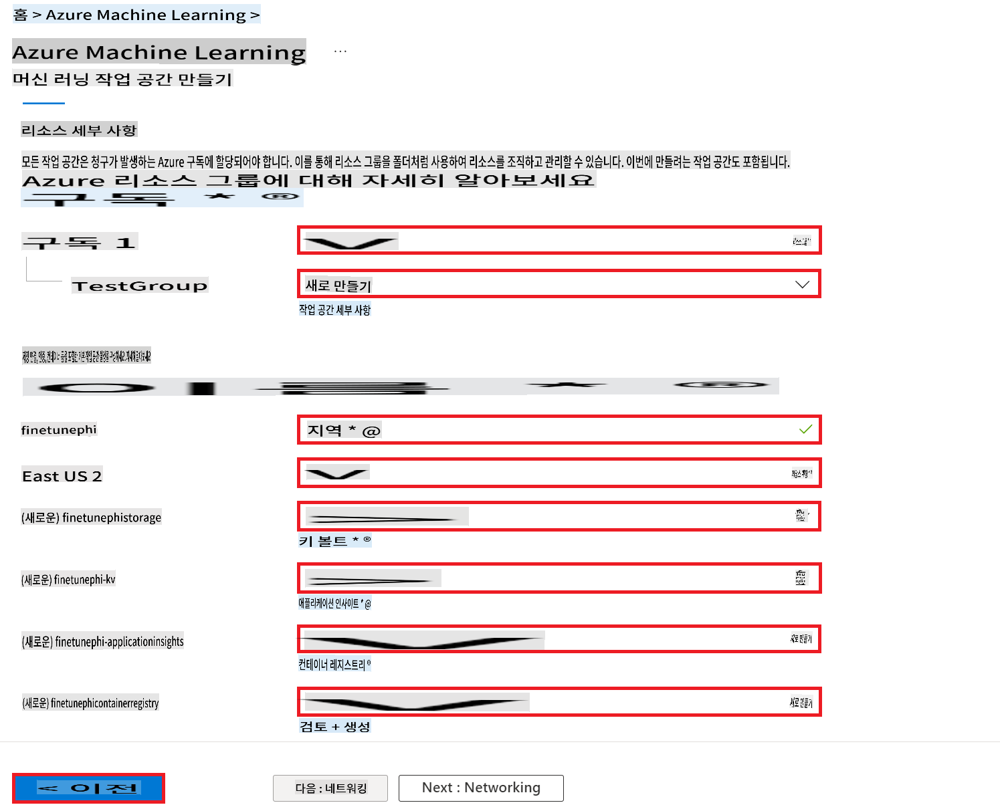

1. **Review + Create**를 선택합니다.

1. **Create**를 선택합니다.

### Azure 구독에서 GPU 쿼터 요청

이 E2E 샘플에서는 미세 조정을 위해 *Standard_NC24ads_A100_v4 GPU*를 사용하며, 이는 쿼터 요청이 필요합니다. 배포를 위해 *Standard_E4s_v3* CPU를 사용하며, 이는 쿼터 요청이 필요하지 않습니다.

> [!NOTE]
>
> Pay-As-You-Go 구독(표준 구독 유형)만 GPU 할당이 가능하며, 혜택 구독은 현재 지원되지 않습니다.
>
> 혜택 구독(예: Visual Studio Enterprise Subscription)을 사용하는 경우 또는 미세 조정 및 배포 과정을 빠르게 테스트하려는 경우, 이 튜토리얼은 CPU를 사용하여 최소 데이터셋으로 미세 조정하는 가이드를 제공합니다. 그러나 GPU를 사용하여 더 큰 데이터셋으로 미세 조정할 때 결과가 훨씬 더 좋다는 점을 유의해야 합니다.

1. [Azure ML Studio](https://ml.azure.com/home?wt.mc_id=studentamb_279723)에 방문합니다.

1. *Standard NCADSA100v4 Family* 쿼터를 요청하려면 다음 작업을 수행합니다:

    - 왼쪽 탭에서 **Quota**를 선택합니다.
    - 사용할 **Virtual machine family**를 선택합니다. 예를 들어, *Standard_NC24ads_A100_v4* GPU를 포함하는 **Standard NCADSA100v4 Family Cluster Dedicated vCPUs**를 선택합니다.
    - 내비게이션 메뉴에서 **Request quota**를 선택합니다.

        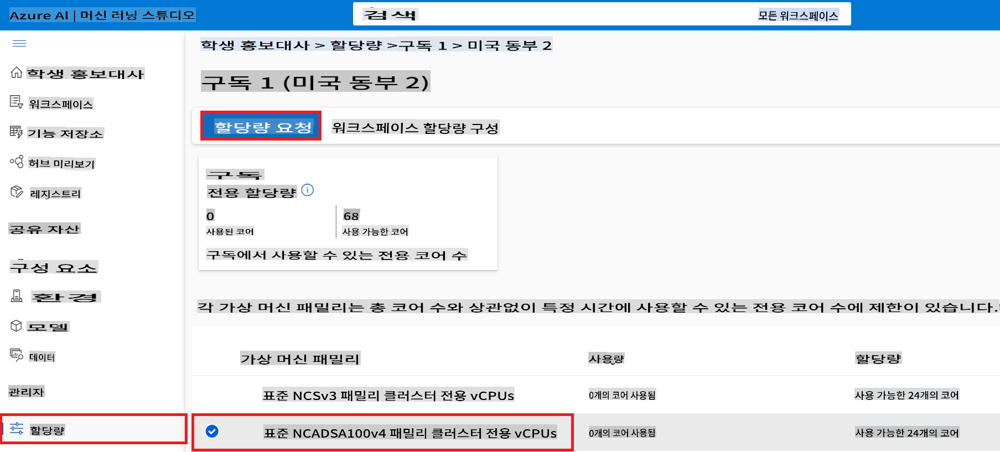

    - Request quota 페이지에서 사용할 **New cores limit**을 입력합니다. 예를 들어, 24.
    - Request quota 페이지에서 **Submit**을 선택하여 GPU 쿼터를 요청합니다.

> [!NOTE]
> [Sizes for Virtual Machines in Azure](https://learn.microsoft.com/azure/virtual-machines/sizes/overview?tabs=breakdownseries%2Cgeneralsizelist%2Ccomputesizelist%2Cmemorysizelist%2Cstoragesizelist%2Cgpusizelist%2Cfpgasizelist%2Chpcsizelist) 문서를 참조하여 필요에 맞는 GPU 또는 CPU를 선택할 수 있습니다.

### 역할 할당 추가

모델을 미세 조정하고 배포하려면 먼저 사용자 할당 관리 ID(UAI)를 생성하고 적절한 권한을 할당해야 합니다. 이 UAI는 배포 중 인증에 사용됩니다.

#### 사용자 할당 관리 ID(UAI) 생성

1. 포털 페이지 상단의 **검색창**에 *managed identities*를 입력하고 나타나는 옵션에서 **Managed Identities**를 선택합니다.

    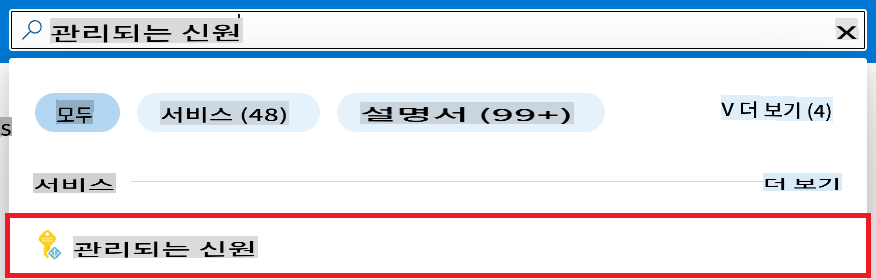

1. **+ Create**를 선택합니다.

    

1. 다음 작업을 수행합니다:

    - Azure **구독**을 선택합니다.
    - 사용할 **리소스 그룹**을 선택합니다(필요시 새로 생성).
    - 사용할 **지역**을 선택합니다.
    - **이름**을 입력합니다. 고유한 값이어야 합니다.

1. **Review + create**를 선택합니다.

1. **+ Create**를 선택합니다.

#### 관리 ID에 기여자 역할 할당 추가

1. 생성한 관리 ID 리소스로 이동합니다.

1. 왼쪽 탭에서 **Azure role assignments**를 선택합니다.

1. 내비게이션 메뉴에서 **+Add role assignment**를 선택합니다.

1. Add role assignment 페이지에서 다음 작업을 수행합니다:
    - **Scope**를 **Resource group**으로 선택합니다.
    - Azure **구독**을 선택합니다.
    - 사용할 **리소스 그룹**을 선택합니다.
    - **역할**을 **기여자**로 선택합니다.

    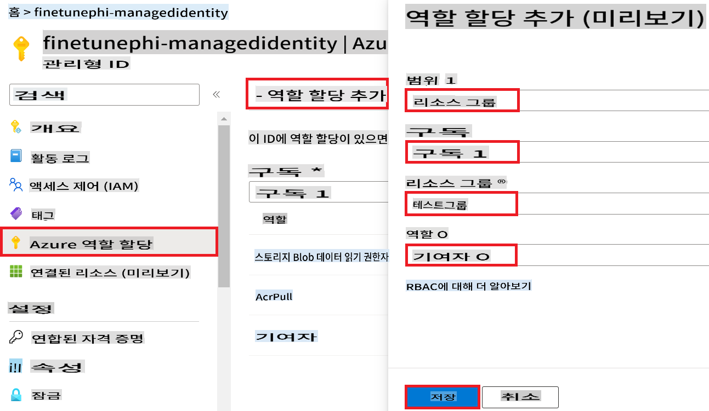

1. **저장**을 선택합니다.

#### 관리 ID에 Storage Blob Data Reader 역할 할당 추가

1. 포털 페이지 상단의 **검색창**에 *storage accounts*를 입력하고 나타나는 옵션에서 **Storage accounts**를 선택합니다.

    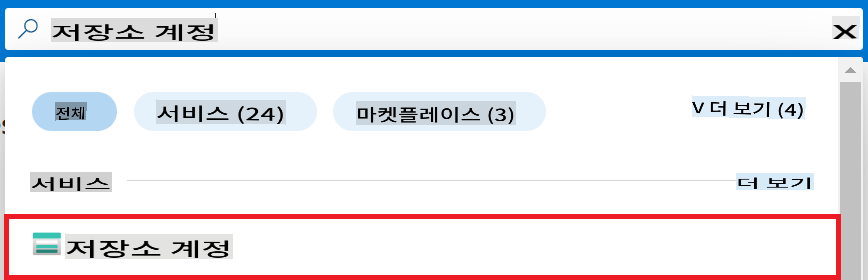

1. 생성한 Azure Machine Learning 워크스페이스와 연결된 스토리지 계정을 선택합니다. 예를 들어, *finetunephistorage*.

1. Add role assignment 페이지로 이동하려면 다음 작업을 수행합니다:

    - 생성한 Azure Storage 계정으로 이동합니다.
    - 왼쪽 탭에서 **Access Control (IAM)**을 선택합니다.
    - 내비게이션 메뉴에서 **+ Add**를 선택합니다.
    - 내비게이션 메뉴에서 **Add role assignment**를 선택합니다.

    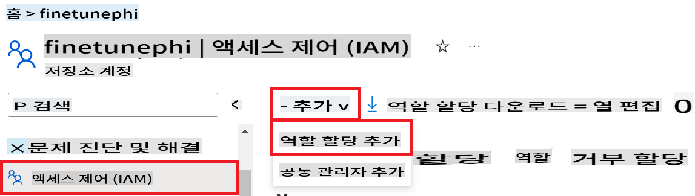

1. Add role assignment 페이지에서 다음 작업을 수행합니다:

    - Role 페이지에서 **검색창**에 *Storage Blob Data Reader*를 입력하고 나타나는 옵션에서 **Storage Blob Data Reader**를 선택합니다.
    - Role 페이지에서 **다음**을 선택합니다.
    - Members 페이지에서 **Assign access to**를 **Managed identity**로 선택합니다.
    - Members 페이지에서 **+ Select members**를 선택합니다.
    - Select managed identities 페이지에서 Azure **구독**을 선택합니다.
    - Select managed identities 페이지에서 **Managed identity**를 **Manage Identity**로 선택합니다.
    - Select managed identities 페이지에서 생성한 Manage Identity를 선택합니다. 예를 들어, *finetunephi-managedidentity*.
    - Select managed identities 페이지에서 **선택**을 선택합니다.

    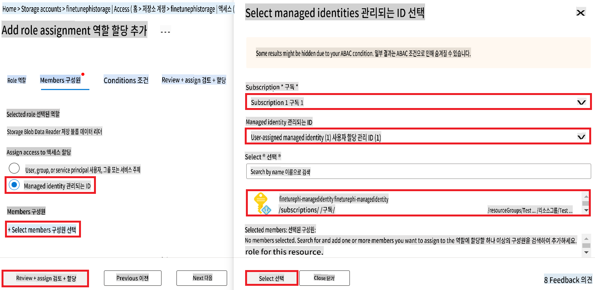

1. **Review + assign**을 선택합니다.

#### 관리 ID에 AcrPull 역할 할당 추가

1. 포털 페이지 상단의 **검색창**에 *container registries*를 입력하고 나타나는 옵션에서 **Container registries**를 선택합니다.

    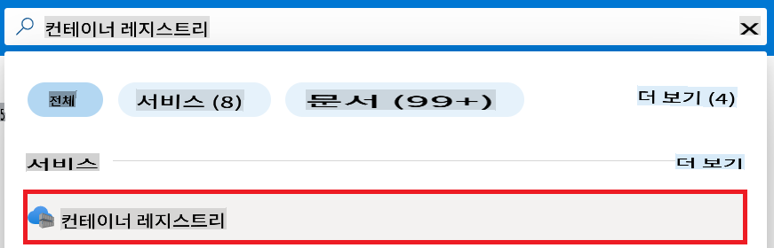

1. Azure Machine Learning 워크스페이스와 연결된 컨테이너 레지스트리를 선택합니다. 예를 들어, *finetunephicontainerregistries*.

1. Add role assignment 페이지로 이동하려면 다음 작업을 수행합니다:

    - 왼쪽 탭에서 **Access Control (IAM)**을 선택합니다.
    - 내비게이션 메뉴에서 **+ Add**를 선택합니다.
    - 내비게이션 메뉴에서 **Add role assignment**를 선택합니다.

1. Add role assignment 페이지에서 다음 작업을 수행합니다:

    - Role 페이지에서 **검색창**에 *AcrPull*을 입력하고 나타나는 옵션에서 **AcrPull**을 선택합니다.
    - Role 페이지에서 **다음**을 선택합니다.
    - Members 페이지에서 **Assign access to**를 **Managed identity**로 선택합니다.
    - Members 페이지에서 **+ Select members**를 선택합니다.
    - Select managed identities 페이지에서 Azure **구독**을 선택합니다.
    - Select managed identities 페이지에서 **Managed identity**를 **Manage Identity**로 선택합니다.
    - Select managed identities 페이지에서 생성한 Manage Identity를 선택합니다. 예를 들어, *finetunephi-managedidentity*.
    - Select managed identities 페이지에서 **선택**을 선택합니다.
    - **Review + assign**을 선택합니다.

### 프로젝트 설정

이제 작업할 폴더를 생성하고 Azure Cosmos DB에 저장된 채팅 기록을 사용하여 사용자와 상호작용하는 프로그램을 개발하기 위한 가상 환경을 설정합니다.

#### 작업할 폴더 생성

1. 터미널 창을 열고 기본 경로에 *finetune-phi* 폴더를 생성하려면 다음 명령어를 입력합니다.

    ```console
    mkdir finetune-phi
    ```

1. 생성한 *finetune-phi* 폴더로 이동하려면 터미널에 다음 명령어를 입력합니다.

    ```console
    cd finetune-phi
    ```

#### 가상 환경 생성

1. *.venv*라는 가상 환경을 생성하려면 터미널에 다음 명령어를 입력합니다.

    ```console
    python -m venv .venv
    ```

1. 가상 환경을 활성화하려면 터미널에 다음 명령어를 입력합니다.

    ```console
    .venv\Scripts\activate.bat
    ```

> [!NOTE]
>
> 작동하면 명령 프롬프트 앞에 *(.venv)*가 표시됩니다.

#### 필요한 패키지 설치

1. 필요한 패키지를 설치하려면 터미널에 다음 명령어를 입력합니다.

    ```console
    pip install datasets==2.19.1
    pip install transformers==4.41.1
    pip install azure-ai-ml==1.16.0
    pip install torch==2.3.1
    pip install trl==0.9.4
    pip install promptflow==1.12.0
    ```

#### 프로젝트 파일 생성

이 연습에서는 프로젝트의 필수 파일을 생성합니다. 이 파일에는 데이터셋을 다운로드하고, Azure Machine Learning 환경을 설정하고, Phi-3 모델을 미세 조정하고, 미세 조정된 모델을 배포하기 위한 스크립트가 포함됩니다. 또한 미세 조정 환경을 설정하기 위한 *conda.yml* 파일도 생성합니다.

이 연습에서는 다음을 수행합니다:

- 데이터셋을 다운로드하기 위한 *download_dataset.py* 파일 생성.
- Azure Machine Learning 환경을 설정하기 위한 *setup_ml.py* 파일 생성.
- 데이터셋을 사용하여 Phi-3 모델을 미세 조정하기 위한 *finetuning_dir* 폴더 내 *fine_tune.py* 파일 생성.
- 미세 조정 환경을 설정하기 위한 *conda.yml* 파일 생성.
- 미세 조정된 모델을 배포하기 위한 *deploy_model.py* 파일 생성.
- 미세 조정된 모델을 Prompt flow와 통합하고 모델을 실행하기 위한 *integrate_with_promptflow.py* 파일 생성.
- Prompt flow의 워크플로 구조를 설정하기 위한 flow.dag.yml 파일 생성.
- Azure 정보를 입력하기 위한 *config.py* 파일 생성.

> [!NOTE]
>
> 전체 폴더 구조:
>
> ```text
> └── YourUserName
> .    └── finetune-phi
> .        ├── finetuning_dir
> .        │      └── fine_tune.py
> .        ├── conda.yml
> .        ├── config.py
> .        ├── deploy_model.py
> .        ├── download_dataset.py
> .        ├── flow.dag.yml
> .        ├── integrate_with_promptflow.py
> .        └── setup_ml.py
> ```

1. **Visual Studio Code**를 엽니다.

1. 메뉴 바에서 **파일**을 선택합니다.

1. **폴더 열기**를 선택합니다.

1. 생성한 *finetune-phi* 폴더를 선택합니다. 경로는 *C:\Users\yourUserName\finetune-phi*에 있습니다.

    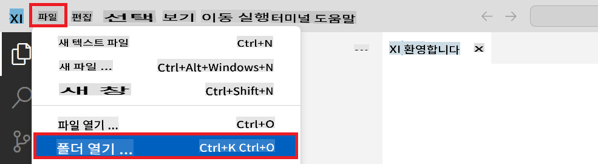

1. Visual Studio Code의 왼쪽 창에서 오른쪽 클릭하여 **새 파일**을 선택하고 *download_dataset.py*라는 새 파일을 생성합니다.

1. Visual Studio Code의 왼쪽 창에서 오른쪽 클릭하여 **새 파일**을 선택하고 *setup_ml.py*라는 새 파일을 생성합니다.

1. Visual Studio Code의 왼쪽 창에서 오른쪽 클릭하여 **새 파일**을 선택하고 *deploy_model.py*라는 새 파일을 생성합니다.

    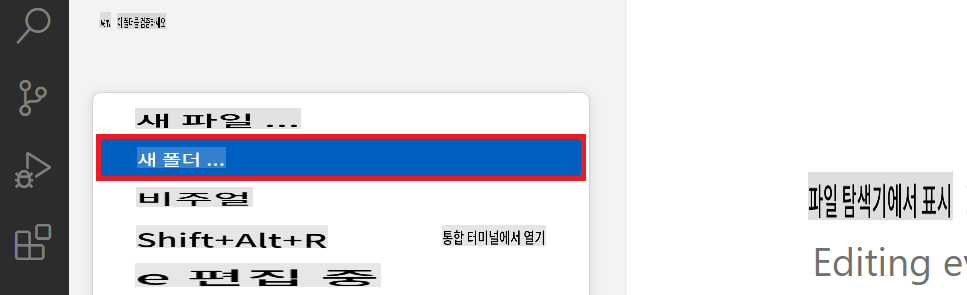

1. Visual Studio Code의 왼쪽 창에서 오른쪽 클릭하여 **새 폴더**를 선택하고 *finetuning_dir*이라는 새 폴더를 생성합니다.

1. *finetuning_dir* 폴더에서 *fine_tune.py*라는 새 파일을 생성합니다.

#### *conda.yml* 파일 생성 및 구성

1. Visual Studio Code의 왼쪽 창에서 오른쪽 클릭하여 **새 파일**을 선택하고 *conda.yml*이라는 새 파일을 생성합니다.

1. Phi-3 모델의 미세 조정 환경을 설정하기 위해 *conda.yml* 파일에 다음 코드를 추가합니다.

    ```yml
    name: phi-3-training-env
    channels:
      - defaults
      - conda-forge
    dependencies:
      - python=3.10
      - pip
      - numpy<2.0
      - pip:
          - torch==2.4.0
          - torchvision==0.19.0
          - trl==0.8.6
          - transformers==4.41
          - datasets==2.21.0
          - azureml-core==1.57.0
          - azure-storage-blob==12.19.0
          - azure-ai-ml==1.16
          - azure-identity==1.17.1
          - accelerate==0.33.0
          - mlflow==2.15.1
          - azureml


면책 조항: 이 번역은 AI 모델에 의해 원본에서 번역되었으며 완벽하지 않을 수 있습니다.
출력을 검토하고 필요한 수정 사항을 반영해 주시기 바랍니다.