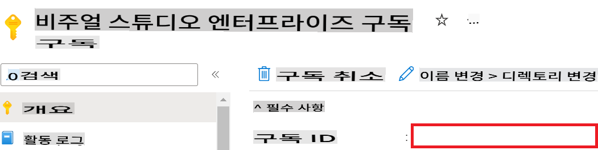
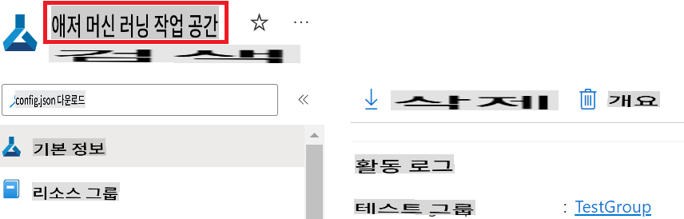
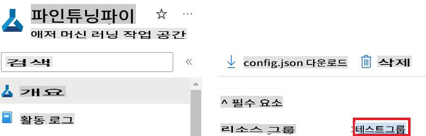
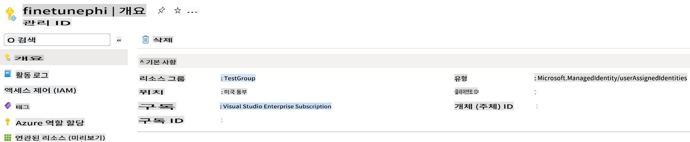
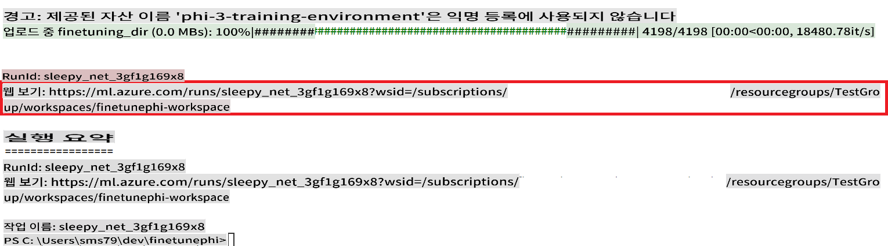
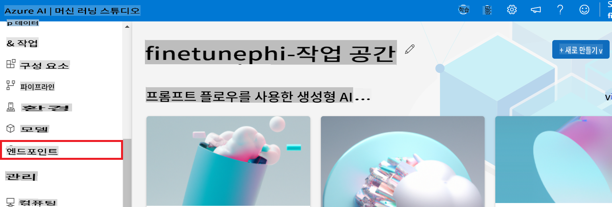
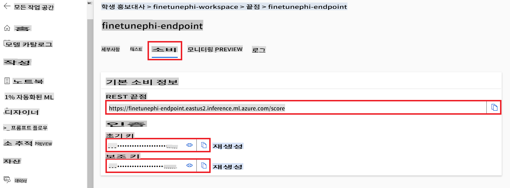
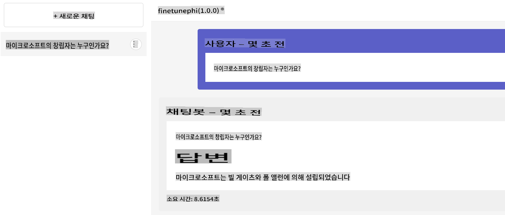

# Fine-tune and Integrate custom Phi-3 models with Prompt flow

이 종단 간(E2E) 샘플은 Microsoft Tech Community의 가이드 "[Fine-Tune and Integrate Custom Phi-3 Models with Prompt Flow: Step-by-Step Guide](https://techcommunity.microsoft.com/t5/educator-developer-blog/fine-tune-and-integrate-custom-phi-3-models-with-prompt-flow/ba-p/4178612?WT.mc_id=aiml-137032-kinfeylo)"를 기반으로 합니다. 이 샘플은 사용자 정의 Phi-3 모델을 Prompt flow와 함께 미세 조정하고 배포 및 통합하는 과정을 소개합니다.

## 개요

이 E2E 샘플에서는 Phi-3 모델을 미세 조정하고 Prompt flow와 통합하는 방법을 배웁니다. Azure Machine Learning과 Prompt flow를 활용하여 사용자 정의 AI 모델을 배포하고 활용하는 워크플로우를 구축합니다. 이 E2E 샘플은 세 가지 시나리오로 나뉩니다:

**시나리오 1: Azure 리소스 설정 및 미세 조정 준비**

**시나리오 2: Phi-3 모델 미세 조정 및 Azure Machine Learning Studio에 배포**

**시나리오 3: Prompt flow와 통합 및 사용자 정의 모델과 채팅**

다음은 이 E2E 샘플의 개요입니다.


### 목차

1. **[시나리오 1: Azure 리소스 설정 및 미세 조정 준비](../../../../md/06.E2ESamples)**
    - [Azure Machine Learning 워크스페이스 생성](../../../../md/06.E2ESamples)
    - [Azure 구독에서 GPU 할당량 요청](../../../../md/06.E2ESamples)
    - [역할 할당 추가](../../../../md/06.E2ESamples)
    - [프로젝트 설정](../../../../md/06.E2ESamples)
    - [미세 조정을 위한 데이터셋 준비](../../../../md/06.E2ESamples)

1. **[시나리오 2: Phi-3 모델 미세 조정 및 Azure Machine Learning Studio에 배포](../../../../md/06.E2ESamples)**
    - [Azure CLI 설정](../../../../md/06.E2ESamples)
    - [Phi-3 모델 미세 조정](../../../../md/06.E2ESamples)
    - [미세 조정된 모델 배포](../../../../md/06.E2ESamples)

1. **[시나리오 3: Prompt flow와 통합 및 사용자 정의 모델과 채팅](../../../../md/06.E2ESamples)**
    - [사용자 정의 Phi-3 모델을 Prompt flow와 통합](../../../../md/06.E2ESamples)
    - [사용자 정의 모델과 채팅](../../../../md/06.E2ESamples)

## 시나리오 1: Azure 리소스 설정 및 미세 조정 준비

### Azure Machine Learning 워크스페이스 생성

1. 포털 페이지 상단의 **검색 바**에 *azure machine learning*을 입력하고 나타나는 옵션에서 **Azure Machine Learning**을 선택합니다.

    

1. 탐색 메뉴에서 **+ Create**를 선택합니다.

1. 탐색 메뉴에서 **New workspace**를 선택합니다.

    

1. 다음 작업을 수행합니다:

    - Azure **Subscription**을 선택합니다.
    - 사용할 **Resource group**을 선택합니다(필요 시 새로 생성).
    - **Workspace Name**을 입력합니다. 고유한 값이어야 합니다.
    - 사용할 **Region**을 선택합니다.
    - 사용할 **Storage account**를 선택합니다(필요 시 새로 생성).
    - 사용할 **Key vault**를 선택합니다(필요 시 새로 생성).
    - 사용할 **Application insights**를 선택합니다(필요 시 새로 생성).
    - 사용할 **Container registry**를 선택합니다(필요 시 새로 생성).

    

1. **Review + Create**를 선택합니다.

1. **Create**를 선택합니다.

### Azure 구독에서 GPU 할당량 요청

이 E2E 샘플에서는 미세 조정을 위해 *Standard_NC24ads_A100_v4 GPU*를 사용하며, 이는 할당량 요청이 필요합니다. 배포를 위해서는 *Standard_E4s_v3* CPU를 사용하며, 이는 할당량 요청이 필요하지 않습니다.

> [!NOTE]
>
> GPU 할당은 Pay-As-You-Go 구독(표준 구독 유형)만 가능하며, 혜택 구독은 현재 지원되지 않습니다.
>
> 혜택 구독(예: Visual Studio Enterprise Subscription)을 사용하는 경우 또는 미세 조정 및 배포 프로세스를 빠르게 테스트하려는 경우, 이 튜토리얼은 CPU를 사용하여 최소 데이터셋으로 미세 조정하는 가이드를 제공합니다. 그러나 GPU와 더 큰 데이터셋을 사용할 때 미세 조정 결과가 훨씬 더 좋다는 점을 유의해야 합니다.

1. [Azure ML Studio](https://ml.azure.com/home?wt.mc_id=studentamb_279723)를 방문합니다.

1. *Standard NCADSA100v4 Family* 할당량을 요청하려면 다음 작업을 수행합니다:

    - 왼쪽 탭에서 **Quota**를 선택합니다.
    - 사용할 **Virtual machine family**를 선택합니다. 예를 들어, *Standard_NC24ads_A100_v4* GPU가 포함된 **Standard NCADSA100v4 Family Cluster Dedicated vCPUs**를 선택합니다.
    - 탐색 메뉴에서 **Request quota**를 선택합니다.

        

    - Request quota 페이지에서 사용할 **New cores limit**을 입력합니다. 예를 들어, 24.
    - Request quota 페이지에서 **Submit**을 선택하여 GPU 할당량을 요청합니다.

> [!NOTE]
> [Sizes for Virtual Machines in Azure](https://learn.microsoft.com/azure/virtual-machines/sizes/overview?tabs=breakdownseries%2Cgeneralsizelist%2Ccomputesizelist%2Cmemorysizelist%2Cstoragesizelist%2Cgpusizelist%2Cfpgasizelist%2Chpcsizelist) 문서를 참조하여 필요에 맞는 적절한 GPU 또는 CPU를 선택할 수 있습니다.

### 역할 할당 추가

모델을 미세 조정하고 배포하려면 먼저 사용자 할당 관리 ID(UAI)를 생성하고 적절한 권한을 부여해야 합니다. 이 UAI는 배포 중 인증에 사용됩니다.

#### 사용자 할당 관리 ID(UAI) 생성

1. 포털 페이지 상단의 **검색 바**에 *managed identities*를 입력하고 나타나는 옵션에서 **Managed Identities**를 선택합니다.

    

1. **+ Create**를 선택합니다.

    

1. 다음 작업을 수행합니다:

    - Azure **Subscription**을 선택합니다.
    - 사용할 **Resource group**을 선택합니다(필요 시 새로 생성).
    - 사용할 **Region**을 선택합니다.
    - **Name**을 입력합니다. 고유한 값이어야 합니다.

1. **Review + create**를 선택합니다.

1. **+ Create**를 선택합니다.

#### Managed Identity에 Contributor 역할 할당 추가

1. 생성한 Managed Identity 리소스로 이동합니다.

1. 왼쪽 탭에서 **Azure role assignments**를 선택합니다.

1. 탐색 메뉴에서 **+Add role assignment**를 선택합니다.

1. Add role assignment 페이지에서 다음 작업을 수행합니다:
    - **Scope**를 **Resource group**으로 선택합니다.
    - Azure **Subscription**을 선택합니다.
    - 사용할 **Resource group**을 선택합니다.
    - **Role**을 **Contributor**로 선택합니다.

    

1. **Save**를 선택합니다.

#### Managed Identity에 Storage Blob Data Reader 역할 할당 추가

1. 포털 페이지 상단의 **검색 바**에 *storage accounts*를 입력하고 나타나는 옵션에서 **Storage accounts**를 선택합니다.

    

1. 생성한 Azure Machine Learning 워크스페이스와 연결된 스토리지 계정을 선택합니다. 예: *finetunephistorage*.

1. Add role assignment 페이지로 이동하려면 다음 작업을 수행합니다:

    - 생성한 Azure Storage 계정으로 이동합니다.
    - 왼쪽 탭에서 **Access Control (IAM)**을 선택합니다.
    - 탐색 메뉴에서 **+ Add**를 선택합니다.
    - 탐색 메뉴에서 **Add role assignment**를 선택합니다.

    

1. Add role assignment 페이지에서 다음 작업을 수행합니다:

    - Role 페이지에서 **search bar**에 *Storage Blob Data Reader*를 입력하고 나타나는 옵션에서 **Storage Blob Data Reader**를 선택합니다.
    - Role 페이지에서 **Next**를 선택합니다.
    - Members 페이지에서 **Assign access to** **Managed identity**를 선택합니다.
    - Members 페이지에서 **+ Select members**를 선택합니다.
    - Select managed identities 페이지에서 Azure **Subscription**을 선택합니다.
    - Select managed identities 페이지에서 **Managed identity**를 **Manage Identity**로 선택합니다.
    - Select managed identities 페이지에서 생성한 Manage Identity를 선택합니다. 예: *finetunephi-managedidentity*.
    - Select managed identities 페이지에서 **Select**를 선택합니다.

    

1. **Review + assign**을 선택합니다.

#### Managed Identity에 AcrPull 역할 할당 추가

1. 포털 페이지 상단의 **검색 바**에 *container registries*를 입력하고 나타나는 옵션에서 **Container registries**를 선택합니다.

    

1. Azure Machine Learning 워크스페이스와 연결된 컨테이너 레지스트리를 선택합니다. 예: *finetunephicontainerregistries*

1. Add role assignment 페이지로 이동하려면 다음 작업을 수행합니다:

    - 왼쪽 탭에서 **Access Control (IAM)**을 선택합니다.
    - 탐색 메뉴에서 **+ Add**를 선택합니다.
    - 탐색 메뉴에서 **Add role assignment**를 선택합니다.

1. Add role assignment 페이지에서 다음 작업을 수행합니다:

    - Role 페이지에서 **search bar**에 *AcrPull*을 입력하고 나타나는 옵션에서 **AcrPull**을 선택합니다.
    - Role 페이지에서 **Next**를 선택합니다.
    - Members 페이지에서 **Assign access to** **Managed identity**를 선택합니다.
    - Members 페이지에서 **+ Select members**를 선택합니다.
    - Select managed identities 페이지에서 Azure **Subscription**을 선택합니다.
    - Select managed identities 페이지에서 **Managed identity**를 **Manage Identity**로 선택합니다.
    - Select managed identities 페이지에서 생성한 Manage Identity를 선택합니다. 예: *finetunephi-managedidentity*.
    - Select managed identities 페이지에서 **Select**를 선택합니다.
    - **Review + assign**을 선택합니다.

### 프로젝트 설정

이제 작업할 폴더를 생성하고 Azure Cosmos DB에 저장된 채팅 기록을 사용하여 사용자와 상호 작용하는 프로그램을 개발할 가상 환경을 설정합니다.

#### 작업할 폴더 생성

1. 터미널 창을 열고 기본 경로에 *finetune-phi*라는 폴더를 생성하려면 다음 명령어를 입력합니다.

    ```console
    mkdir finetune-phi
    ```

1. 생성한 *finetune-phi* 폴더로 이동하려면 터미널에서 다음 명령어를 입력합니다.

    ```console
    cd finetune-phi
    ```

#### 가상 환경 생성

1. 터미널에서 다음 명령어를 입력하여 *.venv*라는 가상 환경을 생성합니다.

    ```console
    python -m venv .venv
    ```

1. 터미널에서 다음 명령어를 입력하여 가상 환경을 활성화합니다.

    ```console
    .venv\Scripts\activate.bat
    ```

> [!NOTE]
>
> 제대로 작동하면 명령 프롬프트 앞에 *(.venv)*가 표시됩니다.

#### 필요한 패키지 설치

1. 터미널에서 다음 명령어를 입력하여 필요한 패키지를 설치합니다.

    ```console
    pip install datasets==2.19.1
    pip install transformers==4.41.1
    pip install azure-ai-ml==1.16.0
    pip install torch==2.3.1
    pip install trl==0.9.4
    pip install promptflow==1.12.0
    ```

#### 프로젝트 파일 생성

이 연습에서는 프로젝트의 필수 파일을 생성합니다. 이 파일에는 데이터셋을 다운로드하고 Azure Machine Learning 환경을 설정하며 Phi-3 모델을 미세 조정하고 미세 조정된 모델을 배포하는 스크립트가 포함됩니다. 또한, 미세 조정 환경을 설정하기 위한 *conda.yml* 파일도 생성합니다.

이 연습에서는 다음을 수행합니다:

- 데이터셋을 다운로드하기 위한 *download_dataset.py* 파일 생성.
- Azure Machine Learning 환경을 설정하기 위한 *setup_ml.py* 파일 생성.
- 데이터셋을 사용하여 Phi-3 모델을 미세 조정하기 위한 *fine_tune.py* 파일을 *finetuning_dir* 폴더에 생성.
- 미세 조정 환경을 설정하기 위한 *conda.yml* 파일 생성.
- 미세 조정된 모델을 배포하기 위한 *deploy_model.py* 파일 생성.
- 미세 조정된 모델을 Prompt flow와 통합하고 모델을 실행하기 위한 *integrate_with_promptflow.py* 파일 생성.
- Prompt flow의 워크플로우 구조를 설정하기 위한 flow.dag.yml 파일 생성.
- Azure 정보를 입력하기 위한 *config.py* 파일 생성.

> [!NOTE]
>
> 전체 폴더 구조:
>
> ```text
> └── YourUserName
> .    └── finetune-phi
> .        ├── finetuning_dir
> .        │      └── fine_tune.py
> .        ├── conda.yml
> .        ├── config.py
> .        ├── deploy_model.py
> .        ├── download_dataset.py
> .        ├── flow.dag.yml
> .        ├── integrate_with_promptflow.py
> .        └── setup_ml.py
> ```

1. **Visual Studio Code**를 엽니다.

1. 메뉴 바에서 **File**을 선택합니다.

1. **Open Folder**를 선택합니다.

1. 생성한 *finetune-phi* 폴더를 선택합니다. 경로는 *C:\Users\yourUserName\finetune-phi*입니다.

    

1. Visual Studio Code의 왼쪽 창에서 마우스 오른쪽 버튼을 클릭하고 **New File**을 선택하여 *download_dataset.py*라는 새 파일을 생성합니다.

1. Visual Studio Code의 왼쪽 창에서 마우스 오른쪽 버튼을 클릭하고 **New File**을 선택하여 *setup_ml.py*라는 새 파일을 생성합니다.

1. Visual Studio Code의 왼쪽 창에서 마우스 오른쪽 버튼을 클릭하고 **New File**을 선택하여 *deploy_model.py*라는 새 파일을 생성합니다.

    

1. Visual Studio Code의 왼쪽 창에서 마우스 오른쪽 버튼을 클릭하고 **New Folder**를 선택하여 *finetuning_dir*라는 새 폴더를 생성합니다.

1. *finetuning_dir* 폴더에서 *fine_tune.py*라는 새 파일을 생성합니다.

#### *conda.yml* 파일 생성 및 구성

1. Visual Studio Code의 왼쪽 창에서 마우스 오른쪽 버튼을 클릭하고 **New File**을 선택하여 *conda.yml*라는 새 파일을 생성합니다.

1. *conda.yml* 파일에 다음 코드를 추가하여 Phi-3 모델의 미세 조정 환경을 설정합니다.

    ```yml
    name: phi-3-training-env
    channels:
      - defaults
      - conda-forge
    dependencies:
      - python=3.10
      - pip
      - numpy<2.0
      - pip:
          - torch==2.4.0
          - torchvision==0.19.0
          - trl==0.8.6
          - transformers==4.41
          - datasets==2.21.0
          - azureml-core==1.57.0
          - azure-storage-blob==12.19.0
          - azure-ai-ml==1.16
          - azure-identity==1.17.1
          - accelerate==0.33.0
          - mlflow==2.15.1
          - azureml-mlflow==1.57.0
    ```

#### *config.py* 파일 생성 및 구성

1. Visual Studio Code의 왼쪽 창에서 마우스 오른쪽 버튼을 클릭하고 **New File**을 선택하여 *config.py*라는 새 파일을 생성합니다.

1. *config.py* 파일에 Azure 정보를 포함하는 다음 코드를 추가합니다.

    ```python
    # Azure settings
    AZURE_SUBSCRIPTION_ID = "your_subscription_id"
    AZURE_RESOURCE_GROUP_NAME = "your_resource_group_name" # "TestGroup"

    # Azure Machine Learning settings
    AZURE_ML_WORKSPACE_NAME = "your_workspace_name" # "finetunephi-workspace"

    # Azure Managed Identity settings
    AZURE_MANAGED_IDENTITY_CLIENT_ID = "your_azure_managed_identity_client_id"
    AZURE_MANAGED_IDENTITY_NAME = "your_azure_managed_identity_name" # "finetunephi-mangedidentity"
    AZURE_MANAGED_IDENTITY_RESOURCE_ID = f"/subscriptions/{AZURE_SUBSCRIPTION_ID}/resourceGroups/{AZURE_RESOURCE_GROUP_NAME}/providers/Microsoft.ManagedIdentity/userAssignedIdentities/{AZURE_MANAGED_IDENTITY_NAME}"

    # Dataset file paths
    TRAIN_DATA_PATH = "data/train_data.jsonl"
    TEST_DATA_PATH = "data/test_data.jsonl"

    # Fine-tuned model settings
    AZURE_MODEL_NAME = "your_fine_tuned_model_name" # "finetune-phi-model"
    AZURE_ENDPOINT_NAME = "your_fine_tuned_model_endpoint_name" # "finetune-phi-endpoint"
    AZURE_DEPLOYMENT_NAME = "your_fine_tuned_model_deployment_name" # "finetune-phi-deployment"

    AZURE_ML_API_KEY = "your_fine_tuned_model_api_key"
    AZURE_ML_ENDPOINT = "your_fine_tuned_model_endpoint_uri" # "https://{your-endpoint-name}.{your-region}.inference.ml.azure.com/score"
    ```

#### Azure 환경 변수 추가

1. Azure Subscription ID를 추가하려면 다음 작업을 수행합니다:

    - 포털 페이지 상단의 **검색 바**에 *subscriptions*을 입력하고 나타나는 옵션에서 **Subscriptions**을 선택합니다.
    - 현재 사용 중인 Azure Subscription을 선택합니다.
    - Subscription ID를 복사하여 *config.py* 파일에 붙여넣습니다.


1. Azure Workspace Name을 추가하려면 다음 작업을 수행하세요:

    - 생성한 Azure Machine Learning 리소스로 이동하세요.
    - 계정 이름을 복사하여 *config.py* 파일에 붙여넣으세요.

    

1. Azure Resource Group Name을 추가하려면 다음 작업을 수행하세요:

    - 생성한 Azure Machine Learning 리소스로 이동하세요.
    - Azure Resource Group Name을 복사하여 *config.py* 파일에 붙여넣으세요.

    

1. Azure Managed Identity 이름을 추가하려면 다음 작업을 수행하세요:

    - 생성한 Managed Identities 리소스로 이동하세요.
    - Azure Managed Identity 이름을 복사하여 *config.py* 파일에 붙여넣으세요.

    

### 데이터셋 준비하기

이 연습에서는 *download_dataset.py* 파일을 실행하여 *ULTRACHAT_200k* 데이터셋을 로컬 환경에 다운로드합니다. 그런 다음 이 데이터셋을 사용하여 Azure Machine Learning에서 Phi-3 모델을 미세 조정합니다.

#### *download_dataset.py*를 사용하여 데이터셋 다운로드

1. Visual Studio Code에서 *download_dataset.py* 파일을 엽니다.

1. 다음 코드를 *download_dataset.py*에 추가합니다.

    ```python
    import json
    import os
    from datasets import load_dataset
    from config import (
        TRAIN_DATA_PATH,
        TEST_DATA_PATH)

    def load_and_split_dataset(dataset_name, config_name, split_ratio):
        """
        Load and split a dataset.
        """
        # Load the dataset with the specified name, configuration, and split ratio
        dataset = load_dataset(dataset_name, config_name, split=split_ratio)
        print(f"Original dataset size: {len(dataset)}")
        
        # Split the dataset into train and test sets (80% train, 20% test)
        split_dataset = dataset.train_test_split(test_size=0.2)
        print(f"Train dataset size: {len(split_dataset['train'])}")
        print(f"Test dataset size: {len(split_dataset['test'])}")
        
        return split_dataset

    def save_dataset_to_jsonl(dataset, filepath):
        """
        Save a dataset to a JSONL file.
        """
        # Create the directory if it does not exist
        os.makedirs(os.path.dirname(filepath), exist_ok=True)
        
        # Open the file in write mode
        with open(filepath, 'w', encoding='utf-8') as f:
            # Iterate over each record in the dataset
            for record in dataset:
                # Dump the record as a JSON object and write it to the file
                json.dump(record, f)
                # Write a newline character to separate records
                f.write('\n')
        
        print(f"Dataset saved to {filepath}")

    def main():
        """
        Main function to load, split, and save the dataset.
        """
        # Load and split the ULTRACHAT_200k dataset with a specific configuration and split ratio
        dataset = load_and_split_dataset("HuggingFaceH4/ultrachat_200k", 'default', 'train_sft[:1%]')
        
        # Extract the train and test datasets from the split
        train_dataset = dataset['train']
        test_dataset = dataset['test']

        # Save the train dataset to a JSONL file
        save_dataset_to_jsonl(train_dataset, TRAIN_DATA_PATH)
        
        # Save the test dataset to a separate JSONL file
        save_dataset_to_jsonl(test_dataset, TEST_DATA_PATH)

    if __name__ == "__main__":
        main()

    ```

> [!TIP]
>
> **CPU를 사용한 최소 데이터셋으로 미세 조정 가이드**
>
> CPU를 사용하여 미세 조정을 원한다면, 이 접근 방식은 혜택 구독(예: Visual Studio Enterprise Subscription)이 있는 사용자나 미세 조정 및 배포 과정을 빠르게 테스트하려는 사용자에게 이상적입니다.
>
> `dataset = load_and_split_dataset("HuggingFaceH4/ultrachat_200k", 'default', 'train_sft[:1%]')` with `dataset = load_and_split_dataset("HuggingFaceH4/ultrachat_200k", 'default', 'train_sft[:10]')`로 대체하세요.
>

1. 터미널에서 다음 명령을 입력하여 스크립트를 실행하고 데이터셋을 로컬 환경에 다운로드합니다.

    ```console
    python download_data.py
    ```

1. 데이터셋이 로컬 *finetune-phi/data* 디렉터리에 성공적으로 저장되었는지 확인하세요.

> [!NOTE]
>
> **데이터셋 크기 및 미세 조정 시간**
>
> 이 E2E 샘플에서는 데이터셋의 1%(`train_sft[:1%]`)만 사용합니다. 이는 데이터 양을 크게 줄여 업로드 및 미세 조정 프로세스를 빠르게 만듭니다. 훈련 시간과 모델 성능 간의 적절한 균형을 찾기 위해 퍼센티지를 조정할 수 있습니다. 더 작은 데이터셋을 사용하면 미세 조정 시간이 단축되어 E2E 샘플에 더 적합합니다.

## 시나리오 2: Phi-3 모델 미세 조정 및 Azure Machine Learning Studio에 배포

### Azure CLI 설정

환경 인증을 위해 Azure CLI를 설정해야 합니다. Azure CLI는 명령줄에서 직접 Azure 리소스를 관리할 수 있게 해주며, Azure Machine Learning이 이러한 리소스에 접근할 수 있는 자격 증명을 제공합니다. 시작하려면 [Azure CLI](https://learn.microsoft.com/cli/azure/install-azure-cli)를 설치하세요.

1. 터미널 창을 열고 다음 명령을 입력하여 Azure 계정에 로그인합니다.

    ```console
    az login
    ```

1. 사용할 Azure 계정을 선택하세요.

1. 사용할 Azure 구독을 선택하세요.

    

> [!TIP]
>
> Azure에 로그인하는 데 문제가 있는 경우, 디바이스 코드를 사용해보세요. 터미널 창을 열고 다음 명령을 입력하여 Azure 계정에 로그인하세요:
>
> ```console
> az login --use-device-code
> ```
>

### Phi-3 모델 미세 조정

이 연습에서는 제공된 데이터셋을 사용하여 Phi-3 모델을 미세 조정합니다. 먼저, *fine_tune.py* 파일에서 미세 조정 프로세스를 정의합니다. 그런 다음, Azure Machine Learning 환경을 구성하고 *setup_ml.py* 파일을 실행하여 미세 조정 프로세스를 시작합니다. 이 스크립트는 미세 조정이 Azure Machine Learning 환경 내에서 이루어지도록 보장합니다.

*setup_ml.py*를 실행하면 Azure Machine Learning 환경에서 미세 조정 프로세스를 실행합니다.

#### *fine_tune.py* 파일에 코드 추가

1. *finetuning_dir* 폴더로 이동하여 Visual Studio Code에서 *fine_tune.py* 파일을 엽니다.

1. 다음 코드를 *fine_tune.py*에 추가합니다.

    ```python
    import argparse
    import sys
    import logging
    import os
    from datasets import load_dataset
    import torch
    import mlflow
    from transformers import AutoModelForCausalLM, AutoTokenizer, TrainingArguments
    from trl import SFTTrainer

    # To avoid the INVALID_PARAMETER_VALUE error in MLflow, disable MLflow integration
    os.environ["DISABLE_MLFLOW_INTEGRATION"] = "True"

    # Logging setup
    logging.basicConfig(
        format="%(asctime)s - %(levelname)s - %(name)s - %(message)s",
        datefmt="%Y-%m-%d %H:%M:%S",
        handlers=[logging.StreamHandler(sys.stdout)],
        level=logging.WARNING
    )
    logger = logging.getLogger(__name__)

    def initialize_model_and_tokenizer(model_name, model_kwargs):
        """
        Initialize the model and tokenizer with the given pretrained model name and arguments.
        """
        model = AutoModelForCausalLM.from_pretrained(model_name, **model_kwargs)
        tokenizer = AutoTokenizer.from_pretrained(model_name)
        tokenizer.model_max_length = 2048
        tokenizer.pad_token = tokenizer.unk_token
        tokenizer.pad_token_id = tokenizer.convert_tokens_to_ids(tokenizer.pad_token)
        tokenizer.padding_side = 'right'
        return model, tokenizer

    def apply_chat_template(example, tokenizer):
        """
        Apply a chat template to tokenize messages in the example.
        """
        messages = example["messages"]
        if messages[0]["role"] != "system":
            messages.insert(0, {"role": "system", "content": ""})
        example["text"] = tokenizer.apply_chat_template(
            messages, tokenize=False, add_generation_prompt=False
        )
        return example

    def load_and_preprocess_data(train_filepath, test_filepath, tokenizer):
        """
        Load and preprocess the dataset.
        """
        train_dataset = load_dataset('json', data_files=train_filepath, split='train')
        test_dataset = load_dataset('json', data_files=test_filepath, split='train')
        column_names = list(train_dataset.features)

        train_dataset = train_dataset.map(
            apply_chat_template,
            fn_kwargs={"tokenizer": tokenizer},
            num_proc=10,
            remove_columns=column_names,
            desc="Applying chat template to train dataset",
        )

        test_dataset = test_dataset.map(
            apply_chat_template,
            fn_kwargs={"tokenizer": tokenizer},
            num_proc=10,
            remove_columns=column_names,
            desc="Applying chat template to test dataset",
        )

        return train_dataset, test_dataset

    def train_and_evaluate_model(train_dataset, test_dataset, model, tokenizer, output_dir):
        """
        Train and evaluate the model.
        """
        training_args = TrainingArguments(
            bf16=True,
            do_eval=True,
            output_dir=output_dir,
            eval_strategy="epoch",
            learning_rate=5.0e-06,
            logging_steps=20,
            lr_scheduler_type="cosine",
            num_train_epochs=3,
            overwrite_output_dir=True,
            per_device_eval_batch_size=4,
            per_device_train_batch_size=4,
            remove_unused_columns=True,
            save_steps=500,
            seed=0,
            gradient_checkpointing=True,
            gradient_accumulation_steps=1,
            warmup_ratio=0.2,
        )

        trainer = SFTTrainer(
            model=model,
            args=training_args,
            train_dataset=train_dataset,
            eval_dataset=test_dataset,
            max_seq_length=2048,
            dataset_text_field="text",
            tokenizer=tokenizer,
            packing=True
        )

        train_result = trainer.train()
        trainer.log_metrics("train", train_result.metrics)

        mlflow.transformers.log_model(
            transformers_model={"model": trainer.model, "tokenizer": tokenizer},
            artifact_path=output_dir,
        )

        tokenizer.padding_side = 'left'
        eval_metrics = trainer.evaluate()
        eval_metrics["eval_samples"] = len(test_dataset)
        trainer.log_metrics("eval", eval_metrics)

    def main(train_file, eval_file, model_output_dir):
        """
        Main function to fine-tune the model.
        """
        model_kwargs = {
            "use_cache": False,
            "trust_remote_code": True,
            "torch_dtype": torch.bfloat16,
            "device_map": None,
            "attn_implementation": "eager"
        }

        # pretrained_model_name = "microsoft/Phi-3-mini-4k-instruct"
        pretrained_model_name = "microsoft/Phi-3.5-mini-instruct"

        with mlflow.start_run():
            model, tokenizer = initialize_model_and_tokenizer(pretrained_model_name, model_kwargs)
            train_dataset, test_dataset = load_and_preprocess_data(train_file, eval_file, tokenizer)
            train_and_evaluate_model(train_dataset, test_dataset, model, tokenizer, model_output_dir)

    if __name__ == "__main__":
        parser = argparse.ArgumentParser()
        parser.add_argument("--train-file", type=str, required=True, help="Path to the training data")
        parser.add_argument("--eval-file", type=str, required=True, help="Path to the evaluation data")
        parser.add_argument("--model_output_dir", type=str, required=True, help="Directory to save the fine-tuned model")
        args = parser.parse_args()
        main(args.train_file, args.eval_file, args.model_output_dir)

    ```

1. *fine_tune.py* 파일을 저장하고 닫습니다.

> [!TIP]
> **Phi-3.5 모델도 미세 조정할 수 있습니다**
>
> *fine_tune.py* 파일에서 `pretrained_model_name` from `"microsoft/Phi-3-mini-4k-instruct"` to any model you want to fine-tune. For example, if you change it to `"microsoft/Phi-3.5-mini-instruct"`, you'll be using the Phi-3.5-mini-instruct model for fine-tuning. To find and use the model name you prefer, visit [Hugging Face](https://huggingface.co/), search for the model you're interested in, and then copy and paste its name into the `pretrained_model_name` 필드를 변경할 수 있습니다.
>
> :::image type="content" source="../../imgs/03/FineTuning-PromptFlow/finetunephi3.5.png" alt-text="Fine tune Phi-3.5.":::
>

#### *setup_ml.py* 파일에 코드 추가

1. Visual Studio Code에서 *setup_ml.py* 파일을 엽니다.

1. 다음 코드를 *setup_ml.py*에 추가합니다.

    ```python
    import logging
    from azure.ai.ml import MLClient, command, Input
    from azure.ai.ml.entities import Environment, AmlCompute
    from azure.identity import AzureCliCredential
    from config import (
        AZURE_SUBSCRIPTION_ID,
        AZURE_RESOURCE_GROUP_NAME,
        AZURE_ML_WORKSPACE_NAME,
        TRAIN_DATA_PATH,
        TEST_DATA_PATH
    )

    # Constants

    # Uncomment the following lines to use a CPU instance for training
    # COMPUTE_INSTANCE_TYPE = "Standard_E16s_v3" # cpu
    # COMPUTE_NAME = "cpu-e16s-v3"
    # DOCKER_IMAGE_NAME = "mcr.microsoft.com/azureml/openmpi4.1.0-ubuntu20.04:latest"

    # Uncomment the following lines to use a GPU instance for training
    COMPUTE_INSTANCE_TYPE = "Standard_NC24ads_A100_v4"
    COMPUTE_NAME = "gpu-nc24s-a100-v4"
    DOCKER_IMAGE_NAME = "mcr.microsoft.com/azureml/curated/acft-hf-nlp-gpu:59"

    CONDA_FILE = "conda.yml"
    LOCATION = "eastus2" # Replace with the location of your compute cluster
    FINETUNING_DIR = "./finetuning_dir" # Path to the fine-tuning script
    TRAINING_ENV_NAME = "phi-3-training-environment" # Name of the training environment
    MODEL_OUTPUT_DIR = "./model_output" # Path to the model output directory in azure ml

    # Logging setup to track the process
    logger = logging.getLogger(__name__)
    logging.basicConfig(
        format="%(asctime)s - %(levelname)s - %(name)s - %(message)s",
        datefmt="%Y-%m-%d %H:%M:%S",
        level=logging.WARNING
    )

    def get_ml_client():
        """
        Initialize the ML Client using Azure CLI credentials.
        """
        credential = AzureCliCredential()
        return MLClient(credential, AZURE_SUBSCRIPTION_ID, AZURE_RESOURCE_GROUP_NAME, AZURE_ML_WORKSPACE_NAME)

    def create_or_get_environment(ml_client):
        """
        Create or update the training environment in Azure ML.
        """
        env = Environment(
            image=DOCKER_IMAGE_NAME,  # Docker image for the environment
            conda_file=CONDA_FILE,  # Conda environment file
            name=TRAINING_ENV_NAME,  # Name of the environment
        )
        return ml_client.environments.create_or_update(env)

    def create_or_get_compute_cluster(ml_client, compute_name, COMPUTE_INSTANCE_TYPE, location):
        """
        Create or update the compute cluster in Azure ML.
        """
        try:
            compute_cluster = ml_client.compute.get(compute_name)
            logger.info(f"Compute cluster '{compute_name}' already exists. Reusing it for the current run.")
        except Exception:
            logger.info(f"Compute cluster '{compute_name}' does not exist. Creating a new one with size {COMPUTE_INSTANCE_TYPE}.")
            compute_cluster = AmlCompute(
                name=compute_name,
                size=COMPUTE_INSTANCE_TYPE,
                location=location,
                tier="Dedicated",  # Tier of the compute cluster
                min_instances=0,  # Minimum number of instances
                max_instances=1  # Maximum number of instances
            )
            ml_client.compute.begin_create_or_update(compute_cluster).wait()  # Wait for the cluster to be created
        return compute_cluster

    def create_fine_tuning_job(env, compute_name):
        """
        Set up the fine-tuning job in Azure ML.
        """
        return command(
            code=FINETUNING_DIR,  # Path to fine_tune.py
            command=(
                "python fine_tune.py "
                "--train-file ${{inputs.train_file}} "
                "--eval-file ${{inputs.eval_file}} "
                "--model_output_dir ${{inputs.model_output}}"
            ),
            environment=env,  # Training environment
            compute=compute_name,  # Compute cluster to use
            inputs={
                "train_file": Input(type="uri_file", path=TRAIN_DATA_PATH),  # Path to the training data file
                "eval_file": Input(type="uri_file", path=TEST_DATA_PATH),  # Path to the evaluation data file
                "model_output": MODEL_OUTPUT_DIR
            }
        )

    def main():
        """
        Main function to set up and run the fine-tuning job in Azure ML.
        """
        # Initialize ML Client
        ml_client = get_ml_client()

        # Create Environment
        env = create_or_get_environment(ml_client)
        
        # Create or get existing compute cluster
        create_or_get_compute_cluster(ml_client, COMPUTE_NAME, COMPUTE_INSTANCE_TYPE, LOCATION)

        # Create and Submit Fine-Tuning Job
        job = create_fine_tuning_job(env, COMPUTE_NAME)
        returned_job = ml_client.jobs.create_or_update(job)  # Submit the job
        ml_client.jobs.stream(returned_job.name)  # Stream the job logs
        
        # Capture the job name
        job_name = returned_job.name
        print(f"Job name: {job_name}")

    if __name__ == "__main__":
        main()

    ```

1. `COMPUTE_INSTANCE_TYPE`, `COMPUTE_NAME`, and `LOCATION`을 특정 세부 사항으로 대체합니다.

    ```python
   # Uncomment the following lines to use a GPU instance for training
    COMPUTE_INSTANCE_TYPE = "Standard_NC24ads_A100_v4"
    COMPUTE_NAME = "gpu-nc24s-a100-v4"
    ...
    LOCATION = "eastus2" # Replace with the location of your compute cluster
    ```

> [!TIP]
>
> **CPU를 사용한 최소 데이터셋으로 미세 조정 가이드**
>
> CPU를 사용하여 미세 조정을 원한다면, 이 접근 방식은 혜택 구독(예: Visual Studio Enterprise Subscription)이 있는 사용자나 미세 조정 및 배포 과정을 빠르게 테스트하려는 사용자에게 이상적입니다.
>
> 1. *setup_ml* 파일을 엽니다.
> 1. `COMPUTE_INSTANCE_TYPE`, `COMPUTE_NAME`, and `DOCKER_IMAGE_NAME` with the following. If you do not have access to *Standard_E16s_v3*, you can use an equivalent CPU instance or request a new quota.
> 1. Replace `LOCATION`을 특정 세부 사항으로 대체합니다.
>
>    ```python
>    # Uncomment the following lines to use a CPU instance for training
>    COMPUTE_INSTANCE_TYPE = "Standard_E16s_v3" # cpu
>    COMPUTE_NAME = "cpu-e16s-v3"
>    DOCKER_IMAGE_NAME = "mcr.microsoft.com/azureml/openmpi4.1.0-ubuntu20.04:latest"
>    LOCATION = "eastus2" # Replace with the location of your compute cluster
>    ```
>

1. 다음 명령을 입력하여 *setup_ml.py* 스크립트를 실행하고 Azure Machine Learning에서 미세 조정 프로세스를 시작합니다.

    ```python
    python setup_ml.py
    ```

1. 이 연습에서는 Azure Machine Learning을 사용하여 Phi-3 모델을 성공적으로 미세 조정했습니다. *setup_ml.py* 스크립트를 실행하여 Azure Machine Learning 환경을 설정하고 *fine_tune.py* 파일에서 정의한 미세 조정 프로세스를 시작했습니다. 미세 조정 프로세스는 상당한 시간이 걸릴 수 있음을 유의하세요. `python setup_ml.py` command, you need to wait for the process to complete. You can monitor the status of the fine-tuning job by following the link provided in the terminal to the Azure Machine Learning portal.

    

### Deploy the fine-tuned model

To integrate the fine-tuned Phi-3 model with Prompt Flow, you need to deploy the model to make it accessible for real-time inference. This process involves registering the model, creating an online endpoint, and deploying the model.

#### Set the model name, endpoint name, and deployment name for deployment

1. Open *config.py* file.

1. Replace `AZURE_MODEL_NAME = "your_fine_tuned_model_name"` with the desired name for your model.

1. Replace `AZURE_ENDPOINT_NAME = "your_fine_tuned_model_endpoint_name"` with the desired name for your endpoint.

1. Replace `AZURE_DEPLOYMENT_NAME = "your_fine_tuned_model_deployment_name"`를 실행하여 배포에 원하는 이름을 지정하세요.

#### *deploy_model.py* 파일에 코드 추가

*deploy_model.py* 파일을 실행하면 전체 배포 프로세스가 자동화됩니다. 모델을 등록하고, 엔드포인트를 생성하며, config.py 파일에 지정된 설정(모델 이름, 엔드포인트 이름, 배포 이름)에 따라 배포를 실행합니다.

1. Visual Studio Code에서 *deploy_model.py* 파일을 엽니다.

1. 다음 코드를 *deploy_model.py*에 추가합니다.

    ```python
    import logging
    from azure.identity import AzureCliCredential
    from azure.ai.ml import MLClient
    from azure.ai.ml.entities import Model, ProbeSettings, ManagedOnlineEndpoint, ManagedOnlineDeployment, IdentityConfiguration, ManagedIdentityConfiguration, OnlineRequestSettings
    from azure.ai.ml.constants import AssetTypes

    # Configuration imports
    from config import (
        AZURE_SUBSCRIPTION_ID,
        AZURE_RESOURCE_GROUP_NAME,
        AZURE_ML_WORKSPACE_NAME,
        AZURE_MANAGED_IDENTITY_RESOURCE_ID,
        AZURE_MANAGED_IDENTITY_CLIENT_ID,
        AZURE_MODEL_NAME,
        AZURE_ENDPOINT_NAME,
        AZURE_DEPLOYMENT_NAME
    )

    # Constants
    JOB_NAME = "your-job-name"
    COMPUTE_INSTANCE_TYPE = "Standard_E4s_v3"

    deployment_env_vars = {
        "SUBSCRIPTION_ID": AZURE_SUBSCRIPTION_ID,
        "RESOURCE_GROUP_NAME": AZURE_RESOURCE_GROUP_NAME,
        "UAI_CLIENT_ID": AZURE_MANAGED_IDENTITY_CLIENT_ID,
    }

    # Logging setup
    logging.basicConfig(
        format="%(asctime)s - %(levelname)s - %(name)s - %(message)s",
        datefmt="%Y-%m-%d %H:%M:%S",
        level=logging.DEBUG
    )
    logger = logging.getLogger(__name__)

    def get_ml_client():
        """Initialize and return the ML Client."""
        credential = AzureCliCredential()
        return MLClient(credential, AZURE_SUBSCRIPTION_ID, AZURE_RESOURCE_GROUP_NAME, AZURE_ML_WORKSPACE_NAME)

    def register_model(ml_client, model_name, job_name):
        """Register a new model."""
        model_path = f"azureml://jobs/{job_name}/outputs/artifacts/paths/model_output"
        logger.info(f"Registering model {model_name} from job {job_name} at path {model_path}.")
        run_model = Model(
            path=model_path,
            name=model_name,
            description="Model created from run.",
            type=AssetTypes.MLFLOW_MODEL,
        )
        model = ml_client.models.create_or_update(run_model)
        logger.info(f"Registered model ID: {model.id}")
        return model

    def delete_existing_endpoint(ml_client, endpoint_name):
        """Delete existing endpoint if it exists."""
        try:
            endpoint_result = ml_client.online_endpoints.get(name=endpoint_name)
            logger.info(f"Deleting existing endpoint {endpoint_name}.")
            ml_client.online_endpoints.begin_delete(name=endpoint_name).result()
            logger.info(f"Deleted existing endpoint {endpoint_name}.")
        except Exception as e:
            logger.info(f"No existing endpoint {endpoint_name} found to delete: {e}")

    def create_or_update_endpoint(ml_client, endpoint_name, description=""):
        """Create or update an endpoint."""
        delete_existing_endpoint(ml_client, endpoint_name)
        logger.info(f"Creating new endpoint {endpoint_name}.")
        endpoint = ManagedOnlineEndpoint(
            name=endpoint_name,
            description=description,
            identity=IdentityConfiguration(
                type="user_assigned",
                user_assigned_identities=[ManagedIdentityConfiguration(resource_id=AZURE_MANAGED_IDENTITY_RESOURCE_ID)]
            )
        )
        endpoint_result = ml_client.online_endpoints.begin_create_or_update(endpoint).result()
        logger.info(f"Created new endpoint {endpoint_name}.")
        return endpoint_result

    def create_or_update_deployment(ml_client, endpoint_name, deployment_name, model):
        """Create or update a deployment."""

        logger.info(f"Creating deployment {deployment_name} for endpoint {endpoint_name}.")
        deployment = ManagedOnlineDeployment(
            name=deployment_name,
            endpoint_name=endpoint_name,
            model=model.id,
            instance_type=COMPUTE_INSTANCE_TYPE,
            instance_count=1,
            environment_variables=deployment_env_vars,
            request_settings=OnlineRequestSettings(
                max_concurrent_requests_per_instance=3,
                request_timeout_ms=180000,
                max_queue_wait_ms=120000
            ),
            liveness_probe=ProbeSettings(
                failure_threshold=30,
                success_threshold=1,
                period=100,
                initial_delay=500,
            ),
            readiness_probe=ProbeSettings(
                failure_threshold=30,
                success_threshold=1,
                period=100,
                initial_delay=500,
            ),
        )
        deployment_result = ml_client.online_deployments.begin_create_or_update(deployment).result()
        logger.info(f"Created deployment {deployment.name} for endpoint {endpoint_name}.")
        return deployment_result

    def set_traffic_to_deployment(ml_client, endpoint_name, deployment_name):
        """Set traffic to the specified deployment."""
        try:
            # Fetch the current endpoint details
            endpoint = ml_client.online_endpoints.get(name=endpoint_name)
            
            # Log the current traffic allocation for debugging
            logger.info(f"Current traffic allocation: {endpoint.traffic}")
            
            # Set the traffic allocation for the deployment
            endpoint.traffic = {deployment_name: 100}
            
            # Update the endpoint with the new traffic allocation
            endpoint_poller = ml_client.online_endpoints.begin_create_or_update(endpoint)
            updated_endpoint = endpoint_poller.result()
            
            # Log the updated traffic allocation for debugging
            logger.info(f"Updated traffic allocation: {updated_endpoint.traffic}")
            logger.info(f"Set traffic to deployment {deployment_name} at endpoint {endpoint_name}.")
            return updated_endpoint
        except Exception as e:
            # Log any errors that occur during the process
            logger.error(f"Failed to set traffic to deployment: {e}")
            raise


    def main():
        ml_client = get_ml_client()

        registered_model = register_model(ml_client, AZURE_MODEL_NAME, JOB_NAME)
        logger.info(f"Registered model ID: {registered_model.id}")

        endpoint = create_or_update_endpoint(ml_client, AZURE_ENDPOINT_NAME, "Endpoint for finetuned Phi-3 model")
        logger.info(f"Endpoint {AZURE_ENDPOINT_NAME} is ready.")

        try:
            deployment = create_or_update_deployment(ml_client, AZURE_ENDPOINT_NAME, AZURE_DEPLOYMENT_NAME, registered_model)
            logger.info(f"Deployment {AZURE_DEPLOYMENT_NAME} is created for endpoint {AZURE_ENDPOINT_NAME}.")

            set_traffic_to_deployment(ml_client, AZURE_ENDPOINT_NAME, AZURE_DEPLOYMENT_NAME)
            logger.info(f"Traffic is set to deployment {AZURE_DEPLOYMENT_NAME} at endpoint {AZURE_ENDPOINT_NAME}.")
        except Exception as e:
            logger.error(f"Failed to create or update deployment: {e}")

    if __name__ == "__main__":
        main()

    ```

1. `JOB_NAME`:

    - Navigate to Azure Machine Learning resource that you created.
    - Select **Studio web URL** to open the Azure Machine Learning workspace.
    - Select **Jobs** from the left side tab.
    - Select the experiment for fine-tuning. For example, *finetunephi*.
    - Select the job that you created.
    - Copy and paste your job Name into the `JOB_NAME = "your-job-name"` in *deploy_model.py* file.

1. Replace `COMPUTE_INSTANCE_TYPE`을 특정 세부 사항으로 대체합니다.

1. 다음 명령을 입력하여 *deploy_model.py* 스크립트를 실행하고 Azure Machine Learning에서 배포 프로세스를 시작합니다.

    ```python
    python deploy_model.py
    ```

> [!WARNING]
> 계정에 추가 요금이 발생하지 않도록 Azure Machine Learning 작업 공간에서 생성된 엔드포인트를 삭제하세요.
>

#### Azure Machine Learning Workspace에서 배포 상태 확인

1. [Azure ML Studio](https://ml.azure.com/home?wt.mc_id=studentamb_279723)를 방문하세요.

1. 생성한 Azure Machine Learning 작업 공간으로 이동하세요.

1. **Studio 웹 URL**을 선택하여 Azure Machine Learning 작업 공간을 엽니다.

1. 왼쪽 탭에서 **Endpoints**를 선택하세요.

    

1. 생성한 엔드포인트를 선택하세요.

    

1. 이 페이지에서 배포 과정에서 생성된 엔드포인트를 관리할 수 있습니다.

## 시나리오 3: Prompt flow와 통합하여 사용자 지정 모델과 채팅하기

### 사용자 지정 Phi-3 모델을 Prompt flow와 통합

미세 조정된 모델을 성공적으로 배포한 후, 이제 Prompt flow와 통합하여 실시간 애플리케이션에서 모델을 사용할 수 있습니다. 이를 통해 사용자 지정 Phi-3 모델과 다양한 상호작용 작업을 수행할 수 있습니다.

#### 미세 조정된 Phi-3 모델의 API 키와 엔드포인트 URI 설정

1. 생성한 Azure Machine Learning 작업 공간으로 이동하세요.
1. 왼쪽 탭에서 **Endpoints**를 선택하세요.
1. 생성한 엔드포인트를 선택하세요.
1. 탐색 메뉴에서 **Consume**을 선택하세요.
1. **REST endpoint**를 복사하여 *config.py* 파일에 붙여넣고, `AZURE_ML_ENDPOINT = "your_fine_tuned_model_endpoint_uri"` with your **REST endpoint**.
1. Copy and paste your **Primary key** into the *config.py* file, replacing `AZURE_ML_API_KEY = "your_fine_tuned_model_api_key"`를 **Primary key**로 대체하세요.

    

#### *flow.dag.yml* 파일에 코드 추가

1. Visual Studio Code에서 *flow.dag.yml* 파일을 엽니다.

1. 다음 코드를 *flow.dag.yml*에 추가합니다.

    ```yml
    inputs:
      input_data:
        type: string
        default: "Who founded Microsoft?"

    outputs:
      answer:
        type: string
        reference: ${integrate_with_promptflow.output}

    nodes:
    - name: integrate_with_promptflow
      type: python
      source:
        type: code
        path: integrate_with_promptflow.py
      inputs:
        input_data: ${inputs.input_data}
    ```

#### *integrate_with_promptflow.py* 파일에 코드 추가

1. Visual Studio Code에서 *integrate_with_promptflow.py* 파일을 엽니다.

1. 다음 코드를 *integrate_with_promptflow.py*에 추가합니다.

    ```python
    import logging
    import requests
    from promptflow.core import tool
    import asyncio
    import platform
    from config import (
        AZURE_ML_ENDPOINT,
        AZURE_ML_API_KEY
    )

    # Logging setup
    logging.basicConfig(
        format="%(asctime)s - %(levelname)s - %(name)s - %(message)s",
        datefmt="%Y-%m-%d %H:%M:%S",
        level=logging.DEBUG
    )
    logger = logging.getLogger(__name__)

    def query_azml_endpoint(input_data: list, endpoint_url: str, api_key: str) -> str:
        """
        Send a request to the Azure ML endpoint with the given input data.
        """
        headers = {
            "Content-Type": "application/json",
            "Authorization": f"Bearer {api_key}"
        }
        data = {
            "input_data": [input_data],
            "params": {
                "temperature": 0.7,
                "max_new_tokens": 128,
                "do_sample": True,
                "return_full_text": True
            }
        }
        try:
            response = requests.post(endpoint_url, json=data, headers=headers)
            response.raise_for_status()
            result = response.json()[0]
            logger.info("Successfully received response from Azure ML Endpoint.")
            return result
        except requests.exceptions.RequestException as e:
            logger.error(f"Error querying Azure ML Endpoint: {e}")
            raise

    def setup_asyncio_policy():
        """
        Setup asyncio event loop policy for Windows.
        """
        if platform.system() == 'Windows':
            asyncio.set_event_loop_policy(asyncio.WindowsSelectorEventLoopPolicy())
            logger.info("Set Windows asyncio event loop policy.")

    @tool
    def my_python_tool(input_data: str) -> str:
        """
        Tool function to process input data and query the Azure ML endpoint.
        """
        setup_asyncio_policy()
        return query_azml_endpoint(input_data, AZURE_ML_ENDPOINT, AZURE_ML_API_KEY)

    ```

### 사용자 지정 모델과 채팅하기

1. 다음 명령을 입력하여 *deploy_model.py* 스크립트를 실행하고 Azure Machine Learning에서 배포 프로세스를 시작합니다.

    ```python
    pf flow serve --source ./ --port 8080 --host localhost
    ```

1. 결과 예시: 이제 사용자 지정 Phi-3 모델과 채팅할 수 있습니다. 미세 조정에 사용된 데이터를 기반으로 질문하는 것이 좋습니다.

    

**면책 조항**:
이 문서는 기계 기반 AI 번역 서비스를 사용하여 번역되었습니다. 정확성을 위해 노력하고 있지만, 자동 번역에는 오류나 부정확성이 포함될 수 있습니다. 원본 문서는 해당 언어로 작성된 문서를 권위 있는 자료로 간주해야 합니다. 중요한 정보에 대해서는 전문적인 인간 번역을 권장합니다. 이 번역 사용으로 인해 발생하는 오해나 잘못된 해석에 대해서는 책임을 지지 않습니다.