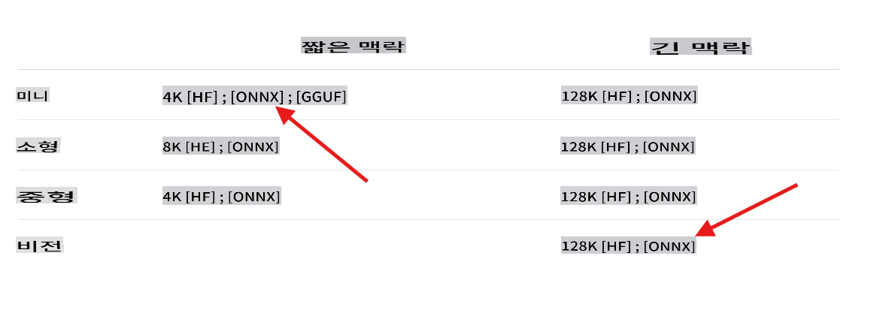

## Phi-3 실습에 오신 것을 환영합니다 (C# 사용)

.NET 환경에서 다양한 버전의 Phi-3 모델을 통합하는 방법을 보여주는 여러 실습이 있습니다.

## 사전 요구 사항
샘플을 실행하기 전에 다음 항목이 설치되어 있는지 확인하세요:

**.NET 8:** [최신 버전의 .NET](https://dotnet.microsoft.com/download/dotnet/8.0?WT.mc_id=aiml-137032-kinfeylo)이 머신에 설치되어 있는지 확인하세요.

**(선택 사항) Visual Studio 또는 Visual Studio Code:** .NET 프로젝트를 실행할 수 있는 IDE 또는 코드 편집기가 필요합니다. [Visual Studio](https://visualstudio.microsoft.com/) 또는 [Visual Studio Code](https://code.visualstudio.com?WT.mc_id=aiml-137032-kinfeylo)를 권장합니다.

**git 사용** [Hugging Face](https://huggingface.co)에서 사용할 수 있는 Phi-3 버전 중 하나를 로컬로 클론하세요.

**phi3-mini-4k-instruct-onnx 모델**을 로컬 머신에 다운로드하세요:

### 모델을 저장할 폴더로 이동
```bash
cd c:\phi3\models
```
### lfs 지원 추가
```bash
git lfs install 
```
### mini 4K instruct 모델 클론 및 다운로드
```bash
git clone https://huggingface.co/microsoft/Phi-3-mini-4k-instruct-onnx
```

### vision 128K 모델 클론 및 다운로드
```
git clone https://huggingface.co/microsoft/Phi-3-vision-128k-instruct-onnx-cpu
```
**중요:** 현재 데모는 모델의 ONNX 버전을 사용하도록 설계되었습니다. 이전 단계에서는 다음 모델을 클론합니다.



## 실습에 대하여

주요 솔루션에는 C#을 사용하여 Phi-3 모델의 기능을 보여주는 여러 샘플 실습이 포함되어 있습니다.

| 프로젝트 | 설명 | 위치 |
| ------------ | ----------- | -------- |
| LabsPhi301    | 로컬 phi3 모델을 사용하여 질문에 답하는 샘플 프로젝트입니다. 이 프로젝트는 `Microsoft.ML.OnnxRuntime` 라이브러리를 사용하여 로컬 ONNX Phi-3 모델을 로드합니다. | .\src\LabsPhi301\ |
| LabsPhi302    | Semantic Kernel을 사용하여 콘솔 채팅을 구현한 샘플 프로젝트입니다. | .\src\LabsPhi302\ |
| LabsPhi303 | 로컬 phi3 비전 모델을 사용하여 이미지를 분석하는 샘플 프로젝트입니다. 이 프로젝트는 `Microsoft.ML.OnnxRuntime` 라이브러리를 사용하여 로컬 ONNX Phi-3 비전 모델을 로드합니다. | .\src\LabsPhi303\ |
| LabsPhi304 | 로컬 phi3 비전 모델을 사용하여 이미지를 분석하는 샘플 프로젝트입니다. 이 프로젝트는 `Microsoft.ML.OnnxRuntime` 라이브러리를 사용하여 로컬 ONNX Phi-3 비전 모델을 로드합니다. 이 프로젝트는 또한 사용자와 상호작용할 수 있는 다양한 옵션을 제공하는 메뉴를 제공합니다. | .\src\LabsPhi304\ |
| LabsPhi305 | ollama 모델에 호스팅된 Phi-3를 사용하여 질문에 답하는 샘플 프로젝트입니다.  |**곧 제공 예정**|
| LabsPhi306 | Semantic Kernel을 사용하여 콘솔 채팅을 구현한 샘플 프로젝트입니다. |**곧 제공 예정**|
| LabsPhi307  | 로컬 임베딩 및 Semantic Kernel을 사용하여 RAG를 구현한 샘플 프로젝트입니다. |**곧 제공 예정**|

## 프로젝트 실행 방법

프로젝트를 실행하려면 다음 단계를 따르세요:
1. 리포지토리를 로컬 머신에 클론하세요.

1. 터미널을 열고 원하는 프로젝트로 이동하세요. 예를 들어, `LabsPhi301`을 실행해 봅시다.
    ```bash
    cd .\src\LabsPhi301\
    ```

1. 다음 명령어로 프로젝트를 실행하세요
    ```bash
    dotnet run
    ```

1. 샘플 프로젝트는 사용자 입력을 요청하고 로컬 모드를 사용하여 응답합니다.

    실행 중인 데모는 다음과 유사합니다:

    

    ***참고:** 첫 번째 질문에 오타가 있지만, Phi-3는 정확한 답변을 제공합니다!*

1. 프로젝트 `LabsPhi304`는 사용자에게 다양한 옵션을 선택하도록 요청한 후 요청을 처리합니다. 예를 들어, 로컬 이미지를 분석하는 경우.

    실행 중인 데모는 다음과 유사합니다:

    

면책 조항: 이 번역은 AI 모델에 의해 원본에서 번역된 것이며 완벽하지 않을 수 있습니다. 
출력을 검토하고 필요한 수정 사항을 반영해 주시기 바랍니다.