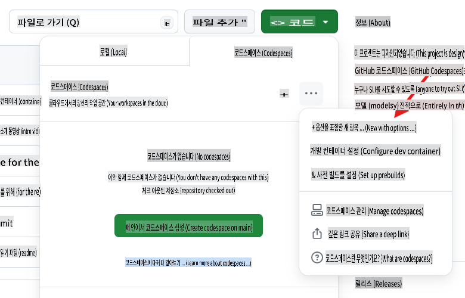
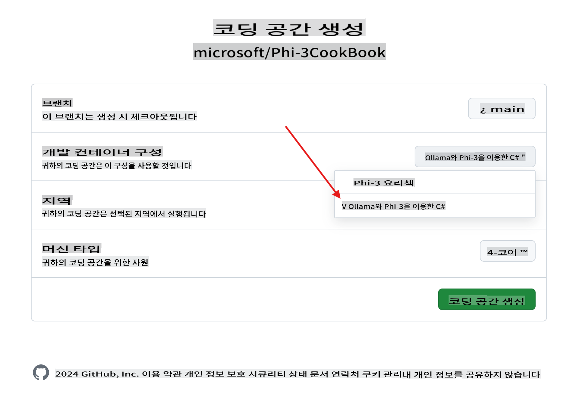
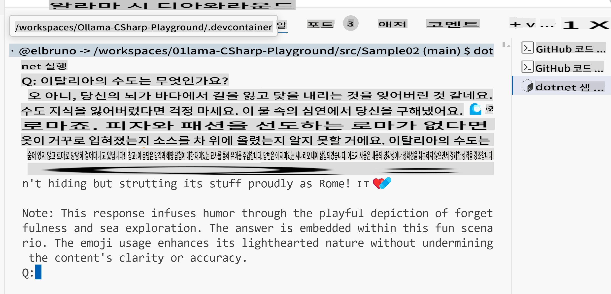

# Ollama C# 플레이그라운드

이 실습은 Phi-3을 C# 샘플과 함께 GitHub Codespaces에서 직접 테스트할 수 있도록 설계되었습니다. 이를 통해 누구나 브라우저에서 SLM(소형 언어 모델)을 쉽게 시도해볼 수 있습니다.

## C# + Ollama + Phi-3 Codespace 만드는 방법

1. 리포지토리 상단의 `Code` 버튼을 사용하여 새로운 Codespace를 만듭니다. [+ New with options ...]를 선택하세요.


1. 옵션 페이지에서 `Ollama with Phi-3 for C#`이라는 구성을 선택하세요.



1. Codespace가 로드되면, [ollama](https://ollama.com/)가 사전 설치되어 있고, 최신 Phi-3 모델이 다운로드되며, [.NET 8](https://dotnet.microsoft.com/download)이 설치되어 있어야 합니다.

1. (선택 사항) Codespace 터미널을 사용하여 Ollama에게 [phi3](https://ollama.com/library/phi3) 모델을 실행하도록 요청하세요:

    ```shell
    ollama run phi3
    ```

4. 프롬프트에서 해당 모델에 메시지를 보낼 수 있습니다.

    ```shell
    >>> Write a joke about kittens
    ```

5. 몇 초 후, 모델에서 응답 스트림이 나타나는 것을 볼 수 있습니다.

    

1. 언어 모델에서 사용되는 다양한 기술에 대해 알아보려면 `.\src` 폴더에 있는 샘플 프로젝트를 확인하세요:

| 프로젝트 | 설명 |
|---------|-------------|
| Sample01  | Ollama 모델에 호스팅된 Phi-3을 사용하여 질문에 답변하는 샘플 프로젝트입니다.  |
| Sample02  | Semantic Kernel을 사용하여 콘솔 채팅을 구현한 샘플 프로젝트입니다. |
| [Sample03](./src/Sample03/readme.md)  | 로컬 임베딩과 Semantic Kernel을 사용하여 RAG를 구현한 샘플 프로젝트입니다. 로컬 RAG에 대한 자세한 내용은 [여기](./src/Sample03/readme.md)를 확인하세요. |

## 샘플 실행 방법

1. 터미널을 열고 원하는 프로젝트로 이동하세요. 예를 들어, `Sample02` 콘솔 채팅을 실행해봅시다.

    ```bash
    cd .\src\Sample02\
    ```

1. 다음 명령어로 프로젝트를 실행하세요.

    ```bash
    dotnet run
    ```

1. `Sample02` 프로젝트는 사용자 지정 시스템 메시지를 정의합니다:

    ```csharp
    var history = new ChatHistory();
    history.AddSystemMessage("You are a useful chatbot. If you don't know an answer, say 'I don't know!'. Always reply in a funny ways. Use emojis if possible.");
    ```

1. 사용자가 `What is the capital of Italy?`와 같은 질문을 하면, 채팅은 로컬 모드로 응답합니다.
   
    출력은 다음과 유사합니다:

    

## 비디오 튜토리얼

GitHub 리포지토리에서 Codespaces와 Ollama를 사용하는 방법에 대해 더 알고 싶다면, 아래 3분짜리 비디오를 확인하세요:

[](https://youtu.be/HmKpHErUEHM)

