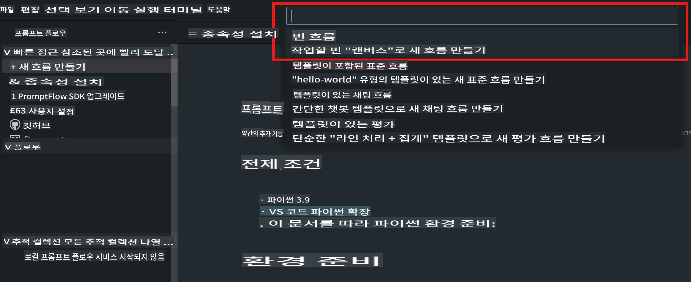
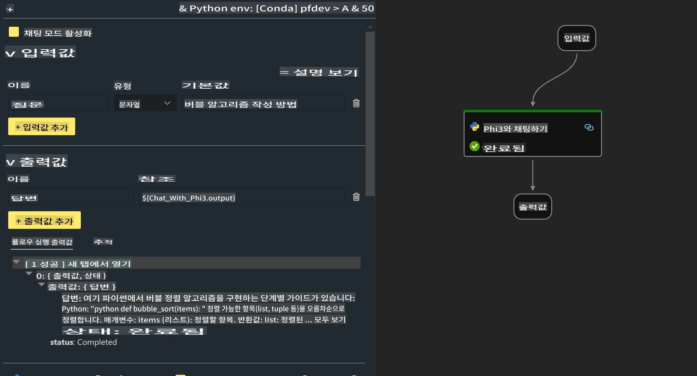

# **Lab 2 - AIPC에서 Phi-3-mini로 프롬프트 플로우 실행하기**

## **프롬프트 플로우란?**

프롬프트 플로우는 LLM 기반 AI 애플리케이션의 아이디어 구상부터 프로토타입 제작, 테스트, 평가, 프로덕션 배포 및 모니터링까지의 전체 개발 주기를 간소화하는 개발 도구 모음입니다. 프롬프트 엔지니어링을 훨씬 쉽게 만들며, 프로덕션 품질의 LLM 앱을 구축할 수 있게 해줍니다.

프롬프트 플로우를 사용하면 다음을 할 수 있습니다:

- LLM, 프롬프트, Python 코드 및 기타 도구를 실행 가능한 워크플로우로 연결하는 플로우를 생성할 수 있습니다.

- 특히 LLM과의 상호작용을 쉽게 디버그하고 반복할 수 있습니다.

- 더 큰 데이터셋으로 품질 및 성능 지표를 계산하여 플로우를 평가할 수 있습니다.

- CI/CD 시스템에 테스트 및 평가를 통합하여 플로우의 품질을 보장할 수 있습니다.

- 선택한 서빙 플랫폼에 플로우를 배포하거나 앱의 코드 베이스에 쉽게 통합할 수 있습니다.

- (선택 사항이지만 강력히 권장됨) Azure AI의 클라우드 버전을 활용하여 팀과 협업할 수 있습니다.

## **AIPC란?**

AI PC는 각각 특정 AI 가속 기능을 갖춘 CPU, GPU 및 NPU를 가지고 있습니다. NPU(신경 처리 장치)는 인공지능(AI) 및 머신 러닝(ML) 작업을 클라우드로 데이터를 보내지 않고 PC에서 직접 처리하는 특수 가속기입니다. GPU와 CPU도 이러한 작업을 처리할 수 있지만, NPU는 저전력 AI 계산에 특히 뛰어납니다. AI PC는 컴퓨터 작동 방식의 근본적인 변화를 나타냅니다. 기존에 없던 문제를 해결하는 것이 아니라 일상적인 PC 사용에서 큰 개선을 약속합니다.

그렇다면 어떻게 작동할까요? 엄청난 양의 공개 데이터로 훈련된 생성형 AI와 대규모 LLM과 비교할 때, PC에서 발생하는 AI는 거의 모든 수준에서 더 접근하기 쉽습니다. 개념이 더 쉽게 이해되며, 클라우드에 접근할 필요 없이 여러분의 데이터로 훈련되기 때문에 더 넓은 인구에게 즉각적인 이점을 제공합니다.

단기적으로 AI PC 세계는 개인 비서와 PC에서 직접 실행되는 더 작은 AI 모델을 포함하며, 여러분의 데이터를 사용하여 일상적으로 하는 일들에 대해 개인적이고, 비공개적이며, 더 안전한 AI 향상을 제공합니다. 예를 들어 회의 기록 작성, 판타지 풋볼 리그 조직, 사진 및 비디오 편집 자동화, 가족 모임의 완벽한 일정을 구성하는 것 등이 있습니다.

## **AIPC에서 생성 코드 플로우 구축하기**

***Note***: 환경 설치를 완료하지 않았다면 [Lab 0 -Installations](./01.Installations.md)를 방문하세요.

1. Visual Studio Code에서 프롬프트 플로우 확장을 열고 빈 플로우 프로젝트를 만듭니다.



2. 입력 및 출력 매개변수를 추가하고 새로운 플로우로 Python 코드를 추가합니다.



(flow.dag.yaml)을 참고하여 플로우를 구성할 수 있습니다.

```yaml

inputs:
  question:
    type: string
    default: how to write Bubble Algorithm
outputs:
  answer:
    type: string
    reference: ${Chat_With_Phi3.output}
nodes:
- name: Chat_With_Phi3
  type: python
  source:
    type: code
    path: Chat_With_Phi3.py
  inputs:
    question: ${inputs.question}


```

3. ***Chat_With_Phi3.py***에 코드를 추가합니다.

```python


from promptflow.core import tool

# import torch
from transformers import AutoTokenizer, pipeline,TextStreamer
import intel_npu_acceleration_library as npu_lib

import warnings

import asyncio
import platform

class Phi3CodeAgent:
    
    model = None
    tokenizer = None
    text_streamer = None
    
    model_id = "microsoft/Phi-3-mini-4k-instruct"

    @staticmethod
    def init_phi3():
        
        if Phi3CodeAgent.model is None or Phi3CodeAgent.tokenizer is None or Phi3CodeAgent.text_streamer is None:
            Phi3CodeAgent.model = npu_lib.NPUModelForCausalLM.from_pretrained(
                                    Phi3CodeAgent.model_id,
                                    torch_dtype="auto",
                                    dtype=npu_lib.int4,
                                    trust_remote_code=True
                                )
            Phi3CodeAgent.tokenizer = AutoTokenizer.from_pretrained(Phi3CodeAgent.model_id)
            Phi3CodeAgent.text_streamer = TextStreamer(Phi3CodeAgent.tokenizer, skip_prompt=True)

    

    @staticmethod
    def chat_with_phi3(prompt):
        
        Phi3CodeAgent.init_phi3()

        messages = "<|system|>You are a AI Python coding assistant. Please help me to generate code in Python.The answer only genertated Python code, but any comments and instructions do not need to be generated<|end|><|user|>" + prompt +"<|end|><|assistant|>"


        generation_args = {
            "max_new_tokens": 1024,
            "return_full_text": False,
            "temperature": 0.3,
            "do_sample": False,
            "streamer": Phi3CodeAgent.text_streamer,
        }

        pipe = pipeline(
            "text-generation",
            model=Phi3CodeAgent.model,
            tokenizer=Phi3CodeAgent.tokenizer,
            # **generation_args
        )

        result = ''

        with warnings.catch_warnings():
            warnings.simplefilter("ignore")
            response = pipe(messages, **generation_args)
            result =response[0]['generated_text']
            return result


@tool
def my_python_tool(question: str) -> str:
    if platform.system() == 'Windows':
        asyncio.set_event_loop_policy(asyncio.WindowsSelectorEventLoopPolicy())
    return Phi3CodeAgent.chat_with_phi3(question)


```

4. 디버그 또는 실행에서 플로우를 테스트하여 생성된 코드가 올바른지 확인할 수 있습니다.


5. 터미널에서 개발 API로 플로우를 실행합니다.

```

pf flow serve --source ./ --port 8080 --host localhost   

```

Postman / Thunder Client에서 테스트할 수 있습니다.

### **참고 사항**

1. 첫 실행은 시간이 오래 걸립니다. Hugging face CLI에서 phi-3 모델을 다운로드하는 것이 좋습니다.

2. Intel NPU의 제한된 계산 능력을 고려하여 Phi-3-mini-4k-instruct를 사용하는 것이 좋습니다.

3. Intel NPU 가속화를 사용하여 INT4 변환을 양자화하지만, 서비스를 다시 실행할 때는 캐시 및 nc_workshop 폴더를 삭제해야 합니다.

## **자원**

1. Promptflow 학습 [https://microsoft.github.io/promptflow/](https://microsoft.github.io/promptflow/)

2. Intel NPU 가속화 학습 [https://github.com/intel/intel-npu-acceleration-library](https://github.com/intel/intel-npu-acceleration-library)

3. 샘플 코드 다운로드 [Local NPU Agent Sample Code](../../../../../../../code/07.Lab/01/AIPC/local-npu-agent)

**면책 조항**:
이 문서는 기계 기반 AI 번역 서비스를 사용하여 번역되었습니다. 정확성을 위해 노력하고 있지만 자동 번역에는 오류나 부정확성이 있을 수 있습니다. 원어로 작성된 원본 문서를 권위 있는 자료로 간주해야 합니다. 중요한 정보에 대해서는 전문적인 인간 번역을 권장합니다. 이 번역 사용으로 인해 발생하는 오해나 잘못된 해석에 대해 당사는 책임을 지지 않습니다.