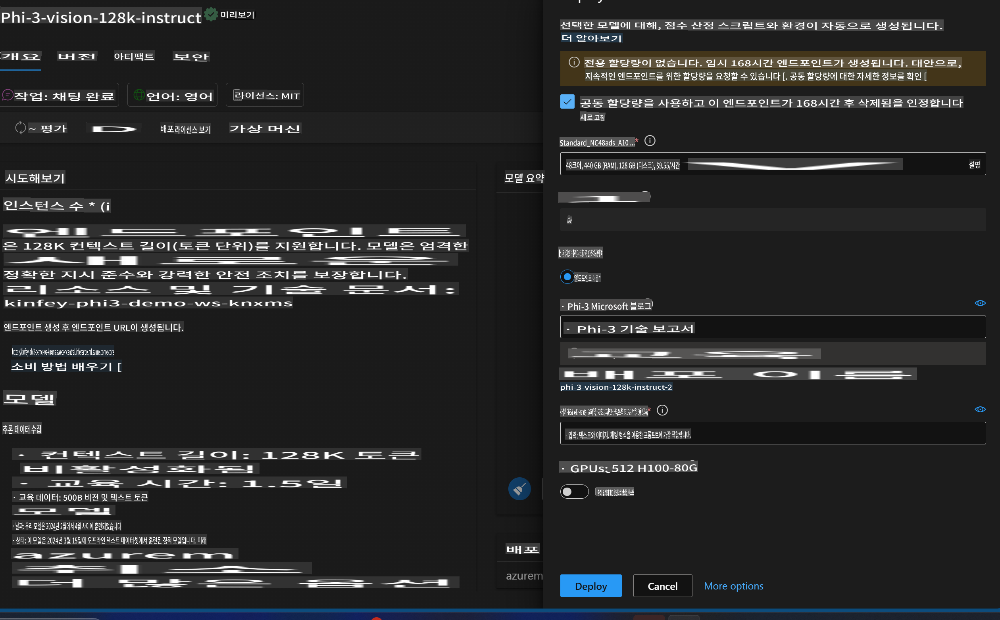
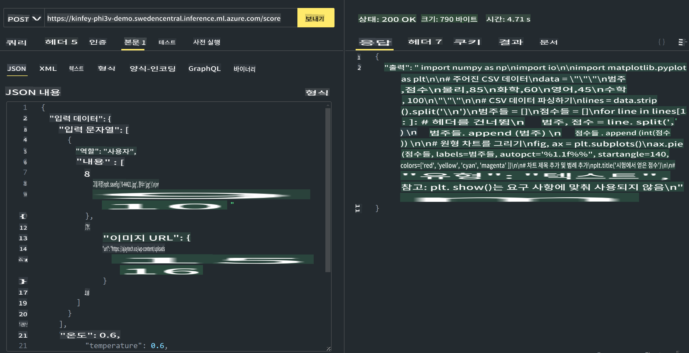

# **Lab 3 - Azure Machine Learning Service에 Phi-3-vision 배포하기**

우리는 NPU를 사용하여 로컬 코드의 프로덕션 배포를 완료한 후, 이를 통해 PHI-3-VISION 기능을 도입하여 이미지를 코드로 생성하는 능력을 소개하고자 합니다.

이 가이드를 통해 Azure Machine Learning Service에서 Model As Service Phi-3 Vision 서비스를 빠르게 구축할 수 있습니다.

***Note***: Phi-3 Vision은 더 빠른 속도로 콘텐츠를 생성하기 위해 컴퓨팅 파워가 필요합니다. 이를 위해 클라우드 컴퓨팅 파워가 필요합니다.


### **1. Azure Machine Learning Service 만들기**

Azure Portal에서 Azure Machine Learning Service를 만들어야 합니다. 만드는 방법을 배우고 싶다면 이 링크를 방문하세요 [https://learn.microsoft.com/azure/machine-learning/quickstart-create-resources?view=azureml-api-2](https://learn.microsoft.com/azure/machine-learning/quickstart-create-resources?view=azureml-api-2)


### **2. Azure Machine Learning Service에서 Phi-3 Vision 선택하기**


### **3. Azure에 Phi-3-Vision 배포하기**




### **4. Postman에서 Endpoint 테스트하기**




***Note***

1. 전달해야 할 매개변수에는 Authorization, azureml-model-deployment, Content-Type이 포함되어야 합니다. 배포 정보를 확인하여 이를 얻어야 합니다.

2. 매개변수를 전달하려면 Phi-3-Vision이 이미지 링크를 전달해야 합니다. 매개변수를 전달하는 방법은 GPT-4-Vision 방법을 참조하세요, 예를 들어

```json

{
  "input_data":{
    "input_string":[
      {
        "role":"user",
        "content":[ 
          {
            "type": "text",
            "text": "You are a Python coding assistant.Please create Python code for image "
          },
          {
              "type": "image_url",
              "image_url": {
                "url": "https://ajaytech.co/wp-content/uploads/2019/09/index.png"
              }
          }
        ]
      }
    ],
    "parameters":{
          "temperature": 0.6,
          "top_p": 0.9,
          "do_sample": false,
          "max_new_tokens": 2048
    }
  }
}

```

3. Post 메서드를 사용하여 **/score** 호출하기

**축하합니다**! 빠른 PHI-3-VISION 배포를 완료하고 이미지를 사용하여 코드를 생성하는 방법을 시도해 보았습니다. 이제 NPU와 클라우드를 결합하여 애플리케이션을 구축할 수 있습니다.

