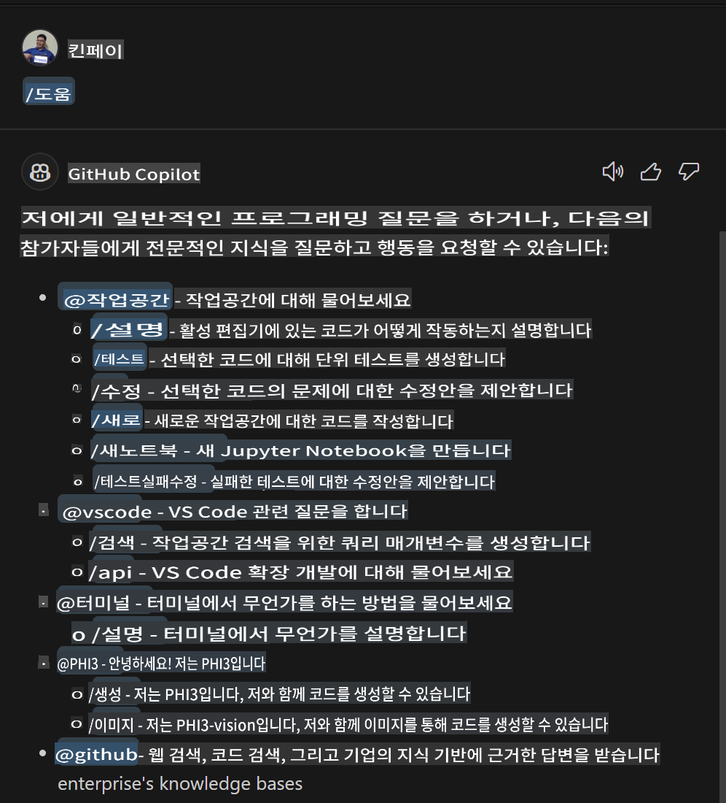
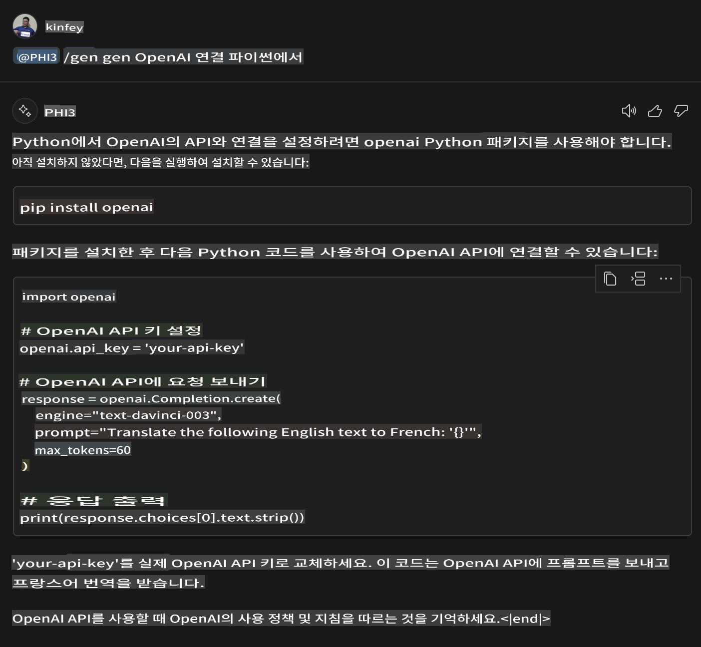
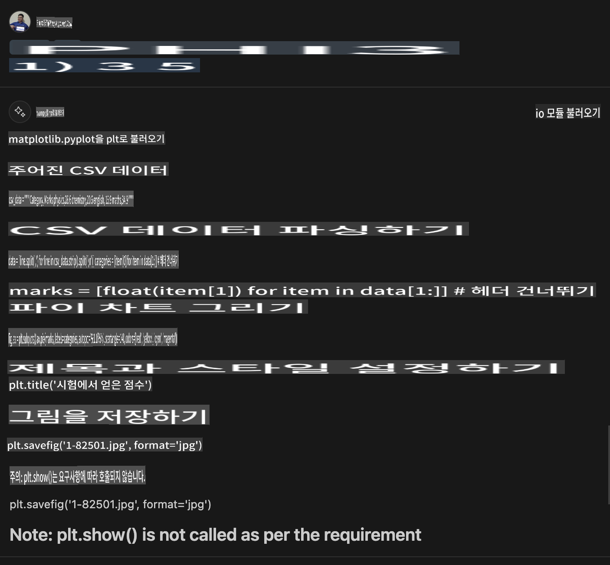

# **Lab 3 - GitHub Copilot Chat에서 @PHI3 에이전트 만들기**

Visual Studio Code Copilot Chat에서는 @workspace를 통해 전체 프로젝트를 관리할 수 있습니다. 기업 시나리오에서는 Copilot Chat의 에이전트를 더 유연하게 맞춤 설정할 수도 있습니다.

지난 Lab에서는 NPU와 클라우드를 결합하여 Phi3 Agent를 위한 Visual Studio Code Extension을 완성했습니다.



### **1. VSCode 개발 확장 프로그램 만들기**

확장 프로그램 프로젝트를 만들려면 다음 링크를 참조하세요: [https://code.visualstudio.com/api/get-started/your-first-extension](https://code.visualstudio.com/api/get-started/your-first-extension)

***NOTE:*** 이 프로젝트의 기술 솔루션으로 Typescript와 WebPack을 사용하세요.

### **2. vscode.d.ts 추가**

Visual Studio Code Chat API는 아직 코드 API에 병합되지 않았지만, 확장을 통해 추가할 수 있습니다.

vscode.d.ts 다운로드 [https://github.com/microsoft/vscode/blob/main/src/vscode-dts/vscode.d.ts](https://github.com/microsoft/vscode/blob/main/src/vscode-dts/vscode.d.ts)

***NOTE:*** Visual Studio Code Insiders 1.90+에서 실행하세요.

### **3. package.json 업데이트**

```json

{
  "name": "phi3ext",
  "displayName": "phi3ext",
  "description": "",
  "version": "0.0.1",
  "engines": {
    "vscode": "^1.90.0"
  },
  "categories": [
      "AI",
      "Chat"
  ],
  "activationEvents": [],
  "enabledApiProposals": [
      "chatVariableResolver"
  ],
  "main": "./dist/extension.js",
  "contributes": {
      "chatParticipants": [
          {
              "id": "chat.PHI3",
              "name": "PHI3",
              "description": "Hey! I am PHI3",
              "isSticky": true,
              "commands": [
                  {
                      "name": "gen",
                      "description": "I am PHI3, you can gen code with me"
                  },
                  {
                      "name": "img",
                      "description": "I am PHI3-vision, you can gen code from img with me"
                  }
              ]
          }
      ],
      "commands": [
          {
              "command": "PHI3.namesInEditor",
              "title": "Use PHI3 in Editor"
          }
      ]
  },  
  "scripts": {
    "vscode:prepublish": "npm run package",
    "compile": "webpack",
    "watch": "webpack --watch",
    "package": "webpack --mode production --devtool hidden-source-map",
    "compile-tests": "tsc -p . --outDir out",
    "watch-tests": "tsc -p . -w --outDir out",
    "pretest": "npm run compile-tests && npm run compile && npm run lint",
    "lint": "eslint src --ext ts",
    "test": "vscode-test"
  },
  "devDependencies": {
    "@types/vscode": "^1.90.0",
    "@types/mocha": "^10.0.6",
    "@types/node": "18.x",
    "@typescript-eslint/eslint-plugin": "^7.11.0",
    "@typescript-eslint/parser": "^7.11.0",
    "eslint": "^8.57.0",
    "typescript": "^5.4.5",
    "ts-loader": "^9.5.1",
    "webpack": "^5.91.0",
    "webpack-cli": "^5.1.4",
    "@vscode/test-cli": "^0.0.9",
    "@vscode/test-electron": "^2.4.0"
  },
  "dependencies": {
    "@types/node-fetch": "^2.6.11",
    "node-fetch": "^3.3.2"
  }
}

```

터미널에서 **npm install**을 실행하고 확장 프로그램을 디버그하여 테스트할 수 있습니다.

***샘플 코드 다운로드*** [여기를 클릭하세요](../../../../../../../code/07.Lab/01/AIPC)

### **4. src/extension.ts 변경**

```ts

// 'vscode' 모듈은 VS Code 확장 API를 포함합니다
// 모듈을 가져와서 아래 코드에서 vscode 별칭으로 참조합니다
import * as vscode from 'vscode';

interface IPHI3ChatResult extends vscode.ChatResult {
    metadata: {
        command: string;
    }
}

// 이 메서드는 확장이 활성화될 때 호출됩니다
// 첫 번째 명령이 실행될 때 확장이 처음으로 활성화됩니다
export function activate(extcontext: vscode.ExtensionContext) {

	// SHEIN 채팅 핸들러 정의
	const phi3handler: vscode.ChatRequestHandler = async (request: vscode.ChatRequest, context: vscode.ChatContext, stream: vscode.ChatResponseStream, token: vscode.CancellationToken): Promise<IPHI3ChatResult> => {

		if (request.command == 'gen') {

			const content = "Welcome to Phi-3 to gen code";

			const result = await gen(request.prompt);

			const code = result;
			
			stream.progress("```txt"+"\n"+code+ +"\n"+"```")

            return { metadata: { command: 'gen' } };
		}
		if (request.command == 'img') {

			const content = "Welcome to Phi-3 vision to gen code in image";

			const prompt = request.prompt;

			if(prompt.indexOf("(IMG_URL:")>-1){

				const img_url = prompt.split("(IMG_URL:")[1].split(")")[0];
				const question = prompt.split("(IMG_URL:")[0];
				const tmp = question;

				const result = await genImage(question,img_url);
	
				const code = result;
				
				stream.progress(code)
	
				return { metadata: { command: 'img' } };
			}
			else
			{
				var result = "```txt"+"\n\n"+"Please ask question like this Your question (IMG_URL:https://example.com/image.jpg)"+"\n\n"++"```";
				stream.progress(result);
			}

            return { metadata: { command: 'img' } };
		}

		return { metadata: { command: '' } };
	}

	const xp = vscode.chat.createChatParticipant("chat.PHI3", phi3handler);

	xp.iconPath = new vscode.ThemeIcon('sparkle');

    xp.followupProvider = {
        provideFollowups(result: IPHI3ChatResult, context: vscode.ChatContext, token: vscode.CancellationToken) {
            return [{
                prompt: 'let us code with Phi-3 Family',
                label: vscode.l10n.t('Dev with Phi-3 Family'),
                command: 'help'
            } satisfies vscode.ChatFollowup];
        }
    };

	extcontext.subscriptions.push(xp);
}

interface GenCode {
	question: string;
}

interface ImgGenCodeResponse {
	output: string;
}

interface GenCodeResponse {
	answer: string;
}

async function gen(prompt: string) {

	const postData: GenCode = {
		question: prompt
	};
	const response = await fetch('http://localhost:8080/score', {
		method: 'POST',
		body: JSON.stringify(postData),
		headers: { 'Content-Type': 'application/json' }
	});
	const post = await response.json();
	const resultResponse = post as GenCodeResponse;
	return resultResponse.answer;
}

async function genImage(prompt: string, img_url: string) {

	const response = await fetch('Your Phi-3-Vision Endpoint', {
		method: 'POST',
		body: JSON.stringify({
			"input_data":{
			  "input_string":[
				{
				  "role":"user",
				  "content":[ 
					{
					  "type": "text",
					  "text": prompt
					},
					{
						"type": "image_url",
						"image_url": {
						  "url": img_url
						}
					}
				  ]
				}
			  ],
			  "parameters":{
					"temperature": 0.6,
					"top_p": 0.9,
					"do_sample": false,
					"max_new_tokens": 2048
			  }
			}
		}),
		headers: { 'Content-Type': 'application/json', 'Authorization' : 'Bearer Your Phi-3-Vision Endpoint Key', 'azureml-model-deployment': 'Your Phi-3-Vision Deployment name' }
	});
	const post = await response.json();
	const resultResponse = post as ImgGenCodeResponse;
	return resultResponse.output;
}

// 이 메서드는 확장이 비활성화될 때 호출됩니다
export function deactivate() {}

```

축하합니다! 모든 실습을 완료했습니다. 이 과정이 Phi-3 Family와 GitHub Copilot Chat을 이해하는 데 도움이 되길 바랍니다.

***@PHI3 /gen***을 시도해보세요



***@PHI3 /img***을 시도해보세요



면책 조항: 이 번역은 원본에서 AI 모델에 의해 번역되었으며 완벽하지 않을 수 있습니다.
출력을 검토하고 필요한 수정을 해주시기 바랍니다.