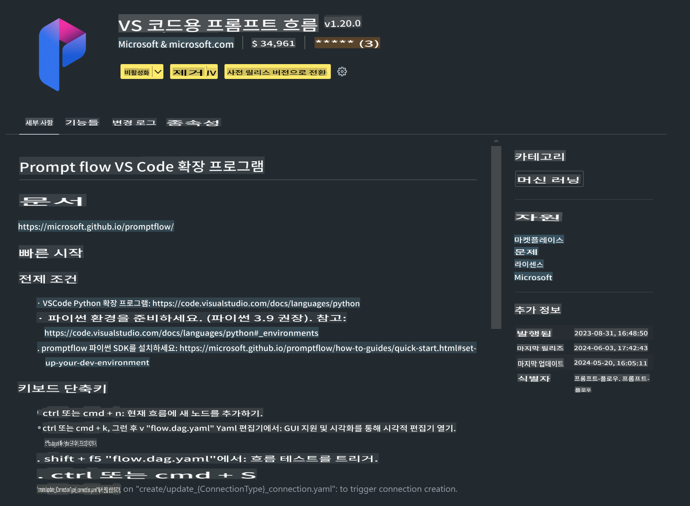

# **Lab 0 - 설치**

Lab에 들어가면 관련 환경을 설정해야 합니다:


### **1. Python 3.11+**

Python 환경을 설정할 때 miniforge를 사용하는 것이 좋습니다.

miniforge를 설정하려면 [https://github.com/conda-forge/miniforge](https://github.com/conda-forge/miniforge)를 참고하세요.

miniforge를 설정한 후 Power Shell에서 다음 명령어를 실행하세요.

```bash

conda create -n pyenv python==3.11.8 -y

conda activate pyenv

```


### **2. Prompt flow SDK 설치**

Lab 1에서는 Prompt flow를 사용하므로 Prompt flow SDK를 설정해야 합니다.

```bash

pip install promptflow --upgrade

```

다음 명령어로 promptflow sdk를 확인할 수 있습니다.


```bash

pf --version

```

### **3. Visual Studio Code Prompt flow Extension 설치**




### **4. Apple's MLX Framework**

MLX는 Apple 기계 학습 연구 팀이 제공하는 Apple 실리콘에서 기계 학습 연구를 위한 배열 프레임워크입니다. **Apple MLX 프레임워크**를 사용하여 Apple Silicon에서 LLM / SLM을 가속화할 수 있습니다. 더 알고 싶다면 [https://github.com/microsoft/Phi-3CookBook/blob/main/md/03.Inference/MLX_Inference.md](https://github.com/microsoft/Phi-3CookBook/blob/main/md/03.Inference/MLX_Inference.md)를 읽어보세요.

bash에서 MLX framework 라이브러리를 설치하세요.

```bash

pip install mlx-lm

```


### **5. 기타 Python 라이브러리**

requirements.txt를 만들고 다음 내용을 추가하세요.

```txt

notebook
numpy 
scipy 
scikit-learn 
matplotlib 
pandas 
pillow 
graphviz

```


### **6. NVM 설치**

Powershell에서 nvm을 설치하세요.

```bash

brew install nvm

```

nodejs 18.20을 설치하세요.

```bash

nvm install 18.20.0

nvm use 18.20.0

```


### **7. Visual Studio Code 개발 지원 설치**

```bash

npm install --global yo generator-code

```

축하합니다! SDK 설정을 성공적으로 완료했습니다. 이제 실습 단계로 진행하세요.

**면책 조항**:
이 문서는 기계 기반 AI 번역 서비스를 사용하여 번역되었습니다. 우리는 정확성을 위해 노력하지만, 자동 번역에는 오류나 부정확성이 포함될 수 있습니다. 원본 문서의 모국어 버전을 권위 있는 출처로 간주해야 합니다. 중요한 정보에 대해서는 전문적인 인간 번역을 권장합니다. 이 번역 사용으로 인한 오해나 잘못된 해석에 대해 우리는 책임을 지지 않습니다.