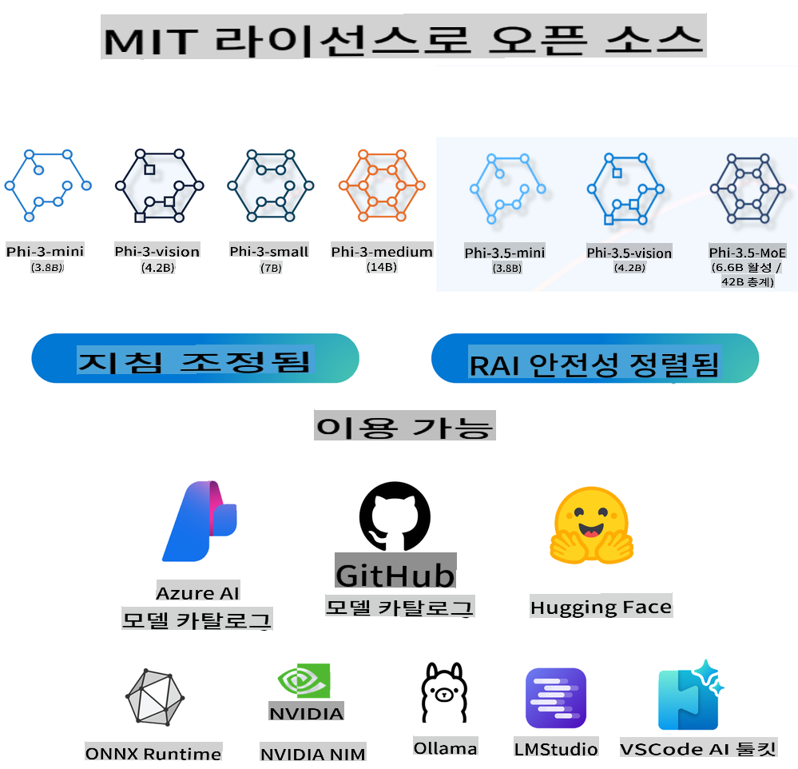
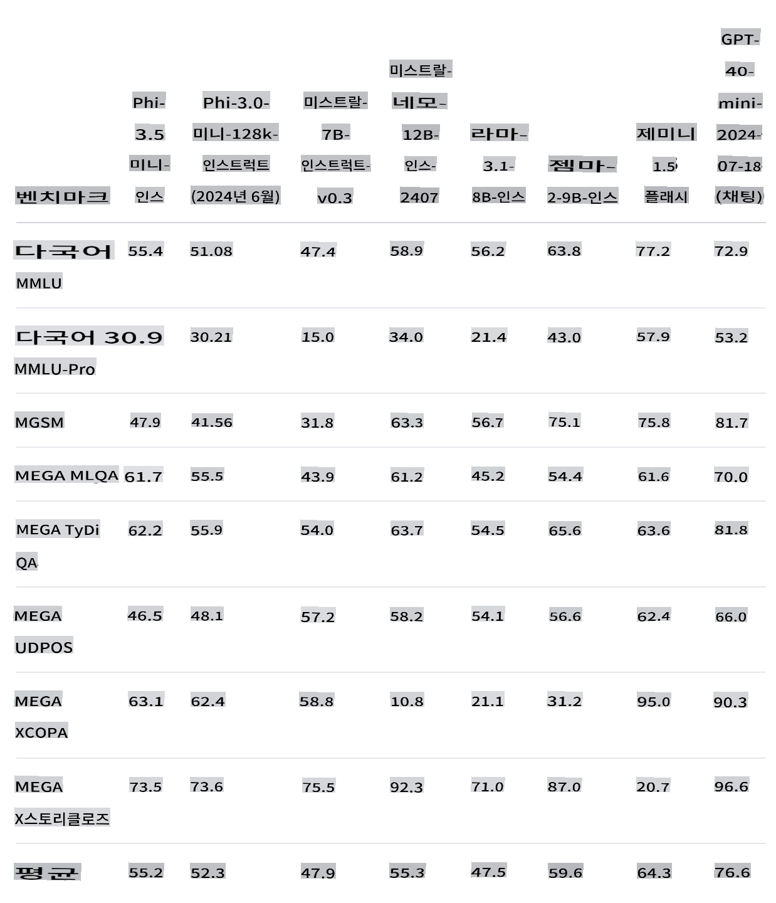
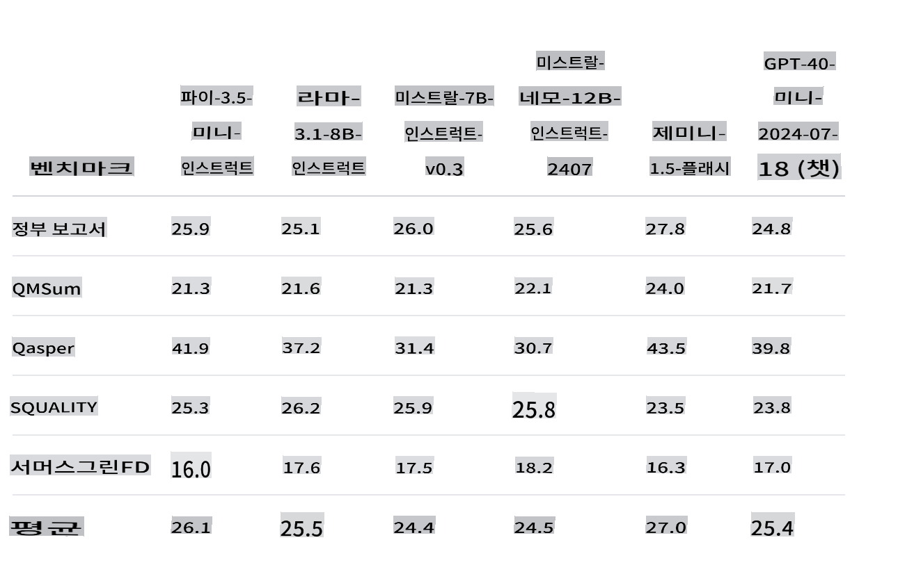
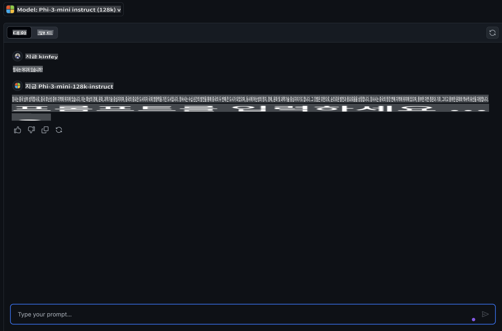
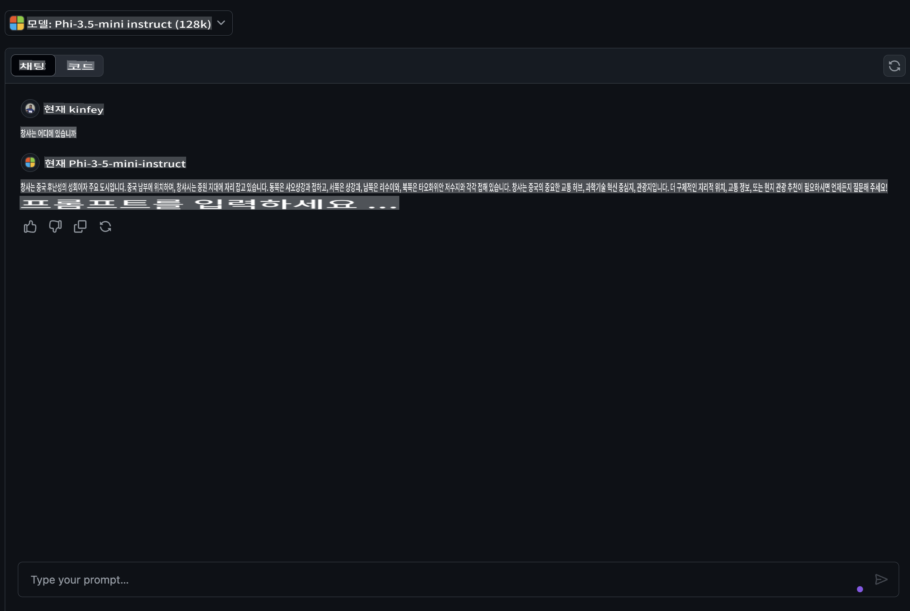
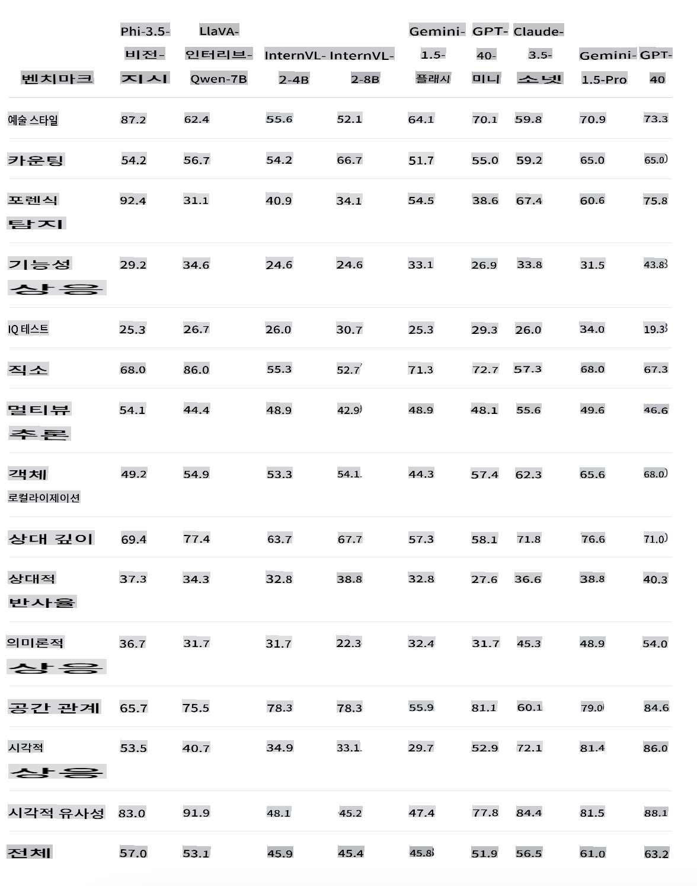
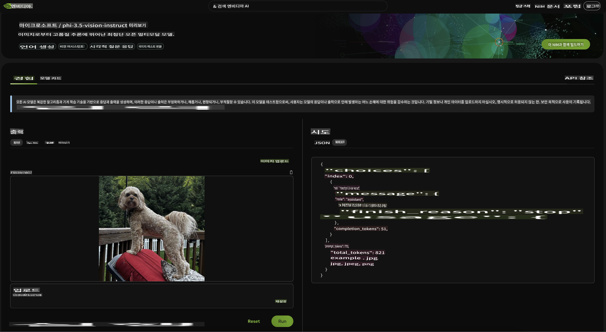
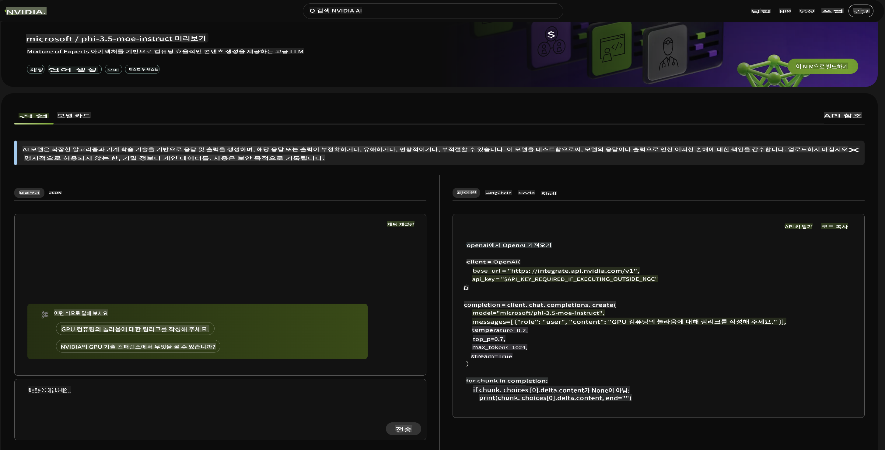

# **Phi-3.5 패밀리의 새로운 기능**

Phi-3 패밀리를 이미 사용하고 계신가요? 어떤 시나리오에서 사용하고 계신가요? 2024년 8월 20일, Microsoft는 다국어, 비전, AI 에이전트가 강화된 새로운 Phi-3.5 패밀리를 출시했습니다. Hugging Face의 모델 카드를 참고하여 더 자세히 소개해 드리겠습니다.

## **Phi-3.5-mini-instruct**

Phi-3.5-mini는 Phi-3에서 사용된 데이터셋 - 합성 데이터와 필터링된 공개 웹사이트 - 을 기반으로 구축된 경량의 최신 오픈 모델로, 매우 높은 품질의 추론 밀집 데이터를 중점으로 합니다. 이 모델은 Phi-3 모델 패밀리에 속하며, 128K 토큰의 컨텍스트 길이를 지원합니다. 모델은 엄격한 강화 과정을 거쳤으며, 지도 학습 미세 조정, 근접 정책 최적화, 직접 선호도 최적화를 통해 정확한 지침 준수와 강력한 안전 조치를 보장합니다.

벤치마크 지표를 통해 Phi-3.5-mini가 Phi-3-mini에 비해 다국어 및 긴 텍스트 콘텐츠 지원이 향상되었음을 알 수 있습니다. 이는 엣지 애플리케이션에서 Phi-3.5 mini의 언어 및 텍스트 능력을 강화하는 데 사용됩니다.

우리는 GitHub 모델을 통해 중국어 지식의 능력을 비교할 수 있습니다. "长沙在哪里?" (창사 어디에 있나요?)라고 물었을 때, Phi-3-mini-128k-instruct와 Phi-3.5-mini-128k-instruct의 결과를 비교할 수 있습니다.

중국어 코퍼스의 데이터 강화로 인해 Phi-3.5-mini가 기본 텍스트 생성 시나리오에서 더 나은 결과를 얻을 수 있음을 쉽게 알 수 있습니다. (***참고:*** Phi-3.5-mini가 더 정확한 답변이 필요하다면, 애플리케이션 시나리오에 따라 미세 조정을 권장합니다)

## **Phi-3.5-vision-instruct**

Phi-3.5-vision은 텍스트와 비전 모두에서 매우 높은 품질의 추론 밀집 데이터를 중점으로 하는 합성 데이터와 필터링된 공개 웹사이트를 포함한 데이터셋을 기반으로 구축된 경량의 최신 오픈 멀티모달 모델입니다. 이 모델은 Phi-3 모델 패밀리에 속하며, 멀티모달 버전은 128K 토큰의 컨텍스트 길이를 지원합니다. 모델은 엄격한 강화 과정을 거쳤으며, 지도 학습 미세 조정과 직접 선호도 최적화를 통해 정확한 지침 준수와 강력한 안전 조치를 보장합니다.

비전을 통해 Phi-3.x 패밀리의 눈을 열고 다음 시나리오를 완료할 수 있었습니다.

1. 메모리/컴퓨팅 제약 환경
2. 지연 시간 제한 시나리오
3. 일반 이미지 이해
4. 광학 문자 인식
5. 차트 및 테이블 이해
6. 다중 이미지 비교
7. 다중 이미지 또는 비디오 클립 요약

비전을 통해 Phi 패밀리의 눈을 열고 다음 시나리오를 완료할 수 있습니다.

제공된 Hugging Face 벤치마크를 사용하여 다양한 시각적 시나리오에서의 비교를 이해할 수 있습니다.

Phi-3.5-vision-instruct의 무료 체험을 원하시면 [Nivida NIM](https://build.nvidia.com/microsoft/phi-3_5-vision-instruct)을 사용하여 체험을 완료할 수 있습니다.

물론, Azure AI Studio를 통해 배포를 완료할 수도 있습니다.

## **Phi-3.5-MoE-instruct**

Phi-3.5-MoE는 Phi-3에서 사용된 데이터셋 - 합성 데이터와 필터링된 공개 문서 - 을 기반으로 구축된 경량의 최신 오픈 모델로, 매우 높은 품질의 추론 밀집 데이터를 중점으로 합니다. 이 모델은 다국어를 지원하며, 128K 토큰의 컨텍스트 길이를 지원합니다. 모델은 엄격한 강화 과정을 거쳤으며, 지도 학습 미세 조정, 근접 정책 최적화, 직접 선호도 최적화를 통해 정확한 지침 준수와 강력한 안전 조치를 보장합니다.

AI 에이전트의 발전과 함께 MoE 모델에 대한 수요가 점차 증가할 것입니다. MoE, 즉 혼합 전문가 모델은 여러 전문가 모델을 혼합하여 형성된 새로운 모델입니다. MoE는 큰 문제를 먼저 나누고, 작은 문제를 하나씩 해결한 다음 결론을 요약하는 방식입니다. 또한 모델 규모는 모델 성능을 향상시키는 주요 요인 중 하나입니다. 제한된 컴퓨팅 자원으로 더 적은 학습 단계로 더 큰 모델을 학습하는 것이 더 작은 모델을 더 많은 단계로 학습하는 것보다 종종 더 나은 결과를 가져옵니다.

Phi-3.5-MoE-Instruct 모델은 Phi-3.5-Vision 및 Phi-3.5-Instruct보다 더 많은 컴퓨팅 파워를 필요로 합니다. 경험 및 사용을 위해 Azure AI Studio 및 Nvidia NIM과 같은 클라우드 기반 방법을 사용하는 것이 좋습니다.

### **🤖 Apple MLX를 사용하는 Phi-3.5 샘플**

| 실험실    | 소개 | 이동 |
| -------- | ------- |  ------- |
| 🚀 Lab-Introduce Phi-3.5 Instruct  | Phi-3.5 Instruct 사용 방법 배우기 |  [이동](../../../../../code/09.UpdateSamples/Aug/phi3-instruct-demo.ipynb)    |
| 🚀 Lab-Introduce Phi-3.5 Vision (image) | Phi-3.5 Vision을 사용하여 이미지 분석 방법 배우기 |  [이동](../../../../../code/09.UpdateSamples/Aug/phi3-vision-demo.ipynb)    |
| 🚀 Lab-Introduce Phi-3.5 MoE   | Phi-3.5 Vision을 사용하여 이미지 분석 방법 배우기 |  [이동](../../../../../code/09.UpdateSamples/Aug/phi3_moe_demo.ipynb)    |

## **리소스**

1. Hugging Face의 Phi 패밀리 [https://huggingface.co/collections/microsoft/phi-3-6626e15e9585a200d2d761e3](https://huggingface.co/collections/microsoft/phi-3-6626e15e9585a200d2d761e3)

2. GitHub 모델에 대해 [https://gh.io/models](https://gh.io/models)

3. Azure AI Studio에 대해 [https://ai.azure.com/](https://ai.azure.com/)

4. Nvidia NIM에 대해 [https://build.nvidia.com/explore/discover](https://build.nvidia.com/explore/discover)

