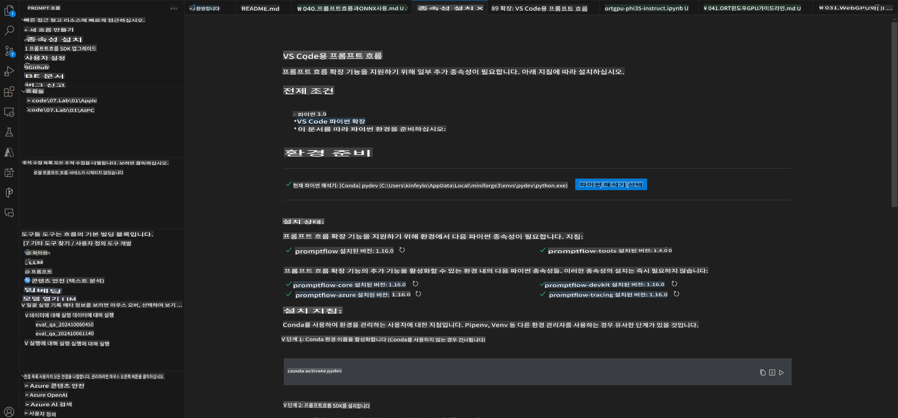
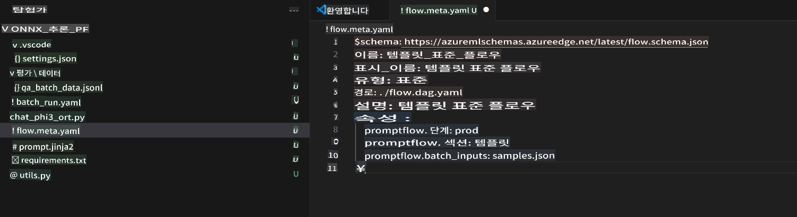
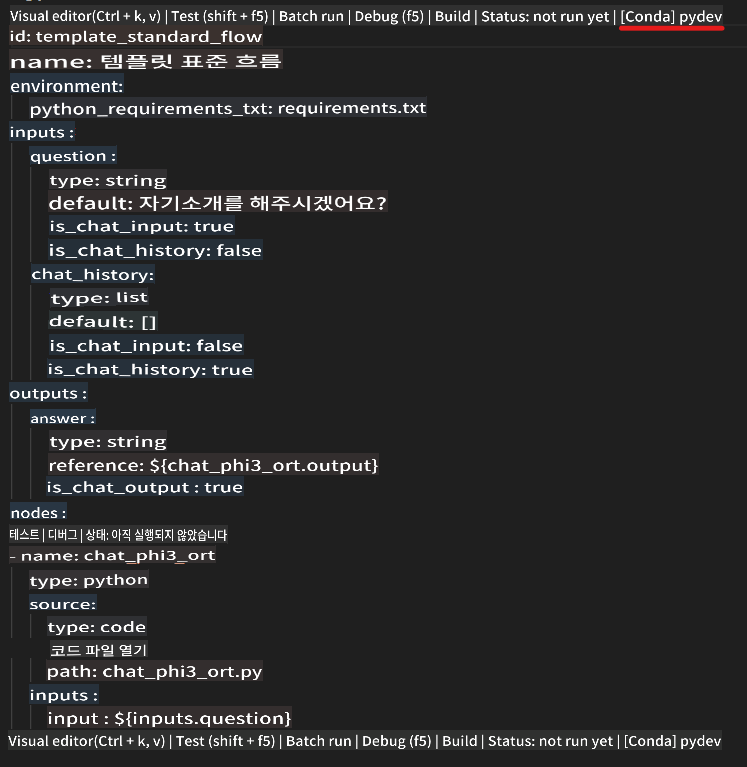
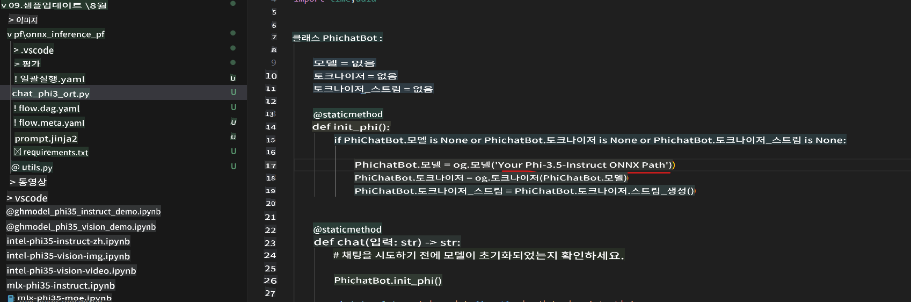
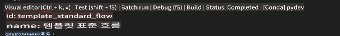
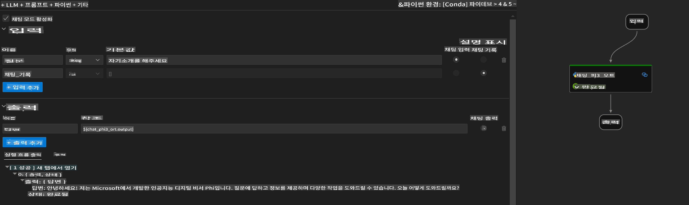
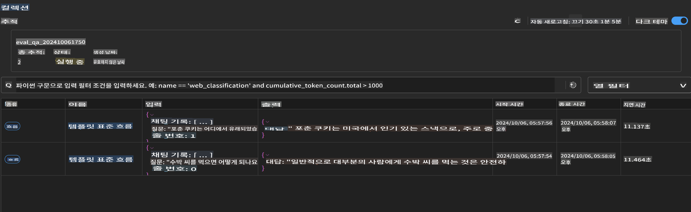

# Windows GPU를 사용하여 Phi-3.5-Instruct ONNX로 Prompt flow 솔루션 만들기

다음 문서는 Phi-3 모델을 기반으로 AI 애플리케이션을 개발하기 위해 ONNX (Open Neural Network Exchange)와 함께 PromptFlow를 사용하는 방법에 대한 예제입니다.

PromptFlow는 LLM 기반 (대형 언어 모델) AI 애플리케이션의 아이디어 구상부터 프로토타이핑, 테스트, 평가까지의 전체 개발 주기를 간소화하기 위해 설계된 개발 도구 모음입니다.

PromptFlow를 ONNX와 통합하면 개발자는 다음을 할 수 있습니다:

- 모델 성능 최적화: ONNX를 활용하여 효율적인 모델 추론 및 배포.
- 개발 간소화: PromptFlow를 사용하여 워크플로우를 관리하고 반복 작업을 자동화.
- 협업 강화: 통합된 개발 환경을 제공하여 팀 구성원 간의 협업을 촉진.

**Prompt flow**는 LLM 기반 AI 애플리케이션의 아이디어 구상, 프로토타이핑, 테스트, 평가에서부터 실제 배포 및 모니터링에 이르기까지의 전체 개발 주기를 간소화하기 위해 설계된 개발 도구 모음입니다. 이는 프롬프트 엔지니어링을 훨씬 쉽게 만들어주며, 생산 품질의 LLM 애플리케이션을 구축할 수 있게 합니다.

Prompt flow는 OpenAI, Azure OpenAI Service, 그리고 맞춤형 모델(Huggingface, 로컬 LLM/SLM)에 연결할 수 있습니다. 우리는 Phi-3.5의 양자화된 ONNX 모델을 로컬 애플리케이션에 배포하고자 합니다. Prompt flow는 우리의 비즈니스를 더 잘 계획하고 Phi-3.5를 기반으로 한 로컬 솔루션을 완성하는 데 도움을 줄 수 있습니다. 이 예제에서는 Windows GPU를 기반으로 한 Prompt flow 솔루션을 완성하기 위해 ONNX Runtime GenAI Library를 결합할 것입니다.

## **설치**

### **Windows GPU용 ONNX Runtime GenAI**

Windows GPU용 ONNX Runtime GenAI 설정에 대한 지침을 읽으려면 [여기를 클릭](./041.ORTWindowGPUGuideline.md)하세요.

### **VSCode에서 Prompt flow 설정하기**

1. Prompt flow VS Code Extension 설치


2. Prompt flow VS Code Extension을 설치한 후, 확장을 클릭하고 **Installation dependencies**를 선택하여 지침에 따라 환경에 Prompt flow SDK를 설치하세요.



3. [샘플 코드](../../../../../code/09.UpdateSamples/Aug/pf/onnx_inference_pf)를 다운로드하고 VS Code로 이 샘플을 여세요.



4. **flow.dag.yaml**을 열어 Python 환경을 선택하세요.



   **chat_phi3_ort.py**를 열어 Phi-3.5-instruct ONNX 모델 위치를 변경하세요.



5. Prompt flow를 실행하여 테스트하세요.

**flow.dag.yaml**을 열고 시각적 편집기를 클릭하세요.



이후 클릭하여 테스트를 위해 실행하세요.



6. 터미널에서 배치를 실행하여 더 많은 결과를 확인할 수 있습니다.

```bash

pf run create --file batch_run.yaml --stream --name 'Your eval qa name'    

```

기본 브라우저에서 결과를 확인할 수 있습니다.



**면책 조항**:
이 문서는 기계 기반 AI 번역 서비스를 사용하여 번역되었습니다. 정확성을 위해 노력하지만, 자동 번역에는 오류나 부정확성이 포함될 수 있습니다. 원본 문서는 해당 언어로 작성된 것이므로 권위 있는 출처로 간주되어야 합니다. 중요한 정보에 대해서는 전문적인 인간 번역을 권장합니다. 이 번역 사용으로 인해 발생하는 오해나 오역에 대해 우리는 책임지지 않습니다.