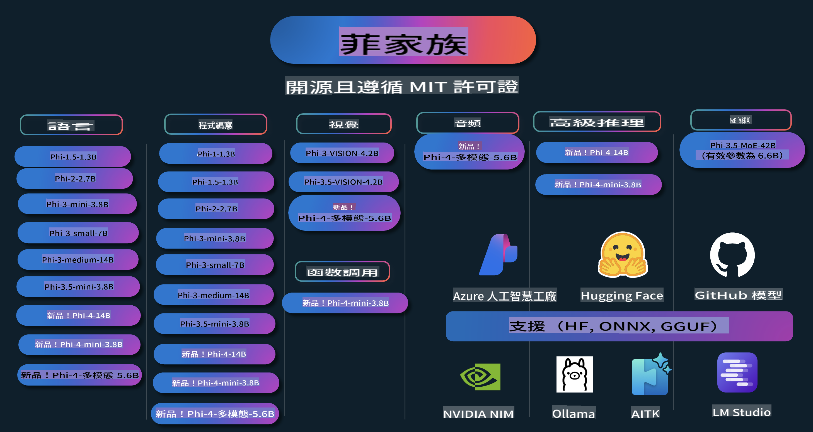

# Phi Cookbook: Hands-On Examples with Microsoft's Phi Models

  

  
  
  

  
  

Phi is a series of open-source AI models developed by Microsoft.

Phi is currently the most advanced and cost-effective small language model (SLM), excelling in multiple areas such as multilingual support, reasoning, text/chat generation, coding, images, audio, and more.

You can deploy Phi either in the cloud or on edge devices, enabling you to create generative AI applications even with limited computational resources.

Follow these steps to get started with these resources:  
1. **Fork the Repository**: Click   
2. **Clone the Repository**:   `git clone https://github.com/microsoft/PhiCookBook.git`  
3. [**Join The Microsoft AI Discord Community and meet experts and fellow developers**](https://discord.com/invite/ByRwuEEgH4?WT.mc_id=aiml-137032-kinfeylo)

## Table of Contents

- Introduction  
  - [Welcome to the Phi Family](./md/01.Introduction/01/01.PhiFamily.md)  
  - [Setting up your environment](./md/01.Introduction/01/01.EnvironmentSetup.md)  
  - [Understanding Key Technologies](./md/01.Introduction/01/01.Understandingtech.md)  
  - [AI Safety for Phi Models](./md/01.Introduction/01/01.AISafety.md)  
  - [Phi Hardware Support](./md/01.Introduction/01/01.Hardwaresupport.md)  
  - [Phi Models & Availability across platforms](./md/01.Introduction/01/01.Edgeandcloud.md)  
  - [Using Guidance-ai and Phi](./md/01.Introduction/01/01.Guidance.md)  
  - [GitHub Marketplace Models](https://github.com/marketplace/models)  
  - [Azure AI Model Catalog](https://ai.azure.com)

- Inference Phi in different environments  
    - [Hugging Face](./md/01.Introduction/02/01.HF.md)  
    - [GitHub Models](./md/01.Introduction/02/02.GitHubModel.md)  
    - [Azure AI Foundry Model Catalog](./md/01.Introduction/02/03.AzureAIFoundry.md)  
    - [Ollama](./md/01.Introduction/02/04.Ollama.md)  
    - [AI Toolkit VSCode (AITK)](./md/01.Introduction/02/05.AITK.md)  
    - [NVIDIA NIM](./md/01.Introduction/02/06.NVIDIA.md)

- Inference Phi Family  
    - [Inference Phi in iOS](./md/01.Introduction/03/iOS_Inference.md)  
    - [Inference Phi in Android](./md/01.Introduction/03/Android_Inference.md)  
- [Inference Phi in Jetson](./md/01.Introduction/03/Jetson_Inference.md)
    - [Inference Phi in AI PC](./md/01.Introduction/03/AIPC_Inference.md)
    - [Inference Phi with Apple MLX Framework](./md/01.Introduction/03/MLX_Inference.md)
    - [Inference Phi in Local Server](./md/01.Introduction/03/Local_Server_Inference.md)
    - [Inference Phi in Remote Server using AI Toolkit](./md/01.Introduction/03/Remote_Interence.md)
    - [Inference Phi with Rust](./md/01.Introduction/03/Rust_Inference.md)
    - [Inference Phi--Vision in Local](./md/01.Introduction/03/Vision_Inference.md)
    - [Inference Phi with Kaito AKS, Azure Containers(official support)](./md/01.Introduction/03/Kaito_Inference.md)
-  [Quantifying Phi Family](./md/01.Introduction/04/QuantifyingPhi.md)
    - [Quantizing Phi-3.5 / 4 using llama.cpp](./md/01.Introduction/04/UsingLlamacppQuantifyingPhi.md)
    - [Quantizing Phi-3.5 / 4 using Generative AI extensions for onnxruntime](./md/01.Introduction/04/UsingORTGenAIQuantifyingPhi.md)
    - [Quantizing Phi-3.5 / 4  using Intel OpenVINO](./md/01.Introduction/04/UsingIntelOpenVINOQuantifyingPhi.md)
    - [Quantizing Phi-3.5 / 4  using Apple MLX Framework](./md/01.Introduction/04/UsingAppleMLXQuantifyingPhi.md)

-  Evaluating Phi
    - [Responsible AI](./md/01.Introduction/05/ResponsibleAI.md)
    - [Azure AI Foundry for Evaluation](./md/01.Introduction/05/AIFoundry.md)
    - [Using Promptflow for Evaluation](./md/01.Introduction/05/Promptflow.md)
 
- RAG with Azure AI Search
    - [How to use Phi-4-mini and Phi-4-multimodal(RAG) with Azure AI Search](https://github.com/microsoft/PhiCookBook/blob/main/code/06.E2E/E2E_Phi-4-RAG-Azure-AI-Search.ipynb)

- Phi application development samples
  - Text & Chat Applications
    - Phi-4 Samples 🆕
      - [📓] [Chat With Phi-4-mini ONNX Model](./md/02.Application/01.TextAndChat/Phi4/ChatWithPhi4ONNX/README.md)
      - [Chat with Phi-4 local ONNX Model .NET](../../md/04.HOL/dotnet/src/LabsPhi4-Chat-01OnnxRuntime)
      - [Chat .NET Console App with Phi-4 ONNX using Semantic Kernel](../../md/04.HOL/dotnet/src/LabsPhi4-Chat-02SK)
    - Phi-3 / 3.5 Samples
      - [Local Chatbot in the browser using Phi3, ONNX Runtime Web and WebGPU](https://github.com/microsoft/onnxruntime-inference-examples/tree/main/js/chat)
      - [OpenVino Chat](./md/02.Application/01.TextAndChat/Phi3/E2E_OpenVino_Chat.md)
      - [Multi Model - Interactive Phi-3-mini and OpenAI Whisper](./md/02.Application/01.TextAndChat/Phi3/E2E_Phi-3-mini_with_whisper.md)
      - [MLFlow - Building a wrapper and using Phi-3 with MLFlow](./md//02.Application/01.TextAndChat/Phi3/E2E_Phi-3-MLflow.md)
      - [Model Optimization - How to optimize Phi-3-mini model for ONNX Runtime Web with Olive](https://github.com/microsoft/Olive/tree/main/examples/phi3)
      - [WinUI3 App with Phi-3 mini-4k-instruct-onnx](https://github.com/microsoft/Phi3-Chat-WinUI3-Sample/)
      - [WinUI3 Multi Model AI Powered Notes App Sample](https://github.com/microsoft/ai-powered-notes-winui3-sample)
      - [Fine-tune and Integrate custom Phi-3 models with Prompt flow](./md/02.Application/01.TextAndChat/Phi3/E2E_Phi-3-FineTuning_PromptFlow_Integration.md)
      - [Fine-tune and Integrate custom Phi-3 models with Prompt flow in Azure AI Foundry](./md/02.Application/01.TextAndChat/Phi3/E2E_Phi-3-FineTuning_PromptFlow_Integration_AIFoundry.md)
      - [Evaluate the Fine-tuned Phi-3 / Phi-3.5 Model in Azure AI Foundry Focusing on Microsoft's Responsible AI Principles](./md/02.Application/01.TextAndChat/Phi3/E2E_Phi-3-Evaluation_AIFoundry.md)
- [📓] [Phi-3.5-mini-instruct 语言预测示例（中文/英文）](../../md/02.Application/01.TextAndChat/Phi3/phi3-instruct-demo.ipynb)
      - [Phi-3.5-Instruct WebGPU RAG 聊天机器人](./md/02.Application/01.TextAndChat/Phi3/WebGPUWithPhi35Readme.md)
      - [使用 Windows GPU 和 Phi-3.5-Instruct ONNX 创建 Prompt 流解决方案](./md/02.Application/01.TextAndChat/Phi3/UsingPromptFlowWithONNX.md)
      - [使用 Microsoft Phi-3.5 tflite 创建 Android 应用](./md/02.Application/01.TextAndChat/Phi3/UsingPhi35TFLiteCreateAndroidApp.md)
      - [使用 Microsoft.ML.OnnxRuntime 的本地 ONNX Phi-3 模型进行问答 .NET 示例](../../md/04.HOL/dotnet/src/LabsPhi301)
      - [基于语义内核和 Phi-3 的控制台聊天 .NET 应用](../../md/04.HOL/dotnet/src/LabsPhi302)

  - Azure AI 推理 SDK 基于代码的示例 
    - Phi-4 示例 🆕
      - [📓] [使用 Phi-4-multimodal 生成项目代码](./md/02.Application/02.Code/Phi4/GenProjectCode/README.md)
    - Phi-3 / 3.5 示例
      - [使用 Microsoft Phi-3 系列构建您自己的 Visual Studio Code GitHub Copilot 聊天](./md/02.Application/02.Code/Phi3/VSCodeExt/README.md)
      - [使用 GitHub 模型和 Phi-3.5 创建您自己的 Visual Studio Code 聊天 Copilot 代理](/md/02.Application/02.Code/Phi3/CreateVSCodeChatAgentWithGitHubModels.md)

  - 高级推理示例
    - Phi-4 示例 🆕
      - [📓] [Phi-4-mini 高级推理示例](./md/02.Application/03.AdvancedReasoning/Phi4/AdvancedResoningPhi4mini/README.md)
  
  - 演示
      - [Phi-4-mini 演示托管在 Hugging Face Spaces 上](https://huggingface.co/spaces/microsoft/phi-4-mini?WT.mc_id=aiml-137032-kinfeylo)
      - [Phi-4-multimodal 演示托管在 Hugging Face Spaces 上](https://huggingface.co/spaces/microsoft/phi-4-multimodal?WT.mc_id=aiml-137032-kinfeylo)
  - 视觉示例
    - Phi-4 示例 🆕
      - [📓] [使用 Phi-4-multimodal 读取图像并生成代码](./md/02.Application/04.Vision/Phi4/CreateFrontend/README.md) 
    - Phi-3 / 3.5 示例
      -  [📓][Phi-3-vision-图像文本转文本](../../md/02.Application/04.Vision/Phi3/E2E_Phi-3-vision-image-text-to-text-online-endpoint.ipynb)
      - [Phi-3-vision-ONNX](https://onnxruntime.ai/docs/genai/tutorials/phi3-v.html)
      - [📓][Phi-3-vision CLIP 嵌入](../../md/02.Application/04.Vision/Phi3/E2E_Phi-3-vision-image-text-to-text-online-endpoint.ipynb)
      - [演示：Phi-3 回收](https://github.com/jennifermarsman/PhiRecycling/)
      - [Phi-3-vision - 视觉语言助手 - 使用 Phi3-Vision 和 OpenVINO](https://docs.openvino.ai/nightly/notebooks/phi-3-vision-with-output.html)
      - [Phi-3 Vision Nvidia NIM](./md/02.Application/04.Vision/Phi3/E2E_Nvidia_NIM_Vision.md)
      - [Phi-3 Vision OpenVino](./md/02.Application/04.Vision/Phi3/E2E_OpenVino_Phi3Vision.md)
      - [📓][Phi-3.5 Vision 多帧或多图像示例](../../md/02.Application/04.Vision/Phi3/phi3-vision-demo.ipynb)
      - [Phi-3 Vision 本地 ONNX 模型，使用 Microsoft.ML.OnnxRuntime .NET](../../md/04.HOL/dotnet/src/LabsPhi303)
      - [基于菜单的 Phi-3 Vision 本地 ONNX 模型，使用 Microsoft.ML.OnnxRuntime .NET](../../md/04.HOL/dotnet/src/LabsPhi304)

  - 音频示例
    - Phi-4 示例 🆕
      - [📓] [使用 Phi-4-multimodal 提取音频转录](./md/02.Application/05.Audio/Phi4/Transciption/README.md)
      - [📓] [Phi-4-multimodal 音频示例](../../md/02.Application/05.Audio/Phi4/Siri/demo.ipynb)
      - [📓] [Phi-4-multimodal 语音翻译示例](../../md/02.Application/05.Audio/Phi4/Translate/demo.ipynb)
      - [.NET 控制台应用，使用 Phi-4-multimodal 音频分析音频文件并生成转录](../../md/04.HOL/dotnet/src/LabsPhi4-MultiModal-02Audio)

  - MOE 示例
    - Phi-3 / 3.5 示例
      - [📓] [Phi-3.5 专家混合模型 (MoEs) 社交媒体示例](../../md/02.Application/06.MoE/Phi3/phi3_moe_demo.ipynb)
      - [📓] [使用 NVIDIA NIM Phi-3 MOE、Azure AI 搜索和 LlamaIndex 构建检索增强生成 (RAG) 管道](../../md/02.Application/06.MoE/Phi3/azure-ai-search-nvidia-rag.ipynb)
  - 函数调用示例
    - Phi-4 示例 🆕
      -  [📓] [使用 Phi-4-mini 进行函数调用](./md/02.Application/07.FunctionCalling/Phi4/FunctionCallingBasic/README.md)
  - 多模态混合示例
    - Phi-4 示例 🆕
-  [📓] [Phi-4-multimodal-ийг технологийн сэтгүүлчийн хувиар ашиглах](../../md/02.Application/08.Multimodel/Phi4/TechJournalist/phi_4_mm_audio_text_publish_news.ipynb)
      - [.NET консол аппликейшн ашиглан Phi-4-multimodal-аар зураг шинжлэх](../../md/04.HOL/dotnet/src/LabsPhi4-MultiModal-01Images)

- Phi дээжийг нарийвчлан тохируулах
  - [Нарийвчилсан тохиргооны хувилбарууд](./md/03.FineTuning/FineTuning_Scenarios.md)
  - [Нарийвчилсан тохиргоо ба RAG](./md/03.FineTuning/FineTuning_vs_RAG.md)
  - [Phi-3-ыг салбарын мэргэжилтэн болгох нарийвчилсан тохиргоо](./md/03.FineTuning/LetPhi3gotoIndustriy.md)
  - [VS Code-ийн AI Toolkit ашиглан Phi-3-ыг нарийвчлан тохируулах](./md/03.FineTuning/Finetuning_VSCodeaitoolkit.md)
  - [Azure Machine Learning Service ашиглан Phi-3-ыг нарийвчлан тохируулах](./md/03.FineTuning/Introduce_AzureML.md)
  - [Lora ашиглан Phi-3-ыг нарийвчлан тохируулах](./md/03.FineTuning/FineTuning_Lora.md)
  - [QLora ашиглан Phi-3-ыг нарийвчлан тохируулах](./md/03.FineTuning/FineTuning_Qlora.md)
  - [Azure AI Foundry ашиглан Phi-3-ыг нарийвчлан тохируулах](./md/03.FineTuning/FineTuning_AIFoundry.md)
  - [Azure ML CLI/SDK ашиглан Phi-3-ыг нарийвчлан тохируулах](./md/03.FineTuning/FineTuning_MLSDK.md)
  - [Microsoft Olive ашиглан нарийвчлан тохируулах](./md/03.FineTuning/FineTuning_MicrosoftOlive.md)
  - [Microsoft Olive Hands-On Lab ашиглан нарийвчлан тохируулах](./md/03.FineTuning/olive-lab/readme.md)
  - [Weights and Bias ашиглан Phi-3-vision-ийг нарийвчлан тохируулах](./md/03.FineTuning/FineTuning_Phi-3-visionWandB.md)
  - [Apple MLX Framework ашиглан Phi-3-ыг нарийвчлан тохируулах](./md/03.FineTuning/FineTuning_MLX.md)
  - [Phi-3-vision-ийг нарийвчлан тохируулах (албан ёсны дэмжлэг)](./md/03.FineTuning/FineTuning_Vision.md)
  - [Kaito AKS болон Azure Containers ашиглан Phi-3-ыг нарийвчлан тохируулах (албан ёсны дэмжлэг)](./md/03.FineTuning/FineTuning_Kaito.md)
  - [Phi-3 болон 3.5 Vision-ийг нарийвчлан тохируулах](https://github.com/2U1/Phi3-Vision-Finetune)

- Практик лаборатори
  - [Шинэлэг загваруудыг судлах: LLMs, SLMs, орон нутгийн хөгжүүлэлт ба бусад](https://github.com/microsoft/aitour-exploring-cutting-edge-models)
  - [NLP-ийн боломжийг нээх: Microsoft Olive ашиглан нарийвчлан тохируулах](https://github.com/azure/Ignite_FineTuning_workshop)

- Академик судалгааны өгүүллүүд ба нийтлэлүүд
  - [Бүх хэрэгтэй зүйл бол сурах бичиг II: phi-1.5 техникийн тайлан](https://arxiv.org/abs/2309.05463)
  - [Phi-3 Техникийн тайлан: Өндөр чадвартай хэлний загвар таны гар утсан дээр](https://arxiv.org/abs/2404.14219)
  - [Phi-4 Техникийн тайлан](https://arxiv.org/abs/2412.08905)
  - [Жижиг хэлний загваруудыг автомашины функц дуудах зориулалтаар оновчтой болгох](https://arxiv.org/abs/2501.02342)
  - [(WhyPHI) PHI-3-ыг олон сонголттой асуулт хариултын системд нарийвчлан тохируулах: Арга зүй, үр дүн ба сорилтууд](https://arxiv.org/abs/2501.01588)

## Phi загваруудыг ашиглах

### Phi Azure AI Foundry дээр

Microsoft Phi-г хэрхэн ашиглах болон өөр өөр төрлийн техник хангамж дээр E2E шийдэл бүтээх талаар суралцаарай. Phi-г туршиж үзэхийг хүсвэл загваруудтай ажиллаж, өөрийн нөхцөл байдалд тохируулан өөрчлөхөөс эхлээрэй. [Azure AI Foundry Azure AI Model Catalog](https://aka.ms/phi3-azure-ai)-г ашиглан эхэлж болно. Дэлгэрэнгүй мэдээллийг [Azure AI Foundry эхлэх гарын авлага](/md/02.QuickStart/AzureAIFoundry_QuickStart.md)-аас үзнэ үү.

**Туршилтын талбар**
Загвар бүр өөрийн тусгай туршилтын талбартай: [Azure AI Playground](https://aka.ms/try-phi3).

### Phi GitHub загварууд дээр

Microsoft Phi-г хэрхэн ашиглах болон өөр өөр төрлийн техник хангамж дээр E2E шийдэл бүтээх талаар суралцаарай. Phi-г туршиж үзэхийг хүсвэл загваруудтай ажиллаж, өөрийн нөхцөл байдалд тохируулан өөрчлөхөөс эхлээрэй. [GitHub Model Catalog](https://github.com/marketplace/models?WT.mc_id=aiml-137032-kinfeylo)-г ашиглан эхэлж болно. Дэлгэрэнгүй мэдээллийг [GitHub Model Catalog эхлэх гарын авлага](/md/02.QuickStart/GitHubModel_QuickStart.md)-аас үзнэ үү.

**Туршилтын талбар**
प्रत्येक मॉडल के लिए एक समर्पित [प्लेग्राउंड है जहाँ आप मॉडल का परीक्षण कर सकते हैं](/md/02.QuickStart/GitHubModel_QuickStart.md)।

### Hugging Face पर Phi

आप इस मॉडल को [Hugging Face](https://huggingface.co/microsoft) पर भी पा सकते हैं।

**प्लेग्राउंड**  
[Hugging Chat प्लेग्राउंड](https://huggingface.co/chat/models/microsoft/Phi-3-mini-4k-instruct)

## उत्तरदायी AI

Microsoft अपने ग्राहकों को AI उत्पादों का जिम्मेदारीपूर्वक उपयोग करने में मदद करने, अपनी सीख साझा करने और पारदर्शिता नोट्स और प्रभाव आकलन जैसे उपकरणों के माध्यम से विश्वास-आधारित साझेदारी बनाने के लिए प्रतिबद्ध है। इन संसाधनों में से कई [https://aka.ms/RAI](https://aka.ms/RAI) पर उपलब्ध हैं।  
Microsoft का उत्तरदायी AI के प्रति दृष्टिकोण हमारे AI सिद्धांतों पर आधारित है: निष्पक्षता, विश्वसनीयता और सुरक्षा, गोपनीयता और सुरक्षा, समावेशिता, पारदर्शिता, और जवाबदेही।

प्राकृतिक भाषा, छवि, और वाक् मॉडल जैसे बड़े पैमाने पर मॉडल - जिनका उपयोग इस उदाहरण में किया गया है - संभावित रूप से अनुचित, अविश्वसनीय, या आपत्तिजनक तरीके से व्यवहार कर सकते हैं, जिससे हानि हो सकती है। कृपया [Azure OpenAI सेवा पारदर्शिता नोट](https://learn.microsoft.com/legal/cognitive-services/openai/transparency-note?tabs=text) पढ़ें ताकि जोखिमों और सीमाओं के बारे में जानकारी प्राप्त हो सके।

इन जोखिमों को कम करने के लिए अनुशंसित दृष्टिकोण यह है कि आपकी आर्किटेक्चर में एक सुरक्षा प्रणाली शामिल हो, जो हानिकारक व्यवहार का पता लगा सके और उसे रोक सके। [Azure AI कंटेंट सेफ्टी](https://learn.microsoft.com/azure/ai-services/content-safety/overview) एक स्वतंत्र सुरक्षा परत प्रदान करता है, जो अनुप्रयोगों और सेवाओं में उपयोगकर्ता-जनित और AI-जनित हानिकारक सामग्री का पता लगाने में सक्षम है। Azure AI कंटेंट सेफ्टी में टेक्स्ट और इमेज APIs शामिल हैं, जो हानिकारक सामग्री का पता लगाने की अनुमति देते हैं। Azure AI Foundry के भीतर, कंटेंट सेफ्टी सेवा आपको विभिन्न स्वरूपों में हानिकारक सामग्री का पता लगाने के लिए सैंपल कोड देखने, एक्सप्लोर करने और आज़माने की सुविधा देती है। यह [त्वरित शुरुआत दस्तावेज़ीकरण](https://learn.microsoft.com/azure/ai-services/content-safety/quickstart-text?tabs=visual-studio%2Clinux&pivots=programming-language-rest) आपको सेवा के लिए अनुरोध करने के निर्देश देता है।

एक और पहलू जिसे ध्यान में रखना चाहिए वह है संपूर्ण एप्लिकेशन का प्रदर्शन। मल्टी-मॉडल और मल्टी-मॉडल एप्लिकेशन के साथ, प्रदर्शन का अर्थ है कि सिस्टम आपकी और आपके उपयोगकर्ताओं की अपेक्षाओं के अनुसार कार्य करता है, जिसमें हानिकारक आउटपुट न उत्पन्न करना शामिल है। यह महत्वपूर्ण है कि आप [प्रदर्शन और गुणवत्ता और जोखिम और सुरक्षा मूल्यांकनकर्ताओं](https://learn.microsoft.com/azure/ai-studio/concepts/evaluation-metrics-built-in) का उपयोग करके अपने संपूर्ण एप्लिकेशन के प्रदर्शन का आकलन करें। आपके पास [कस्टम मूल्यांकनकर्ता](https://learn.microsoft.com/azure/ai-studio/how-to/develop/evaluate-sdk#custom-evaluators) बनाने और उनका मूल्यांकन करने की क्षमता भी है।

आप अपने विकास वातावरण में [Azure AI मूल्यांकन SDK](https://microsoft.github.io/promptflow/index.html) का उपयोग करके अपने AI एप्लिकेशन का मूल्यांकन कर सकते हैं। एक परीक्षण डेटासेट या लक्ष्य के साथ, आपके जनरेटिव AI एप्लिकेशन की पीढ़ियों को अंतर्निर्मित मूल्यांकनकर्ताओं या आपके द्वारा चुने गए कस्टम मूल्यांकनकर्ताओं के साथ मात्रात्मक रूप से मापा जाता है। अपने सिस्टम का मूल्यांकन करने के लिए Azure AI मूल्यांकन SDK के साथ शुरुआत करने के लिए, आप [त्वरित शुरुआत गाइड](https://learn.microsoft.com/azure/ai-studio/how-to/develop/flow-evaluate-sdk) का पालन कर सकते हैं। एक बार जब आप मूल्यांकन रन निष्पादित करते हैं, तो आप [Azure AI Foundry में परिणामों को विज़ुअलाइज़ कर सकते हैं](https://learn.microsoft.com/azure/ai-studio/how-to/evaluate-flow-results)।

## ट्रेडमार्क्स

यह परियोजना प्रोजेक्ट्स, उत्पादों, या सेवाओं के लिए ट्रेडमार्क्स या लोगो शामिल कर सकती है। Microsoft ट्रेडमार्क्स या लोगो का अधिकृत उपयोग [Microsoft के ट्रेडमार्क और ब्रांड दिशानिर्देशों](https://www.microsoft.com/legal/intellectualproperty/trademarks/usage/general) का पालन करना चाहिए।  
इस परियोजना के संशोधित संस्करणों में Microsoft ट्रेडमार्क्स या लोगो का उपयोग भ्रम पैदा नहीं करना चाहिए या Microsoft प्रायोजन का संकेत नहीं देना चाहिए। किसी भी तीसरे पक्ष के ट्रेडमार्क्स या लोगो का उपयोग उन तीसरे पक्ष की नीतियों के अधीन है।

It seems you want the text translated into "mo," but it's unclear what language "mo" refers to. Could you please clarify? For example, are you referring to Moldovan (Romanian), Maori, Mongolian, or another language?