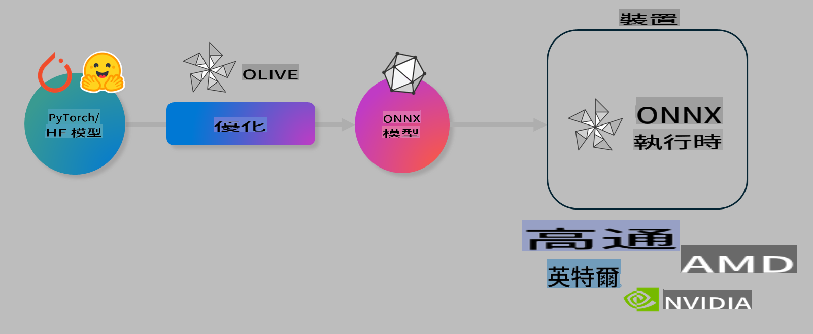

# Lab. Optimize AI models for on-device inference

## Introduction 

> [!IMPORTANT]
> Lab hawn miangaka **GPU Nvidia A10 leh A100** a thawk theih driver leh CUDA toolkit (version 12 a tam ber) an tel a ngai.

> [!NOTE]
> Hei hi **35-na leilung** a awm ang a, OLIVE hmangin model danglamna (optimization) leh on-device inference tan a siam theihna hriatpuihna a pek ang.

## Learning Objectives

Lab hian khawngaihna tan OLIVE hmangin:

- AWQ quantization method hmanga AI Model quantize theihna.
- AI model a specific task atan fine-tune theihna.
- ONNX Runtime-ah LoRA adapters (fine-tuned model) siam theihna.

### Olive chu engmah nge?

Olive (*O*NNX *live*) hi model optimization aṭanga ONNX runtime tan ++https://onnxruntime.ai++ siamtu a ni a, CLI a nei bawk.



Olive hian PyTorch emaw Hugging Face model an input a siam a, a output chu ONNX runtime hmanga device (deployment target) ah a thawk theihna atan siam model a ni. Olive chuan deployment target-a AI accelerator (NPU, GPU, CPU) hardware vendor ang deuhte hnena (Qualcomm, AMD, Nvidia leh Intel ang deuh) model a optimize a ni.

Olive hian *workflow* tih an hnuaia model optimization task *passes* tih thupui atan an siam ang. Example pass-ah model compression, graph capture, quantization, graph optimization an tel. Pass aṭangte parameter a siam theihna atan tun turin a ngai a, accuracy leh latency aṭangin evaluator hmangin an en a ni. Olive chuan search strategy hmangin pass pakhat emaw pass hrang hrang awlsamzia hmangin siam ang.

#### Olive hnathawhna

- **Manual trial-and-error** graph optimization, compression leh quantization technique hmangin tanpuihna leh hun awmzia a hman theih a, Olive hmangin quality leh performance constraint siam a, a ṭha ber model automatically a thlir theih.
- **40+ model optimization components** quantization, compression, graph optimization leh finetuning-ah cutting edge technique hmanga siam.
- **CLI pawimawh** model optimization task tan. Hman turin: olive quantize, olive auto-opt, olive finetune.
- Model packaging leh deployment a tel.
- **Multi LoRA serving** tan model siam hman theih.
- YAML/JSON hmangin model optimization leh deployment task siam workflow.
- **Hugging Face** leh **Azure AI** Integration a tel.
- **Caching** a awm a, **cost reduce** theih.

## Lab Instructions
> [!NOTE]
> Azure AI Hub leh Project siam turin A100 compute Lab 1-ah siam tawh turin ngai.

### Step 0: Azure AI Compute-ah connect rawh

Azure AI compute-ah **VS Code** remote feature hmangin connect rawh.

1. **VS Code** desktop application i hawn:
1. **Command palette** (Shift+Ctrl+P) i hawn.
1. Command palette-ah **AzureML - remote: Connect to compute instance in New Window** tih i thlir.
1. On-screen instruction angin i thawk, Subscription, Resource Group, Project leh Compute Lab 1-ah i siam tawh select ang.
1. Azure ML Compute node-ah i connect tawh hian **Visual Code** hnuaiah **bottom left** ah a lang `><Azure ML: Compute Name`

### Step 1: Repo hi clone rawh

VS Code-ah **Ctrl+J** hmangin terminal hawn leh:

Terminal-ah prompt i en:

```
azureuser@computername:~/cloudfiles/code$ 
```
Solution hi clone rawh:

```bash
cd ~/localfiles
git clone https://github.com/microsoft/phi-3cookbook.git
```

### Step 2: Folder hawn rawh

Relevant folder-a VS Code hawn turin terminal-ah command hi execute rawh, chu new window a hawn ang:

```bash
code phi-3cookbook/code/04.Finetuning/Olive-lab
```

Aṭang emaw, **File** > **Open Folder** select rawh.

### Step 3: Dependencies

Azure AI Compute Instance-a VS Code terminal window (Ctrl+J tip) hawn leh command hian dependencies install rawh:

```bash
conda create -n olive-ai python=3.11 -y
conda activate olive-ai
pip install -r requirements.txt
az extension remove -n azure-cli-ml
az extension add -n ml
```

> [!NOTE]
> Dependencies install turin ~5mins a ngai.

Lab-ah model download leh upload Azure AI Model catalog-ah siam ang. Model catalog access theihna turin Azure login a ngai:

```bash
az login
```

> [!NOTE]
> Login hunah subscription select turin a ngai. Lab hi tan subscription chu i thlang ang.

### Step 4: Olive commands execute rawh

Azure AI Compute Instance-a VS Code terminal window hawn leh (Ctrl+J tip) `olive-ai` conda environment activate turin ensure rawh:

```bash
conda activate olive-ai
```

Tuna Olive commands terminal-ah execute rawh:

1. **Data inspect rawh:** He example-ah, Phi-3.5-Mini model chu travel thlirna zawng zawng tan specialize turin fine-tune tur a ni. A hnuaia code hi dataset JSON lines format-a records a hrilh ang:

    ```bash
    head data/data_sample_travel.jsonl
    ```
1. **Model quantize rawh:** Training hun hmaa model chu quantize rawh, Active Aware Quantization (AWQ) technique hmanga +++https://arxiv.org/abs/2306.00978+++. AWQ hian model-a weights chu inference hunah activation siam dan ngaihtuahna hmanga quantize tur a ni. Hei hi model accuracy traditional weight quantization method aṭangin ṭha zawk a ni.
    
    ```bash
    olive quantize \
       --model_name_or_path microsoft/Phi-3.5-mini-instruct \
       --trust_remote_code \
       --algorithm awq \
       --output_path models/phi/awq \
       --log_level 1
    ```
    
    **~8mins** a ṭang AWQ quantization hunah model size chu **~7.5GB aṭangin ~2.5GB** a ṭang.
   
   Lab-ah hian Hugging Face model hman turin a siam (Example: `microsoft/Phi-3.5-mini-instruct`). However, Olive also allows you to input models from the Azure AI catalog by updating the `model_name_or_path` argument to an Azure AI asset ID (for example:  `azureml://registries/azureml/models/Phi-3.5-mini-instruct/versions/4`). 

1. **Train the model:** Next, the `olive finetune` command hmanga quantized model finetune ang. Model finetune hun hmaa quantize hian accuracy ṭha zawk a ni a, finetune hunah quantization loss recover a ni.

    ```bash
    olive finetune \
        --method lora \
        --model_name_or_path models/phi/awq \
        --data_files "data/data_sample_travel.jsonl" \
        --data_name "json" \
        --text_template "<|user|>\n{prompt}<|end|>\n<|assistant|>\n{response}<|end|>" \
        --max_steps 100 \
        --output_path ./models/phi/ft \
        --log_level 1
    ```
    
    Fine-tuning (100 steps) **~6mins** a ṭang.

1. **Optimize rawh:** Model finetune tawh hian Olive `auto-opt` command, which will capture the ONNX graph and automatically perform a number of optimizations to improve the model performance for CPU by compressing the model and doing fusions. It should be noted, that you can also optimize for other devices such as NPU or GPU by just updating the `--device` and `--provider` arguments hmanga model optimize ang - Lab hian CPU hman ang.

    ```bash
    olive auto-opt \
       --model_name_or_path models/phi/ft/model \
       --adapter_path models/phi/ft/adapter \
       --device cpu \
       --provider CPUExecutionProvider \
       --use_ort_genai \
       --output_path models/phi/onnx-ao \
       --log_level 1
    ```
    
    Optimization **~5mins** a ṭang.

### Step 5: Model inference test rawh

Model inference test turin **app.py** tihna Python file folder-ah siam rawh, code hnuaia in copy-paste rawh:

```python
import onnxruntime_genai as og
import numpy as np

print("loading model and adapters...", end="", flush=True)
model = og.Model("models/phi/onnx-ao/model")
adapters = og.Adapters(model)
adapters.load("models/phi/onnx-ao/model/adapter_weights.onnx_adapter", "travel")
print("DONE!")

tokenizer = og.Tokenizer(model)
tokenizer_stream = tokenizer.create_stream()

params = og.GeneratorParams(model)
params.set_search_options(max_length=100, past_present_share_buffer=False)
user_input = "what is the best thing to see in chicago"
params.input_ids = tokenizer.encode(f"<|user|>\n{user_input}<|end|>\n<|assistant|>\n")

generator = og.Generator(model, params)

generator.set_active_adapter(adapters, "travel")

print(f"{user_input}")

while not generator.is_done():
    generator.compute_logits()
    generator.generate_next_token()

    new_token = generator.get_next_tokens()[0]
    print(tokenizer_stream.decode(new_token), end='', flush=True)

print("\n")
```

Command hian execute rawh:

```bash
python app.py
```

### Step 6: Model Azure AI-ah upload rawh

Model chu Azure AI model repository-ah upload rawh a, development team member dangte tan share leh version control aṭangin hman theih ang. Command hnuaiah model upload rawh:

> [!NOTE]
> `{}` placeholders with the name of your resource group and Azure AI Project Name. 

To find your resource group `"resourceGroup" leh Azure AI Project Name update rawh leh command execute ang 

```
az ml workspace show
```

+++ai.azure.com+++ ah **management center** **project** **overview** select rawh.

`{}` placeholders hian i resource group leh Azure AI Project Name update rawh.

```bash
az ml model create \
    --name ft-for-travel \
    --version 1 \
    --path ./models/phi/onnx-ao \
    --resource-group {RESOURCE_GROUP_NAME} \
    --workspace-name {PROJECT_NAME}
```
Uploaded model chu https://ml.azure.com/model/list ah i en leh deploy theih.

It seems like "mo" could refer to a specific language or dialect, but it's unclear which one you're referring to. Could you please clarify which language you mean by "mo"? For example, do you mean Māori, Mon (a language spoken in Myanmar and Thailand), or something else? Let me know so I can assist you better!