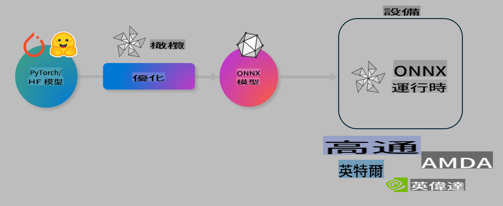

# Lab. Optimize AI models for on-device inference

## مقدمة

> [!IMPORTANT]
> يتطلب هذا المختبر وجود **Nvidia A10 أو A100 GPU** مع تثبيت التعريفات وأدوات CUDA (الإصدار 12+).

> [!NOTE]
> هذا المختبر مدته **35 دقيقة** وسيوفر لك تجربة عملية لفهم المفاهيم الأساسية لتحسين النماذج للتنفيذ على الأجهزة باستخدام OLIVE.

## أهداف التعلم

بنهاية هذا المختبر، ستكون قادرًا على استخدام OLIVE لـ:

- ضغط نموذج ذكاء اصطناعي باستخدام طريقة AWQ للضغط.
- تحسين نموذج ذكاء اصطناعي لمهمة محددة.
- إنشاء LoRA adapters (النموذج المحسن) لتحقيق تنفيذ فعّال على الأجهزة باستخدام ONNX Runtime.

### ما هو Olive

Olive (*O*NNX *live*) هو أداة لتحسين النماذج مع واجهة CLI مصاحبة تمكنك من تجهيز النماذج لتعمل على ONNX runtime +++https://onnxruntime.ai+++ بجودة وأداء عاليين.



عادةً ما يكون مدخل Olive نموذج PyTorch أو Hugging Face، ويكون الناتج نموذج ONNX محسن يتم تشغيله على الجهاز (هدف النشر) باستخدام ONNX runtime. يقوم Olive بتحسين النموذج لتوافق مع مسرع الذكاء الاصطناعي (NPU، GPU، CPU) الذي يوفره بائع الأجهزة مثل Qualcomm، AMD، Nvidia أو Intel.

ينفذ Olive *سير عمل*، وهو تسلسل مرتب من مهام تحسين النموذج الفردية التي تُعرف بـ *passes* - أمثلة على هذه المهام تشمل: ضغط النموذج، التقاط الرسم البياني، الضغط، وتحسين الرسم البياني. يحتوي كل تمرير على مجموعة من المعايير التي يمكن ضبطها لتحقيق أفضل المقاييس مثل الدقة والزمن، والتي يتم تقييمها بواسطة المقيم المناسب. يستخدم Olive استراتيجية بحث تعتمد على خوارزمية بحث لضبط كل تمرير بشكل تلقائي سواءً بشكل فردي أو كمجموعة.

#### فوائد Olive

- **تقليل الإحباط والوقت** الناتج عن التجربة اليدوية العشوائية لتقنيات تحسين الرسم البياني، الضغط والضغط. قم بتحديد قيود الجودة والأداء الخاصة بك ودع Olive يجد لك أفضل نموذج تلقائيًا.
- **أكثر من 40 مكونًا لتحسين النماذج** تغطي أحدث التقنيات في الضغط، والتحسين، وضبط الأداء.
- **واجهة CLI سهلة الاستخدام** لمهام تحسين النماذج الشائعة. على سبيل المثال: olive quantize، olive auto-opt، olive finetune.
- دعم مدمج لتغليف النماذج ونشرها.
- يدعم إنشاء نماذج لـ **خدمة LoRA متعددة**.
- بناء سير العمل باستخدام YAML/JSON لتنظيم مهام تحسين النماذج والنشر.
- تكامل مع **Hugging Face** و **Azure AI**.
- آلية **تخزين مؤقت مدمجة** لتقليل التكاليف.

## تعليمات المختبر
> [!NOTE]
> تأكد من إعداد Azure AI Hub والمشروع الخاص بك وإعداد A100 compute كما هو موضح في مختبر 1.

### الخطوة 0: الاتصال بـ Azure AI Compute

ستتصل بـ Azure AI compute باستخدام ميزة الاتصال عن بُعد في **VS Code.**

1. افتح تطبيق **VS Code** على سطح المكتب:
2. افتح **command palette** باستخدام **Shift+Ctrl+P**.
3. في command palette، ابحث عن **AzureML - remote: Connect to compute instance in New Window**.
4. اتبع التعليمات الظاهرة على الشاشة للاتصال بـ Compute. سيتضمن ذلك اختيار اشتراك Azure الخاص بك، مجموعة الموارد، المشروع واسم الحوسبة الذي أعددته في مختبر 1.
5. بمجرد الاتصال بـ Azure ML Compute node، سيتم عرض ذلك في **الزاوية السفلية اليسرى من Visual Code** `><Azure ML: Compute Name`.

### الخطوة 1: نسخ هذا المستودع

في VS Code، يمكنك فتح نافذة طرفية جديدة باستخدام **Ctrl+J** ونسخ هذا المستودع:

في الطرفية، يجب أن ترى الموجه:

```
azureuser@computername:~/cloudfiles/code$ 
```
انسخ الحل:

```bash
cd ~/localfiles
git clone https://github.com/microsoft/phi-3cookbook.git
```

### الخطوة 2: فتح المجلد في VS Code

لفتح VS Code في المجلد المناسب، نفذ الأمر التالي في الطرفية، والذي سيفتح نافذة جديدة:

```bash
code phi-3cookbook/code/04.Finetuning/Olive-lab
```

بدلاً من ذلك، يمكنك فتح المجلد عن طريق اختيار **File** > **Open Folder**.

### الخطوة 3: التبعيات

افتح نافذة طرفية في VS Code على Azure AI Compute Instance (نصيحة: **Ctrl+J**) ونفذ الأوامر التالية لتثبيت التبعيات:

```bash
conda create -n olive-ai python=3.11 -y
conda activate olive-ai
pip install -r requirements.txt
az extension remove -n azure-cli-ml
az extension add -n ml
```

> [!NOTE]
> سيستغرق تثبيت جميع التبعيات حوالي **5 دقائق**.

في هذا المختبر، ستقوم بتنزيل وتحميل النماذج إلى كتالوج نماذج Azure AI. للوصول إلى كتالوج النماذج، ستحتاج إلى تسجيل الدخول إلى Azure باستخدام:

```bash
az login
```

> [!NOTE]
> عند تسجيل الدخول، سيُطلب منك اختيار اشتراكك. تأكد من اختيار الاشتراك المخصص لهذا المختبر.

### الخطوة 4: تنفيذ أوامر Olive

افتح نافذة طرفية في VS Code على Azure AI Compute Instance (نصيحة: **Ctrl+J**) وتأكد من تفعيل بيئة `olive-ai` الخاصة بـ conda:

```bash
conda activate olive-ai
```

بعد ذلك، نفذ أوامر Olive التالية في سطر الأوامر.

1. **فحص البيانات:** في هذا المثال، ستقوم بتحسين نموذج Phi-3.5-Mini ليصبح متخصصًا في الإجابة عن الأسئلة المتعلقة بالسفر. يعرض الكود أدناه السجلات الأولى من مجموعة البيانات، والتي تكون بتنسيق JSON lines:

    ```bash
    head data/data_sample_travel.jsonl
    ```

2. **ضغط النموذج:** قبل تدريب النموذج، قم أولاً بضغطه باستخدام الأمر التالي الذي يستخدم تقنية تسمى Active Aware Quantization (AWQ) +++https://arxiv.org/abs/2306.00978+++. تضغط AWQ أوزان النموذج مع الأخذ في الاعتبار التنشيطات الناتجة أثناء التنفيذ. يعني هذا أن عملية الضغط تأخذ في الاعتبار التوزيع الفعلي للبيانات في التنشيطات، مما يؤدي إلى الحفاظ على دقة النموذج بشكل أفضل مقارنة بطرق ضغط الأوزان التقليدية.

    ```bash
    olive quantize \
       --model_name_or_path microsoft/Phi-3.5-mini-instruct \
       --trust_remote_code \
       --algorithm awq \
       --output_path models/phi/awq \
       --log_level 1
    ```
    
    تستغرق عملية الضغط باستخدام AWQ حوالي **8 دقائق**، مما سيقلل حجم النموذج من **~7.5GB إلى ~2.5GB**.

   في هذا المختبر، نعرض لك كيفية إدخال النماذج من Hugging Face (على سبيل المثال: `microsoft/Phi-3.5-mini-instruct`). However, Olive also allows you to input models from the Azure AI catalog by updating the `model_name_or_path` argument to an Azure AI asset ID (for example:  `azureml://registries/azureml/models/Phi-3.5-mini-instruct/versions/4`). 

1. **Train the model:** Next, the `olive finetune` الأمر يقوم بتحسين النموذج المضغوط. ضغط النموذج *قبل* تحسينه بدلاً من بعده يعطي دقة أفضل حيث تستعيد عملية التحسين بعض الخسائر الناتجة عن الضغط.

    ```bash
    olive finetune \
        --method lora \
        --model_name_or_path models/phi/awq \
        --data_files "data/data_sample_travel.jsonl" \
        --data_name "json" \
        --text_template "<|user|>\n{prompt}<|end|>\n<|assistant|>\n{response}<|end|>" \
        --max_steps 100 \
        --output_path ./models/phi/ft \
        --log_level 1
    ```
    
    تستغرق عملية التحسين (مع 100 خطوة) حوالي **6 دقائق**.

3. **التحسين:** مع تدريب النموذج، يمكنك الآن تحسينه باستخدام أمر Olive `auto-opt` command, which will capture the ONNX graph and automatically perform a number of optimizations to improve the model performance for CPU by compressing the model and doing fusions. It should be noted, that you can also optimize for other devices such as NPU or GPU by just updating the `--device` and `--provider` - ولكن لغرض هذا المختبر سنستخدم CPU.

    ```bash
    olive auto-opt \
       --model_name_or_path models/phi/ft/model \
       --adapter_path models/phi/ft/adapter \
       --device cpu \
       --provider CPUExecutionProvider \
       --use_ort_genai \
       --output_path models/phi/onnx-ao \
       --log_level 1
    ```
    
    تستغرق عملية التحسين حوالي **5 دقائق**.

### الخطوة 5: اختبار سريع للنموذج

لاختبار تنفيذ النموذج، قم بإنشاء ملف Python في مجلدك باسم **app.py** وانسخ الكود التالي:

```python
import onnxruntime_genai as og
import numpy as np

print("loading model and adapters...", end="", flush=True)
model = og.Model("models/phi/onnx-ao/model")
adapters = og.Adapters(model)
adapters.load("models/phi/onnx-ao/model/adapter_weights.onnx_adapter", "travel")
print("DONE!")

tokenizer = og.Tokenizer(model)
tokenizer_stream = tokenizer.create_stream()

params = og.GeneratorParams(model)
params.set_search_options(max_length=100, past_present_share_buffer=False)
user_input = "what is the best thing to see in chicago"
params.input_ids = tokenizer.encode(f"<|user|>\n{user_input}<|end|>\n<|assistant|>\n")

generator = og.Generator(model, params)

generator.set_active_adapter(adapters, "travel")

print(f"{user_input}")

while not generator.is_done():
    generator.compute_logits()
    generator.generate_next_token()

    new_token = generator.get_next_tokens()[0]
    print(tokenizer_stream.decode(new_token), end='', flush=True)

print("\n")
```

نفذ الكود باستخدام:

```bash
python app.py
```

### الخطوة 6: تحميل النموذج إلى Azure AI

يتيح تحميل النموذج إلى مستودع نماذج Azure AI مشاركة النموذج مع أعضاء فريق التطوير الآخرين بالإضافة إلى التحكم في إصدار النموذج. لتحميل النموذج، نفذ الأمر التالي:

> [!NOTE]
> حدّث الحقول `{}` بـ "resourceGroup" واسم مشروع Azure AI، ثم نفذ الأمر التالي:

```
az ml workspace show
```

أو من خلال الذهاب إلى +++ai.azure.com+++ واختيار **management center** **project** **overview**.

حدّث الحقول `{}` بأسماء مجموعة الموارد واسم مشروع Azure AI.

```bash
az ml model create \
    --name ft-for-travel \
    --version 1 \
    --path ./models/phi/onnx-ao \
    --resource-group {RESOURCE_GROUP_NAME} \
    --workspace-name {PROJECT_NAME}
```
يمكنك بعد ذلك رؤية النموذج المحمل ونشره على https://ml.azure.com/model/list

It seems like you're asking to translate the text into "mo," but it's unclear what language "mo" refers to. Could you please clarify or provide more context? Are you referring to a specific language or abbreviation?