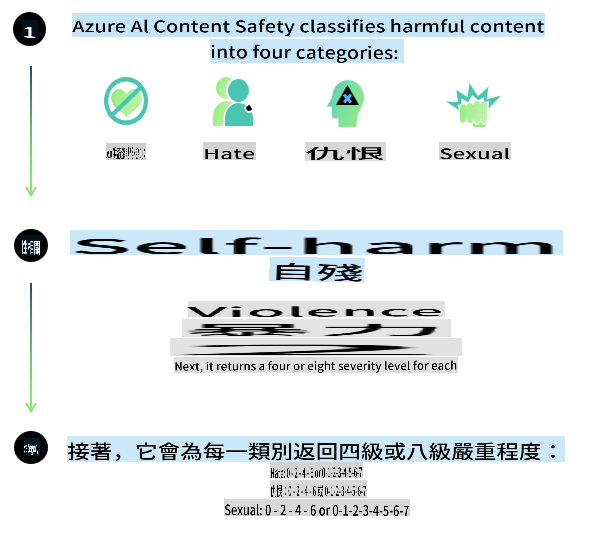
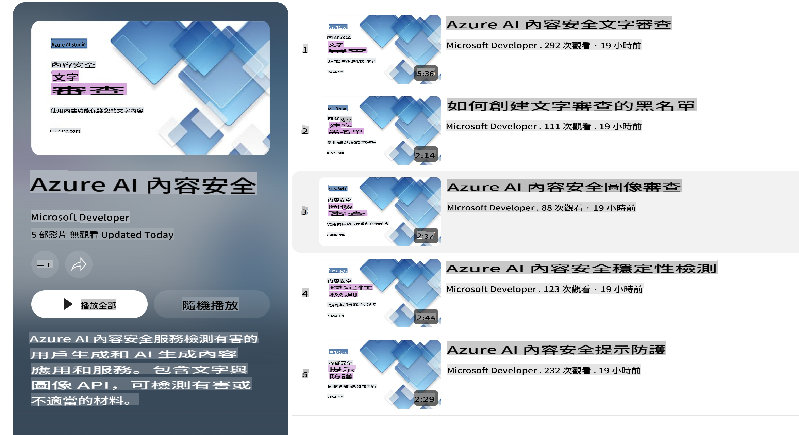

# AI Safety for Phi Models  
Phi मॉडेल्स का परिवार [Microsoft Responsible AI Standard](https://query.prod.cms.rt.microsoft.com/cms/api/am/binary/RE5cmFl) के अनुसार विकसित किया गया है, जो कंपनी-व्यापी आवश्यकताओं का एक सेट है। यह निम्नलिखित छह सिद्धांतों पर आधारित है: जवाबदेही, पारदर्शिता, निष्पक्षता, विश्वसनीयता और सुरक्षा, गोपनीयता और समावेशन। ये [Microsoft के Responsible AI सिद्धांतों](https://www.microsoft.com/ai/responsible-ai) का निर्माण करते हैं।  

पिछले Phi मॉडेल्स की तरह, इस रिलीज़ की बहुभाषी क्षमताओं को ध्यान में रखते हुए एक बहु-आयामी सुरक्षा मूल्यांकन और सुरक्षा-पश्च-प्रशिक्षण दृष्टिकोण अपनाया गया। हमारी सुरक्षा प्रशिक्षण और मूल्यांकन की प्रक्रिया, जिसमें विभिन्न भाषाओं और जोखिम श्रेणियों में परीक्षण शामिल हैं, [Phi Safety Post-Training Paper](https://arxiv.org/abs/2407.13833) में वर्णित है। जबकि Phi मॉडेल्स इस दृष्टिकोण से लाभान्वित होते हैं, डेवलपर्स को अपने विशिष्ट उपयोग के मामले और सांस्कृतिक और भाषाई संदर्भ के अनुसार जोखिमों की मैपिंग, माप और शमन सहित जिम्मेदार AI सर्वोत्तम प्रथाओं को लागू करना चाहिए।  

## सर्वोत्तम प्रथाएँ  

अन्य मॉडेल्स की तरह, Phi मॉडेल्स भी संभावित रूप से अनुचित, अविश्वसनीय, या आपत्तिजनक व्यवहार कर सकते हैं।  

SLM और LLM के कुछ सीमित व्यवहार जिन पर ध्यान देना चाहिए:  

- **सेवा की गुणवत्ता:** Phi मॉडेल्स को मुख्य रूप से अंग्रेज़ी टेक्स्ट पर प्रशिक्षित किया गया है। अंग्रेज़ी के अलावा अन्य भाषाओं में प्रदर्शन खराब हो सकता है। प्रशिक्षण डेटा में कम प्रतिनिधित्व वाले अंग्रेज़ी भाषा के प्रकार, जैसे मानक अमेरिकी अंग्रेज़ी के मुकाबले, खराब प्रदर्शन कर सकते हैं।  
- **हानियों का प्रतिनिधित्व और रूढ़ियों को बढ़ावा देना:** ये मॉडेल्स कुछ समूहों का अधिक या कम प्रतिनिधित्व कर सकते हैं, कुछ समूहों के प्रतिनिधित्व को मिटा सकते हैं, या अपमानजनक या नकारात्मक रूढ़ियों को सुदृढ़ कर सकते हैं। सुरक्षा-पश्च-प्रशिक्षण के बावजूद, इन सीमाओं का अस्तित्व विभिन्न समूहों के प्रतिनिधित्व के स्तर या प्रशिक्षण डेटा में नकारात्मक रूढ़ियों के उदाहरणों की व्यापकता के कारण हो सकता है, जो वास्तविक दुनिया के पैटर्न और सामाजिक पूर्वाग्रहों को दर्शाते हैं।  
- **अनुचित या आपत्तिजनक सामग्री:** ये मॉडेल्स अन्य प्रकार की अनुचित या आपत्तिजनक सामग्री उत्पन्न कर सकते हैं, जो संवेदनशील संदर्भों के लिए इसे अनुपयुक्त बना सकती है। इसके लिए उपयोग के मामले के अनुसार अतिरिक्त शमन उपायों की आवश्यकता हो सकती है।  
- **जानकारी की विश्वसनीयता:** भाषा मॉडेल्स कभी-कभी असंगत सामग्री उत्पन्न कर सकते हैं या ऐसी सामग्री बना सकते हैं जो सुनने में तर्कसंगत लगे लेकिन वास्तव में गलत या पुरानी हो।  
- **कोड के लिए सीमित दायरा:** Phi-3 प्रशिक्षण डेटा का अधिकांश हिस्सा Python और सामान्य पैकेज जैसे "typing, math, random, collections, datetime, itertools" पर आधारित है। यदि मॉडेल ऐसे Python स्क्रिप्ट उत्पन्न करता है जो अन्य पैकेजों या अन्य भाषाओं के स्क्रिप्ट का उपयोग करते हैं, तो हम दृढ़ता से अनुशंसा करते हैं कि उपयोगकर्ता सभी API उपयोगों को मैन्युअल रूप से सत्यापित करें।  

डेवलपर्स को जिम्मेदार AI सर्वोत्तम प्रथाओं को लागू करना चाहिए और यह सुनिश्चित करने के लिए जिम्मेदार होना चाहिए कि उनका विशिष्ट उपयोग मामला प्रासंगिक कानूनों और विनियमों (जैसे गोपनीयता, व्यापार, आदि) का अनुपालन करता है।  

## जिम्मेदार AI विचार  

अन्य भाषा मॉडेल्स की तरह, Phi श्रृंखला के मॉडेल्स भी संभावित रूप से अनुचित, अविश्वसनीय, या आपत्तिजनक व्यवहार कर सकते हैं। ध्यान देने योग्य कुछ सीमित व्यवहार:  

**सेवा की गुणवत्ता:** Phi मॉडेल्स को मुख्य रूप से अंग्रेज़ी टेक्स्ट पर प्रशिक्षित किया गया है। अंग्रेज़ी के अलावा अन्य भाषाओं में प्रदर्शन खराब हो सकता है। प्रशिक्षण डेटा में कम प्रतिनिधित्व वाले अंग्रेज़ी भाषा के प्रकार, जैसे मानक अमेरिकी अंग्रेज़ी के मुकाबले, खराब प्रदर्शन कर सकते हैं।  

**हानियों का प्रतिनिधित्व और रूढ़ियों को बढ़ावा देना:** ये मॉडेल्स कुछ समूहों का अधिक या कम प्रतिनिधित्व कर सकते हैं, कुछ समूहों के प्रतिनिधित्व को मिटा सकते हैं, या अपमानजनक या नकारात्मक रूढ़ियों को सुदृढ़ कर सकते हैं। सुरक्षा-पश्च-प्रशिक्षण के बावजूद, इन सीमाओं का अस्तित्व विभिन्न समूहों के प्रतिनिधित्व के स्तर या प्रशिक्षण डेटा में नकारात्मक रूढ़ियों के उदाहरणों की व्यापकता के कारण हो सकता है, जो वास्तविक दुनिया के पैटर्न और सामाजिक पूर्वाग्रहों को दर्शाते हैं।  

**अनुचित या आपत्तिजनक सामग्री:** ये मॉडेल्स अन्य प्रकार की अनुचित या आपत्तिजनक सामग्री उत्पन्न कर सकते हैं, जो संवेदनशील संदर्भों के लिए इसे अनुपयुक्त बना सकती है। इसके लिए उपयोग के मामले के अनुसार अतिरिक्त शमन उपायों की आवश्यकता हो सकती है।  
**जानकारी की विश्वसनीयता:** भाषा मॉडेल्स कभी-कभी असंगत सामग्री उत्पन्न कर सकते हैं या ऐसी सामग्री बना सकते हैं जो सुनने में तर्कसंगत लगे लेकिन वास्तव में गलत या पुरानी हो।  

**कोड के लिए सीमित दायरा:** Phi-3 प्रशिक्षण डेटा का अधिकांश हिस्सा Python और सामान्य पैकेज जैसे "typing, math, random, collections, datetime, itertools" पर आधारित है। यदि मॉडेल ऐसे Python स्क्रिप्ट उत्पन्न करता है जो अन्य पैकेजों या अन्य भाषाओं के स्क्रिप्ट का उपयोग करते हैं, तो हम दृढ़ता से अनुशंसा करते हैं कि उपयोगकर्ता सभी API उपयोगों को मैन्युअल रूप से सत्यापित करें।  

डेवलपर्स को जिम्मेदार AI सर्वोत्तम प्रथाओं को लागू करना चाहिए और यह सुनिश्चित करने के लिए जिम्मेदार होना चाहिए कि उनका विशिष्ट उपयोग मामला प्रासंगिक कानूनों और विनियमों (जैसे गोपनीयता, व्यापार, आदि) का अनुपालन करता है। विचार करने के महत्वपूर्ण क्षेत्र:  

**आवंटन:** मॉडेल्स ऐसे परिदृश्यों के लिए उपयुक्त नहीं हो सकते जिनका कानूनी स्थिति या संसाधनों या जीवन के अवसरों के आवंटन पर प्रभाव पड़ सकता है (जैसे: आवास, रोजगार, क्रेडिट, आदि) बिना आगे के आकलन और अतिरिक्त पूर्वाग्रह कम करने की तकनीकों के।  

**उच्च-जोखिम परिदृश्य:** डेवलपर्स को उच्च-जोखिम परिदृश्यों में मॉडेल्स का उपयोग करने की उपयुक्तता का आकलन करना चाहिए, जहां अनुचित, अविश्वसनीय, या आपत्तिजनक आउटपुट अत्यधिक महंगे हो सकते हैं या नुकसान पहुंचा सकते हैं। इसमें उन संवेदनशील या विशेषज्ञ डोमेन में सलाह देना शामिल है, जहां सटीकता और विश्वसनीयता महत्वपूर्ण है (जैसे: कानूनी या स्वास्थ्य सलाह)। तैनाती संदर्भ के अनुसार एप्लिकेशन स्तर पर अतिरिक्त सुरक्षा उपाय लागू किए जाने चाहिए।  

**भ्रामक जानकारी:** मॉडेल्स गलत जानकारी उत्पन्न कर सकते हैं। डेवलपर्स को पारदर्शिता सर्वोत्तम प्रथाओं का पालन करना चाहिए और अंतिम-उपयोगकर्ताओं को सूचित करना चाहिए कि वे एक AI प्रणाली के साथ बातचीत कर रहे हैं। एप्लिकेशन स्तर पर, डेवलपर्स फीडबैक तंत्र और उपयोग-केस विशिष्ट, प्रासंगिक जानकारी में प्रतिक्रियाओं को ग्राउंड करने के लिए पाइपलाइनों का निर्माण कर सकते हैं, जिसे Retrieval Augmented Generation (RAG) के रूप में जाना जाता है।  

**हानिकारक सामग्री का उत्पादन:** डेवलपर्स को उनके संदर्भ के लिए आउटपुट का आकलन करना चाहिए और अपने उपयोग के मामले के लिए उपलब्ध सुरक्षा वर्गीकरणकर्ताओं या कस्टम समाधानों का उपयोग करना चाहिए।  

**दुरुपयोग:** अन्य प्रकार के दुरुपयोग, जैसे धोखाधड़ी, स्पैम, या मैलवेयर उत्पादन संभव हो सकते हैं, और डेवलपर्स को यह सुनिश्चित करना चाहिए कि उनके एप्लिकेशन लागू कानूनों और विनियमों का उल्लंघन नहीं करते हैं।  

### फाइन-ट्यूनिंग और AI सामग्री सुरक्षा  

मॉडेल को फाइन-ट्यून करने के बाद, हम दृढ़ता से अनुशंसा करते हैं कि [Azure AI Content Safety](https://learn.microsoft.com/azure/ai-services/content-safety/overview) उपायों का उपयोग करके मॉडेल्स द्वारा उत्पन्न सामग्री की निगरानी करें, संभावित जोखिमों, खतरों, और गुणवत्ता मुद्दों की पहचान करें और उन्हें ब्लॉक करें।  

  

[Azure AI Content Safety](https://learn.microsoft.com/azure/ai-services/content-safety/overview) टेक्स्ट और इमेज सामग्री दोनों का समर्थन करता है। इसे क्लाउड, डिस्कनेक्टेड कंटेनर्स, और एज/एंबेडेड डिवाइसेस पर तैनात किया जा सकता है।  

## Azure AI Content Safety का अवलोकन  

Azure AI Content Safety एक "वन-साइज़-फिट्स-ऑल" समाधान नहीं है; इसे व्यवसायों की विशिष्ट नीतियों के साथ संरेखित करने के लिए अनुकूलित किया जा सकता है। इसके अतिरिक्त, इसके बहुभाषी मॉडेल्स इसे कई भाषाओं को एक साथ समझने में सक्षम बनाते हैं।  

  

- **Azure AI Content Safety**  
- **Microsoft Developer**  
- **5 वीडियो**  

Azure AI Content Safety सेवा एप्लिकेशन और सेवाओं में हानिकारक उपयोगकर्ता-जनित और AI-जनित सामग्री का पता लगाती है। इसमें टेक्स्ट और इमेज API शामिल हैं, जो हानिकारक या अनुचित सामग्री का पता लगाने की अनुमति देते हैं।  

[AI Content Safety Playlist](https://www.youtube.com/playlist?list=PLlrxD0HtieHjaQ9bJjyp1T7FeCbmVcPkQ)  

It seems like you're asking for a translation into "mo." Could you clarify what "mo" refers to? For instance, are you referring to a specific language or dialect? If you mean Maori, Mongolian, or another language, please let me know so I can assist you accurately!