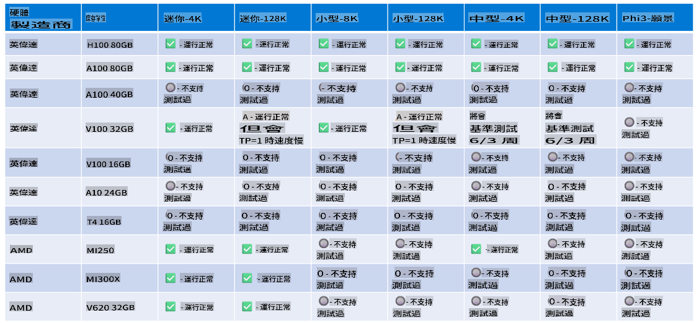

# Phi Hardware Support

Microsoft Phi ໄດ້ຖືກປັບປຸງໃຫ້ເຂົ້າກັບ ONNX Runtime ແລະສະໜັບສະໜູນ Windows DirectML. ມັນເຮັດວຽກໄດ້ດີກັບປະເພດຮາດແວຕ່າງໆ, ລວມທັງ GPUs, CPUs, ແລະອຸປະກອນມືຖື.

## ອຸປະກອນຮາດແວ
ຮາດແວທີ່ສະໜັບສະໜູນໂດຍສະເພາະປະກອບມີ:

- GPU SKU: RTX 4090 (DirectML)
- GPU SKU: 1 A100 80GB (CUDA)
- CPU SKU: Standard F64s v2 (64 vCPUs, 128 GiB memory)

## Mobile SKU

- Android - Samsung Galaxy S21
- Apple iPhone 14 ຫຼືສູງກວ່າ ຊີບປະມວນ A16/A17

## ສະເປັກຮາດແວຂອງ Phi

- ຄວາມຕ້ອງການຂັ້ນຕ່ຳທີ່ຈຳເປັນ.
- Windows: GPU ທີ່ສົມດວຍ DirectX 12 ແລະ RAM ຢ່າງໜ້ອຍ 4GB ລວມກັນ

CUDA: NVIDIA GPU ທີ່ມີ Compute Capability >= 7.02



## ການເຮັດວຽກຂອງ onnxruntime ບນ GPUs ຫຼາຍຕົວ

ໃນປັດຈຸບັນ, ຮູບແບບ Phi ONNX ທີ່ມີຢູ່ເຫມາະສົມສຳລັບ GPU ຕົວດຽວ. ມັນເປັນໄປໄດ້ທີ່ຈະສະໜັບສະໜູນ multi-gpu ສຳລັບຮູບແບບ Phi, ແຕ່ ORT ກັບ 2 gpu ບໍ່ໄດ້ຮັບປະກັນວ່າມັນຈະໃຫ້ຄວາມສາມາດຜ່ານເຂົ້າທີ່ສູງກວ່າການໃຊ້ ORT 2 ອິນສະແຕນສ໌. ກະລຸນາເຂົ້າໄປທີ່ [ONNX Runtime](https://onnxruntime.ai/) ສຳລັບຂໍ້ມູນອັບເດດລ່າສຸດ.

ທີ່ [Build 2024 ທີມ GenAI ONNX](https://youtu.be/WLW4SE8M9i8?si=EtG04UwDvcjunyfC) ໄດ້ປະກາດວ່າພວກເຂົາໄດ້ເຮັດໃຫ້ multi-instance ແທນທີ່ຈະເປັນ multi-gpu ສຳລັບຮູບແບບ Phi.

ໃນປັດຈຸບັນ, ນີ້ຊ່ວຍໃຫ້ທ່ານສາມາດເຮັດວຽກດ້ວຍ onnxruntime ຫຼື onnxruntime-genai ອິນສະແຕນສ໌ດ້ວຍຕົວແປສະພາບວ່າລ້ຽງ CUDA_VISIBLE_DEVICES ດັ່ງນີ້.

```Python
CUDA_VISIBLE_DEVICES=0 python infer.py
CUDA_VISIBLE_DEVICES=1 python infer.py
```

ຂໍໃຫ້ທ່ານສຳຫຼວດ Phi ຕໍ່ໄປໄດ້ທີ່ [Azure AI Foundry](https://ai.azure.com)

It seems you are asking to translate the provided text into "mo." Could you clarify what "mo" refers to? Is it a specific language or abbreviation? For example, are you referring to Moldovan (Romanian), Mongolian, or something else? Let me know so I can assist you accurately!