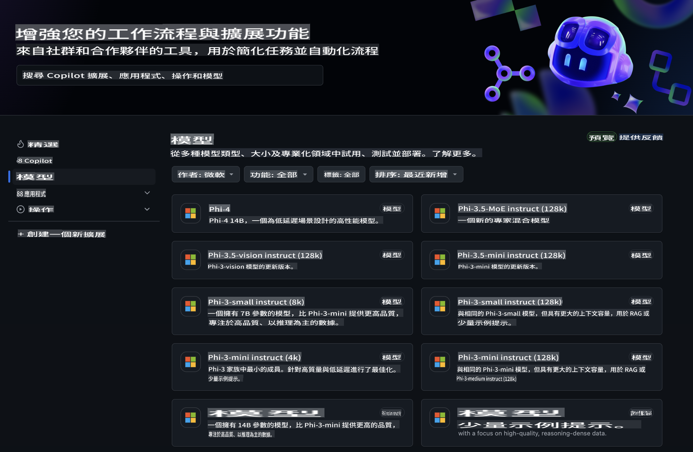
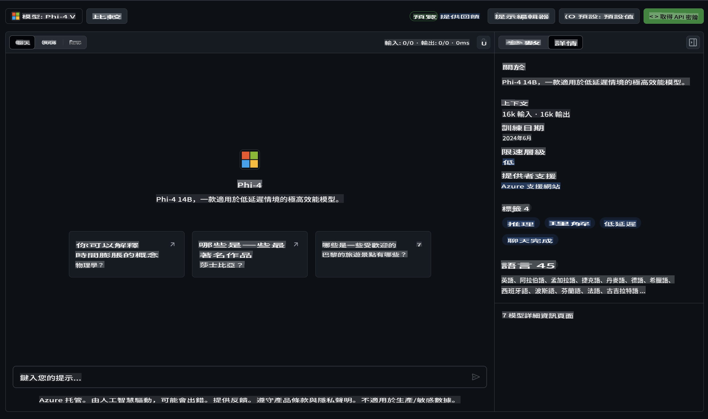
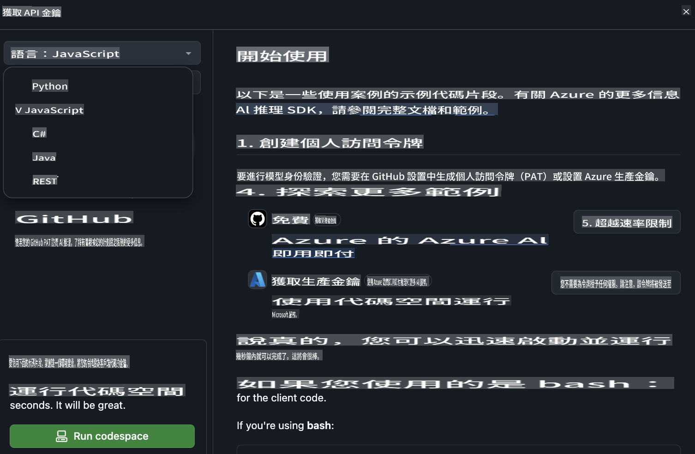
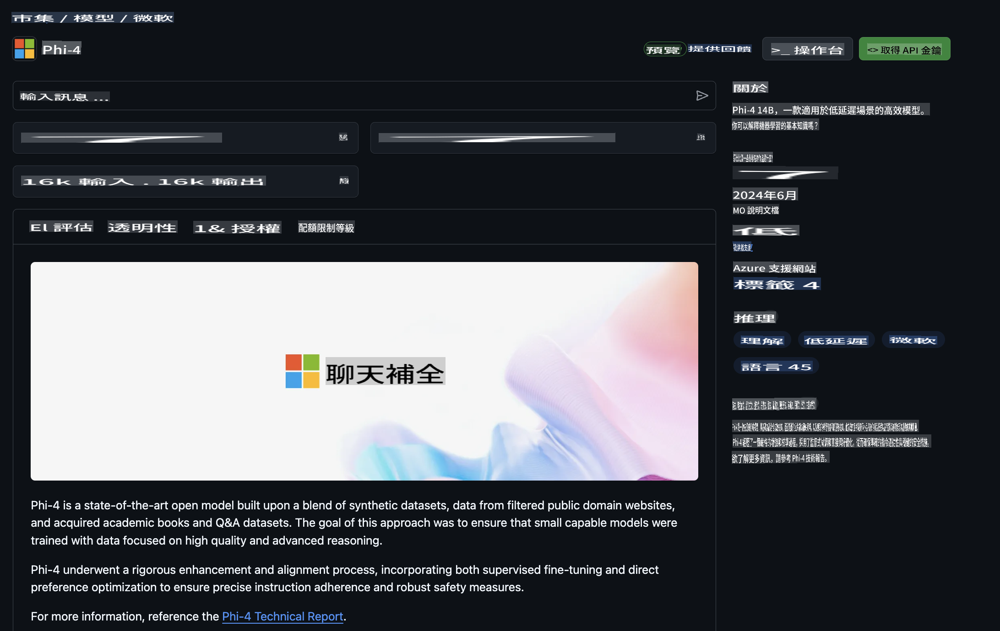

## Phi Family in GitHub Models

So dhawow ku soo dhawow [GitHub Models](https://github.com/marketplace/models)! Wax walba waa diyaar si aad u sahamiso AI Models oo lagu martigeliyay Azure AI.



Wixii macluumaad dheeraad ah ee ku saabsan Models-ka laga heli karo GitHub Models, eeg [GitHub Model Marketplace](https://github.com/marketplace/models).

## Models-ka La Heli Karo

Mid kasta oo ka mid ah models-ka wuxuu leeyahay goob lagu tijaabiyo iyo tijaabooyin koodh ah.



### Qoyska Phi ee GitHub Model Catalog

- [Phi-4](https://github.com/marketplace/models/azureml/Phi-4)

- [Phi-3.5-MoE instruct (128k)](https://github.com/marketplace/models/azureml/Phi-3-5-MoE-instruct)

- [Phi-3.5-vision instruct (128k)](https://github.com/marketplace/models/azureml/Phi-3-5-vision-instruct)

- [Phi-3.5-mini instruct (128k)](https://github.com/marketplace/models/azureml/Phi-3-5-mini-instruct)

- [Phi-3-Medium-128k-Instruct](https://github.com/marketplace/models/azureml/Phi-3-medium-128k-instruct)

- [Phi-3-medium-4k-instruct](https://github.com/marketplace/models/azureml/Phi-3-medium-4k-instruct)

- [Phi-3-mini-128k-instruct](https://github.com/marketplace/models/azureml/Phi-3-mini-128k-instruct)

- [Phi-3-mini-4k-instruct](https://github.com/marketplace/models/azureml/Phi-3-mini-4k-instruct)

- [Phi-3-small-128k-instruct](https://github.com/marketplace/models/azureml/Phi-3-small-128k-instruct)

- [Phi-3-small-8k-instruct](https://github.com/marketplace/models/azureml/Phi-3-small-8k-instruct)

## Sida Loo Bilaabo

Waxaa jira tusaalooyin aasaasi ah oo diyaar u ah inaad orodsiiso. Waxaad ka heli kartaa tusaalooyinkan galka samples-ka. Haddii aad rabto inaad si toos ah ugu boodo luqadda aad jeceshahay, waxaad tusaalooyinka ka heli kartaa luqadaha soo socda:

- Python  
- JavaScript  
- C#  
- Java  
- cURL  

Waxaa sidoo kale jira Deegaan Codespaces ah oo loo qoondeeyay orodinta tusaalooyinka iyo models-ka.



## Koodh Tusaale Ah  

Hoos waxaa ku jira koodh tusaale ah oo loogu talagalay dhowr isticmaal. Wixii macluumaad dheeraad ah ee ku saabsan Azure AI Inference SDK, eeg dukumentiyada buuxa iyo tusaalooyinka.

## Dejinta  

1. Samee token shaqsiyeed oo marin u ah  
Uma baahnid inaad siiso wax rukhsad ah token-ka. Fiiro gaar ah u yeelo in token-ka loo diri doono adeeg Microsoft ah.  

Si aad u isticmaasho koodhka hoose, samee isbeddel deegaanka si aad token-kaaga ugu dejiso furaha koodhka macmiilka.  

Haddii aad isticmaasho bash:  
```
export GITHUB_TOKEN="<your-github-token-goes-here>"
```  
Haddii aad ku jirto powershell:  
```
$Env:GITHUB_TOKEN="<your-github-token-goes-here>"
```  

Haddii aad isticmaasho Windows command prompt:  
```
set GITHUB_TOKEN=<your-github-token-goes-here>
```  

## Tusaale Python  

### Ku Rakib Waxyaabaha Loo Baahan Yahay  
Ku rakib Azure AI Inference SDK adigoo isticmaalaya pip (U baahan yahay: Python >=3.8):  

```
pip install azure-ai-inference
```  

### Orod Tusaale Aasaasi ah  

Tusaalahan wuxuu muujinayaa wicitaan aasaasi ah oo ku socda chat completion API. Waxay adeegsaneysaa GitHub AI model inference endpoint iyo token-kaaga GitHub. Wicitaanku waa mid isku mar ah.  

```python
import os
from azure.ai.inference import ChatCompletionsClient
from azure.ai.inference.models import SystemMessage, UserMessage
from azure.core.credentials import AzureKeyCredential

endpoint = "https://models.inference.ai.azure.com"
model_name = "Phi-4"
token = os.environ["GITHUB_TOKEN"]

client = ChatCompletionsClient(
    endpoint=endpoint,
    credential=AzureKeyCredential(token),
)

response = client.complete(
    messages=[
        UserMessage(content="I have $20,000 in my savings account, where I receive a 4% profit per year and payments twice a year. Can you please tell me how long it will take for me to become a millionaire? Also, can you please explain the math step by step as if you were explaining it to an uneducated person?"),
    ],
    temperature=0.4,
    top_p=1.0,
    max_tokens=2048,
    model=model_name
)

print(response.choices[0].message.content)
```  

### Orod Wadahadal Isku Xiran  

Tusaalahan wuxuu muujinayaa wadahadal isku xiran oo leh chat completion API. Markaad isticmaaleyso model-ka codsi chat ah, waa inaad maamushaa taariikhda wadahadalkaas oo aad u dirtaa fariimaha ugu dambeeyay model-ka.  

```
import os
from azure.ai.inference import ChatCompletionsClient
from azure.ai.inference.models import AssistantMessage, SystemMessage, UserMessage
from azure.core.credentials import AzureKeyCredential

token = os.environ["GITHUB_TOKEN"]
endpoint = "https://models.inference.ai.azure.com"
# Replace Model_Name
model_name = "Phi-4"

client = ChatCompletionsClient(
    endpoint=endpoint,
    credential=AzureKeyCredential(token),
)

messages = [
    SystemMessage(content="You are a helpful assistant."),
    UserMessage(content="What is the capital of France?"),
    AssistantMessage(content="The capital of France is Paris."),
    UserMessage(content="What about Spain?"),
]

response = client.complete(messages=messages, model=model_name)

print(response.choices[0].message.content)
```  

### Ku Gudbi Natiijada Si Toos ah  

Si aad u hesho waayo-aragnimo isticmaale oo wanaagsan, waxaad rabtaa inaad ku gudbiso jawaabta model-ka si toos ah, si token-ka ugu horreeya uu u soo baxo si dhakhso ah oo aad uga fogaato sugitaanka jawaabo dhaadheer.  

```
import os
from azure.ai.inference import ChatCompletionsClient
from azure.ai.inference.models import SystemMessage, UserMessage
from azure.core.credentials import AzureKeyCredential

token = os.environ["GITHUB_TOKEN"]
endpoint = "https://models.inference.ai.azure.com"
# Replace Model_Name
model_name = "Phi-4"

client = ChatCompletionsClient(
    endpoint=endpoint,
    credential=AzureKeyCredential(token),
)

response = client.complete(
    stream=True,
    messages=[
        SystemMessage(content="You are a helpful assistant."),
        UserMessage(content="Give me 5 good reasons why I should exercise every day."),
    ],
    model=model_name,
)

for update in response:
    if update.choices:
        print(update.choices[0].delta.content or "", end="")

client.close()
```  

## Isticmaal Bilaash ah iyo Xaddidaadaha Heerarka ee GitHub Models  

  

[Xaddidaadaha heerarka ee goobta tijaabada iyo isticmaalka API-ga bilaashka ah](https://docs.github.com/en/github-models/prototyping-with-ai-models#rate-limits) waxaa loogu talagalay inay kaa caawiyaan inaad tijaabiso models-ka oo aad horumariso codsigaaga AI. Si aad u isticmaasho wixii ka baxsan xaddidaadahaas, oo aad u ballaariso codsigaaga, waa inaad ka qaadataa ilo ka socda xisaab Azure ah, oo aad halkaas ka gasho halkii aad ka isticmaali lahayd token-kaaga shaqsiyeed ee GitHub. Waxba uma baahnid inaad beddesho wax kale oo ku jira koodhkaaga. Adeegso xiriirkan si aad u ogaato sida loo dhaafo xaddidaadaha heerka bilaashka ah ee Azure AI.  

### Ogaanshooyin  

Xusuusnow markaad la falgashay model inaad tijaabinayso AI, sidaas darteed khaladaadka macluumaadka waa suurtagal.  

Astaantani waxay ku xiran tahay xaddidaado kala duwan (oo ay ku jiraan codsiyada daqiiqaddii, codsiyada maalintii, tokens codsi kasta, iyo codsiyada isku mar ah) mana ahan mid loogu talagalay isticmaalka kiisaska wax soo saarka.  

GitHub Models waxay isticmaashaa Azure AI Content Safety. Filtarradan lama damin karo inta lagu jiro waayo-aragnimada GitHub Models. Haddii aad go'aansato inaad adeegsanayso models-ka adeeg lacag leh, fadlan u habee filtarradaada macluumaadka si ay ula jaanqaadaan shuruudahaaga.  

Adeeggan wuxuu hoos yimaadaa Shuruudaha Hore ee Sii-daynta GitHub.  

It seems you might be asking for a translation into a language abbreviated as "mo." However, "mo" could refer to several things, such as Moldovan (a variant of Romanian), Maori, or something else. Could you please clarify the specific language or context you're referring to so I can assist you more accurately?