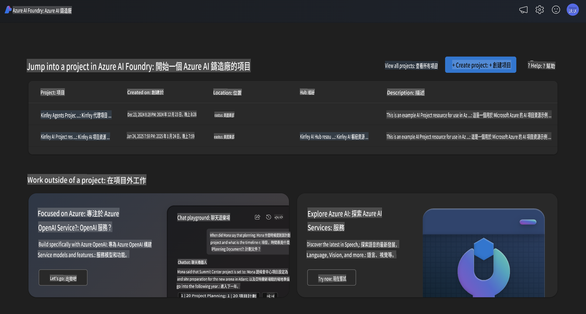
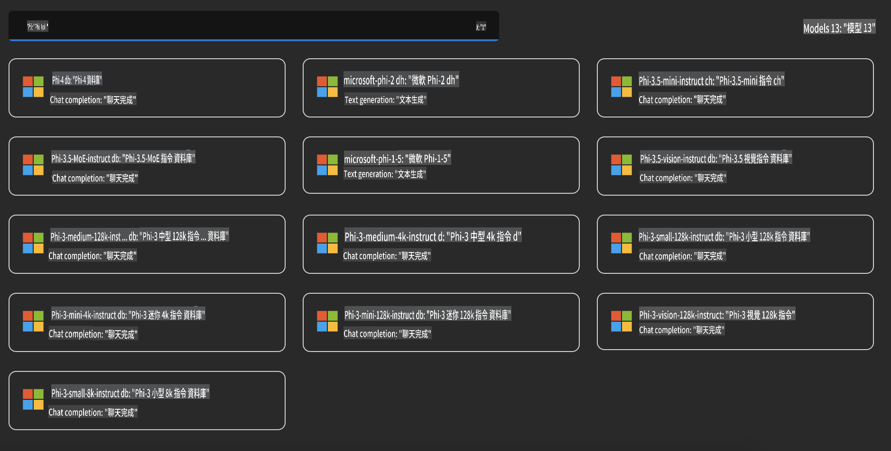
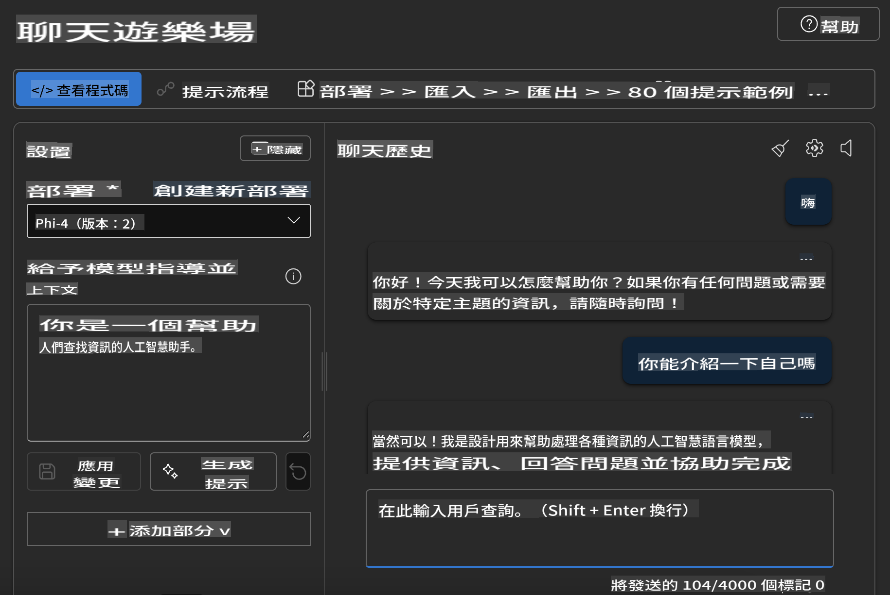

## Phi Family katika Azure AI Foundry

[Azure AI Foundry](https://ai.azure.com) ni jukwaa la kuaminika linalowezesha watengenezaji kuendesha uvumbuzi na kuunda mustakabali kwa kutumia AI kwa njia salama, ya kuaminika, na yenye uwajibikaji.

[Azure AI Foundry](https://ai.azure.com) imeundwa kwa ajili ya watengenezaji ili:

- Kujenga programu za generative AI kwenye jukwaa lenye kiwango cha daraja la biashara.
- Kuchunguza, kujenga, kupima, na kupeleka kwa kutumia zana za kisasa za AI na mifano ya ML, zenye msingi wa mazoea ya AI yenye uwajibikaji.
- Kushirikiana na timu kwa mzunguko mzima wa maendeleo ya programu.

Kwa kutumia Azure AI Foundry, unaweza kuchunguza aina mbalimbali za mifano, huduma, na uwezo, na kuanza kujenga programu za AI zinazokidhi malengo yako. Jukwaa la Azure AI Foundry linasaidia urahisi wa kupanua kutoka dhana za awali hadi programu kamili za uzalishaji. Ufuatiliaji wa kuendelea na uboreshaji unahakikisha mafanikio ya muda mrefu.



Mbali na kutumia Huduma ya Azure AOAI katika Azure AI Foundry, unaweza pia kutumia mifano ya wahusika wengine katika Katalogi ya Mifano ya Azure AI Foundry. Hili ni chaguo zuri ikiwa unataka kutumia Azure AI Foundry kama jukwaa lako la suluhisho la AI.

Tunaweza kupeleka haraka Mifano ya Phi Family kupitia Katalogi ya Mifano katika Azure AI Foundry.



### **Kupeleka Phi-4 katika Azure AI Foundry**


### **Kujaribu Phi-4 katika Azure AI Foundry Playground**



### **Kuendesha Msimbo wa Python kuwaita Azure AI Foundry Phi-4**

```python

import os  
import base64
from openai import AzureOpenAI  
from azure.identity import DefaultAzureCredential, get_bearer_token_provider  
        
endpoint = os.getenv("ENDPOINT_URL", "Your Azure AOAI Service Endpoint")  
deployment = os.getenv("DEPLOYMENT_NAME", "Phi-4")  
      
token_provider = get_bearer_token_provider(  
    DefaultAzureCredential(),  
    "https://cognitiveservices.azure.com/.default"  
)  
  
client = AzureOpenAI(  
    azure_endpoint=endpoint,  
    azure_ad_token_provider=token_provider,  
    api_version="2024-05-01-preview",  
)  
  

chat_prompt = [
    {
        "role": "system",
        "content": "You are an AI assistant that helps people find information."
    },
    {
        "role": "user",
        "content": "can you introduce yourself"
    }
] 
    
# Include speech result if speech is enabled  
messages = chat_prompt 

completion = client.chat.completions.create(  
    model=deployment,  
    messages=messages,
    max_tokens=800,  
    temperature=0.7,  
    top_p=0.95,  
    frequency_penalty=0,  
    presence_penalty=0,
    stop=None,  
    stream=False  
)  
  
print(completion.to_json())  

```

It seems like you've requested a translation into "mo." Could you please clarify what "mo" refers to? Are you referring to a specific language or dialect, such as Maori, Mongolian, or something else? Let me know so I can assist you accurately!