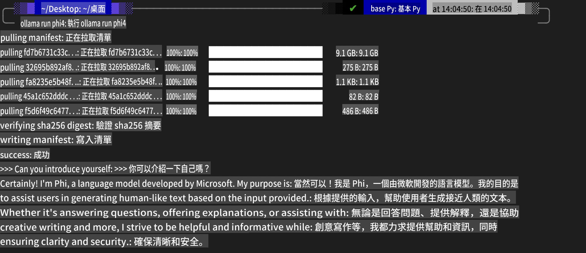
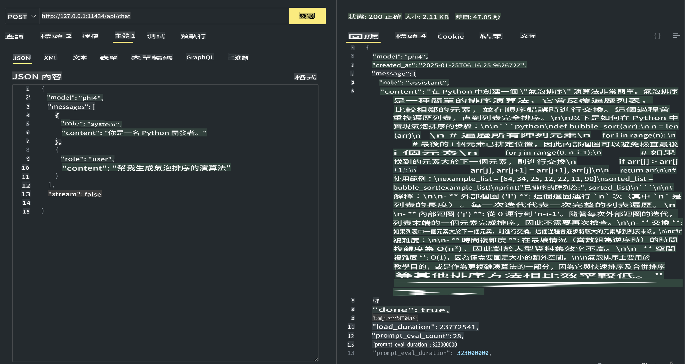

## Phi Family in Ollama

[Ollama](https://ollama.com) umo umoho fa yɔɔni sɛ lɛɛboŋŋɛ ɛni a maŋaŋa fɔlɔŋ kaŋ kaŋ LLM foɔ SLM kaŋŋɛ wɔlɔɔ kaŋ sɔɔŋɔ kɔmɔ, ɛni a toŋɔtiŋ fɔɔŋ API fɔɔŋ wɔɔrɔyɛ kaŋ tiŋŋɛ kɔmɔ Copilot wɔɔlɛbɛ kaŋŋɛ.

## **1. Lɛɛboŋŋɛ**

Ollama yɛɛfɔ wɔlɔɔŋ Windows, macOS, ɛni Linux. I yɛɛ tiŋŋɛ Ollama wɔɔ lɛɛboŋŋɛ yɛlɛ wɔɔlɛ [https://ollama.com/download](https://ollama.com/download). Fɔɔŋ wɔɔlɛɛ lɛɛboŋŋɛ wɔɔfɔɔŋ yɛɛfɔŋŋɛ, I yɛɛ tiŋŋɛ Ollama lɛɛboŋŋɛ wɔɔrɔyɛ kaŋ Phi-3 wɔɔfɔɔŋ wɔlɔŋŋɛ. I yɛɛ yɛɛfɔ yɛɛ [wɔɔrɔyɛ wɔɔ Ollama wɔɔŋɔ](https://ollama.com/library). Fɔɔŋ wɔɔlɛɛ repository wɔɔ Codespace wɔɔŋɔ, Ollama yɛɛ lɛɛboŋŋɛ wɔɔŋɔ wɔɔŋɔŋ.

```bash

ollama run phi4

```

> [!NOTE]
> Fɔɔŋ wɔɔŋɔ yɛɛ wɔɔrɔyɛ fɔɔŋ wɔɔŋɔ yɛɛyɛɛ kaŋŋɛ, wɔɔ wɔɔ wɔɔlɔɔ yɛɛ wɔɔyɛɛ wɔɔ Phi-4 wɔɔrɔyɛ kaŋŋɛ. Wɔɔ yɛɛŋaŋa WSL kaŋ tiŋŋɛ wɔɔyɛɛ. Fɔɔŋ wɔɔ wɔɔrɔyɛ yɛɛfɔŋŋɛ, I yɛɛ yɛɛ tiŋŋɛ wɔɔ lɛɛŋŋɛ wɔɔ terminal wɔɔŋɔŋ.



## **2. Phi-4 API wɔɔrɔyɛ Ollama wɔɔŋɔŋ**

Fɔɔŋ I yɛɛ tiŋŋɛ Phi-4 API wɔɔ Ollama wɔɔŋɔŋ, I yɛɛ yɛɛŋaŋa wɔɔ yɛɛŋŋɛ wɔɔ terminal kaŋ tiŋŋɛ Ollama server wɔɔŋɔŋ.

```bash

ollama serve

```

> [!NOTE]
> Fɔɔŋ wɔɔŋɔ macOS foɔ Linux wɔɔŋɔŋ, yɛɛ yɛɛ yɛɛŋŋɛ yɛɛ wɔɔŋɔŋ yɛɛyɛɛ **"Error: listen tcp 127.0.0.1:11434: bind: address already in use"**. Wɔɔ yɛɛŋŋɛ yɛɛŋŋɛ fɔɔŋ server yɛɛ wɔɔŋɔŋ wɔɔŋɔŋ, yɛɛ yɛɛ yɛɛŋŋɛ fɔɔŋ wɔɔŋɔŋ yɛɛ yɛɛŋŋɛ Ollama kaŋ wɔɔŋɔŋ:

**macOS**

```bash

brew services restart ollama

```

**Linux**

```bash

sudo systemctl stop ollama

```

Ollama yɛɛ yɛɛ API wɔɔŋɔŋ: generate ɛni chat. I yɛɛ tiŋŋɛ model API wɔɔ Ollama wɔɔŋɔŋ, yɛɛ yɛɛŋŋɛ fɔɔŋ local service wɔɔ port 11434 wɔɔŋɔŋ.

**Chat**

```bash

curl http://127.0.0.1:11434/api/chat -d '{
  "model": "phi3",
  "messages": [
    {
      "role": "system",
      "content": "Your are a python developer."
    },
    {
      "role": "user",
      "content": "Help me generate a bubble algorithm"
    }
  ],
  "stream": false
  
}'

This is the result in Postman



## Additional Resources

Check the list of available models in Ollama in [their library](https://ollama.com/library).

Pull your model from the Ollama server using this command

```bash
ollama pull phi4
```

Run the model using this command

```bash
ollama run phi4
```

***Note:*** Visit this link [https://github.com/ollama/ollama/blob/main/docs/api.md](https://github.com/ollama/ollama/blob/main/docs/api.md) to learn more

## Calling Ollama from Python

You can use `requests` or `urllib3` to make requests to the local server endpoints used above. However, a popular way to use Ollama in Python is via the [openai](https://pypi.org/project/openai/) SDK, since Ollama provides OpenAI-compatible server endpoints as well.

Here is an example for phi3-mini:

```python
import openai

client = openai.OpenAI(
    base_url="http://localhost:11434/v1",
    api_key="nokeyneeded",
)

response = client.chat.completions.create(
    model="phi4",
    temperature=0.7,
    n=1,
    messages=[
        {"role": "system", "content": "You are a helpful assistant."},
        {"role": "user", "content": "Write a haiku about a hungry cat"},
    ],
)

print("Response:")
print(response.choices[0].message.content)
```

## Calling Ollama from JavaScript 

```javascript
// Phi-4 yɛɛ yɛɛ file summarize yɛɛŋŋɛ wɔɔŋɔŋ
script({
    model: "ollama:phi4",
    title: "Summarize with Phi-4",
    system: ["system"],
})

// summarize yɛɛŋŋɛ
const file = def("FILE", env.files)
$`Summarize ${file} in a single paragraph.`
```

## Calling Ollama from C#

Create a new C# Console application and add the following NuGet package:

```bash
dotnet add package Microsoft.SemanticKernel --version 1.34.0
```

Then replace this code in the `Program.cs` file

```csharp
using Microsoft.SemanticKernel;
using Microsoft.SemanticKernel.ChatCompletion;

// chat completion service yɛɛ Ollama server wɔɔŋɔŋ
#pragma warning disable SKEXP0001, SKEXP0003, SKEXP0010, SKEXP0011, SKEXP0050, SKEXP0052
builder.AddOpenAIChatCompletion(
    modelId: "phi4",
    endpoint: new Uri("http://localhost:11434/"),
    apiKey: "non required");

// chat service wɔɔŋɔŋ yɛɛ prompt wɔɔŋɔŋ
string prompt = "Write a joke about kittens";
var response = await kernel.InvokePromptAsync(prompt);
Console.WriteLine(response.GetValue<string>());
```

Run the app with the command:

```bash
dotnet run

It seems like you're requesting a translation to "mo," but it's unclear what language or dialect "mo" refers to. Could you please clarify the target language or provide more context? For example, are you referring to Māori, Montenegrin, or something else? Let me know, and I'd be happy to assist!