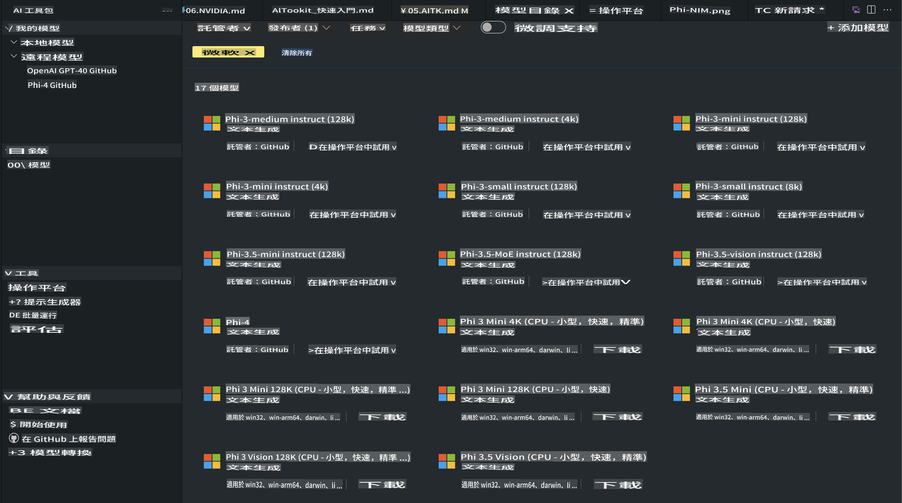
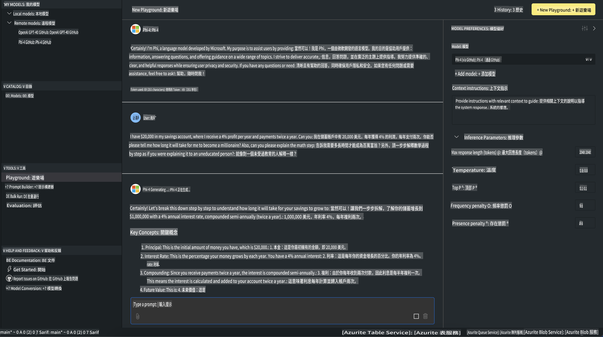

# Phi Family in AITK

[AI Toolkit for VS Code](https://marketplace.visualstudio.com/items?itemName=ms-windows-ai-studio.windows-ai-studio) e faafaigofie ai le atinaʻeina o polokalama AI e fa'atupuina, e ala i le tu'ufa'atasia o meafaigaluega fa'atekonolosi ma faʻataʻitaʻiga AI mai le Azure AI Foundry Catalog ma isi lisi e pei o Hugging Face. E mafai ona e suʻeina le lisi o faʻataʻitaʻiga AI o lo'o lagolagoina e GitHub Models ma Azure AI Foundry Model Catalogs, sii mai i luga o lau komepiuta poʻo se server mamao, faʻaleleia, suʻega, ma faʻaaoga i lau talosaga.

AI Toolkit Preview o le a fa'agasolo i luga o lau komepiuta. O le su'esu'ega i luga o le lotoifale po'o le fa'aleleia, e fa'alagolago i le fa'ata'ita'iga e te filifilia, atonu e mana'omia ai se GPU e pei o le NVIDIA CUDA GPU. E mafai fo'i ona e fa'agasolo sa'o GitHub Models i le AITK.

## Amata

[A'oa'o atili i le auala e fa'apipi'i ai le Windows subsystem for Linux](https://learn.microsoft.com/windows/wsl/install?WT.mc_id=aiml-137032-kinfeylo)

ma [suia le tufatufaina Linux fa'aletonu](https://learn.microsoft.com/windows/wsl/install#change-the-default-linux-distribution-installed).

[AI Toolkit GitHub Repo](https://github.com/microsoft/vscode-ai-toolkit/)

- Windows, Linux, macOS

- Mo le fa'aleleia i luga o Windows ma Linux, e mana'omia ai se Nvidia GPU. I le male, e mana'omia e **Windows** le subsystem mo Linux ma le Ubuntu distro 18.4 po'o se mea fou atu. [A'oa'o atili i le auala e fa'apipi'i ai le Windows subsystem for Linux](https://learn.microsoft.com/windows/wsl/install) ma [suia le tufatufaina Linux fa'aletonu](https://learn.microsoft.com/windows/wsl/install#change-the-default-linux-distribution-installed).

### Fa'apipi'i le AI Toolkit

AI Toolkit o lo'o tu'uina atu o se [Fa'aopoopoga mo Visual Studio Code](https://code.visualstudio.com/docs/setup/additional-components#_vs-code-extensions), o lea e tatau ona e fa'apipi'i muamua le [VS Code](https://code.visualstudio.com/docs/setup/windows?WT.mc_id=aiml-137032-kinfeylo), ma sii mai le AI Toolkit mai le [VS Marketplace](https://marketplace.visualstudio.com/items?itemName=ms-windows-ai-studio.windows-ai-studio).  
O le [AI Toolkit o lo'o maua i le Visual Studio Marketplace](https://marketplace.visualstudio.com/items?itemName=ms-windows-ai-studio.windows-ai-studio) ma e mafai ona fa'apipi'i e pei o isi fa'aopoopoga VS Code.

Afai e te le masani i le fa'apipi'iina o fa'aopoopoga VS Code, mulimuli i laasaga nei:

### Saini I Totonu

1. I le Activity Bar i VS Code, filifili **Extensions**  
1. I le Extensions Search bar, taina "AI Toolkit"  
1. Filifili le "AI Toolkit for Visual Studio code"  
1. Filifili **Install**  

O lea ua e sauni e fa'aoga le fa'aopoopoga!

O le a fa'aalia se fa'amatalaga e saini i totonu o GitHub, o lea fa'amolemole kiliki "Allow" e fa'aauau. O le a toe fa'ailoa atu oe i le itulau saini i totonu o GitHub.

Fa'amolemole saini i totonu ma mulimuli i la'asaga o le faiga. A maeʻa le faagasologa manuia, o le a toe faʻafeiloaʻi oe i VS Code.

A maeʻa ona faʻapipiʻi le faʻaopoopoga, o le a e vaʻaia le ata o le AI Toolkit e aliali mai i lau Activity Bar.

Se’i o tatou su’esu’e i gaoioiga avanoa!

### Gaoioiga Avanoa

O le fa'asoa autu o le AI Toolkit e fa'avae i luga o vaega nei:  

- **Models**  
- **Resources**  
- **Playground**  
- **Fine-tuning**  
- **Evaluation**  

O lo'o maua i le vaega o Resources. Ina ia amata, filifili **Model Catalog**.

### Sii mai se fa'ata'ita'iga mai le lisi

A mae'a ona fa'alauiloa le AI Toolkit mai le VS Code side bar, e mafai ona e filifilia mai i filifiliga nei:



- Su'e se fa'ata'ita'iga lagolago mai le **Model Catalog** ma sii mai i luga o le lotoifale  
- Su'e le fa'ata'ita'iga i le **Model Playground**  
- Fa'aleleia le fa'ata'ita'iga i le lotoifale po'o se server mamao i le **Model Fine-tuning**  
- Fa'apipi'i fa'ata'ita'iga ua fa'aleleia i le ao e ala i le command palette mo le AI Toolkit  
- Iloilo fa'ata'ita'iga  

> [!NOTE]
>
> **GPU Vs CPU**
>
> O le ae matauina o le model cards o lo'o fa'aalia ai le tele o fa'ata'ita'iga, le tulaga ma le ituaiga accelerator (CPU, GPU). Mo fa'atinoga sili ona lelei i luga o **Windows masini e i ai le itiiti ifo ma le tasi GPU**, filifili fa'ata'ita'iga e fa'atatau i Windows.
>
> O lenei mea e mautinoa ai e te maua se fa'ata'ita'iga fa'alelei mo le DirectML accelerator.
>
> O igoa o fa'ata'ita'iga o lo'o i le fa'atulagaga
>
> - `{model_name}-{accelerator}-{quantization}-{format}`.
>
> Ina ia siaki pe i ai sau GPU i lau masini Windows, tatala le **Task Manager** ona filifili lea o le **Performance** tab. Afai e i ai ni GPU, o le a lisiina i lalo o igoa e pei o "GPU 0" poʻo "GPU 1".

### Fa'agasolo le fa'ata'ita'iga i le playground

A uma ona seti uma fa'amatalaga, kiliki **Generate Project**.

A uma ona sii mai lau fa'ata'ita'iga, filifili **Load in Playground** i luga o le model card i le catalog:

- Fa'amaonia le sii mai o le fa'ata'ita'iga  
- Fa'apipi'i mea uma e mana'omia ma mea e fa'alagolago ai  
- Fausia le VS Code workspace  



### Fa'aoga le REST API i lau talosaga

O le AI Toolkit e sau ma se REST API web server i luga o le lotoifale **i luga o le port 5272** o lo'o fa'aogaina le [OpenAI chat completions format](https://platform.openai.com/docs/api-reference/chat/create).

O lenei mea e mafai ai ona e su'eina lau talosaga i le lotoifale e aunoa ma le fa'alagolago i se auaunaga fa'ata'ita'iga AI i le ao. Mo se fa'ata'ita'iga, o le faila JSON o lo'o i lalo o lo'o fa'aalia ai le auala e fa'atulaga ai le tino o le talosaga:

```json
{
    "model": "Phi-4",
    "messages": [
        {
            "role": "user",
            "content": "what is the golden ratio?"
        }
    ],
    "temperature": 0.7,
    "top_p": 1,
    "top_k": 10,
    "max_tokens": 100,
    "stream": true
}
```

E mafai ona e su'eina le REST API e fa'aaoga ai (fa'ata'ita'iga) [Postman](https://www.postman.com/) po'o le CURL (Client URL) utility:

```bash
curl -vX POST http://127.0.0.1:5272/v1/chat/completions -H 'Content-Type: application/json' -d @body.json
```

### Fa'aogaina le OpenAI client library mo Python

```python
from openai import OpenAI

client = OpenAI(
    base_url="http://127.0.0.1:5272/v1/", 
    api_key="x" # required for the API but not used
)

chat_completion = client.chat.completions.create(
    messages=[
        {
            "role": "user",
            "content": "what is the golden ratio?",
        }
    ],
    model="Phi-4",
)

print(chat_completion.choices[0].message.content)
```

### Fa'aogaina le Azure OpenAI client library mo .NET

Fa'aopoopo le [Azure OpenAI client library mo .NET](https://www.nuget.org/packages/Azure.AI.OpenAI/) i lau poloketi e fa'aogaina ai NuGet:

```bash
dotnet add {project_name} package Azure.AI.OpenAI --version 1.0.0-beta.17
```

Fa'aopoopo se faila C# e ta'ua **OverridePolicy.cs** i lau poloketi ma kopi i totonu le fa'amaumauga lenei:

```csharp
// OverridePolicy.cs
using Azure.Core.Pipeline;
using Azure.Core;

internal partial class OverrideRequestUriPolicy(Uri overrideUri)
    : HttpPipelineSynchronousPolicy
{
    private readonly Uri _overrideUri = overrideUri;

    public override void OnSendingRequest(HttpMessage message)
    {
        message.Request.Uri.Reset(_overrideUri);
    }
}
```

Sosoo ai, kopi le fa'amaumauga o lo'o i lalo i lau faila **Program.cs**:

```csharp
// Program.cs
using Azure.AI.OpenAI;

Uri localhostUri = new("http://localhost:5272/v1/chat/completions");

OpenAIClientOptions clientOptions = new();
clientOptions.AddPolicy(
    new OverrideRequestUriPolicy(localhostUri),
    Azure.Core.HttpPipelinePosition.BeforeTransport);
OpenAIClient client = new(openAIApiKey: "unused", clientOptions);

ChatCompletionsOptions options = new()
{
    DeploymentName = "Phi-4",
    Messages =
    {
        new ChatRequestSystemMessage("You are a helpful assistant. Be brief and succinct."),
        new ChatRequestUserMessage("What is the golden ratio?"),
    }
};

StreamingResponse<StreamingChatCompletionsUpdate> streamingChatResponse
    = await client.GetChatCompletionsStreamingAsync(options);

await foreach (StreamingChatCompletionsUpdate chatChunk in streamingChatResponse)
{
    Console.Write(chatChunk.ContentUpdate);
}
```

## Fa'aleleia Fa'ata'ita'iga ma le AI Toolkit

- Amata i le su'esu'eina o fa'ata'ita'iga ma le playground.  
- Fa'aleleia fa'ata'ita'iga ma fa'ata'ita'iga i luga o punaoa i le lotoifale.  
- Fa'aleleia ma fa'ata'ita'iga mamao e fa'aogaina ai punaoa Azure.  

[Fa'aleleia Fa'ata'ita'iga ma le AI Toolkit](../../03.FineTuning/Finetuning_VSCodeaitoolkit.md)

## AI Toolkit Q&A Resources

Fa'amolemole taga'i i la matou [Q&A page](https://github.com/microsoft/vscode-ai-toolkit/blob/main/archive/QA.md) mo mataupu masani ma fofo.

It seems like you want the text translated into "mo," but it's unclear what "mo" refers to. Could you clarify if "mo" is a specific language, such as Mongolian, Maori, or something else? Once you specify, I’ll be happy to assist with the translation!