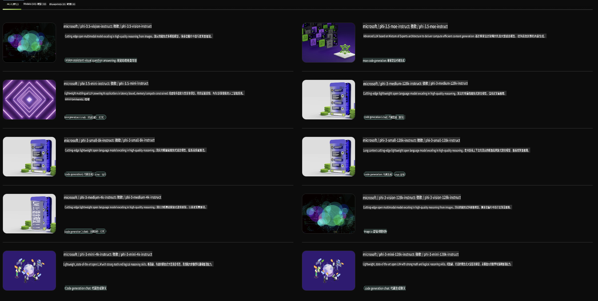

## Phi Family in NVIDIA NIM

NVIDIA NIM jẹ awọn iṣẹ microservices ti o rọrun lati lo ti a ṣe apẹrẹ lati yara ifilọlẹ awọn awoṣe AI iran lori awọsanma, ile-iṣẹ data, ati awọn ibi iṣẹ. NIMs ni a pin ni ibamu si idile awoṣe ati awoṣe kọọkan. Fun apẹẹrẹ, NVIDIA NIM fun awọn awoṣe ede nla (LLMs) mu agbara awọn awoṣe LLM to ti ni ilọsiwaju si awọn ohun elo ile-iṣẹ, n pese agbara alailẹgbẹ fun ilana ede adayeba ati oye.

NIM jẹ ki o rọrun fun awọn ẹgbẹ IT ati DevOps lati ṣeto awọn awoṣe ede nla (LLMs) ni awọn agbegbe ti wọn ṣakoso lakoko ti o tun n pese awọn olupilẹṣẹ pẹlu awọn API ile-iṣẹ ti o fun wọn laaye lati kọ awọn alabaṣiṣẹpọ ọlọgbọn, awọn chatbots, ati awọn oluranlọwọ AI ti o le yi iṣowo wọn pada. Pẹlu lilo agbara GPU to ti ni ilọsiwaju ti NVIDIA ati ifilọlẹ ti o ni iwọn, NIM nfunni ni ọna ti o yara julọ si itọkasi pẹlu iṣẹ ti ko ni afiwe.

O le lo NVIDIA NIM lati tọkasi Awọn awoṣe Idile Phi.



### **Awọn Apẹẹrẹ - Phi-3-Vision ni NVIDIA NIM**

Fojuinu pe o ni aworan kan (`demo.png`) ati pe o fẹ lati ṣẹda koodu Python ti o ṣe ilana aworan yii ati fipamọ ẹya tuntun rẹ (`phi-3-vision.jpg`).

Koodu ti o wa loke ṣe adaṣe ilana yii nipa:

1. Ṣiṣeto ayika ati awọn iṣeto pataki.
2. Ṣẹda ibeere kan ti o paṣẹ fun awoṣe lati ṣẹda koodu Python ti o nilo.
3. Firanṣẹ ibeere naa si awoṣe ati gbigba koodu ti a ṣẹda.
4. Yọkuro ati ṣiṣe koodu ti a ṣẹda.
5. Ṣafihan awọn aworan atilẹba ati ti a ti ṣe ilana.

Ọna yii lo agbara AI lati ṣe adaṣe awọn iṣẹ ṣiṣe aworan, ṣiṣe irọrun ati yara lati ṣaṣeyọri awọn ibi-afẹde rẹ.

[Ojutu Koodu Apẹẹrẹ](../../../../../code/06.E2E/E2E_Nvidia_NIM_Phi3_Vision.ipynb)

Jẹ ki a pin kini gbogbo koodu naa ṣe ni igbesẹ-nipasẹ-igbesẹ:

1. **Fi Package Ti o Nilo sii**:
   ```python
    !pip install langchain_nvidia_ai_endpoints -U
    ```
   Aṣẹ yii fi package `langchain_nvidia_ai_endpoints` sii, ti o rii daju pe o jẹ ẹya tuntun.

2. **Gba Awọn Modulu pataki sii**:
   ```python
    from langchain_nvidia_ai_endpoints import ChatNVIDIA
    import getpass
    import os
    import base64
    ```
   Awọn akowọle wọnyi mu awọn modulu pataki wa fun ibaraẹnisọrọ pẹlu awọn ọna opopona AI NVIDIA, ṣiṣe awọn ọrọ igbaniwọle ni aabo, ibaraẹnisọrọ pẹlu eto iṣẹ, ati siseto/sisọ data ni ọna kika base64.

3. **Ṣeto Bọtini API**:
   ```python
    if not os.getenv("NVIDIA_API_KEY"):
        os.environ["NVIDIA_API_KEY"] = getpass.getpass("Enter your NVIDIA API key: ")
    ```
   Koodu yii ṣayẹwo boya oniyipada agbegbe `NVIDIA_API_KEY` ti ṣeto. Ti kii ba ṣe bẹ, o beere lọwọ olumulo lati tẹ bọtini API wọn ni aabo.

4. **Ṣalaye Awoṣe ati Ọna Aworan**:
   ```python
    model = 'microsoft/phi-3-vision-128k-instruct'
    chat = ChatNVIDIA(model=model)
    img_path = './imgs/demo.png'
    ```
   Eyi ṣeto awoṣe lati lo, ṣẹda apẹẹrẹ ti `ChatNVIDIA` pẹlu awoṣe ti a ṣalaye, ati ṣalaye ọna si faili aworan naa.

5. **Ṣẹda Ibeere Ọrọ**:
   ```python
    text = "Please create Python code for image, and use plt to save the new picture under imgs/ and name it phi-3-vision.jpg."
    ```
   Eyi ṣalaye ibeere ọrọ kan ti o paṣẹ fun awoṣe lati ṣẹda koodu Python fun ṣiṣe aworan.

6. **Ṣatunkọ Aworan ni Base64**:
   ```python
    with open(img_path, "rb") as f:
        image_b64 = base64.b64encode(f.read()).decode()
    image = f''
    ```
   Koodu yii ka faili aworan naa, ṣatunkọ rẹ ni base64, ati ṣẹda taagi aworan HTML pẹlu data ti a ṣe atunṣe.

7. **Darapọ Ọrọ ati Aworan sinu Ibeere kan**:
   ```python
    prompt = f"{text} {image}"
    ```
   Eyi darapọ ọrọ ibeere ati taagi aworan HTML sinu okun kan ṣoṣo.

8. **Ṣẹda Koodu Lilo ChatNVIDIA**:
   ```python
    code = ""
    for chunk in chat.stream(prompt):
        print(chunk.content, end="")
        code += chunk.content
    ```
   Koodu yii firanṣẹ ibeere naa si `ChatNVIDIA` model and collects the generated code in chunks, printing and appending each chunk to the `code` okun.

9. **Yọ Koodu Python kuro ninu Akoonu ti a Ṣẹda**:
   ```python
    begin = code.index('```python') + 9
   code = code[begin:]
   end = code.index('```')
    code = code[:end]
    ```
   Eyi yọ koodu Python gangan kuro ninu akoonu ti a ṣẹda nipa yiyọ apẹrẹ markdown kuro.

10. **Ṣiṣẹ Koodu ti a Ṣẹda**:
    ```python
    import subprocess
    result = subprocess.run(["python", "-c", code], capture_output=True)
    ```
    Eyi ṣe koodu Python ti a yọ bi ilana kekere kan ati mujade rẹ.

11. **Ṣafihan Awọn Aworan**:
    ```python
    from IPython.display import Image, display
    display(Image(filename='./imgs/phi-3-vision.jpg'))
    display(Image(filename='./imgs/demo.png'))
    ```
    Awọn ila wọnyi n ṣafihan awọn aworan nipa lilo modulu `IPython.display`.

It seems like you're asking for a translation into "mo," but it's unclear what "mo" refers to. Could you clarify the target language or provide more context? For example, are you referring to Māori, Mongolian, or something else? Let me know so I can assist you better!