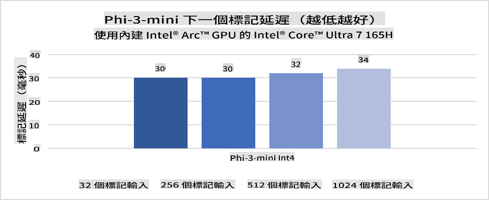
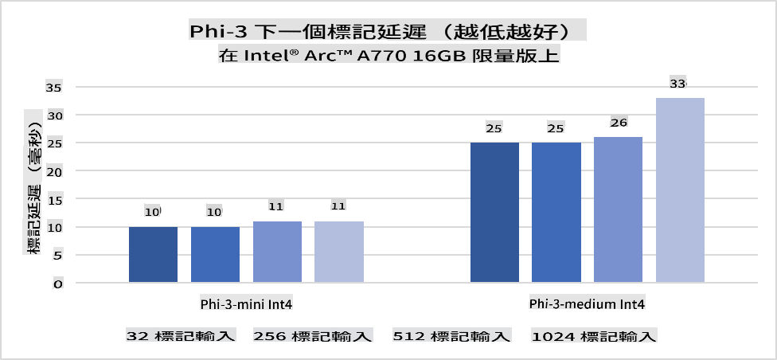
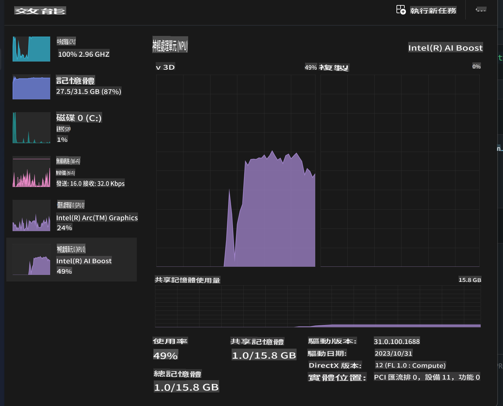
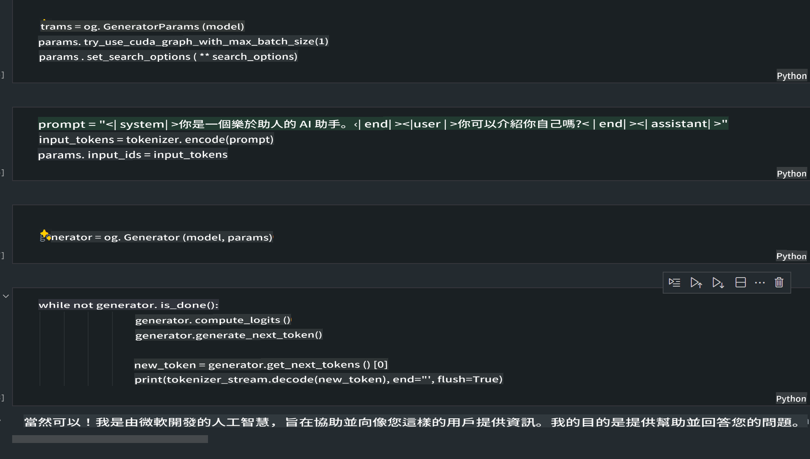
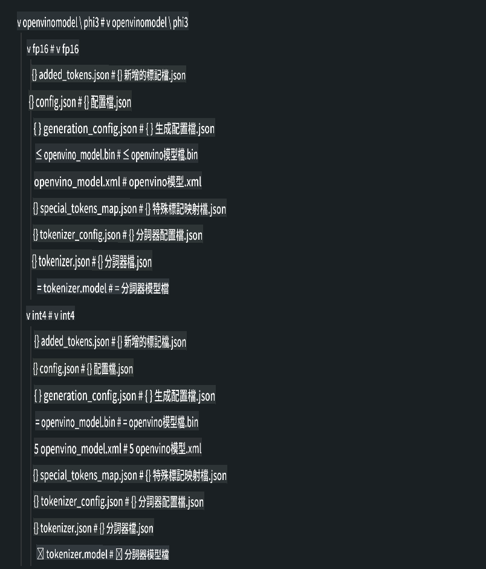
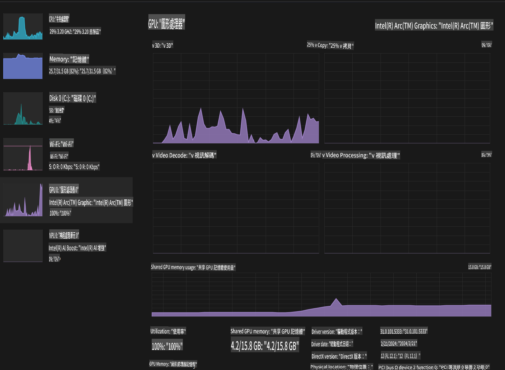

# **Inference Phi-3 in AI PC**

Mo generative AI oo kobcaya iyo awoodda qalabka edge device oo soo hagaagaya, waxaa hadda suurtagal ah in moodooyinka generative AI lagu daro qalabka Bring Your Own Device (BYOD) ee isticmaalayaasha. AI PCs ayaa kamid ah moodooyinkaas. Laga bilaabo 2024, Intel, AMD, iyo Qualcomm ayaa iska kaashaday soo saarista AI PCs oo awood u siinaya in lagu fuliyo moodooyinka generative AI ee deegaanka maxalliga ah iyada oo loo marayo isbeddelada qalabka. Qormadan, waxaan diiradda saari doonaa Intel AI PCs oo aan baari doonaa sida loo hirgeliyo Phi-3 oo lagu shaqeynayo Intel AI PC.

### Waa maxay NPU?

NPU (Neural Processing Unit) waa processor gaar ah ama unug ku dhex jira SoC oo loogu talagalay in lagu dedejiyo hawlaha shabakadaha neerfaha iyo shaqooyinka AI. Si ka duwan CPUs iyo GPUs ee ujeeddooyinka guud, NPUs waxaa loo habeeyay xisaabinta isbarbar socda oo ku saleysan xog, taasoo ka dhigaysa kuwo aad u waxtar leh marka la shaqeynayo xogta badan sida muuqaalka iyo sawirrada, iyo sidoo kale xogta shabakadaha neerfaha. Waxay si gaar ah ugu wanaagsan yihiin qabashada shaqooyinka AI, sida aqoonsiga codka, dhalaalidda asalka ah ee wicitaanada muuqaalka, iyo habaynta sawirrada ama muuqaalada sida ogaanshaha walxaha.

## NPU vs GPU

In kasta oo shaqooyin badan oo AI iyo barashada mashiinka lagu fuliyo GPUs, waxaa jira farqi muhiim ah oo u dhexeeya GPUs iyo NPUs.  
GPUs waxaa lagu yaqaanaa awoodda ay u leeyihiin xisaabinta isbarbar socda, laakiin dhammaan GPUs maaha kuwo isku waxtar leh marka laga soo tago habaynta garaafyada. NPUs, dhanka kale, waxaa si gaar ah loogu talagalay xisaabinta adag ee ku lug leh hawlaha shabakadaha neerfaha, taasoo ka dhigaysa kuwo aad ugu habboon shaqooyinka AI.

Gabagabadii, NPUs waa kuwa xisaabta ku xeel dheer oo dardar geliya xisaabinta AI, waxayna door muhiim ah ka ciyaarayaan waayaha cusub ee AI PCs!

***Tusaalahan wuxuu ku saleysan yahay processor-ka ugu dambeeyay ee Intel Core Ultra***

## **1. U isticmaal NPU in lagu shaqeeyo moodooyinka Phi-3**

Qalabka Intel® NPU waa xawaaraha inference AI oo ku dhex dhisan CPUs-ka Intel ee macaamiisha, laga bilaabo jiilka Intel® Core™ Ultra ee CPUs (oo markii hore loo yaqaanay Meteor Lake). Waxay awood u siinaysaa fulinta tamarta-badbaadinta ee shaqooyinka shabakadaha neerfaha macmalka ah.





**Maktabadda Dardar-gelinta Intel NPU**

Maktabadda Dardar-gelinta Intel NPU [https://github.com/intel/intel-npu-acceleration-library](https://github.com/intel/intel-npu-acceleration-library) waa maktabad Python ah oo loogu talagalay in lagu kordhiyo waxtarka codsiyadaada adoo adeegsanaya awoodda Intel Neural Processing Unit (NPU) si ay u qabato xisaabinta degdegga ah ee qalabka ku habboon.

Tusaale Phi-3-mini oo ku shaqeynaya AI PC oo ay ku shaqeyso processors-ka Intel® Core™ Ultra.


Ku rakib maktabadda Python-ka adigoo isticmaalaya pip

```bash

   pip install intel-npu-acceleration-library

```

***Ogow*** Mashruuca weli wuu socdaa, laakiin moodooyinka tixraaca ah waa kuwo aad u dhammaystiran.

### **Sida loo isticmaalo Maktabadda Dardar-gelinta Intel NPU si loogu shaqeeyo Phi-3**

Iyadoo la adeegsanayo dardar-gelinta Intel NPU, maktabaddani ma saameyneyso habka dhaqameed ee koodhinta. Waxa kaliya ee aad u baahan tahay waa inaad isticmaasho maktabaddan si aad u tiriso moodooyinka Phi-3 asalka ah, sida FP16, INT8, INT4, sida 

```python
from transformers import AutoTokenizer, pipeline,TextStreamer
from intel_npu_acceleration_library import NPUModelForCausalLM, int4
from intel_npu_acceleration_library.compiler import CompilerConfig
import warnings

model_id = "microsoft/Phi-3-mini-4k-instruct"

compiler_conf = CompilerConfig(dtype=int4)
model = NPUModelForCausalLM.from_pretrained(
    model_id, use_cache=True, config=compiler_conf, attn_implementation="sdpa"
).eval()

tokenizer = AutoTokenizer.from_pretrained(model_id)

text_streamer = TextStreamer(tokenizer, skip_prompt=True)
```

Marka tirinta si guul ah loo dhammeeyo, sii wad fulinta si aad u wacdo NPU si uu u socodsiiyo moodooyinka Phi-3.

```python
generation_args = {
   "max_new_tokens": 1024,
   "return_full_text": False,
   "temperature": 0.3,
   "do_sample": False,
   "streamer": text_streamer,
}

pipe = pipeline(
   "text-generation",
   model=model,
   tokenizer=tokenizer,
)

query = "<|system|>You are a helpful AI assistant.<|end|><|user|>Can you introduce yourself?<|end|><|assistant|>"

with warnings.catch_warnings():
    warnings.simplefilter("ignore")
    pipe(query, **generation_args)
```

Marka koodhka la fulinayo, waxaan ku arki karnaa xaaladda socodka NPU iyada oo loo marayo Task Manager



***Tusaalooyin*** : [AIPC_NPU_DEMO.ipynb](../../../../../code/03.Inference/AIPC/AIPC_NPU_DEMO.ipynb)

## **2. U isticmaal DirectML + ONNX Runtime si loogu shaqeeyo moodooyinka Phi-3**

### **Waa maxay DirectML**

[DirectML](https://github.com/microsoft/DirectML) waa maktabad DirectX 12 oo lagu dedejiyay waxqabadka sare leh oo loogu talagalay barashada mashiinka. DirectML waxay siisaa dardar-gelin GPU shaqooyinka caadiga ah ee barashada mashiinka iyadoo taageero ballaaran loo fidinayo qalabka iyo darawallada, oo ay ku jiraan dhammaan GPUs-ku-waafaqsan DirectX 12 ee ka yimid soo saarayaasha sida AMD, Intel, NVIDIA, iyo Qualcomm.

Marka si gaar ah loo isticmaalo, API-ga DirectML waa maktabad heer-hoose ah oo DirectX 12 ah waana mid ku habboon codsiyada waxqabadka sare leh, sida qaab-dhismeedyada, ciyaaraha, iyo codsiyada kale ee waqtiga-dhabta ah. Isdhexgalka fudud ee DirectML iyo Direct3D 12 iyo sidoo kale kharashkiisa yar iyo isku halaynta natiijooyinka across hardware ayaa ka dhigaysa DirectML mid ku habboon dardar-gelinta barashada mashiinka marka waxqabadka sare la rabo iyo natiijooyin lagu kalsoonaan karo across hardware.

***Ogow*** : DirectML-ka ugu dambeeyay ayaa hadda taageera NPU (https://devblogs.microsoft.com/directx/introducing-neural-processor-unit-npu-support-in-directml-developer-preview/)

### DirectML iyo CUDA marka la barbar dhigo awooddooda iyo waxqabadkooda:

**DirectML** waa maktabad barashada mashiinka oo ay horumarisay Microsoft. Waxaa loogu talagalay in lagu dedejiyo shaqooyinka barashada mashiinka ee qalabka Windows, oo ay ku jiraan kombuyuutarada miiska, laptops, iyo qalabka edge.  
- Ku Salaysan DX12: DirectML waxaa lagu dhisay DirectX 12 (DX12), taasoo bixisa taageero ballaaran oo qalabka across GPUs, oo ay ku jiraan NVIDIA iyo AMD.  
- Taageero Ballaaran: Sababtoo ah waxay adeegsaneysaa DX12, DirectML waxay la shaqeyn kartaa GPU kasta oo taageera DX12, xitaa kuwa isku dhafan.  
- Habaynta Sawirka: DirectML waxay habaysaa sawirrada iyo xogta kale iyadoo la adeegsanayo shabakadaha neerfaha, taasoo ka dhigaysa mid ku habboon shaqooyinka sida aqoonsiga sawirka, ogaanshaha walxaha, iyo kuwo kale.  
- Fududeynta Dejinta: Dejinta DirectML waa mid fudud, mana u baahna SDKs ama maktabado gaar ah oo ka socda soo saarayaasha GPU.  
- Waxqabadka: Mararka qaar, DirectML waxay si fiican u shaqeysaa oo xitaa ka dheereyn kartaa CUDA, gaar ahaan shaqooyinka qaarkood.  
- Xaddidaadaha: Si kastaba ha ahaatee, waxaa jira xaalado ay DirectML ka gaabis tahay, gaar ahaan xirmooyin waaweyn oo float16 ah.

**CUDA** waa madal xisaabinta isbarbar socota iyo qaabka barnaamijka ee ay soo saartay NVIDIA. Waxay u oggolaaneysaa horumariyeyaasha inay ka faa'iideystaan awoodda GPUs-ka NVIDIA ee xisaabinta ujeeddooyinka guud, oo ay ku jiraan barashada mashiinka iyo jilitaanka cilmiga.  
- Ku Gaar ah NVIDIA: CUDA waxaa si adag loogu dhex daray GPUs-ka NVIDIA waxaana loogu talagalay iyaga si gaar ah.  
- Si Wanaagsan Loo Habeeyay: Waxay bixisaa waxqabad aad u fiican oo loogu talagalay shaqooyinka GPU-dardar-gelinta, gaar ahaan marka la adeegsanayo GPUs-ka NVIDIA.  
- Si Weyn Loo Adeegsaday: Qaab-dhismeedyada iyo maktabadaha barashada mashiinka badan (sida TensorFlow iyo PyTorch) waxay leeyihiin taageero CUDA.  
- Habaynta: Horumariyeyaashu waxay si gaar ah u habayn karaan dejinta CUDA shaqooyinka gaarka ah, taasoo keeni karta waxqabadka ugu wanaagsan.  
- Xaddidaadaha: Si kastaba ha ahaatee, ku-tiirsanaanta CUDA ee qalabka NVIDIA waxay noqon kartaa caqabad haddii aad rabto waafaqid ballaaran across GPUs kala duwan.

### Doorashada u dhaxaysa DirectML iyo CUDA

Doorashada u dhaxaysa DirectML iyo CUDA waxay ku xiran tahay kiiskaaga gaarka ah, helitaanka qalabka, iyo doorbidkaaga.  
Haddii aad raadineyso waafaqid ballaaran iyo dejin fudud, DirectML waxay noqon kartaa doorasho wanaagsan. Si kastaba ha ahaatee, haddii aad haysato GPUs-ka NVIDIA oo aad u baahan tahay waxqabad si fiican loo habeeyay, CUDA weli waa doorasho xooggan. Gabagabadii, labadaba DirectML iyo CUDA waxay leeyihiin xooggooda iyo daciifnimadooda, sidaas darteed tixgeli shuruudahaaga iyo qalabka aad heli karto markaad go'aanka sameyneyso.

### **Generative AI oo leh ONNX Runtime**

Xilliga AI, la qaadista moodooyinka AI aad bay muhiim u tahay. ONNX Runtime waxay si fudud u hirgelin kartaa moodooyinka la tababaray qalab kala duwan. Horumariyayaashu uma baahna inay fiiro gaar ah siiyaan qaab-dhismeedka inference-ka oo waxay isticmaali karaan API mideysan si ay u dhammaystiraan inference-ka moodooyinka. Xilliga generative AI, ONNX Runtime sidoo kale waxay fulisay hagaajin koodh (https://onnxruntime.ai/docs/genai/). Iyadoo loo marayo ONNX Runtime oo la hagaajiyay, moodooyinka generative AI ee la tiriyay waxaa lagu falanqeyn karaa qalab kala duwan. Generative AI oo leh ONNX Runtime, waxaad ku falanqeyn kartaa moodooyinka AI API adigoo adeegsanaya Python, C#, C / C++. Dabcan, Deployment-ka iPhone-ka waxaa ka faa'iideysan kara Generative AI oo leh API-ga ONNX Runtime ee C++.

[Tusaalaha Koodhka](https://github.com/Azure-Samples/Phi-3MiniSamples/tree/main/onnx)

***Isku keen Generative AI oo leh maktabadda ONNX Runtime***

```bash

winget install --id=Kitware.CMake  -e

git clone https://github.com/microsoft/onnxruntime.git

cd .\onnxruntime\

./build.bat --build_shared_lib --skip_tests --parallel --use_dml --config Release

cd ../

git clone https://github.com/microsoft/onnxruntime-genai.git

cd .\onnxruntime-genai\

mkdir ort

cd ort

mkdir include

mkdir lib

copy ..\onnxruntime\include\onnxruntime\core\providers\dml\dml_provider_factory.h ort\include

copy ..\onnxruntime\include\onnxruntime\core\session\onnxruntime_c_api.h ort\include

copy ..\onnxruntime\build\Windows\Release\Release\*.dll ort\lib

copy ..\onnxruntime\build\Windows\Release\Release\onnxruntime.lib ort\lib

python build.py --use_dml


```

**Ku rakib maktabadda**

```bash

pip install .\onnxruntime_genai_directml-0.3.0.dev0-cp310-cp310-win_amd64.whl

```

Tani waa natiijada socodka



***Tusaalooyin*** : [AIPC_DirectML_DEMO.ipynb](../../../../../code/03.Inference/AIPC/AIPC_DirectML_DEMO.ipynb)

## **3. U isticmaal Intel OpenVino si loogu shaqeeyo moodooyinka Phi-3**

### **Waa maxay OpenVINO**

[OpenVINO](https://github.com/openvinotoolkit/openvino) waa qalab furan oo loogu talagalay hagaajinta iyo hirgelinta moodooyinka barashada qoto dheer. Waxay bixisaa waxqabad kordhiyay oo loogu talagalay moodooyinka aragtida, maqalka, iyo luqadda ee ka yimid qaab-dhismeedyada caanka ah sida TensorFlow, PyTorch, iyo kuwo kale. Bilow isticmaalka OpenVINO. OpenVINO sidoo kale waxaa loo isticmaali karaa in lagu daro CPU iyo GPU si loogu socodsiiyo moodooyinka Phi-3.

***Ogow***: Hadda, OpenVINO ma taageerto NPU.

### **Ku rakib Maktabadda OpenVINO**

```bash

 pip install git+https://github.com/huggingface/optimum-intel.git

 pip install git+https://github.com/openvinotoolkit/nncf.git

 pip install openvino-nightly

```

### **Socodsiinta Phi-3 oo leh OpenVINO**

Sida NPU, OpenVINO waxay dhammaystirtaa wicitaanka moodooyinka generative AI iyada oo lagu shaqeynayo moodooyinka la tiriyay. Waa inaan marka hore tirinaa moodooyinka Phi-3 oo aan ku dhammaystirnaa tirinta moodooyinka khadka amarka iyada oo loo marayo optimum-cli.

**INT4**

```bash

optimum-cli export openvino --model "microsoft/Phi-3-mini-4k-instruct" --task text-generation-with-past --weight-format int4 --group-size 128 --ratio 0.6  --sym  --trust-remote-code ./openvinomodel/phi3/int4

```

**FP16**

```bash

optimum-cli export openvino --model "microsoft/Phi-3-mini-4k-instruct" --task text-generation-with-past --weight-format fp16 --trust-remote-code ./openvinomodel/phi3/fp16

```

Qaabka loo badalay, sida tan



Ku shub dariiqyada moodooyinka (model_dir), qaabeynta la xiriirta (ov_config = {"PERFORMANCE_HINT": "LATENCY", "NUM_STREAMS": "1", "CACHE_DIR": ""}), iyo qalabka dardar-gelinta qalabka (GPU.0) iyada oo loo marayo OVModelForCausalLM.

```python

ov_model = OVModelForCausalLM.from_pretrained(
     model_dir,
     device='GPU.0',
     ov_config=ov_config,
     config=AutoConfig.from_pretrained(model_dir, trust_remote_code=True),
     trust_remote_code=True,
)

```

Marka koodhka la fulinayo, waxaan ku arki karnaa xaaladda socodka GPU iyada oo loo marayo Task Manager.



***Tusaalooyin*** : [AIPC_OpenVino_Demo.ipynb](../../../../../code/03.Inference/AIPC/AIPC_OpenVino_Demo.ipynb)

### ***Ogow*** : Saddexda hab ee kor ku xusan waxay leeyihiin faa'iidooyinkooda, laakiin waxaa lagu talinayaa in la isticmaalo dardar-gelinta NPU ee inference-ka AI PC.

It seems like you might have meant a specific language by "mo," but it’s unclear which language you're referring to. Could you please clarify the target language or provide more details? For example, are you referring to Mongolian, Maori, or another language? Let me know so I can assist you better!