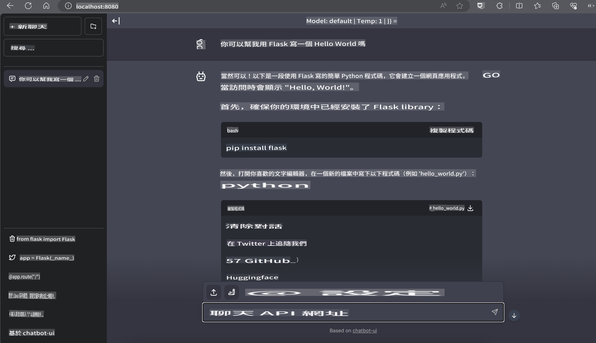

# **Inference Phi-3 e Nvidia Jetson**

Nvidia Jetson adalah rangkaian papan komputasi tertanam dari Nvidia. Model Jetson TK1, TX1, dan TX2 semuanya dilengkapi prosesor Tegra (atau SoC) dari Nvidia yang mengintegrasikan unit pemrosesan pusat (CPU) dengan arsitektur ARM. Jetson adalah sistem berdaya rendah yang dirancang untuk mempercepat aplikasi pembelajaran mesin. Nvidia Jetson digunakan oleh pengembang profesional untuk menciptakan produk AI terobosan di berbagai industri, serta oleh pelajar dan penggemar untuk pembelajaran AI langsung dan pembuatan proyek-proyek luar biasa. SLM diterapkan pada perangkat edge seperti Jetson, yang memungkinkan implementasi yang lebih baik untuk skenario aplikasi generatif AI industri.

## Penerapan di NVIDIA Jetson:
Pengembang yang bekerja pada robotika otonom dan perangkat tertanam dapat memanfaatkan Phi-3 Mini. Ukuran Phi-3 yang relatif kecil menjadikannya ideal untuk penerapan di perangkat edge. Parameter telah disetel dengan cermat selama pelatihan, memastikan akurasi tinggi dalam respons.

### Optimasi TensorRT-LLM:
[TensorRT-LLM library](https://github.com/NVIDIA/TensorRT-LLM?WT.mc_id=aiml-138114-kinfeylo) dari NVIDIA mengoptimalkan inferensi model bahasa besar. Library ini mendukung jendela konteks panjang Phi-3 Mini, meningkatkan throughput dan latensi. Optimasi mencakup teknik seperti LongRoPE, FP8, dan inflight batching.

### Ketersediaan dan Penerapan:
Pengembang dapat menjelajahi Phi-3 Mini dengan jendela konteks 128K di [NVIDIA's AI](https://www.nvidia.com/en-us/ai-data-science/generative-ai/). Model ini dikemas sebagai NVIDIA NIM, sebuah layanan mikro dengan API standar yang dapat diterapkan di mana saja. Selain itu, terdapat [implementasi TensorRT-LLM di GitHub](https://github.com/NVIDIA/TensorRT-LLM).

## **1. Persiapan**

a. Jetson Orin NX / Jetson NX

b. JetPack 5.1.2+

c. Cuda 11.8

d. Python 3.8+

## **2. Menjalankan Phi-3 di Jetson**

Kita dapat memilih [Ollama](https://ollama.com) atau [LlamaEdge](https://llamaedge.com).

Jika Anda ingin menggunakan gguf di cloud dan perangkat edge secara bersamaan, LlamaEdge dapat dipahami sebagai WasmEdge (WasmEdge adalah runtime WebAssembly yang ringan, berkinerja tinggi, dan dapat diskalakan, cocok untuk aplikasi cloud native, edge, dan terdesentralisasi. Runtime ini mendukung aplikasi tanpa server, fungsi tertanam, layanan mikro, kontrak pintar, dan perangkat IoT. Anda dapat menerapkan model kuantitatif gguf ke perangkat edge dan cloud melalui LlamaEdge).


Berikut adalah langkah-langkah penggunaannya:

1. Instal dan unduh pustaka serta file terkait

```bash

curl -sSf https://raw.githubusercontent.com/WasmEdge/WasmEdge/master/utils/install.sh | bash -s -- --plugin wasi_nn-ggml

curl -LO https://github.com/LlamaEdge/LlamaEdge/releases/latest/download/llama-api-server.wasm

curl -LO https://github.com/LlamaEdge/chatbot-ui/releases/latest/download/chatbot-ui.tar.gz

tar xzf chatbot-ui.tar.gz

```

**Catatan**: llama-api-server.wasm dan chatbot-ui harus berada di direktori yang sama.

2. Jalankan skrip di terminal

```bash

wasmedge --dir .:. --nn-preload default:GGML:AUTO:{Your gguf path} llama-api-server.wasm -p phi-3-chat

```

Berikut adalah hasil eksekusinya:



***Kode contoh*** [Phi-3 mini WASM Notebook Sample](https://github.com/Azure-Samples/Phi-3MiniSamples/tree/main/wasm)

Sebagai kesimpulan, Phi-3 Mini mewakili lompatan maju dalam pemodelan bahasa, menggabungkan efisiensi, kesadaran konteks, dan keunggulan optimasi dari NVIDIA. Apakah Anda sedang membangun robot atau aplikasi edge, Phi-3 Mini adalah alat yang sangat bermanfaat untuk diketahui.

It seems like "mo" could refer to a specific language or dialect, but it's not immediately clear which one you're referring to. Could you clarify which language or provide more context? For example, are you referring to Maori, Mongolian, or something else?