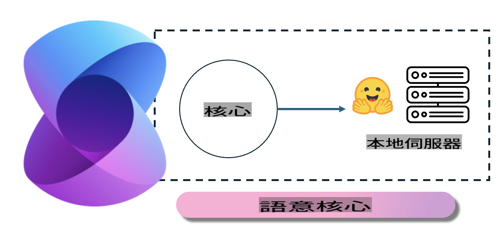
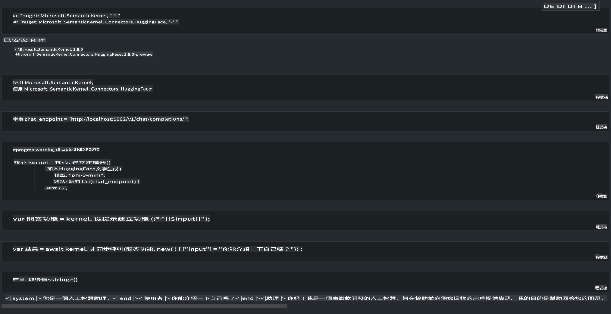

# **Phi-3-ийг Локал Серверт Ашиглах**

Phi-3-ийг локал сервер дээр байршуулж ажиллуулах боломжтой. Хэрэглэгчид [Ollama](https://ollama.com) эсвэл [LM Studio](https://llamaedge.com) шийдлүүдийг сонгож болохоос гадна өөрсдийн кодыг бичиж болно. Та Phi-3-ийн локал үйлчилгээнд [Semantic Kernel](https://github.com/microsoft/semantic-kernel?WT.mc_id=aiml-138114-kinfeylo) эсвэл [Langchain](https://www.langchain.com/) ашиглан холбогдож, Copilot програмууд бүтээх боломжтой.

## **Semantic Kernel ашиглан Phi-3-mini-д хандах**

Copilot програмд бид Semantic Kernel / LangChain ашиглан програмуудыг бүтээдэг. Энэ төрлийн програмын хүрээ нь ихэвчлэн Azure OpenAI Service / OpenAI загваруудтай нийцдэг бөгөөд Hugging Face-ийн нээлттэй эхийн загварууд болон локал загваруудыг ч дэмждэг. Харин бид Semantic Kernel ашиглан Phi-3-mini-д хандахыг хүсвэл яах вэ? .NET-ийг жишээ болгон авч үзвэл, Semantic Kernel дэх Hugging Face Connector-той хослуулж болно. Анхдагч байдлаар, энэ нь Hugging Face дээрх загварын id-тай тохирч ажилладаг (анх удаа ашиглах үед загварыг Hugging Face-ээс татаж авах тул удаан хугацаа шаардагдана). Мөн өөрийн бүтээсэн локал үйлчилгээнд холбогдох боломжтой. Хоёр хувилбарыг харьцуулахад, бид сүүлийнхийг илүү санал болгодог, учир нь энэ нь илүү өндөр түвшний бие даасан байдлыг хангадаг, ялангуяа байгууллагын програмуудад.

Дүрслэлээс харахад Semantic Kernel ашиглан локал үйлчилгээнд хандах нь өөрсдийн бүтээсэн Phi-3-mini загвар сервертэй амархан холбогдох боломжийг олгож байна. Энд ажиллуулсан үр дүнг үзүүлэв:

***Жишээ Код*** https://github.com/kinfey/Phi3MiniSamples/tree/main/semantickernel

It seems like "mo" might refer to a specific language or abbreviation, but it is not clear which one you mean. Could you clarify or provide more context about what "mo" stands for? For example, it could refer to Maori, Montenegrin, or another language. Let me know, and I'll be happy to assist!