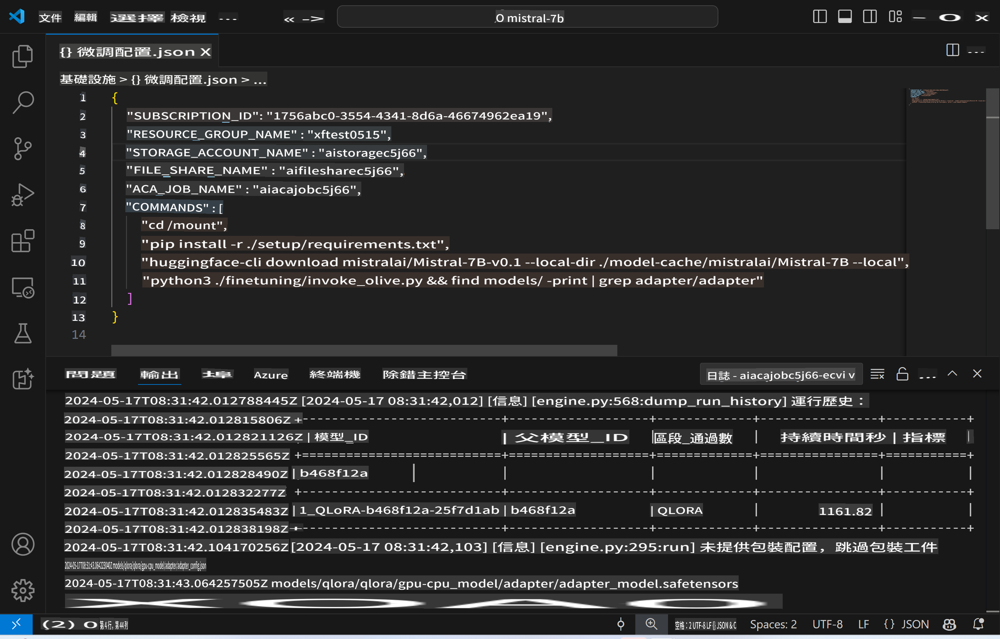
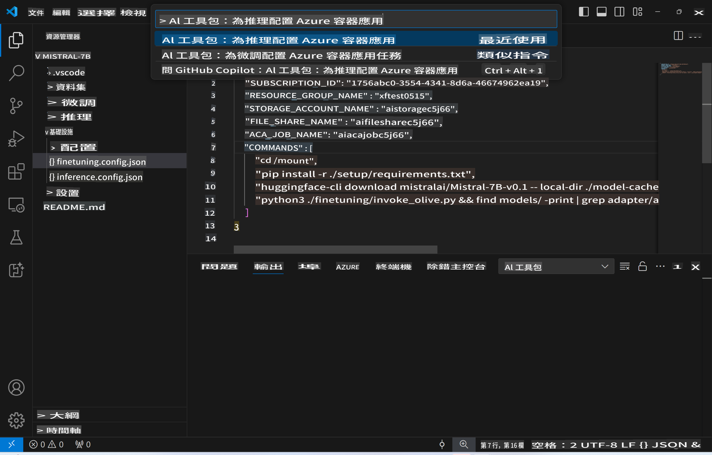
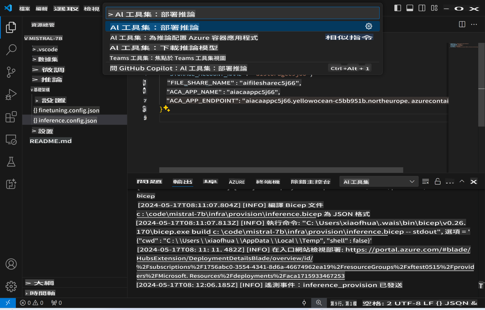
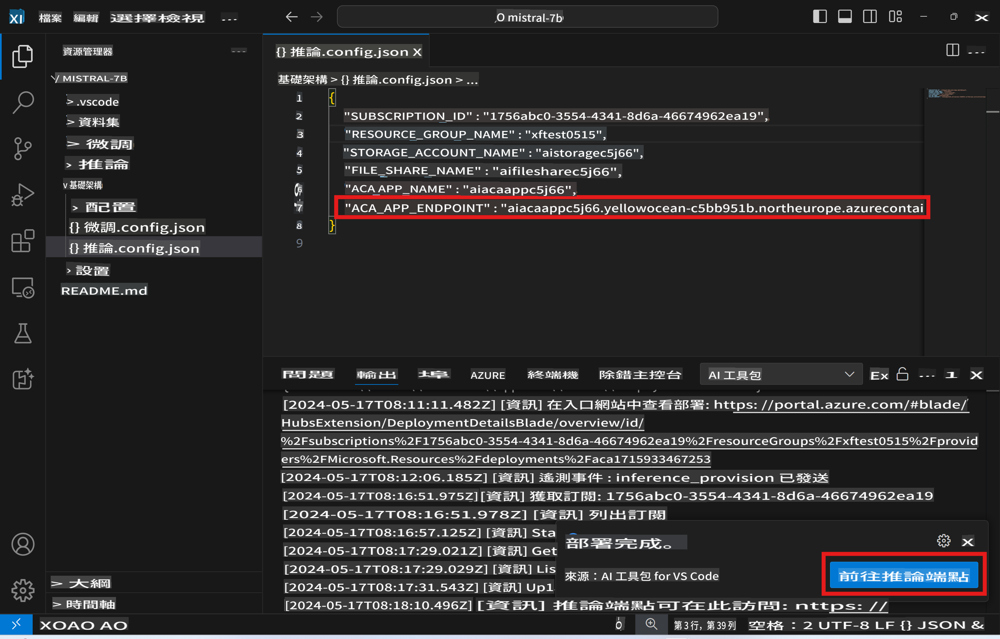

# Inferensiya daura remaot ke saath fine-tuned model

Jab adapters ko remaot environment mein train kar liya jaye, to ek simple Gradio application ka istemal karke model ke saath interact kar sakte hain.



### Azure Resources ka tayari karna
Remote inference ke liye Azure Resources setup karne ke liye, command palette se `AI Toolkit: Provision Azure Container Apps for inference` execute karein. Is setup ke dauraan, aapko apni Azure Subscription aur resource group ko select karne ke liye kaha jayega.  


Default ke taur par, inference ke liye subscription aur resource group wahi hone chahiye jo fine-tuning ke liye use kiye gaye the. Inference ke liye wahi Azure Container App Environment use hoga aur model aur model adapter ko Azure Files se access karega, jo fine-tuning ke step ke dauraan generate hua tha.

## AI Toolkit ka istemal

### Inference ke liye Deployment  
Agar aap inference code ko revise karna chahte hain ya inference model ko reload karna chahte hain, to `AI Toolkit: Deploy for inference` command execute karein. Ye command aapke latest code ko ACA ke saath synchronize karega aur replica ko restart karega.



Deployment ke safal hone ke baad, model evaluation ke liye endpoint par tayar hai.

### Inference API tak pahunchna

Aap inference API ko VSCode notification mein dikhayi dene wale "*Go to Inference Endpoint*" button par click karke access kar sakte hain. Vikalp roop se, web API endpoint `ACA_APP_ENDPOINT` mein `./infra/inference.config.json` aur output panel mein mil sakta hai.



> **Note:** Inference endpoint ko fully operational hone mein kuch minute lag sakte hain.

## Template mein shaamil inference components

| Folder | Samagri |
| ------ |--------- |
| `infra` | Remote operations ke liye zaroori sabhi configurations ko rakhta hai. |
| `infra/provision/inference.parameters.json` | Bicep templates ke parameters rakhta hai, jo Azure resources ke provisioning ke liye use hote hain. |
| `infra/provision/inference.bicep` | Azure resources ke provisioning ke liye templates ko rakhta hai. |
| `infra/inference.config.json` | Configuration file, jo `AI Toolkit: Provision Azure Container Apps for inference` command ke dwara generate hota hai. Ye anya remote command palettes ke liye input ke roop mein use hota hai. |

### Azure Resource Provision ko configure karne ke liye AI Toolkit ka istemal
[AI Toolkit](https://marketplace.visualstudio.com/items?itemName=ms-windows-ai-studio.windows-ai-studio) ko configure karein.

Inference ke liye Azure Container Apps ko provision karein ` command.

You can find configuration parameters in `./infra/provision/inference.parameters.json` file. Here are the details:
| Parameter | Description |
| --------- |------------ |
| `defaultCommands` | This is the commands to initiate a web API. |
| `maximumInstanceCount` | This parameter sets the maximum capacity of GPU instances. |
| `location` | This is the location where Azure resources are provisioned. The default value is the same as the chosen resource group's location. |
| `storageAccountName`, `fileShareName` `acaEnvironmentName`, `acaEnvironmentStorageName`, `acaAppName`,  `acaLogAnalyticsName` | These parameters are used to name the Azure resources for provision. By default, they will be same to the fine-tuning resource name. You can input a new, unused resource name to create your own custom-named resources, or you can input the name of an already existing Azure resource if you'd prefer to use that. For details, refer to the section [Using existing Azure Resources](../../../../../md/01.Introduction/03). |

### Using Existing Azure Resources

By default, the inference provision use the same Azure Container App Environment, Storage Account, Azure File Share, and Azure Log Analytics that were used for fine-tuning. A separate Azure Container App is created solely for the inference API. 

If you have customized the Azure resources during the fine-tuning step or want to use your own existing Azure resources for inference, specify their names in the `./infra/inference.parameters.json` file. Phir, command palette se `AI Toolkit: Provision Azure Container Apps for inference` command run karein. Ye kisi bhi specified resources ko update karega aur missing resources ko create karega.

Udaharan ke taur par, agar aapke paas ek existing Azure container environment hai, to aapka `./infra/finetuning.parameters.json` kuch is prakar dikhega:

```json
{
    "$schema": "https://schema.management.azure.com/schemas/2019-04-01/deploymentParameters.json#",
    "contentVersion": "1.0.0.0",
    "parameters": {
      ...
      "acaEnvironmentName": {
        "value": "<your-aca-env-name>"
      },
      "acaEnvironmentStorageName": {
        "value": null
      },
      ...
    }
  }
```

### Manual Provision  
Agar aap Azure resources ko manually configure karna pasand karte hain, to aap `./infra/provision` folders. If you have already set up and configured all the Azure resources without using the AI Toolkit command palette, you can simply enter the resource names in the `inference.config.json` file mein diye gaye bicep files ka use kar sakte hain.

Udaharan ke taur par:

```json
{
  "SUBSCRIPTION_ID": "<your-subscription-id>",
  "RESOURCE_GROUP_NAME": "<your-resource-group-name>",
  "STORAGE_ACCOUNT_NAME": "<your-storage-account-name>",
  "FILE_SHARE_NAME": "<your-file-share-name>",
  "ACA_APP_NAME": "<your-aca-name>",
  "ACA_APP_ENDPOINT": "<your-aca-endpoint>"
}
```

It seems like "mo" might refer to a specific language or abbreviation, but it's not clear which one you're referring to. Could you clarify or provide more context about the language or format you need the text translated into?