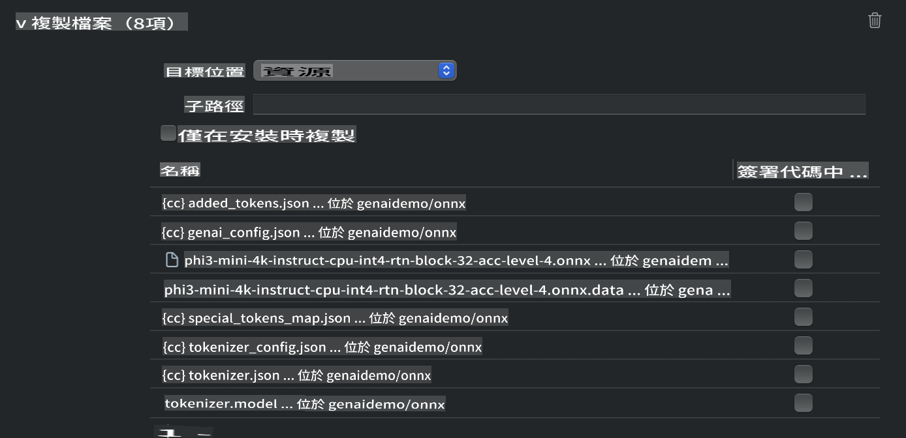
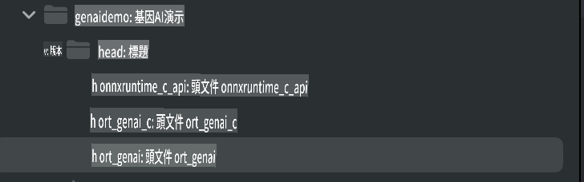
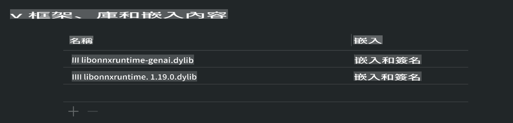
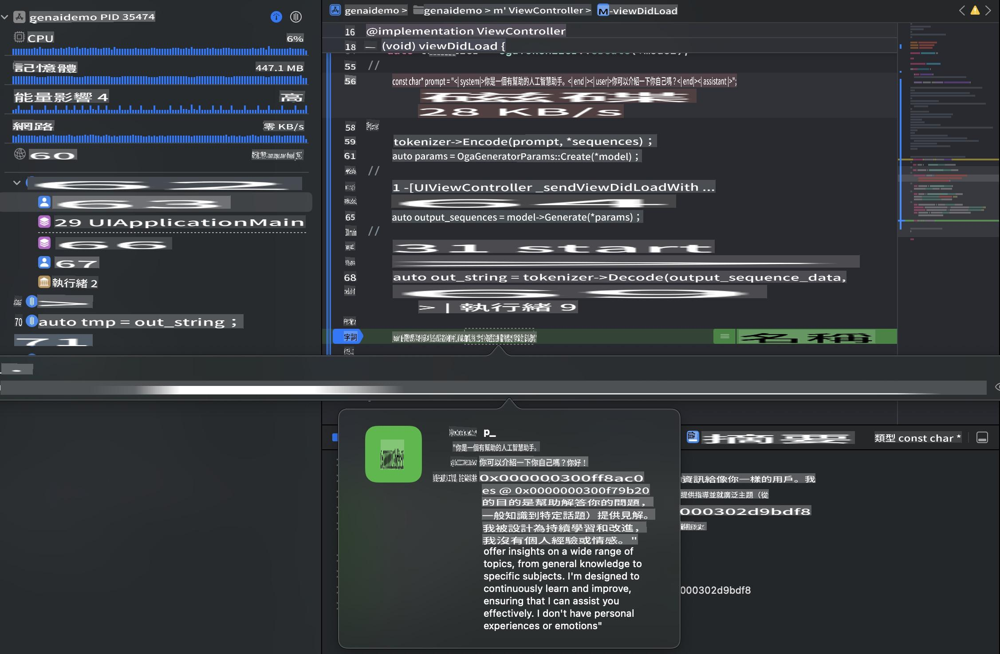

# **Inference Phi-3 in iOS**

Phi-3-mini هو سلسلة جديدة من النماذج التي أطلقتها مايكروسوفت، والتي تتيح نشر نماذج اللغة الكبيرة (LLMs) على الأجهزة الطرفية وأجهزة إنترنت الأشياء. Phi-3-mini متاح لنظام iOS، Android، ونشر الأجهزة الطرفية، مما يتيح نشر الذكاء الاصطناعي التوليدي في بيئات الأجهزة الشخصية (BYOD). يوضح المثال التالي كيفية نشر Phi-3-mini على iOS.

## **1. التحضير**

- **a.** macOS 14 أو أحدث  
- **b.** Xcode 15 أو أحدث  
- **c.** iOS SDK 17.x (iPhone 14 A16 أو أعلى)  
- **d.** تثبيت Python 3.10 أو أحدث (يُفضل Conda)  
- **e.** تثبيت مكتبة Python: `python-flatbuffers`  
- **f.** تثبيت CMake  

### Semantic Kernel والاستدلال

Semantic Kernel هو إطار عمل تطبيقات يسمح لك بإنشاء تطبيقات متوافقة مع Azure OpenAI Service، ونماذج OpenAI، وحتى النماذج المحلية. الوصول إلى الخدمات المحلية عبر Semantic Kernel يُسهّل التكامل مع خادم نموذج Phi-3-mini المستضاف محليًا.

### استدعاء النماذج المضغوطة باستخدام Ollama أو LlamaEdge

يفضل العديد من المستخدمين استخدام النماذج المضغوطة لتشغيل النماذج محليًا. [Ollama](https://ollama.com) و[LlamaEdge](https://llamaedge.com) يتيحان للمستخدمين استدعاء نماذج مضغوطة مختلفة:

#### **Ollama**

يمكنك تشغيل `ollama run phi3` مباشرة أو تكوينه في وضع عدم الاتصال. قم بإنشاء ملف نموذج يحتوي على المسار إلى ملف `gguf` الخاص بك. مثال على الكود لتشغيل نموذج Phi-3-mini المضغوط:

```gguf
FROM {Add your gguf file path}
TEMPLATE \"\"\"<|user|> .Prompt<|end|> <|assistant|>\"\"\"
PARAMETER stop <|end|>
PARAMETER num_ctx 4096
```

#### **LlamaEdge**

إذا كنت ترغب في استخدام `gguf` على كل من السحابة والأجهزة الطرفية في نفس الوقت، فإن LlamaEdge خيار رائع.

## **2. ترجمة ONNX Runtime لنظام iOS**

```bash

git clone https://github.com/microsoft/onnxruntime.git

cd onnxruntime

./build.sh --build_shared_lib --ios --skip_tests --parallel --build_dir ./build_ios --ios --apple_sysroot iphoneos --osx_arch arm64 --apple_deploy_target 17.5 --cmake_generator Xcode --config Release

cd ../

```

### **ملاحظة**

- **a.** قبل الترجمة، تأكد من تكوين Xcode بشكل صحيح وتعيينه كدليل المطور النشط في الطرفية:

    ```bash
    sudo xcode-select -switch /Applications/Xcode.app/Contents/Developer
    ```

- **b.** يجب ترجمة ONNX Runtime لمنصات مختلفة. بالنسبة لنظام iOS، يمكنك الترجمة لـ `arm64` or `x86_64`.

- **c.** يُوصى باستخدام أحدث إصدار من iOS SDK للترجمة. ومع ذلك، يمكنك استخدام إصدار أقدم إذا كنت بحاجة إلى التوافق مع SDKs السابقة.

## **3. ترجمة الذكاء الاصطناعي التوليدي باستخدام ONNX Runtime لنظام iOS**

> **ملاحظة:** نظرًا لأن الذكاء الاصطناعي التوليدي باستخدام ONNX Runtime في وضع المعاينة، يرجى الانتباه إلى التغييرات المحتملة.

```bash

git clone https://github.com/microsoft/onnxruntime-genai
 
cd onnxruntime-genai
 
mkdir ort
 
cd ort
 
mkdir include
 
mkdir lib
 
cd ../
 
cp ../onnxruntime/include/onnxruntime/core/session/onnxruntime_c_api.h ort/include
 
cp ../onnxruntime/build_ios/Release/Release-iphoneos/libonnxruntime*.dylib* ort/lib
 
export OPENCV_SKIP_XCODEBUILD_FORCE_TRYCOMPILE_DEBUG=1
 
python3 build.py --parallel --build_dir ./build_ios --ios --ios_sysroot iphoneos --ios_arch arm64 --ios_deployment_target 17.5 --cmake_generator Xcode --cmake_extra_defines CMAKE_XCODE_ATTRIBUTE_CODE_SIGNING_ALLOWED=NO

```

## **4. إنشاء تطبيق App في Xcode**

اخترت Objective-C كطريقة لتطوير التطبيق، لأن استخدام الذكاء الاصطناعي التوليدي مع ONNX Runtime C++ API يجعل التوافق مع Objective-C أفضل. بالطبع، يمكنك أيضًا إكمال الاستدعاءات ذات الصلة من خلال Swift bridging.


## **5. نسخ نموذج ONNX المضغوط INT4 إلى مشروع تطبيق App**

نحتاج إلى استيراد نموذج INT4 المضغوط بصيغة ONNX، والذي يجب تنزيله أولاً.


بعد التنزيل، تحتاج إلى إضافته إلى دليل Resources الخاص بالمشروع في Xcode.



## **6. إضافة C++ API في ViewControllers**

> **ملاحظة:**

- **a.** أضف ملفات الرأس C++ المقابلة إلى المشروع.

  

- **b.** قم بتضمين `onnxruntime-genai` dynamic library in Xcode.

  

- **c.** Use the C Samples code for testing. You can also add additional features like ChatUI for more functionality.

- **d.** Since you need to use C++ in your project, rename `ViewController.m` to `ViewController.mm` لتمكين دعم Objective-C++.

```objc

    NSString *llmPath = [[NSBundle mainBundle] resourcePath];
    char const *modelPath = llmPath.cString;

    auto model =  OgaModel::Create(modelPath);

    auto tokenizer = OgaTokenizer::Create(*model);

    const char* prompt = "<|system|>You are a helpful AI assistant.<|end|><|user|>Can you introduce yourself?<|end|><|assistant|>";

    auto sequences = OgaSequences::Create();
    tokenizer->Encode(prompt, *sequences);

    auto params = OgaGeneratorParams::Create(*model);
    params->SetSearchOption("max_length", 100);
    params->SetInputSequences(*sequences);

    auto output_sequences = model->Generate(*params);
    const auto output_sequence_length = output_sequences->SequenceCount(0);
    const auto* output_sequence_data = output_sequences->SequenceData(0);
    auto out_string = tokenizer->Decode(output_sequence_data, output_sequence_length);
    
    auto tmp = out_string;

```

## **7. تشغيل التطبيق**

بمجرد اكتمال الإعداد، يمكنك تشغيل التطبيق لرؤية نتائج استدلال نموذج Phi-3-mini.



للحصول على المزيد من عينات الكود والتعليمات التفصيلية، قم بزيارة [مستودع عينات Phi-3 Mini](https://github.com/Azure-Samples/Phi-3MiniSamples/tree/main/ios).

It seems you may be referring to "mo," but could you clarify what you mean by "mo"? Are you referring to a specific language, dialect, or code? For example, do you mean Maori, Mongolian, or something else? Let me know, and I'll be happy to assist!