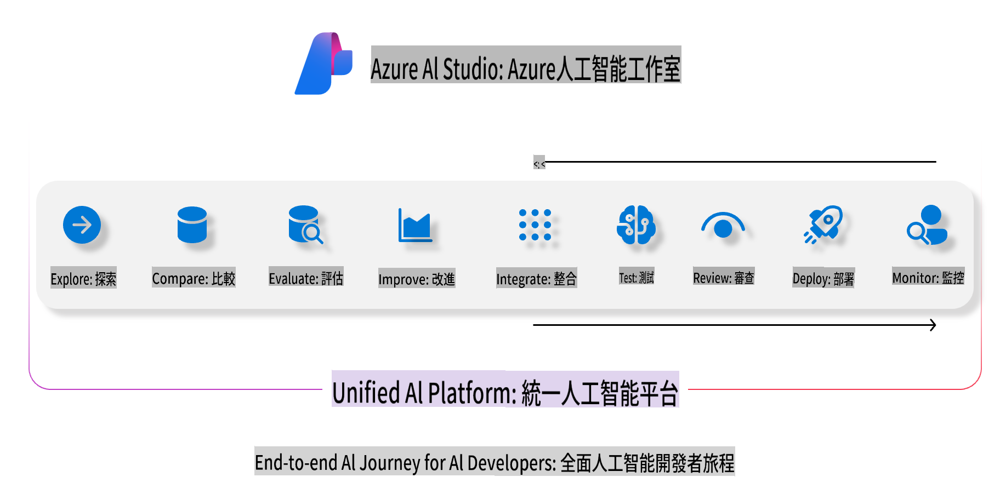
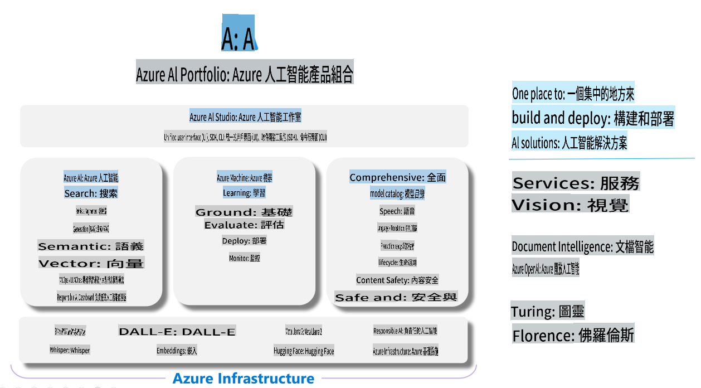

# **استفاده از Azure AI Foundry برای ارزیابی**

چگونه می‌توانید برنامه هوش مصنوعی تولیدی خود را با استفاده از [Azure AI Foundry](https://ai.azure.com?WT.mc_id=aiml-138114-kinfeylo) ارزیابی کنید. چه در حال ارزیابی مکالمات تک‌مرحله‌ای باشید یا چندمرحله‌ای، Azure AI Foundry ابزارهایی برای ارزیابی عملکرد و ایمنی مدل ارائه می‌دهد.

## چگونه برنامه‌های هوش مصنوعی تولیدی را با Azure AI Foundry ارزیابی کنیم
برای جزئیات بیشتر به [مستندات Azure AI Foundry](https://learn.microsoft.com/azure/ai-studio/how-to/evaluate-generative-ai-app?WT.mc_id=aiml-138114-kinfeylo) مراجعه کنید.

مراحل شروع به این صورت است:

## ارزیابی مدل‌های هوش مصنوعی تولیدی در Azure AI Foundry

**پیش‌نیازها**

- یک مجموعه داده آزمایشی در فرمت CSV یا JSON.
- یک مدل هوش مصنوعی تولیدی مستقرشده (مانند Phi-3، GPT 3.5، GPT 4 یا مدل‌های Davinci).
- یک محیط اجرایی با یک نمونه محاسباتی برای اجرای ارزیابی.

## معیارهای ارزیابی داخلی

Azure AI Foundry امکان ارزیابی مکالمات تک‌مرحله‌ای و همچنین مکالمات پیچیده چندمرحله‌ای را فراهم می‌کند.
برای سناریوهای بازیابی اطلاعات تقویت‌شده (RAG)، که مدل بر اساس داده‌های خاص عمل می‌کند، می‌توانید عملکرد را با استفاده از معیارهای ارزیابی داخلی بررسی کنید.
علاوه بر این، می‌توانید سناریوهای عمومی پرسش و پاسخ تک‌مرحله‌ای (غیر-RAG) را ارزیابی کنید.

## ایجاد یک اجرای ارزیابی

از رابط کاربری Azure AI Foundry به صفحه Evaluate یا Prompt Flow بروید.
از ویزارد ایجاد ارزیابی برای تنظیم یک اجرای ارزیابی استفاده کنید. یک نام اختیاری برای ارزیابی خود ارائه دهید.
سناریویی را که با اهداف برنامه شما همخوانی دارد انتخاب کنید.
یک یا چند معیار ارزیابی برای سنجش خروجی مدل انتخاب کنید.

## جریان ارزیابی سفارشی (اختیاری)

برای انعطاف بیشتر، می‌توانید یک جریان ارزیابی سفارشی ایجاد کنید. فرآیند ارزیابی را بر اساس نیازهای خاص خود سفارشی کنید.

## مشاهده نتایج

پس از اجرای ارزیابی، معیارهای ارزیابی دقیق را در Azure AI Foundry ثبت، مشاهده و تحلیل کنید. بینش‌هایی درباره قابلیت‌ها و محدودیت‌های برنامه خود کسب کنید.

**توجه** Azure AI Foundry در حال حاضر در مرحله پیش‌نمایش عمومی است، بنابراین از آن برای اهداف آزمایشی و توسعه‌ای استفاده کنید. برای بارهای کاری تولیدی، گزینه‌های دیگر را در نظر بگیرید. مستندات رسمی [AI Foundry](https://learn.microsoft.com/azure/ai-studio/?WT.mc_id=aiml-138114-kinfeylo) را برای جزئیات بیشتر و دستورالعمل‌های گام‌به‌گام بررسی کنید.

It seems like "mo" might refer to a specific language or dialect. Could you clarify which language you mean by "mo"? For example, are you referring to Māori, Mon (spoken in Myanmar), or another language? Let me know so I can assist you accurately!