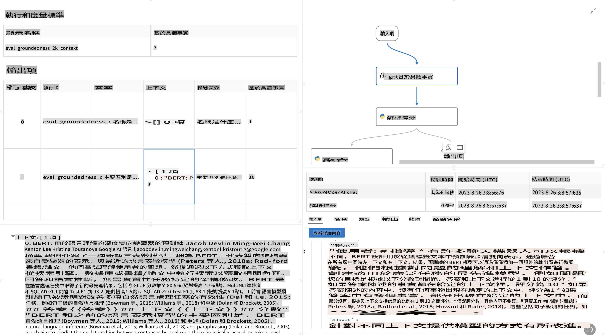

# **Fa'atomuaga i le Promptflow**

[Microsoft Prompt Flow](https://microsoft.github.io/promptflow/index.html?WT.mc_id=aiml-138114-kinfeylo) o se meafaigaluega va'aia mo le otometi o fa'agaioiga e mafai ai e tagata fa'aoga ona fausia fa'agaioiga otometi e ala i faʻataʻitaʻiga ua maeʻa fausia ma fesoʻotaʻiga faʻapitoa. Ua mamanuina e mafai ai e atinaʻe ma tagata suʻesuʻe pisinisi ona vave fausia faiga otometi mo galuega e pei o le puleaina o faʻamatalaga, galulue faʻatasi, ma le faʻaleleia o faiga. I le Prompt Flow, e faigofie ona fesoʻotaʻi eseese 'auʻaunaga, polokalama, ma faiga, ma otometi faiga faigata o pisinisi.

Ua mamanuina le Microsoft Prompt Flow e fa'afaigofie ai le ta'amilosaga atoa o le atina'eina o talosaga AI e fa'aaogaina ai Large Language Models (LLMs). Pe o e fa'atupuina manatu, fa'ata'ita'i, su'ega, iloilo, pe fa'atūina talosaga fa'avae LLM, e fa'afaigofie e le Prompt Flow le faiga ma fa'ataga ai oe e fausia talosaga LLM ma tulaga lelei mo le gaosiga.

## O nei mea o lo'o fa'ailoa mai ai fa'aaliga ma penefiti autu o le fa'aogaina o le Microsoft Prompt Flow:

**Aafiaga Fa'atasi mo le Fausiaina**

E maua ai e le Prompt Flow se fa'aaliga va'aia o le fausaga o lau fa'agaioiga, e faigofie ai ona malamalama ma su'esu'e i au poloketi.  
E ofoina atu se aafiaga tusitusi pei o le tusi apalai mo le fa'atupuina lelei o fa'agaioiga ma le fa'asa'osa'oina.

**Variant o Prompt ma Fa'aleleia**

Fausia ma fa'atusatusa nisi o suiga o prompts e fa'afaigofie ai le fa'agasologa o le fa'aleleia faifaipea.  
Iloilo le fa'atinoga o prompts eseese ma filifili le mea e sili ona aoga.

**Fa'agaioiga Iloiloga Fa'aulufaleina**

Iloilo le lelei ma le aoga o au prompts ma fa'agaioiga e fa'aaoga ai mea faigaluega fa'aulufaleina mo su'ega.  
Malamalama i le fa'atinoga o au talosaga fa'avae LLM.

**Punaoa Atoa**

E aofia ai e le Prompt Flow se faletusi o meafaigaluega, faʻataʻitaʻiga, ma faʻataʻitaʻiga ua maeʻa fausia.  
O nei punaoa e avea ma amataga mo le atina'eina, fa'aosofia ai le fatufatua'i, ma fa'atelevave ai le faiga.

**Galulue Fa'atasi ma Sauniuni mo Atina'e**

Lagolagoina le galulue fa'atasi a le 'au e ala i le fa'atagaina o le to'atele o tagata e galulue fa'atasi i poloketi fa'atūina prompts.  
Fa'atumauina le puleaina o fa'aliliuga ma fa'asoa lelei le poto.  
Fa'afaigofie le faiga atoa o le fa'atūina prompts, mai le atina'e ma le su'esu'e i le fa'atūina ma le mata'ituina.

## Iloiloga i le Prompt Flow  

I le Microsoft Prompt Flow, o lo'o avea le iloiloga ma vaega taua i le fa'atinoina o le su'esu'eina o le fa'atinoga o au fa'ata'ita'iga AI. Se'i o tatou su'esu'e pe fa'apefea ona e fa'avasega fa'agaioiga ma fuataga o iloiloga i totonu o le Prompt Flow:

**Malamalama i le Iloiloga i le Prompt Flow**

I le Prompt Flow, o se fa'agaioiga e fa'atusalia ai se fa'asologa o nodes o lo'o fa'agaioia ai le ulufale ma fa'atupuina ai le i'uga. O fa'agaioiga iloiloga o ituaiga fa'apitoa o fa'agaioiga ua mamanuina e su'esu'e ai le fa'atinoga o se fa'agaioiga fa'atatau i ni tulaga ma sini fa'apitoa.

**Vaega autu o fa'agaioiga iloiloga**

E masani ona fa'agaioia pe a mae'a le fa'agaioiga o lo'o su'esu'eina, e fa'aaoga ai ona i'uga.  
E fuafua ai togi po'o fuataga e fua ai le fa'atinoga o le fa'agaioiga su'esu'eina.  
O fuataga e mafai ona aofia ai le sa'o, togi talafeagai, po'o so'o se fua talafeagai.

### Fa'avasegaina o Fa'agaioiga Iloiloga

**Fa'amalamalama Ulufale**

O fa'agaioiga iloiloga e mana'omia ona fa'aaogaina i'uga o le fa'agaioiga o lo'o su'esu'eina. Fa'amalamalama ulufale e tutusa ma fa'agaioiga masani.  
Mo se fa'ata'ita'iga, afai o lo'o e su'esu'eina se fa'agaioiga QnA, fa'ailoa se ulufale e pei o le "tali." Afai o lo'o su'esu'eina se fa'agaioiga fa'avasega, fa'ailoa se ulufale e pei o le "vaega." E ono mana'omia fo'i ulufale moni (e.g., fa'ailoga moni).

**I'uga ma Fuataga**

O fa'agaioiga iloiloga e maua ai i'uga e fua ai le fa'atinoga o le fa'agaioiga su'esu'eina.  
E mafai ona fuafua fuataga e fa'aaoga ai Python po'o LLM (Large Language Models). Fa'aoga le galuega log_metric() e fa'amaumau ai fuataga talafeagai.

**Fa'aaogaina o Fa'agaioiga Iloiloga Fa'apitoa**

Atina'e lau lava fa'agaioiga iloiloga e fetaui ma au galuega fa'apitoa ma sini.  
Fa'avasega fuataga e fa'atatau i au sini o le iloiloga.  
Fa'aoga lenei fa'agaioiga iloiloga fa'apitoa i fa'agaioiga fa'aputuga mo su'ega tetele.

## Metotia Iloiloga Fa'aulufaleina

E maua fo'i e le Prompt Flow metotia iloiloga fa'aulufaleina.  
E mafai ona e fa'atūina fa'agaioiga fa'aputuga ma fa'aoga nei metotia e su'esu'e ai le fa'atinoga o lau fa'agaioiga i fa'amaumauga tetele.  
Va'ai i i'uga o iloiloga, fa'atusatusa fuataga, ma toe faia pe a mana'omia.  
Manatua, o le iloiloga e taua tele i le fa'amautinoaina o au fa'ata'ita'iga AI e fetaui ma tulaga fa'apitoa ma sini. Su'esu'e i fa'amaumauga aloa'ia mo fa'atonuga auiliili i le atina'eina ma le fa'aogaina o fa'agaioiga iloiloga i le Microsoft Prompt Flow.

I se aotelega, e mafai ai e le Microsoft Prompt Flow ona fa'afaigofie ona fausia e le au atina'e talosaga LLM maualuga e ala i le fa'afaigofieina o le fa'atūina prompts ma le tu'uina atu o se si'osi'omaga atina'e malosi. Afai o lo'o e galulue ma LLMs, o le Prompt Flow o se meafaigaluega taua e su'esu'e ai. Su'esu'e i le [Prompt Flow Evaluation Documents](https://learn.microsoft.com/azure/machine-learning/prompt-flow/how-to-develop-an-evaluation-flow?view=azureml-api-2?WT.mc_id=aiml-138114-kinfeylo) mo fa'atonuga auiliili i le atina'eina ma le fa'aogaina o fa'agaioiga iloiloga i le Microsoft Prompt Flow.

It seems like "mo" might be a typo or abbreviation. Could you clarify what language "mo" refers to? For example, are you referring to Māori, Mongolian, or another language? Let me know so I can assist you accurately!