# Fine-tune sareng Integrasi Modél Phi-3 Kustom sareng Prompt Flow

Conto tungtung-ka-tungtung (E2E) ieu dumasar kana pituduh "[Fine-Tune and Integrate Custom Phi-3 Models with Prompt Flow: Step-by-Step Guide](https://techcommunity.microsoft.com/t5/educator-developer-blog/fine-tune-and-integrate-custom-phi-3-models-with-prompt-flow/ba-p/4178612?WT.mc_id=aiml-137032-kinfeylo)" tina Microsoft Tech Community. Ieu ngenalkeun prosés pikeun ngaluyukeun, nyebarkeun, sareng ngahijikeun modél Phi-3 kustom nganggo Prompt Flow.

## Gambaran Umum

Dina conto E2E ieu, anjeun bakal diajar kumaha ngaluyukeun modél Phi-3 sareng ngahijikeunana sareng Prompt Flow. Ku ngamangpaatkeun Azure Machine Learning sareng Prompt Flow, anjeun bakal nyiptakeun alur kerja pikeun nyebarkeun sareng ngagunakeun modél AI kustom. Conto E2E ieu dibagi kana tilu skenario:

**Skenario 1: Nyetél sumber daya Azure sareng Nyiapkeun pikeun ngaluyukeun**

**Skenario 2: Ngaluyukeun modél Phi-3 sareng Nyebarkeun dina Azure Machine Learning Studio**

**Skenario 3: Ngahijikeun sareng Prompt Flow sareng Ngobrol nganggo modél kustom anjeun**

Di handap ieu ringkesan conto E2E ieu.

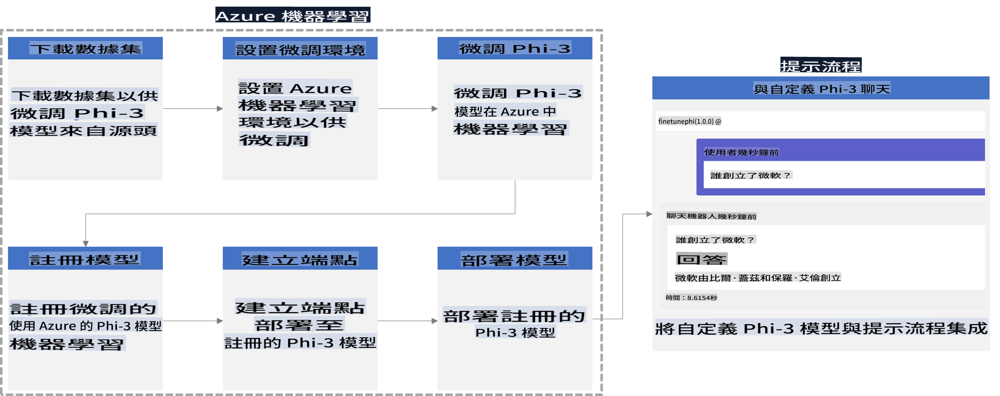

### Daftar Eusi

1. **[Skenario 1: Nyetél sumber daya Azure sareng Nyiapkeun pikeun ngaluyukeun](../../../../../../md/02.Application/01.TextAndChat/Phi3)**
    - [Ngadamel Azure Machine Learning Workspace](../../../../../../md/02.Application/01.TextAndChat/Phi3)
    - [Menta kuota GPU dina Langganan Azure](../../../../../../md/02.Application/01.TextAndChat/Phi3)
    - [Nambihan peran](../../../../../../md/02.Application/01.TextAndChat/Phi3)
    - [Nyetél proyék](../../../../../../md/02.Application/01.TextAndChat/Phi3)
    - [Nyiapkeun dataset pikeun ngaluyukeun](../../../../../../md/02.Application/01.TextAndChat/Phi3)

1. **[Skenario 2: Ngaluyukeun modél Phi-3 sareng Nyebarkeun dina Azure Machine Learning Studio](../../../../../../md/02.Application/01.TextAndChat/Phi3)**
    - [Nyetél Azure CLI](../../../../../../md/02.Application/01.TextAndChat/Phi3)
    - [Ngaluyukeun modél Phi-3](../../../../../../md/02.Application/01.TextAndChat/Phi3)
    - [Nyebarkeun modél anu parantos diluyukeun](../../../../../../md/02.Application/01.TextAndChat/Phi3)

1. **[Skenario 3: Ngahijikeun sareng Prompt Flow sareng Ngobrol nganggo modél kustom anjeun](../../../../../../md/02.Application/01.TextAndChat/Phi3)**
    - [Ngahijikeun modél Phi-3 kustom sareng Prompt Flow](../../../../../../md/02.Application/01.TextAndChat/Phi3)
    - [Ngobrol nganggo modél kustom anjeun](../../../../../../md/02.Application/01.TextAndChat/Phi3)

## Skenario 1: Nyetél sumber daya Azure sareng Nyiapkeun pikeun ngaluyukeun

### Ngadamel Azure Machine Learning Workspace

1. Tipe *azure machine learning* dina **bar pilarian** di luhur halaman portal sareng pilih **Azure Machine Learning** tina pilihan anu muncul.

    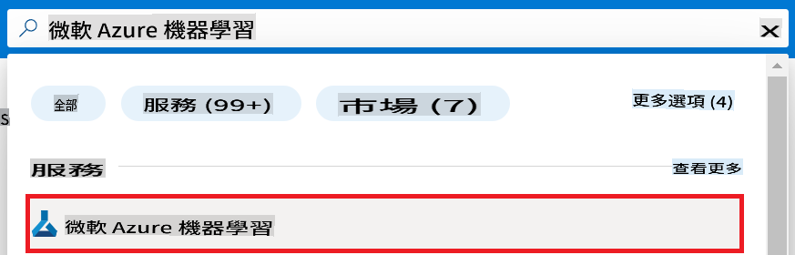

1. Pilih **+ Create** tina ménu navigasi.

1. Pilih **New workspace** tina ménu navigasi.

    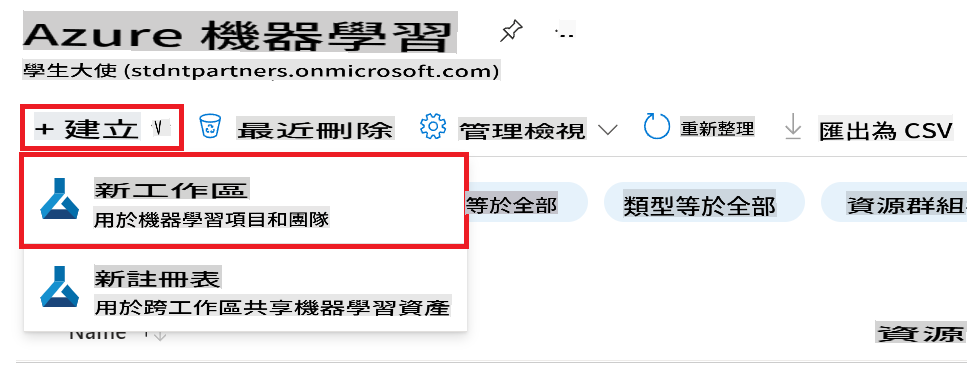

1. Laksanakeun tugas-tugas ieu:

    - Pilih **Langganan Azure** anjeun.
    - Pilih **Kelompok sumber daya** pikeun dianggo (damel anu anyar upami diperyogikeun).
    - Lebetkeun **Nami Workspace**. Éta kedah unik.
    - Pilih **Wewengkon** anu anjeun pikahoyong.
    - Pilih **Akun panyimpenan** pikeun dianggo (damel anu anyar upami diperyogikeun).
    - Pilih **Key vault** pikeun dianggo (damel anu anyar upami diperyogikeun).
    - Pilih **Aplikasi insights** pikeun dianggo (damel anu anyar upami diperyogikeun).
    - Pilih **Registri kontainer** pikeun dianggo (damel anu anyar upami diperyogikeun).

    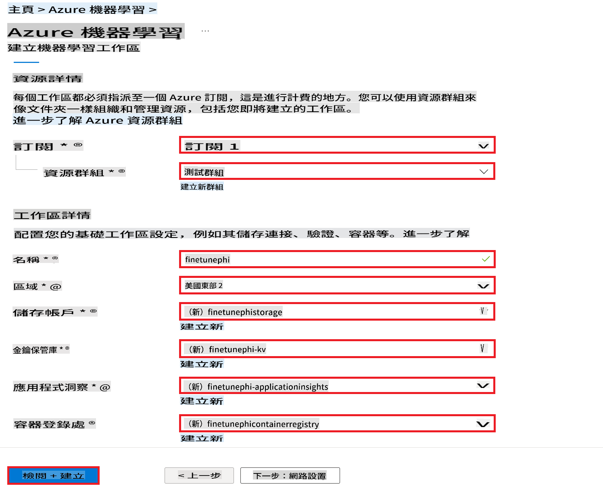

1. Pilih **Review + Create**.

1. Pilih **Create**.

### Menta kuota GPU dina Langganan Azure

Dina conto E2E ieu, anjeun bakal nganggo *Standard_NC24ads_A100_v4 GPU* pikeun ngaluyukeun, anu meryogikeun pamundut kuota, sareng *Standard_E4s_v3 CPU* pikeun penyebaran, anu henteu meryogikeun pamundut kuota.

> [!NOTE]
>
> Ngan Langganan Pay-As-You-Go (jenis langganan standar) anu layak pikeun alokasi GPU; langganan kauntungan ayeuna teu didukung.
>
> Kanggo anu nganggo langganan kauntungan (sapertos Visual Studio Enterprise Subscription) atanapi anu hoyong gancang nguji prosés ngaluyukeun sareng nyebarkeun, tutorial ieu ogé nyayogikeun pituduh pikeun ngaluyukeun nganggo dataset minimal nganggo CPU. Nanging, penting pikeun dicatet yén hasil ngaluyukeun langkung saé nalika nganggo GPU sareng dataset anu langkung ageung.

1. Buka [Azure ML Studio](https://ml.azure.com/home?wt.mc_id=studentamb_279723).

1. Laksanakeun tugas-tugas ieu pikeun menta kuota *Standard NCADSA100v4 Family*:

    - Pilih **Quota** tina tab sisi kénca.
    - Pilih **Virtual machine family** pikeun dianggo. Contona, pilih **Standard NCADSA100v4 Family Cluster Dedicated vCPUs**, anu kalebet *Standard_NC24ads_A100_v4 GPU*.
    - Pilih **Request quota** tina ménu navigasi.

        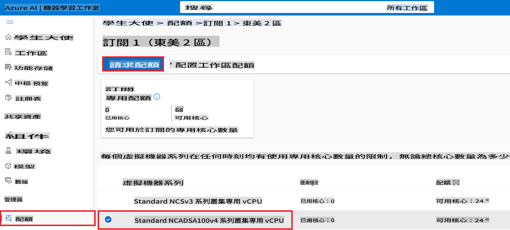

    - Dina halaman Request quota, lebetkeun **New cores limit** anu anjeun pikahoyong. Contona, 24.
    - Dina halaman Request quota, pilih **Submit** pikeun menta kuota GPU.

> [!NOTE]
> Anjeun tiasa milih GPU atanapi CPU anu cocog pikeun kabutuhan anjeun ku ngarujuk kana dokuméntasi [Sizes for Virtual Machines in Azure](https://learn.microsoft.com/azure/virtual-machines/sizes/overview?tabs=breakdownseries%2Cgeneralsizelist%2Ccomputesizelist%2Cmemorysizelist%2Cstoragesizelist%2Cgpusizelist%2Cfpgasizelist%2Chpcsizelist).

### Nambihan peran

Pikeun ngaluyukeun sareng nyebarkeun modél anjeun, anjeun kedah nyiptakeun User Assigned Managed Identity (UAI) sareng masihan idin anu pas. UAI ieu bakal dianggo pikeun autentikasi nalika penyebaran.

#### Nyiptakeun User Assigned Managed Identity (UAI)

1. Tipe *managed identities* dina **bar pilarian** di luhur halaman portal sareng pilih **Managed Identities** tina pilihan anu muncul.

    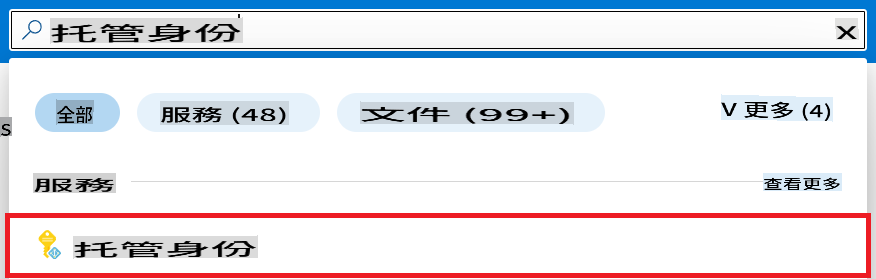

1. Pilih **+ Create**.

    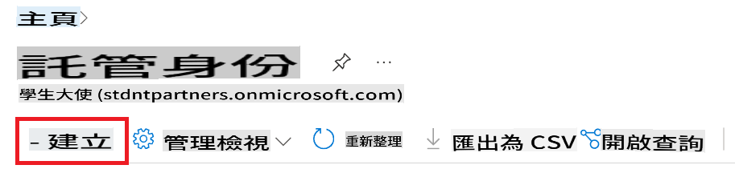

1. Laksanakeun tugas-tugas ieu:

    - Pilih **Langganan Azure** anjeun.
    - Pilih **Kelompok sumber daya** pikeun dianggo (damel anu anyar upami diperyogikeun).
    - Pilih **Wewengkon** anu anjeun pikahoyong.
    - Lebetkeun **Nami**. Éta kedah unik.

1. Pilih **Review + create**.

1. Pilih **+ Create**.

#### Nambihan peran Contributor ka Managed Identity

1. Buka sumber daya Managed Identity anu anjeun damel.

1. Pilih **Azure role assignments** tina tab sisi kénca.

1. Pilih **+Add role assignment** tina ménu navigasi.

1. Dina halaman Add role assignment, laksanakeun tugas-tugas ieu:
    - Pilih **Scope** kana **Resource group**.
    - Pilih **Langganan Azure** anjeun.
    - Pilih **Kelompok sumber daya** pikeun dianggo.
    - Pilih **Peran** kana **Contributor**.

    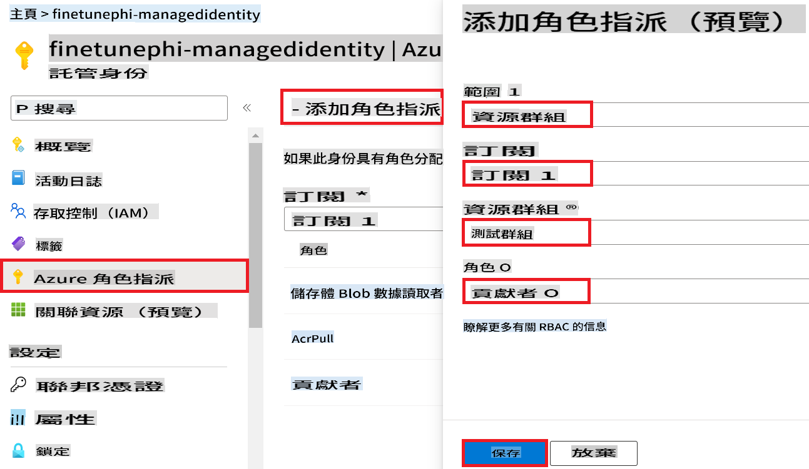

1. Pilih **Save**.

#### Nambihan peran Storage Blob Data Reader ka Managed Identity

1. Tipe *storage accounts* dina **bar pilarian** di luhur halaman portal sareng pilih **Storage accounts** tina pilihan anu muncul.

    

1. Pilih akun panyimpenan anu aya hubunganana sareng Azure Machine Learning workspace anu anjeun damel. Contona, *finetunephistorage*.

1. Laksanakeun tugas-tugas ieu pikeun ngalih ka halaman Add role assignment:

    - Buka akun panyimpenan Azure anu anjeun damel.
    - Pilih **Access Control (IAM)** tina tab sisi kénca.
    - Pilih **+ Add** tina ménu navigasi.
    - Pilih **Add role assignment** tina ménu navigasi.

    

1. Dina halaman Add role assignment, laksanakeun tugas-tugas ieu:

    - Dina halaman Peran, ketik *Storage Blob Data Reader* dina **bar pilarian** sareng pilih **Storage Blob Data Reader** tina pilihan anu muncul.
    - Dina halaman Peran, pilih **Next**.
    - Dina halaman Anggota, pilih **Assign access to** **Managed identity**.
    - Dina halaman Anggota, pilih **+ Select members**.
    - Dina halaman Select managed identities, pilih **Langganan Azure** anjeun.
    - Dina halaman Select managed identities, pilih **Managed identity** ka **Manage Identity**.
    - Dina halaman Select managed identities, pilih Managed Identity anu anjeun damel. Contona, *finetunephi-managedidentity*.
    - Dina halaman Select managed identities, pilih **Select**.

    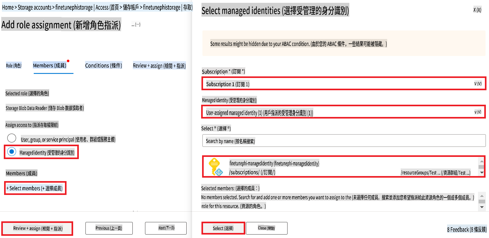

1. Pilih **Review + assign**.

#### Nambihan peran AcrPull ka Managed Identity

1. Tipe *container registries* dina **bar pilarian** di luhur halaman portal sareng pilih **Container registries** tina pilihan anu muncul.

    

1. Pilih registri kontainer anu aya hubunganana sareng Azure Machine Learning workspace. Contona, *finetunephicontainerregistries*

1. Laksanakeun tugas-tugas ieu pikeun ngalih ka halaman Add role assignment:

    - Pilih **Access Control (IAM)** tina tab sisi kénca.
    - Pilih **+ Add** tina ménu navigasi.
    - Pilih **Add role assignment** tina ménu navigasi.

1. Dina halaman Add role assignment, laksanakeun tugas-tugas ieu:

    - Dina halaman Peran, Tipe *AcrPull* dina **bar pilarian** sareng pilih **AcrPull** tina pilihan anu muncul.
    - Dina halaman Peran, pilih **Next**.
    - Dina halaman Anggota, pilih **Assign access to** **Managed identity**.
    - Dina halaman Anggota, pilih **+ Select members**.
    - Dina halaman Select managed identities, pilih **Langganan Azure** anjeun.
    - Dina halaman Select managed identities, pilih **Managed identity** ka **Manage Identity**.
    - Dina halaman Select managed identities, pilih Managed Identity anu anjeun damel. Contona, *finetunephi-managedidentity*.
    - Dina halaman Select managed identities, pilih **Select**.
    - Pilih **Review + assign**.

### Nyetél proyék

Ayeuna, anjeun bakal nyiptakeun folder pikeun digarap sareng nyetél lingkungan virtual pikeun ngembangkeun program anu berinteraksi sareng pangguna sareng nganggo sajarah obrolan anu disimpen tina Azure Cosmos DB pikeun ngabentuk résponna.

#### Nyiptakeun folder pikeun dianggo di jero

1. Buka terminal sareng ketik paréntah ieu pikeun nyiptakeun folder anu namina *finetune-phi* dina jalur standar.

    ```console
    mkdir finetune-phi
    ```

1. Ketik paréntah ieu dina terminal anjeun pikeun ngalih ka folder *finetune-phi* anu anjeun damel.

    ```console
    cd finetune-phi
    ```

#### Nyiptakeun lingkungan virtual

1. Ketik paréntah ieu dina terminal anjeun pikeun nyiptakeun lingkungan virtual anu namina *.venv*.

    ```console
    python -m venv .venv
    ```

1. Ketik paréntah ieu dina terminal anjeun pikeun ngaktipkeun lingkungan virtual.

    ```console
    .venv\Scripts\activate.bat
    ```

> [!NOTE]
>
> Upami hasil, anjeun kedah ningali *(.venv)* sateuacan prompt paréntah.

#### Masang paket anu diperyogikeun

1. Ketik paréntah ieu dina terminal anjeun pikeun masang paket anu diperyogikeun.

    ```console
    pip install datasets==2.19.1
    pip install transformers==4.41.1
    pip install azure-ai-ml==1.16.0
    pip install torch==2.3.1
    pip install trl==0.9.4
    pip install promptflow==1.12.0
    ```

#### Nyiptakeun file proyék

Dina latihan ieu, anjeun bakal nyiptakeun file anu penting pikeun proyék urang. File ieu kalebet skrip pikeun ngaunduh dataset, nyetél lingkungan Azure Machine Learning, ngaluyukeun modél Phi-3, sareng nyebarkeun modél anu parantos diluyukeun. Anjeun ogé bakal nyiptakeun file *conda.yml* pikeun nyetél lingkungan ngaluyukeun.

Dina latihan ieu, anjeun bakal:

- Nyiptakeun file *download_dataset.py* pikeun ngaunduh dataset.
- Nyiptakeun file *setup_ml.py* pikeun nyetél lingkungan Azure Machine Learning.
- Nyiptakeun file *fine_tune.py* dina folder *finetuning_dir* pikeun ngaluyukeun modél Phi-3 nganggo dataset.
- Nyiptakeun file *conda.yml* pikeun nyetél lingkungan ngaluyukeun.
- Nyiptakeun file *deploy_model.py* pikeun nyebarkeun modél anu parantos diluyukeun.
- Nyiptakeun file *integrate_with_promptflow.py* pikeun ngahijikeun modél anu parantos diluyukeun sareng ngalaksanakeun modél nganggo Prompt Flow.
- Nyiptakeun file flow.dag.yml pikeun nyetél struktur alur kerja pikeun Prompt Flow.
- Nyiptakeun file *config.py* pikeun ngalebetkeun inpormasi Azure.

> [!NOTE]
>
> Struktur folder lengkep:
>
> ```text
> └── YourUserName
> .    └── finetune-phi
> .        ├── finetuning_dir
> .        │      └── fine_tune.py
> .        ├── conda.yml
> .        ├── config.py
> .        ├── deploy_model.py
> .        ├── download_dataset.py
> .        ├── flow.dag.yml
> .        ├── integrate_with_promptflow.py
> .        └── setup_ml.py
> ```

1. Buka **Visual Studio Code**.

1. Pilih **File** tina ménu.

1. Pilih **Open Folder**.

1. Pilih folder *finetune-phi* anu anjeun damel, anu lokasina di *C:\Users\yourUserName\finetune-phi*.

    

1. Dina panel kénca Visual Studio Code, klik-katuhu sareng pilih **New File** pikeun nyiptakeun file anyar anu namina *download_dataset.py*.

1. Dina panel kénca Visual Studio Code, klik-katuhu sareng pilih **New File** pikeun nyiptakeun file anyar anu namina *setup_ml.py*.

1. Dina panel kénca Visual Studio Code, klik-katuhu sareng pilih **New File** pikeun nyiptakeun file anyar anu namina *deploy_model.py*.

    

1. Dina panel kénca Visual Studio Code, klik-katuhu sareng pilih **New Folder** pikeun nyiptakeun folder anyar anu namina *finetuning_dir*.

1. Dina folder *finetuning_dir*, nyiptakeun file anyar anu namina *fine_tune.py*.

#### Nyiptakeun sareng Nyetél file *conda.yml*

1. Dina panel kénca Visual Studio Code, klik-katuhu sareng pilih **New File** pikeun nyiptakeun file anyar anu namina *conda.yml*.

1. Tambahkeun kode ieu kana file *conda.yml* pikeun nyetél lingkungan ngaluyukeun pikeun modél Phi-3.

    ```yml
    name: phi-3-training-env
    channels:
      - defaults
      - conda-forge
    dependencies:
      - python=3.10
      - pip
      - numpy<2.0
      - pip:
          - torch==2.4.0
          - torchvision==0.19.0
          - trl==0.8.6
          - transformers==4.41
          - datasets==2.21.0
          - azureml-core==1.57.0
          - azure-storage-blob==12.19.0
          - azure-ai-ml==1.16
          - azure-identity==1.17.1
          - accelerate==0.33.0
          - mlflow==2.15.1
          - azureml-mlflow==1.57.0
    ```

#### Nyiptakeun sareng Nyetél file *config.py*

1. Dina panel kénca Visual Studio Code, klik-katuhu sareng pilih **New File** pikeun nyiptakeun file anyar anu namina *config.py*.

1. Tambahkeun kode ieu kana file *config.py* pikeun ngalebetkeun inpormasi Azure anjeun.

    ```python
    # Azure settings
    AZURE_SUBSCRIPTION_ID = "your_subscription_id"
    AZURE_RESOURCE_GROUP_NAME = "your_resource_group_name" # "TestGroup"

    # Azure Machine Learning settings
    AZURE_ML_WORKSPACE_NAME = "your_workspace_name" # "finetunephi-workspace"

    # Azure Managed Identity settings
    AZURE_MANAGED_IDENTITY_CLIENT_ID = "your_azure_managed_identity_client_id"
    AZURE_MANAGED_IDENTITY_NAME = "your_azure_managed_identity_name" # "finetunephi-mangedidentity"
    AZURE_MANAGED_IDENTITY_RESOURCE_ID = f"/subscriptions/{AZURE_SUBSCRIPTION_ID}/resourceGroups/{AZURE_RESOURCE_GROUP_NAME}/providers/Microsoft.ManagedIdentity/userAssignedIdentities/{AZURE_MANAGED_IDENTITY_NAME}"

    # Dataset file paths
    TRAIN_DATA_PATH = "data/train_data.jsonl"
    TEST_DATA_PATH = "data/test_data.jsonl"

    # Fine-tuned model settings
    AZURE_MODEL_NAME = "your_fine_tuned_model_name" # "finetune-phi-model"
    AZURE_ENDPOINT_NAME = "your_fine_tuned_model_endpoint_name" # "finetune-phi-endpoint"
    AZURE_DEPLOYMENT_NAME = "your_fine_tuned_model_deployment_name" # "finetune-phi-deployment"

    AZURE_ML_API_KEY = "your_fine_tuned_model_api_key"
    AZURE_ML_ENDPOINT = "your_fine_tuned_model_endpoint_uri" # "https://{your-endpoint-name}.{your-region}.inference.ml.azure.com/score"
    ```

#### Nambihan variabel lingkungan Azure

1. Laksanakeun tugas-tugas ieu pikeun nambihan ID Langganan Azure:

    - Tipe *subscriptions* dina **bar pilarian** di luhur halaman portal sareng pilih **Subscriptions** tina pilihan anu muncul.
    - Pilih Langganan Azure anu anjeun anggo ayeuna.
    - Salin sareng témpél ID Langganan anjeun kana file *config.py*.
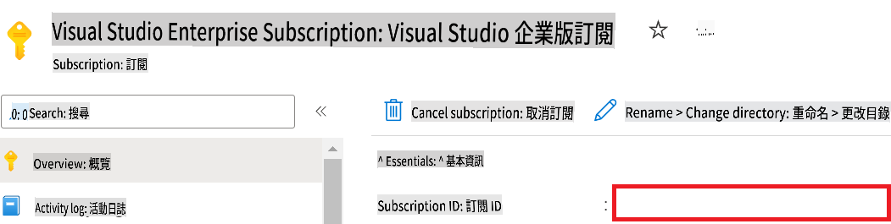

1. Ṣe àwọn ìgbésẹ wọ̀nyí láti ṣàfikún Orúkọ Azure Workspace:

    - Lọ sí orisun Azure Machine Learning tí o dá.
    - Daakọ àti lẹ́ orúkọ àkàǹṣe rẹ sínú fáìlì *config.py*.

    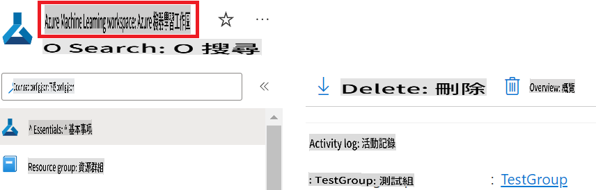

1. Ṣe àwọn ìgbésẹ wọ̀nyí láti ṣàfikún Orúkọ Ẹgbẹ̀ Orisun Azure:

    - Lọ sí orisun Azure Machine Learning tí o dá.
    - Daakọ àti lẹ́ Orúkọ Ẹgbẹ̀ Orisun Azure rẹ sínú fáìlì *config.py*.

    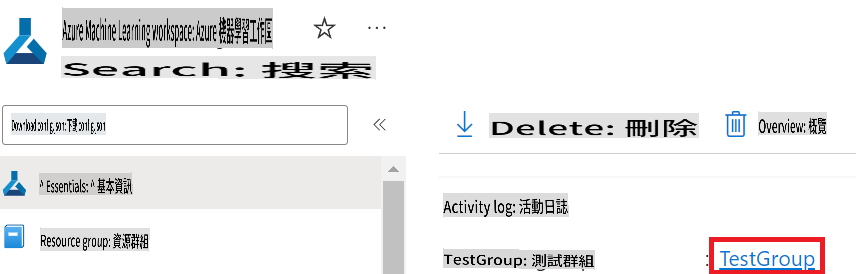

2. Ṣe àwọn ìgbésẹ wọ̀nyí láti ṣàfikún orúkọ Azure Managed Identity:

    - Lọ sí orisun Managed Identities tí o dá.
    - Daakọ àti lẹ́ orúkọ Azure Managed Identity rẹ sínú fáìlì *config.py*.

    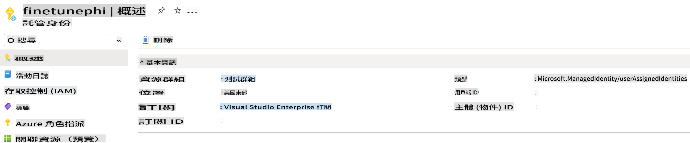

### Ṣètò àtúnṣe ìkànsí fún àkóónú

Nínú iṣẹ́ yìí, ìwọ yóò ṣiṣẹ́ fáìlì *download_dataset.py* láti gbà àwọn àkóónú *ULTRACHAT_200k* sí ayé rẹ̀. Lẹ́yìn náà, ìwọ yóò lò àwọn àkóónú wọ̀nyí láti ṣe àtúnṣe Phi-3 ní Azure Machine Learning.

#### Gbà àkóónú rẹ nípasẹ̀ *download_dataset.py*

1. Ṣí fáìlì *download_dataset.py* nínú Visual Studio Code.

1. Fikun àwọn kóòdù wọ̀nyí sínú fáìlì *download_dataset.py*.

    ```python
    import json
    import os
    from datasets import load_dataset
    from config import (
        TRAIN_DATA_PATH,
        TEST_DATA_PATH)

    def load_and_split_dataset(dataset_name, config_name, split_ratio):
        """
        Load and split a dataset.
        """
        # Load the dataset with the specified name, configuration, and split ratio
        dataset = load_dataset(dataset_name, config_name, split=split_ratio)
        print(f"Original dataset size: {len(dataset)}")
        
        # Split the dataset into train and test sets (80% train, 20% test)
        split_dataset = dataset.train_test_split(test_size=0.2)
        print(f"Train dataset size: {len(split_dataset['train'])}")
        print(f"Test dataset size: {len(split_dataset['test'])}")
        
        return split_dataset

    def save_dataset_to_jsonl(dataset, filepath):
        """
        Save a dataset to a JSONL file.
        """
        # Create the directory if it does not exist
        os.makedirs(os.path.dirname(filepath), exist_ok=True)
        
        # Open the file in write mode
        with open(filepath, 'w', encoding='utf-8') as f:
            # Iterate over each record in the dataset
            for record in dataset:
                # Dump the record as a JSON object and write it to the file
                json.dump(record, f)
                # Write a newline character to separate records
                f.write('\n')
        
        print(f"Dataset saved to {filepath}")

    def main():
        """
        Main function to load, split, and save the dataset.
        """
        # Load and split the ULTRACHAT_200k dataset with a specific configuration and split ratio
        dataset = load_and_split_dataset("HuggingFaceH4/ultrachat_200k", 'default', 'train_sft[:1%]')
        
        # Extract the train and test datasets from the split
        train_dataset = dataset['train']
        test_dataset = dataset['test']

        # Save the train dataset to a JSONL file
        save_dataset_to_jsonl(train_dataset, TRAIN_DATA_PATH)
        
        # Save the test dataset to a separate JSONL file
        save_dataset_to_jsonl(test_dataset, TEST_DATA_PATH)

    if __name__ == "__main__":
        main()

    ```

> [!TIP]
>
> **Ìtọ́nisọ́nà fún àtúnṣe pẹ̀lú àkóónú kékeré lórí CPU**
>
> Bí o bá fẹ́ lò CPU fún àtúnṣe, ọ̀nà yìí dára fún àwọn tí ó ní àwọn ìforúkọsilẹ́ ìdáwọ̀lé (bíi Visual Studio Enterprise Subscription) tàbí fún ìdánwò yíyára lórí àtúnṣe àti ìfọwọ́si.
>
> Rọ́pò `dataset = load_and_split_dataset("HuggingFaceH4/ultrachat_200k", 'default', 'train_sft[:1%]')` with `dataset = load_and_split_dataset("HuggingFaceH4/ultrachat_200k", 'default', 'train_sft[:10]')`
>

1. Tẹ̀ ìlànà yìí nínú tèmínà rẹ láti ṣiṣẹ́ fáìlì náà kí o sì gbà àkóónú sí ayé rẹ̀.

    ```console
    python download_data.py
    ```

1. Ṣàyẹ̀wò pé àkóónú náà ti fipamọ́ ní àbáyọ́ nínú ìtòlẹ́sẹẹsẹ *finetune-phi/data* rẹ.

> [!NOTE]
>
> **Iwọn àkóónú àti àkókò àtúnṣe**
>
> Nínú àpẹẹrẹ E2E yìí, ìwọ yóò lò 1% nìkan nínú àkóónú náà (`train_sft[:1%]`). Èyí yóò dín iwọn àwọn àkóónú kù pátápátá, tí yóò sì mú kí ìgbékalẹ̀ àti àtúnṣe yara. Ìwọ lè ṣàtúnṣe iye yìí láti ṣe àgbéyẹ̀wò àárín àkókò ìkànsí àti iṣẹ́ àpẹẹrẹ. Ìdínkù iye àwọn àkóónú mú kí ìlànà náà rọrùn fún àpẹẹrẹ E2E.

## Ètò 2: Ṣe àtúnṣe Phi-3 àti Fọwọ́si nínú Azure Machine Learning Studio

### Ṣètò Azure CLI

Ìwọ nílò láti ṣètò Azure CLI láti jẹ́ kí ayé rẹ jẹ́ mọ́. Azure CLI gba ọ́ láàyè láti ṣàkóso àwọn orisun Azure pẹ̀lú ìlànà tèmínà àti láti pèsè àwọn ìwé-ẹ̀rí fún Azure Machine Learning láti wọlé sí àwọn orisun wọ̀nyí. Láti bẹ̀rẹ̀, fi [Azure CLI](https://learn.microsoft.com/cli/azure/install-azure-cli) sílè.

1. Ṣí tèmínà kan kí o sì tẹ̀ ìlànà yìí láti wọlé sí àkàǹṣe Azure rẹ.

    ```console
    az login
    ```

1. Yan àkàǹṣe Azure rẹ láti lò.

1. Yan ìforúkọsilẹ́ Azure rẹ láti lò.

    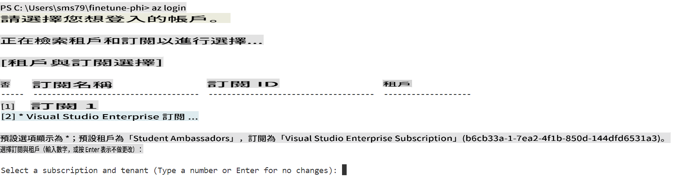

> [!TIP]
>
> Bí o bá ní ìṣòro wọlé sí Azure, gbìyànjú lò kóòdù erò kan. Ṣí tèmínà kan kí o sì tẹ̀ ìlànà yìí láti wọlé sí àkàǹṣe Azure rẹ:
>
> ```console
> az login --use-device-code
> ```
>

### Ṣe àtúnṣe Phi-3

Nínú iṣẹ́ yìí, ìwọ yóò ṣe àtúnṣe Phi-3 nípasẹ̀ àkóónú tí a pèsè. Àkọ́kọ́, ìwọ yóò ṣàpèjúwe ìlànà àtúnṣe nínú fáìlì *fine_tune.py*. Lẹ́yìn náà, ìwọ yóò ṣètò ayé Azure Machine Learning àti bẹ̀rẹ̀ ìlànà àtúnṣe nípasẹ̀ ṣiṣe fáìlì *setup_ml.py*. Fáìlì yìí níròyìn nípa ṣíṣe àtúnṣe nínú ayé Azure Machine Learning.

Nípasẹ̀ ṣiṣe fáìlì *setup_ml.py*, ìwọ yóò bẹ̀rẹ̀ ìlànà àtúnṣe ní ayé Azure Machine Learning.

#### Ṣàfikún kóòdù sínú fáìlì *fine_tune.py*

1. Lọ sí àkójọpọ̀ *finetuning_dir* kí o sì ṣí fáìlì *fine_tune.py* nínú Visual Studio Code.

1. Fikun àwọn kóòdù wọ̀nyí sínú fáìlì *fine_tune.py*.

    ```python
    import argparse
    import sys
    import logging
    import os
    from datasets import load_dataset
    import torch
    import mlflow
    from transformers import AutoModelForCausalLM, AutoTokenizer, TrainingArguments
    from trl import SFTTrainer

    # To avoid the INVALID_PARAMETER_VALUE error in MLflow, disable MLflow integration
    os.environ["DISABLE_MLFLOW_INTEGRATION"] = "True"

    # Logging setup
    logging.basicConfig(
        format="%(asctime)s - %(levelname)s - %(name)s - %(message)s",
        datefmt="%Y-%m-%d %H:%M:%S",
        handlers=[logging.StreamHandler(sys.stdout)],
        level=logging.WARNING
    )
    logger = logging.getLogger(__name__)

    def initialize_model_and_tokenizer(model_name, model_kwargs):
        """
        Initialize the model and tokenizer with the given pretrained model name and arguments.
        """
        model = AutoModelForCausalLM.from_pretrained(model_name, **model_kwargs)
        tokenizer = AutoTokenizer.from_pretrained(model_name)
        tokenizer.model_max_length = 2048
        tokenizer.pad_token = tokenizer.unk_token
        tokenizer.pad_token_id = tokenizer.convert_tokens_to_ids(tokenizer.pad_token)
        tokenizer.padding_side = 'right'
        return model, tokenizer

    def apply_chat_template(example, tokenizer):
        """
        Apply a chat template to tokenize messages in the example.
        """
        messages = example["messages"]
        if messages[0]["role"] != "system":
            messages.insert(0, {"role": "system", "content": ""})
        example["text"] = tokenizer.apply_chat_template(
            messages, tokenize=False, add_generation_prompt=False
        )
        return example

    def load_and_preprocess_data(train_filepath, test_filepath, tokenizer):
        """
        Load and preprocess the dataset.
        """
        train_dataset = load_dataset('json', data_files=train_filepath, split='train')
        test_dataset = load_dataset('json', data_files=test_filepath, split='train')
        column_names = list(train_dataset.features)

        train_dataset = train_dataset.map(
            apply_chat_template,
            fn_kwargs={"tokenizer": tokenizer},
            num_proc=10,
            remove_columns=column_names,
            desc="Applying chat template to train dataset",
        )

        test_dataset = test_dataset.map(
            apply_chat_template,
            fn_kwargs={"tokenizer": tokenizer},
            num_proc=10,
            remove_columns=column_names,
            desc="Applying chat template to test dataset",
        )

        return train_dataset, test_dataset

    def train_and_evaluate_model(train_dataset, test_dataset, model, tokenizer, output_dir):
        """
        Train and evaluate the model.
        """
        training_args = TrainingArguments(
            bf16=True,
            do_eval=True,
            output_dir=output_dir,
            eval_strategy="epoch",
            learning_rate=5.0e-06,
            logging_steps=20,
            lr_scheduler_type="cosine",
            num_train_epochs=3,
            overwrite_output_dir=True,
            per_device_eval_batch_size=4,
            per_device_train_batch_size=4,
            remove_unused_columns=True,
            save_steps=500,
            seed=0,
            gradient_checkpointing=True,
            gradient_accumulation_steps=1,
            warmup_ratio=0.2,
        )

        trainer = SFTTrainer(
            model=model,
            args=training_args,
            train_dataset=train_dataset,
            eval_dataset=test_dataset,
            max_seq_length=2048,
            dataset_text_field="text",
            tokenizer=tokenizer,
            packing=True
        )

        train_result = trainer.train()
        trainer.log_metrics("train", train_result.metrics)

        mlflow.transformers.log_model(
            transformers_model={"model": trainer.model, "tokenizer": tokenizer},
            artifact_path=output_dir,
        )

        tokenizer.padding_side = 'left'
        eval_metrics = trainer.evaluate()
        eval_metrics["eval_samples"] = len(test_dataset)
        trainer.log_metrics("eval", eval_metrics)

    def main(train_file, eval_file, model_output_dir):
        """
        Main function to fine-tune the model.
        """
        model_kwargs = {
            "use_cache": False,
            "trust_remote_code": True,
            "torch_dtype": torch.bfloat16,
            "device_map": None,
            "attn_implementation": "eager"
        }

        # pretrained_model_name = "microsoft/Phi-3-mini-4k-instruct"
        pretrained_model_name = "microsoft/Phi-3.5-mini-instruct"

        with mlflow.start_run():
            model, tokenizer = initialize_model_and_tokenizer(pretrained_model_name, model_kwargs)
            train_dataset, test_dataset = load_and_preprocess_data(train_file, eval_file, tokenizer)
            train_and_evaluate_model(train_dataset, test_dataset, model, tokenizer, model_output_dir)

    if __name__ == "__main__":
        parser = argparse.ArgumentParser()
        parser.add_argument("--train-file", type=str, required=True, help="Path to the training data")
        parser.add_argument("--eval-file", type=str, required=True, help="Path to the evaluation data")
        parser.add_argument("--model_output_dir", type=str, required=True, help="Directory to save the fine-tuned model")
        args = parser.parse_args()
        main(args.train_file, args.eval_file, args.model_output_dir)

    ```

1. Fipamọ́ fáìlì *fine_tune.py* kí o sì tíé.

> [!TIP]
> **Ìwọ lè ṣe àtúnṣe Phi-3.5**
>
> Nínú fáìlì *fine_tune.py*, ìwọ lè ṣe àtúnṣe `pretrained_model_name` from `"microsoft/Phi-3-mini-4k-instruct"` to any model you want to fine-tune. For example, if you change it to `"microsoft/Phi-3.5-mini-instruct"`, you'll be using the Phi-3.5-mini-instruct model for fine-tuning. To find and use the model name you prefer, visit [Hugging Face](https://huggingface.co/), search for the model you're interested in, and then copy and paste its name into the `pretrained_model_name` nínú ìwé rẹ.
>
> :::image type="content" source="../../imgs/03/FineTuning-PromptFlow/finetunephi3.5.png" alt-text="Ṣe àtúnṣe Phi-3.5.":::
>

#### Ṣàfikún kóòdù sínú fáìlì *setup_ml.py*

1. Ṣí fáìlì *setup_ml.py* nínú Visual Studio Code.

1. Fikun àwọn kóòdù wọ̀nyí sínú fáìlì *setup_ml.py*.

    ```python
    import logging
    from azure.ai.ml import MLClient, command, Input
    from azure.ai.ml.entities import Environment, AmlCompute
    from azure.identity import AzureCliCredential
    from config import (
        AZURE_SUBSCRIPTION_ID,
        AZURE_RESOURCE_GROUP_NAME,
        AZURE_ML_WORKSPACE_NAME,
        TRAIN_DATA_PATH,
        TEST_DATA_PATH
    )

    # Constants

    # Uncomment the following lines to use a CPU instance for training
    # COMPUTE_INSTANCE_TYPE = "Standard_E16s_v3" # cpu
    # COMPUTE_NAME = "cpu-e16s-v3"
    # DOCKER_IMAGE_NAME = "mcr.microsoft.com/azureml/openmpi4.1.0-ubuntu20.04:latest"

    # Uncomment the following lines to use a GPU instance for training
    COMPUTE_INSTANCE_TYPE = "Standard_NC24ads_A100_v4"
    COMPUTE_NAME = "gpu-nc24s-a100-v4"
    DOCKER_IMAGE_NAME = "mcr.microsoft.com/azureml/curated/acft-hf-nlp-gpu:59"

    CONDA_FILE = "conda.yml"
    LOCATION = "eastus2" # Replace with the location of your compute cluster
    FINETUNING_DIR = "./finetuning_dir" # Path to the fine-tuning script
    TRAINING_ENV_NAME = "phi-3-training-environment" # Name of the training environment
    MODEL_OUTPUT_DIR = "./model_output" # Path to the model output directory in azure ml

    # Logging setup to track the process
    logger = logging.getLogger(__name__)
    logging.basicConfig(
        format="%(asctime)s - %(levelname)s - %(name)s - %(message)s",
        datefmt="%Y-%m-%d %H:%M:%S",
        level=logging.WARNING
    )

    def get_ml_client():
        """
        Initialize the ML Client using Azure CLI credentials.
        """
        credential = AzureCliCredential()
        return MLClient(credential, AZURE_SUBSCRIPTION_ID, AZURE_RESOURCE_GROUP_NAME, AZURE_ML_WORKSPACE_NAME)

    def create_or_get_environment(ml_client):
        """
        Create or update the training environment in Azure ML.
        """
        env = Environment(
            image=DOCKER_IMAGE_NAME,  # Docker image for the environment
            conda_file=CONDA_FILE,  # Conda environment file
            name=TRAINING_ENV_NAME,  # Name of the environment
        )
        return ml_client.environments.create_or_update(env)

    def create_or_get_compute_cluster(ml_client, compute_name, COMPUTE_INSTANCE_TYPE, location):
        """
        Create or update the compute cluster in Azure ML.
        """
        try:
            compute_cluster = ml_client.compute.get(compute_name)
            logger.info(f"Compute cluster '{compute_name}' already exists. Reusing it for the current run.")
        except Exception:
            logger.info(f"Compute cluster '{compute_name}' does not exist. Creating a new one with size {COMPUTE_INSTANCE_TYPE}.")
            compute_cluster = AmlCompute(
                name=compute_name,
                size=COMPUTE_INSTANCE_TYPE,
                location=location,
                tier="Dedicated",  # Tier of the compute cluster
                min_instances=0,  # Minimum number of instances
                max_instances=1  # Maximum number of instances
            )
            ml_client.compute.begin_create_or_update(compute_cluster).wait()  # Wait for the cluster to be created
        return compute_cluster

    def create_fine_tuning_job(env, compute_name):
        """
        Set up the fine-tuning job in Azure ML.
        """
        return command(
            code=FINETUNING_DIR,  # Path to fine_tune.py
            command=(
                "python fine_tune.py "
                "--train-file ${{inputs.train_file}} "
                "--eval-file ${{inputs.eval_file}} "
                "--model_output_dir ${{inputs.model_output}}"
            ),
            environment=env,  # Training environment
            compute=compute_name,  # Compute cluster to use
            inputs={
                "train_file": Input(type="uri_file", path=TRAIN_DATA_PATH),  # Path to the training data file
                "eval_file": Input(type="uri_file", path=TEST_DATA_PATH),  # Path to the evaluation data file
                "model_output": MODEL_OUTPUT_DIR
            }
        )

    def main():
        """
        Main function to set up and run the fine-tuning job in Azure ML.
        """
        # Initialize ML Client
        ml_client = get_ml_client()

        # Create Environment
        env = create_or_get_environment(ml_client)
        
        # Create or get existing compute cluster
        create_or_get_compute_cluster(ml_client, COMPUTE_NAME, COMPUTE_INSTANCE_TYPE, LOCATION)

        # Create and Submit Fine-Tuning Job
        job = create_fine_tuning_job(env, COMPUTE_NAME)
        returned_job = ml_client.jobs.create_or_update(job)  # Submit the job
        ml_client.jobs.stream(returned_job.name)  # Stream the job logs
        
        # Capture the job name
        job_name = returned_job.name
        print(f"Job name: {job_name}")

    if __name__ == "__main__":
        main()

    ```

1. Rọ́pò `COMPUTE_INSTANCE_TYPE`, `COMPUTE_NAME`, and `LOCATION` pẹ̀lú àwọn àlàyé rẹ.

    ```python
   # Uncomment the following lines to use a GPU instance for training
    COMPUTE_INSTANCE_TYPE = "Standard_NC24ads_A100_v4"
    COMPUTE_NAME = "gpu-nc24s-a100-v4"
    ...
    LOCATION = "eastus2" # Replace with the location of your compute cluster
    ```

> [!TIP]
>
> **Ìtọ́nisọ́nà fún àtúnṣe pẹ̀lú àkóónú kékeré lórí CPU**
>
> Bí o bá fẹ́ lò CPU fún àtúnṣe, ọ̀nà yìí dára fún àwọn tí ó ní àwọn ìforúkọsilẹ́ ìdáwọ̀lé (bíi Visual Studio Enterprise Subscription) tàbí fún ìdánwò yíyára lórí àtúnṣe àti ìfọwọ́si.
>
> 1. Ṣí fáìlì *setup_ml*.
> 1. Rọ́pò `COMPUTE_INSTANCE_TYPE`, `COMPUTE_NAME`, and `DOCKER_IMAGE_NAME` with the following. If you do not have access to *Standard_E16s_v3*, you can use an equivalent CPU instance or request a new quota.
> 1. Replace `LOCATION` pẹ̀lú àwọn àlàyé rẹ.
>
>    ```python
>    # Uncomment the following lines to use a CPU instance for training
>    COMPUTE_INSTANCE_TYPE = "Standard_E16s_v3" # cpu
>    COMPUTE_NAME = "cpu-e16s-v3"
>    DOCKER_IMAGE_NAME = "mcr.microsoft.com/azureml/openmpi4.1.0-ubuntu20.04:latest"
>    LOCATION = "eastus2" # Replace with the location of your compute cluster
>    ```
>

1. Tẹ̀ ìlànà yìí láti ṣiṣẹ́ fáìlì *setup_ml.py* kí o sì bẹ̀rẹ̀ ìlànà àtúnṣe ní Azure Machine Learning.

    ```python
    python setup_ml.py
    ```

1. Nínú iṣẹ́ yìí, ìwọ ti ṣe àtúnṣe Phi-3 nípasẹ̀ Azure Machine Learning. Nípasẹ̀ ṣiṣe fáìlì *setup_ml.py*, ìwọ ti ṣètò ayé Azure Machine Learning àti bẹ̀rẹ̀ ìlànà àtúnṣe tí a ṣàpèjúwe nínú fáìlì *fine_tune.py*. Ṣe àkíyèsí pé ìlànà àtúnṣe lè gba àkókò pípẹ́. Lẹ́yìn ṣiṣe `python setup_ml.py` command, you need to wait for the process to complete. You can monitor the status of the fine-tuning job by following the link provided in the terminal to the Azure Machine Learning portal.

    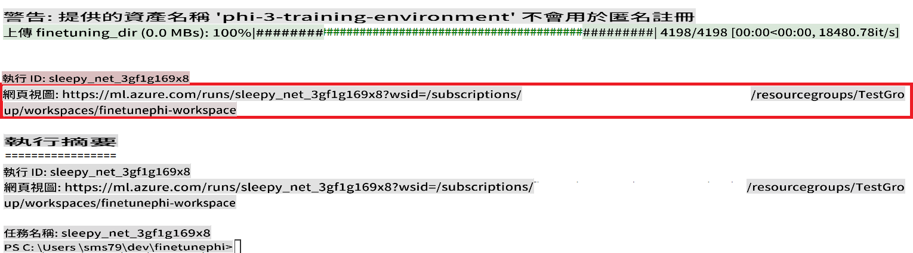

### Deploy the fine-tuned model

To integrate the fine-tuned Phi-3 model with Prompt Flow, you need to deploy the model to make it accessible for real-time inference. This process involves registering the model, creating an online endpoint, and deploying the model.

#### Set the model name, endpoint name, and deployment name for deployment

1. Open *config.py* file.

1. Replace `AZURE_MODEL_NAME = "your_fine_tuned_model_name"` with the desired name for your model.

1. Replace `AZURE_ENDPOINT_NAME = "your_fine_tuned_model_endpoint_name"` with the desired name for your endpoint.

1. Replace `AZURE_DEPLOYMENT_NAME = "your_fine_tuned_model_deployment_name"` pẹ̀lú orúkọ tí o fẹ́ fún ìfọwọ́si rẹ.

#### Ṣàfikún kóòdù sínú fáìlì *deploy_model.py*

Ṣíṣe fáìlì *deploy_model.py* jẹ́ kí gbogbo ìlànà ìfọwọ́si ṣe laifọwọ́si. Ìwọ yóò forúkọsílẹ̀ àwòrán náà, dá ẹ̀bùn kan, kí o sì ṣe ìfọwọ́si nípasẹ̀ àwọn ètò tó wà nínú fáìlì config.py, tó ní orúkọ àwòrán náà, orúkọ ẹ̀bùn náà, àti orúkọ ìfọwọ́si náà.

1. Ṣí fáìlì *deploy_model.py* nínú Visual Studio Code.

1. Fikun àwọn kóòdù wọ̀nyí sínú fáìlì *deploy_model.py*.

    ```python
    import logging
    from azure.identity import AzureCliCredential
    from azure.ai.ml import MLClient
    from azure.ai.ml.entities import Model, ProbeSettings, ManagedOnlineEndpoint, ManagedOnlineDeployment, IdentityConfiguration, ManagedIdentityConfiguration, OnlineRequestSettings
    from azure.ai.ml.constants import AssetTypes

    # Configuration imports
    from config import (
        AZURE_SUBSCRIPTION_ID,
        AZURE_RESOURCE_GROUP_NAME,
        AZURE_ML_WORKSPACE_NAME,
        AZURE_MANAGED_IDENTITY_RESOURCE_ID,
        AZURE_MANAGED_IDENTITY_CLIENT_ID,
        AZURE_MODEL_NAME,
        AZURE_ENDPOINT_NAME,
        AZURE_DEPLOYMENT_NAME
    )

    # Constants
    JOB_NAME = "your-job-name"
    COMPUTE_INSTANCE_TYPE = "Standard_E4s_v3"

    deployment_env_vars = {
        "SUBSCRIPTION_ID": AZURE_SUBSCRIPTION_ID,
        "RESOURCE_GROUP_NAME": AZURE_RESOURCE_GROUP_NAME,
        "UAI_CLIENT_ID": AZURE_MANAGED_IDENTITY_CLIENT_ID,
    }

    # Logging setup
    logging.basicConfig(
        format="%(asctime)s - %(levelname)s - %(name)s - %(message)s",
        datefmt="%Y-%m-%d %H:%M:%S",
        level=logging.DEBUG
    )
    logger = logging.getLogger(__name__)

    def get_ml_client():
        """Initialize and return the ML Client."""
        credential = AzureCliCredential()
        return MLClient(credential, AZURE_SUBSCRIPTION_ID, AZURE_RESOURCE_GROUP_NAME, AZURE_ML_WORKSPACE_NAME)

    def register_model(ml_client, model_name, job_name):
        """Register a new model."""
        model_path = f"azureml://jobs/{job_name}/outputs/artifacts/paths/model_output"
        logger.info(f"Registering model {model_name} from job {job_name} at path {model_path}.")
        run_model = Model(
            path=model_path,
            name=model_name,
            description="Model created from run.",
            type=AssetTypes.MLFLOW_MODEL,
        )
        model = ml_client.models.create_or_update(run_model)
        logger.info(f"Registered model ID: {model.id}")
        return model

    def delete_existing_endpoint(ml_client, endpoint_name):
        """Delete existing endpoint if it exists."""
        try:
            endpoint_result = ml_client.online_endpoints.get(name=endpoint_name)
            logger.info(f"Deleting existing endpoint {endpoint_name}.")
            ml_client.online_endpoints.begin_delete(name=endpoint_name).result()
            logger.info(f"Deleted existing endpoint {endpoint_name}.")
        except Exception as e:
            logger.info(f"No existing endpoint {endpoint_name} found to delete: {e}")

    def create_or_update_endpoint(ml_client, endpoint_name, description=""):
        """Create or update an endpoint."""
        delete_existing_endpoint(ml_client, endpoint_name)
        logger.info(f"Creating new endpoint {endpoint_name}.")
        endpoint = ManagedOnlineEndpoint(
            name=endpoint_name,
            description=description,
            identity=IdentityConfiguration(
                type="user_assigned",
                user_assigned_identities=[ManagedIdentityConfiguration(resource_id=AZURE_MANAGED_IDENTITY_RESOURCE_ID)]
            )
        )
        endpoint_result = ml_client.online_endpoints.begin_create_or_update(endpoint).result()
        logger.info(f"Created new endpoint {endpoint_name}.")
        return endpoint_result

    def create_or_update_deployment(ml_client, endpoint_name, deployment_name, model):
        """Create or update a deployment."""

        logger.info(f"Creating deployment {deployment_name} for endpoint {endpoint_name}.")
        deployment = ManagedOnlineDeployment(
            name=deployment_name,
            endpoint_name=endpoint_name,
            model=model.id,
            instance_type=COMPUTE_INSTANCE_TYPE,
            instance_count=1,
            environment_variables=deployment_env_vars,
            request_settings=OnlineRequestSettings(
                max_concurrent_requests_per_instance=3,
                request_timeout_ms=180000,
                max_queue_wait_ms=120000
            ),
            liveness_probe=ProbeSettings(
                failure_threshold=30,
                success_threshold=1,
                period=100,
                initial_delay=500,
            ),
            readiness_probe=ProbeSettings(
                failure_threshold=30,
                success_threshold=1,
                period=100,
                initial_delay=500,
            ),
        )
        deployment_result = ml_client.online_deployments.begin_create_or_update(deployment).result()
        logger.info(f"Created deployment {deployment.name} for endpoint {endpoint_name}.")
        return deployment_result

    def set_traffic_to_deployment(ml_client, endpoint_name, deployment_name):
        """Set traffic to the specified deployment."""
        try:
            # Fetch the current endpoint details
            endpoint = ml_client.online_endpoints.get(name=endpoint_name)
            
            # Log the current traffic allocation for debugging
            logger.info(f"Current traffic allocation: {endpoint.traffic}")
            
            # Set the traffic allocation for the deployment
            endpoint.traffic = {deployment_name: 100}
            
            # Update the endpoint with the new traffic allocation
            endpoint_poller = ml_client.online_endpoints.begin_create_or_update(endpoint)
            updated_endpoint = endpoint_poller.result()
            
            # Log the updated traffic allocation for debugging
            logger.info(f"Updated traffic allocation: {updated_endpoint.traffic}")
            logger.info(f"Set traffic to deployment {deployment_name} at endpoint {endpoint_name}.")
            return updated_endpoint
        except Exception as e:
            # Log any errors that occur during the process
            logger.error(f"Failed to set traffic to deployment: {e}")
            raise


    def main():
        ml_client = get_ml_client()

        registered_model = register_model(ml_client, AZURE_MODEL_NAME, JOB_NAME)
        logger.info(f"Registered model ID: {registered_model.id}")

        endpoint = create_or_update_endpoint(ml_client, AZURE_ENDPOINT_NAME, "Endpoint for finetuned Phi-3 model")
        logger.info(f"Endpoint {AZURE_ENDPOINT_NAME} is ready.")

        try:
            deployment = create_or_update_deployment(ml_client, AZURE_ENDPOINT_NAME, AZURE_DEPLOYMENT_NAME, registered_model)
            logger.info(f"Deployment {AZURE_DEPLOYMENT_NAME} is created for endpoint {AZURE_ENDPOINT_NAME}.")

            set_traffic_to_deployment(ml_client, AZURE_ENDPOINT_NAME, AZURE_DEPLOYMENT_NAME)
            logger.info(f"Traffic is set to deployment {AZURE_DEPLOYMENT_NAME} at endpoint {AZURE_ENDPOINT_NAME}.")
        except Exception as e:
            logger.error(f"Failed to create or update deployment: {e}")

    if __name__ == "__main__":
        main()

    ```

1. Ṣe àwọn ìgbésẹ wọ̀nyí láti rí `JOB_NAME`:

    - Navigate to Azure Machine Learning resource that you created.
    - Select **Studio web URL** to open the Azure Machine Learning workspace.
    - Select **Jobs** from the left side tab.
    - Select the experiment for fine-tuning. For example, *finetunephi*.
    - Select the job that you created.
    - Copy and paste your job Name into the `JOB_NAME = "your-job-name"` in *deploy_model.py* file.

1. Replace `COMPUTE_INSTANCE_TYPE` pẹ̀lú àwọn àlàyé rẹ.

1. Tẹ̀ ìlànà yìí láti ṣiṣẹ́ fáìlì *deploy_model.py* kí o sì bẹ̀rẹ̀ ìlànà ìfọwọ́si ní Azure Machine Learning.

    ```python
    python deploy_model.py
    ```

> [!WARNING]
> Láti yago fún àwọn owó àfikún sí àkàǹṣe rẹ, ráná àwọn ẹ̀bùn tí a dá nínú ayé Azure Machine Learning.
>

#### Ṣàyẹ̀wò ipo ìfọwọ́si ní ayé Azure Machine Learning Workspace

1. Ṣàbẹwò sí [Azure ML Studio](https://ml.azure.com/home?wt.mc_id=studentamb_279723).

1. Lọ sí ayé Azure Machine Learning tí o dá.

1. Yan **Studio web URL** láti ṣí ayé Azure Machine Learning.

1. Yan **Endpoints** láti àkójọpọ̀ òsì.

    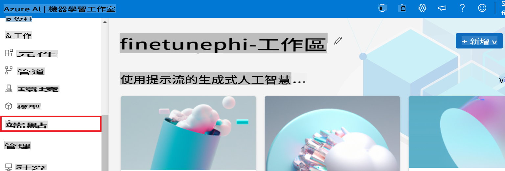

2. Yan ẹ̀bùn tí o dá.

    

3. Lórí ojú-ìwé yìí, ìwọ lè ṣàkóso àwọn ẹ̀bùn tí a dá nígbà ìlànà ìfọwọ́si.

## Ètò 3: Ṣepò pẹ̀lú Prompt flow àti Bàá Wí pẹ̀lú àwòrán rẹ̀

### Ṣepò àwòrán Phi-3 tí o ṣe àtúnṣe pẹ̀lú Prompt flow

Lẹ́yìn ìfọwọ́si àwòrán tí o ṣe àtúnṣe, ìwọ lè ṣepò rẹ̀ pẹ̀lú Prompt flow láti lò àwòrán rẹ fún àwọn ìṣe àkókò-gidi, tó jẹ́ kí ó ṣee ṣe láti ṣe àwọn ìṣẹ̀lẹ̀ ìbáradì pẹ̀lú àwòrán Phi-3 rẹ.

#### Ṣètò bọtìnì API àti URI ẹ̀bùn Phi-3 tí o ṣe àtúnṣe

1. Lọ sí ayé Azure Machine Learning tí o dá.
1. Yan **Endpoints** láti àkójọpọ̀ òsì.
1. Yan ẹ̀bùn tí o dá.
1. Yan **Consume** láti àtẹ̀jáde ìtòlẹ́sẹẹsẹ.
1. Daakọ àti lẹ́ **REST endpoint** rẹ sínú fáìlì *config.py*, rọ́pò `AZURE_ML_ENDPOINT = "your_fine_tuned_model_endpoint_uri"` with your **REST endpoint**.
1. Copy and paste your **Primary key** into the *config.py* file, replacing `AZURE_ML_API_KEY = "your_fine_tuned_model_api_key"` pẹ̀lú **Primary key** rẹ.

    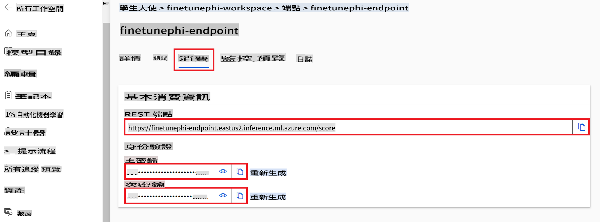

#### Ṣàfikún kóòdù sínú fáìlì *flow.dag.yml*

1. Ṣí fáìlì *flow.dag.yml* nínú Visual Studio Code.

1. Fikun àwọn kóòdù wọ̀nyí sínú fáìlì *flow.dag.yml*.

    ```yml
    inputs:
      input_data:
        type: string
        default: "Who founded Microsoft?"

    outputs:
      answer:
        type: string
        reference: ${integrate_with_promptflow.output}

    nodes:
    - name: integrate_with_promptflow
      type: python
      source:
        type: code
        path: integrate_with_promptflow.py
      inputs:
        input_data: ${inputs.input_data}
    ```

#### Ṣàfikún kóòdù sínú fáìlì *integrate_with_promptflow.py*

1. Ṣí fáìlì *integrate_with_promptflow.py* nínú Visual Studio Code.

1. Fikun àwọn kóòdù wọ̀nyí sínú fáìlì *integrate_with_promptflow.py*.

    ```python
    import logging
    import requests
    from promptflow.core import tool
    import asyncio
    import platform
    from config import (
        AZURE_ML_ENDPOINT,
        AZURE_ML_API_KEY
    )

    # Logging setup
    logging.basicConfig(
        format="%(asctime)s - %(levelname)s - %(name)s - %(message)s",
        datefmt="%Y-%m-%d %H:%M:%S",
        level=logging.DEBUG
    )
    logger = logging.getLogger(__name__)

    def query_azml_endpoint(input_data: list, endpoint_url: str, api_key: str) -> str:
        """
        Send a request to the Azure ML endpoint with the given input data.
        """
        headers = {
            "Content-Type": "application/json",
            "Authorization": f"Bearer {api_key}"
        }
        data = {
            "input_data": [input_data],
            "params": {
                "temperature": 0.7,
                "max_new_tokens": 128,
                "do_sample": True,
                "return_full_text": True
            }
        }
        try:
            response = requests.post(endpoint_url, json=data, headers=headers)
            response.raise_for_status()
            result = response.json()[0]
            logger.info("Successfully received response from Azure ML Endpoint.")
            return result
        except requests.exceptions.RequestException as e:
            logger.error(f"Error querying Azure ML Endpoint: {e}")
            raise

    def setup_asyncio_policy():
        """
        Setup asyncio event loop policy for Windows.
        """
        if platform.system() == 'Windows':
            asyncio.set_event_loop_policy(asyncio.WindowsSelectorEventLoopPolicy())
            logger.info("Set Windows asyncio event loop policy.")

    @tool
    def my_python_tool(input_data: str) -> str:
        """
        Tool function to process input data and query the Azure ML endpoint.
        """
        setup_asyncio_policy()
        return query_azml_endpoint(input_data, AZURE_ML_ENDPOINT, AZURE_ML_API_KEY)

    ```

### Bàá Wí pẹ̀lú àwòrán rẹ

1. Tẹ̀ ìlànà yìí láti ṣiṣẹ́ fáìlì *deploy_model.py* kí o sì bẹ̀rẹ̀ ìlànà ìfọwọ́si ní Azure Machine Learning.

    ```python
    pf flow serve --source ./ --port 8080 --host localhost
    ```

1. Ẹ̀yà àpẹẹrẹ àwọn abajade: Ní báyìí ìwọ lè bàá wí pẹ̀lú àwòrán Phi-3 tí o ṣe àtúnṣe. Ó dára láti béèrè àwọn ìbéèrè tó bá àwọn àkóónú tí o lò fún àtúnṣe mu.

    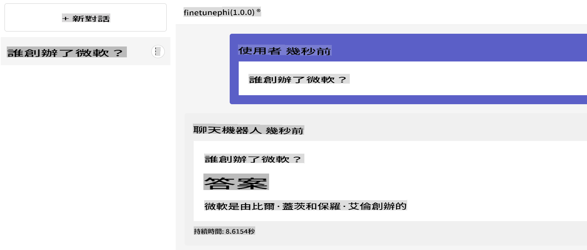

It seems like "mo" could refer to a specific language or abbreviation, but it is not clear which language you are referring to. Could you please clarify or specify the language you would like the text translated into? For example, are you referring to Māori, Mongolian, or something else?