# Fine-tune et intégrez des modèles Phi-3 personnalisés avec Prompt Flow dans Azure AI Foundry

Cet exemple de bout en bout (E2E) est basé sur le guide "[Fine-Tune and Integrate Custom Phi-3 Models with Prompt Flow in Azure AI Foundry](https://techcommunity.microsoft.com/t5/educator-developer-blog/fine-tune-and-integrate-custom-phi-3-models-with-prompt-flow-in/ba-p/4191726?WT.mc_id=aiml-137032-kinfeylo)" de la communauté technique Microsoft. Il explique les processus de fine-tuning, de déploiement et d'intégration de modèles Phi-3 personnalisés avec Prompt Flow dans Azure AI Foundry.  
Contrairement à l'exemple E2E "[Fine-Tune and Integrate Custom Phi-3 Models with Prompt Flow](./E2E_Phi-3-FineTuning_PromptFlow_Integration.md)", qui nécessitait l'exécution de code localement, ce tutoriel se concentre entièrement sur le fine-tuning et l'intégration de votre modèle dans Azure AI / ML Studio.

## Vue d'ensemble

Dans cet exemple E2E, vous apprendrez à affiner le modèle Phi-3 et à l'intégrer avec Prompt Flow dans Azure AI Foundry. En tirant parti d'Azure AI / ML Studio, vous mettrez en place un workflow pour déployer et utiliser des modèles IA personnalisés. Cet exemple est divisé en trois scénarios :

**Scénario 1 : Configurer les ressources Azure et préparer le fine-tuning**  

**Scénario 2 : Affiner le modèle Phi-3 et le déployer dans Azure Machine Learning Studio**  

**Scénario 3 : Intégrer avec Prompt Flow et interagir avec votre modèle personnalisé dans Azure AI Foundry**  

Voici une vue d'ensemble de cet exemple E2E.  

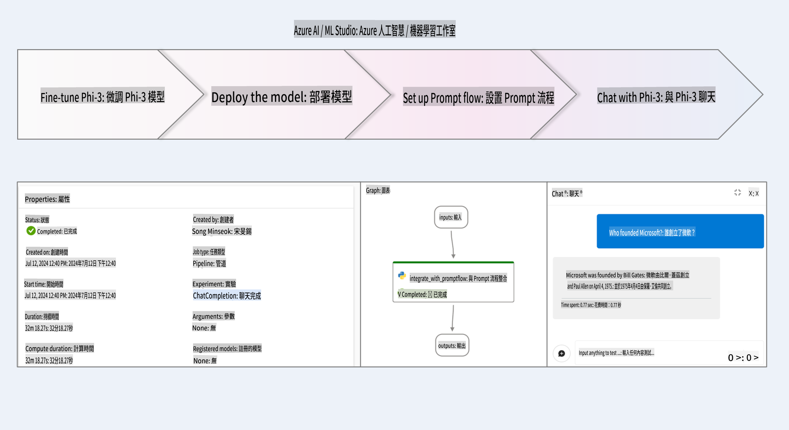

### Table des matières

1. **[Scénario 1 : Configurer les ressources Azure et préparer le fine-tuning](../../../../../../md/02.Application/01.TextAndChat/Phi3)**  
    - [Créer un espace de travail Azure Machine Learning](../../../../../../md/02.Application/01.TextAndChat/Phi3)  
    - [Demander des quotas GPU dans l'abonnement Azure](../../../../../../md/02.Application/01.TextAndChat/Phi3)  
    - [Ajouter une attribution de rôle](../../../../../../md/02.Application/01.TextAndChat/Phi3)  
    - [Configurer le projet](../../../../../../md/02.Application/01.TextAndChat/Phi3)  
    - [Préparer le jeu de données pour le fine-tuning](../../../../../../md/02.Application/01.TextAndChat/Phi3)  

1. **[Scénario 2 : Affiner le modèle Phi-3 et le déployer dans Azure Machine Learning Studio](../../../../../../md/02.Application/01.TextAndChat/Phi3)**  
    - [Affiner le modèle Phi-3](../../../../../../md/02.Application/01.TextAndChat/Phi3)  
    - [Déployer le modèle Phi-3 affiné](../../../../../../md/02.Application/01.TextAndChat/Phi3)  

1. **[Scénario 3 : Intégrer avec Prompt Flow et interagir avec votre modèle personnalisé dans Azure AI Foundry](../../../../../../md/02.Application/01.TextAndChat/Phi3)**  
    - [Intégrer le modèle Phi-3 personnalisé avec Prompt Flow](../../../../../../md/02.Application/01.TextAndChat/Phi3)  
    - [Interagir avec votre modèle Phi-3 personnalisé](../../../../../../md/02.Application/01.TextAndChat/Phi3)  

## Scénario 1 : Configurer les ressources Azure et préparer le fine-tuning  

### Créer un espace de travail Azure Machine Learning  

1. Tapez *azure machine learning* dans la **barre de recherche** en haut de la page du portail, puis sélectionnez **Azure Machine Learning** parmi les options proposées.  

    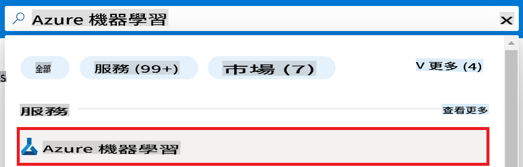  

2. Sélectionnez **+ Créer** dans le menu de navigation.  

3. Sélectionnez **Nouvel espace de travail** dans le menu de navigation.  

    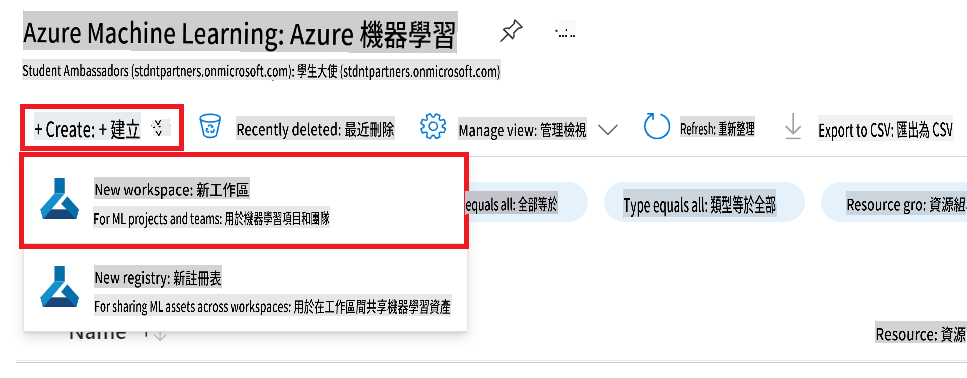  

4. Effectuez les tâches suivantes :  

    - Sélectionnez votre **Abonnement Azure**.  
    - Choisissez le **Groupe de ressources** à utiliser (créez-en un nouveau si nécessaire).  
    - Saisissez un **Nom d'espace de travail** unique.  
    - Sélectionnez la **Région** à utiliser.  
    - Choisissez le **Compte de stockage** à utiliser (créez-en un nouveau si nécessaire).  
    - Sélectionnez le **Key Vault** à utiliser (créez-en un nouveau si nécessaire).  
    - Sélectionnez les **Insights d'application** à utiliser (créez-en un nouveau si nécessaire).  
    - Sélectionnez le **Registre de conteneurs** à utiliser (créez-en un nouveau si nécessaire).  

    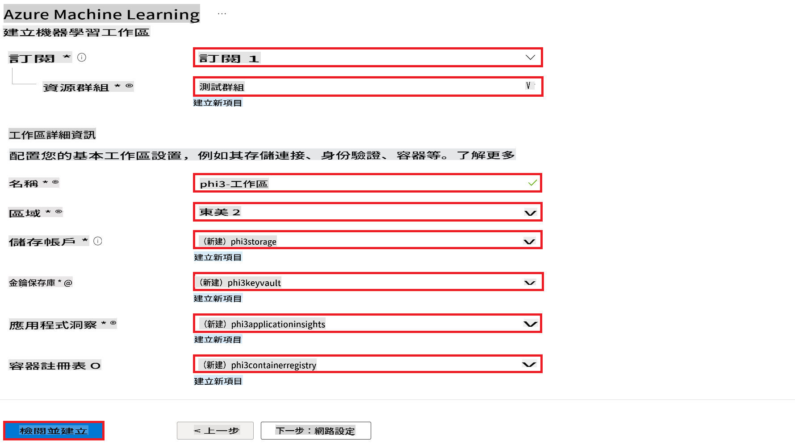  

5. Cliquez sur **Vérifier + Créer**.  

6. Sélectionnez **Créer**.  

### Demander des quotas GPU dans l'abonnement Azure  

Dans ce tutoriel, vous apprendrez à affiner et déployer un modèle Phi-3 en utilisant des GPU. Pour le fine-tuning, vous utiliserez le GPU *Standard_NC24ads_A100_v4*, qui nécessite une demande de quota. Pour le déploiement, vous utiliserez le GPU *Standard_NC6s_v3*, qui nécessite également une demande de quota.  

> [!NOTE]  
> Seuls les abonnements Pay-As-You-Go (le type d'abonnement standard) sont éligibles pour l'allocation GPU ; les abonnements avec avantages ne sont actuellement pas pris en charge.  

1. Accédez à [Azure ML Studio](https://ml.azure.com/home?wt.mc_id=studentamb_279723).  

1. Effectuez les tâches suivantes pour demander un quota pour la famille *Standard NCADSA100v4* :  

    - Sélectionnez **Quota** dans l'onglet latéral gauche.  
    - Choisissez la **Famille de machines virtuelles** à utiliser. Par exemple, sélectionnez **Standard NCADSA100v4 Family Cluster Dedicated vCPUs**, qui inclut le GPU *Standard_NC24ads_A100_v4*.  
    - Cliquez sur **Demander un quota** dans le menu de navigation.  

        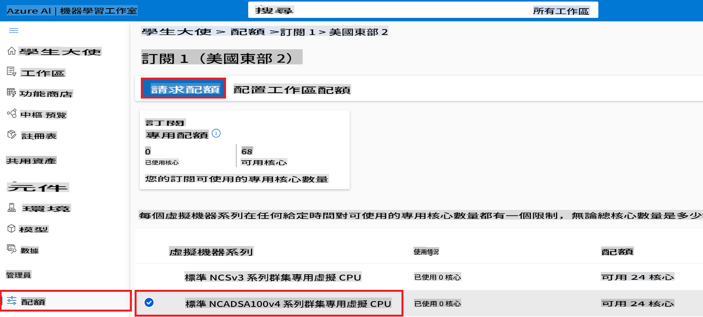  

    - Sur la page de demande de quota, saisissez la **Nouvelle limite de cœurs** souhaitée. Par exemple, 24.  
    - Sur la page de demande de quota, cliquez sur **Soumettre** pour demander le quota GPU.  

1. Effectuez les tâches suivantes pour demander un quota pour la famille *Standard NCSv3* :  

    - Sélectionnez **Quota** dans l'onglet latéral gauche.  
    - Choisissez la **Famille de machines virtuelles** à utiliser. Par exemple, sélectionnez **Standard NCSv3 Family Cluster Dedicated vCPUs**, qui inclut le GPU *Standard_NC6s_v3*.  
    - Cliquez sur **Demander un quota** dans le menu de navigation.  
    - Sur la page de demande de quota, saisissez la **Nouvelle limite de cœurs** souhaitée. Par exemple, 24.  
    - Sur la page de demande de quota, cliquez sur **Soumettre** pour demander le quota GPU.  

### Ajouter une attribution de rôle  

Pour affiner et déployer vos modèles, vous devez d'abord créer une identité managée affectée par l'utilisateur (UAI) et lui attribuer les autorisations appropriées. Cette UAI sera utilisée pour l'authentification pendant le déploiement.  

#### Créer une identité managée affectée par l'utilisateur (UAI)  

1. Tapez *identités managées* dans la **barre de recherche** en haut de la page du portail, puis sélectionnez **Identités managées** parmi les options proposées.  

    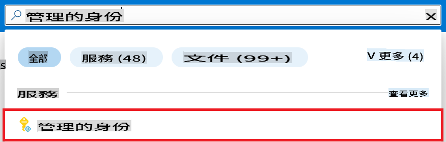  

1. Cliquez sur **+ Créer**.  

    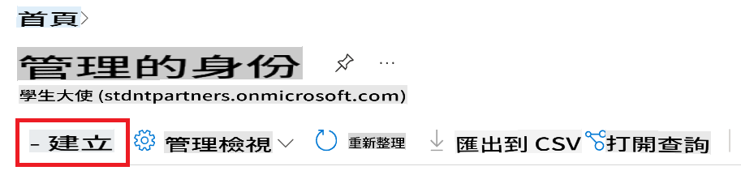  

1. Effectuez les tâches suivantes :  

    - Sélectionnez votre **Abonnement Azure**.  
    - Choisissez le **Groupe de ressources** à utiliser (créez-en un nouveau si nécessaire).  
    - Sélectionnez la **Région** à utiliser.  
    - Saisissez un **Nom** unique.  

    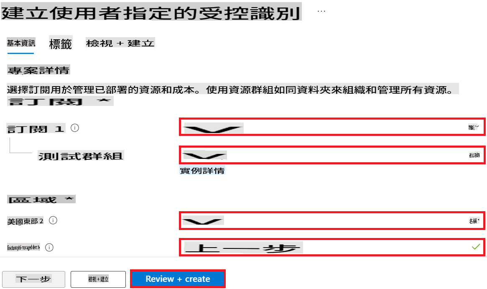  

1. Cliquez sur **Vérifier + créer**.  

1. Cliquez sur **Créer**.  

#### Ajouter un rôle de contributeur à l'identité managée  

1. Accédez à la ressource d'identité managée que vous avez créée.  

1. Sélectionnez **Attributions de rôles Azure** dans l'onglet latéral gauche.  

1. Cliquez sur **+ Ajouter une attribution de rôle** dans le menu de navigation.  

1. Sur la page d'ajout d'attribution de rôle, effectuez les tâches suivantes :  
    - Définissez le **Périmètre** sur **Groupe de ressources**.  
    - Sélectionnez votre **Abonnement Azure**.  
    - Choisissez le **Groupe de ressources** à utiliser.  
    - Définissez le **Rôle** sur **Contributeur**.  

    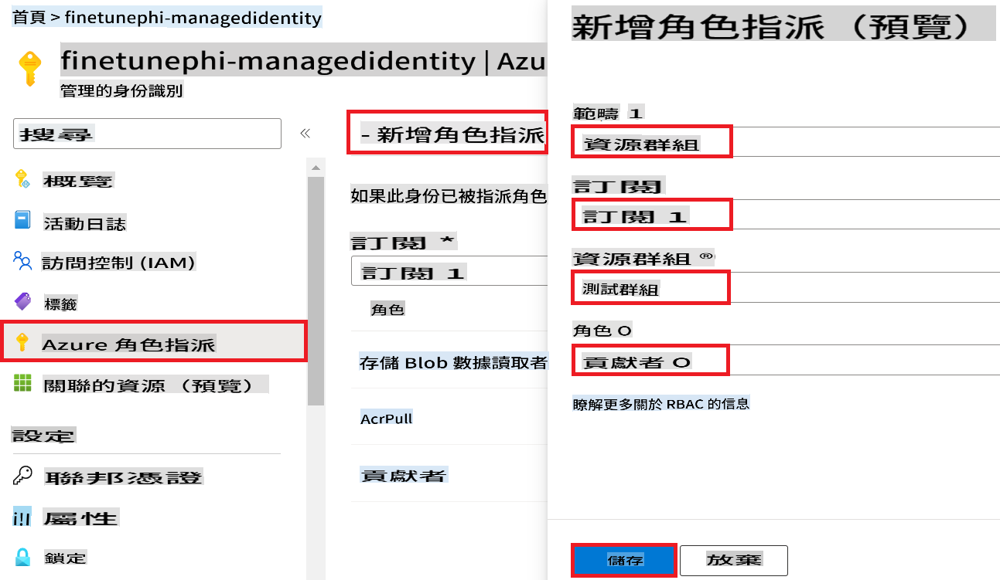  

2. Cliquez sur **Enregistrer**.  

#### Ajouter un rôle de lecteur de données Blob pour le stockage  

... (La traduction se poursuit en suivant la structure originale.)
1. မည်သူမဆို [Azure ML Studio](https://ml.azure.com/home?wt.mc_id=studentamb_279723) သို့ သွားပါ။

1. ဘယ်ဘက်ဘောင်မှ **Compute** ကိုရွေးပါ။

1. **Compute clusters** ကိုရွေးချယ်ပါ။

1. **+ New** ကိုနှိပ်ပါ။

    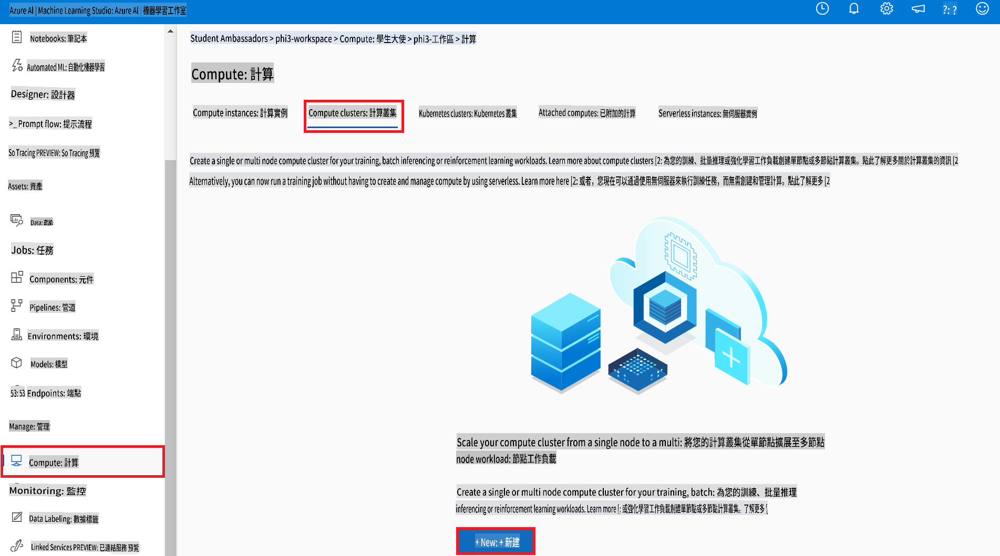

1. အောက်ပါအလုပ်များကို ဆောင်ရွက်ပါ။

    - သင်အသုံးပြုလိုသော **Region** ကိုရွေးချယ်ပါ။
    - **Virtual machine tier** ကို **Dedicated** သို့ရွေးပါ။
    - **Virtual machine type** ကို **GPU** သို့ရွေးပါ။
    - **Virtual machine size** filter ကို **Select from all options** သို့ရွေးပါ။
    - **Virtual machine size** ကို **Standard_NC24ads_A100_v4** သို့ရွေးပါ။

    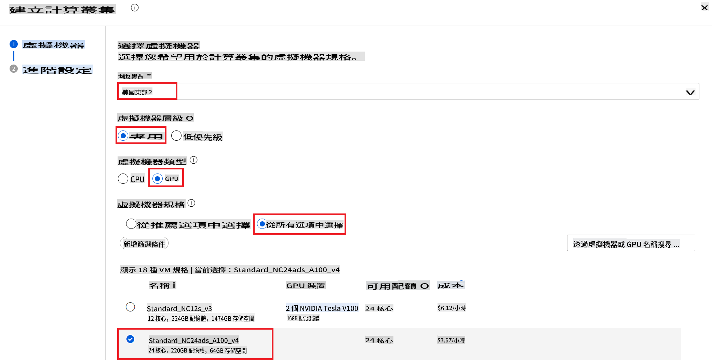

1. **Next** ကိုရွေးပါ။

1. အောက်ပါအလုပ်များကို ဆောင်ရွက်ပါ။

    - **Compute name** ကိုထည့်ပါ။ ၎င်းသည် ထူးခြားသောတန်ဖိုးဖြစ်ရမည်။
    - **Minimum number of nodes** ကို **0** သို့ရွေးပါ။
    - **Maximum number of nodes** ကို **1** သို့ရွေးပါ။
    - **Idle seconds before scale down** ကို **120** သို့ရွေးပါ။

    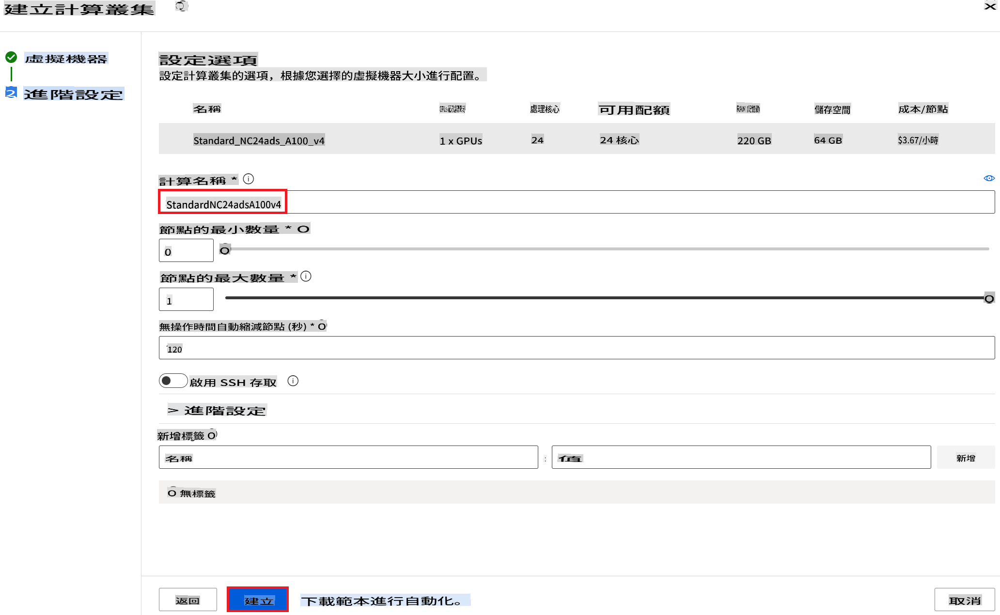

1. **Create** ကိုရွေးပါ။

#### Phi-3 မော်ဒယ်ကို Fine-tune ပြုလုပ်ပါ။

1. [Azure ML Studio](https://ml.azure.com/home?wt.mc_id=studentamb_279723) သို့ သွားပါ။

1. သင်ဖန်တီးထားသော Azure Machine Learning workspace ကိုရွေးချယ်ပါ။

    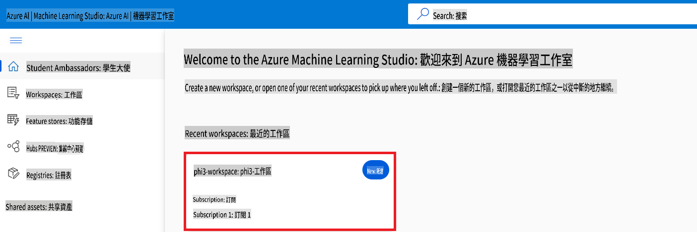

1. အောက်ပါအလုပ်များကို ဆောင်ရွက်ပါ။

    - ဘယ်ဘက်ဘောင်မှ **Model catalog** ကိုရွေးချယ်ပါ။
    - **search bar** တွင် *phi-3-mini-4k* ဟုရိုက်ထည့်ပြီး **Phi-3-mini-4k-instruct** ကိုရွေးချယ်ပါ။

    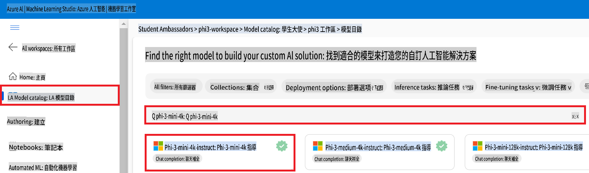

1. Navigation menu မှ **Fine-tune** ကိုရွေးချယ်ပါ။

    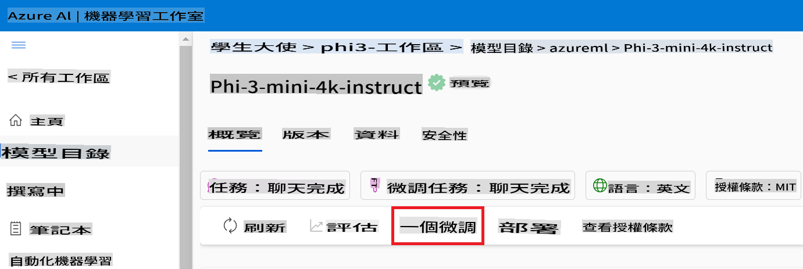

1. အောက်ပါအလုပ်များကို ဆောင်ရွက်ပါ။

    - **Select task type** ကို **Chat completion** သို့ရွေးပါ။
    - **+ Select data** ကိုရွေးပြီး **Training data** ကို upload လုပ်ပါ။
    - Validation data upload type ကို **Provide different validation data** သို့ရွေးပါ။
    - **+ Select data** ကိုရွေးပြီး **Validation data** ကို upload လုပ်ပါ။

    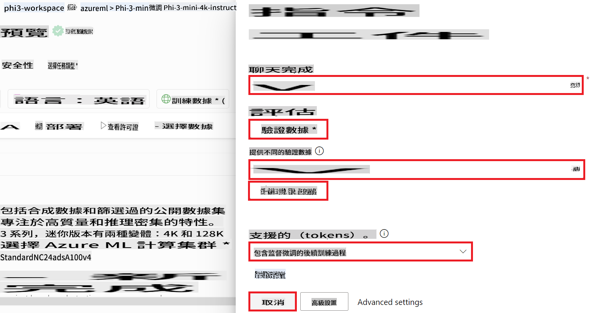

    > [!TIP]
    >
    > **Advanced settings** ကိုရွေးချယ်ပြီး **learning_rate** နှင့် **lr_scheduler_type** တို့ကို သင်၏လိုအပ်ချက်များအတိုင်း ချိန်ညှိ၍ Fine-tuning လုပ်ငန်းစဉ်ကို အကောင်းဆုံးဖြစ်စေရန် ပြုလုပ်နိုင်သည်။

1. **Finish** ကိုရွေးပါ။

1. ဤလေ့ကျင့်မှုတွင် သင်သည် Azure Machine Learning ကို အသုံးပြု၍ Phi-3 မော်ဒယ်ကို အောင်မြင်စွာ Fine-tune ပြုလုပ်နိုင်ခဲ့ပါသည်။ Fine-tuning လုပ်ငန်းစဉ်သည် အချိန်အတော်ကြာနိုင်သည်ကို မှတ်သားပါ။ Fine-tuning job ကို run ပြီးနောက် ၎င်း၏ အခြေအနေကို စောင့်ကြည့်ရန် Azure Machine Learning Workspace ၏ Jobs tab သို့ သွားပါ။ နောက်ထပ် အစီအစဉ်တွင် Fine-tuned မော်ဒယ်ကို Deploy ပြုလုပ်ပြီး Prompt flow နှင့် ပေါင်းစပ်အသုံးပြုမည်။

    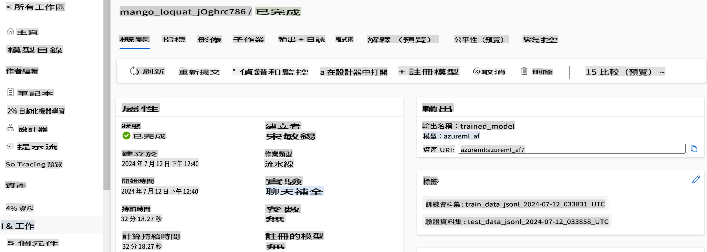

### Fine-tuned Phi-3 မော်ဒယ်ကို Deploy ပြုလုပ်ပါ။

Fine-tuned Phi-3 မော်ဒယ်ကို Prompt flow နှင့် ပေါင်းစပ်အသုံးပြုရန်အတွက် ၎င်းကို real-time inference အတွက် အသုံးပြုနိုင်ရန် Deploy လုပ်ရမည်။ ဤလုပ်ငန်းစဉ်တွင် မော်ဒယ်ကို Register လုပ်ခြင်း၊ online endpoint တစ်ခုဖန်တီးခြင်းနှင့် မော်ဒယ်ကို Deploy ပြုလုပ်ခြင်းတို့ ပါဝင်သည်။

ဤလေ့ကျင့်မှုတွင် သင်သည် -

- Fine-tuned မော်ဒယ်ကို Azure Machine Learning workspace တွင် Register လုပ်ပါ။
- Online endpoint တစ်ခု ဖန်တီးပါ။
- Register လုပ်ထားသော Fine-tuned Phi-3 မော်ဒယ်ကို Deploy ပြုလုပ်ပါ။

#### Fine-tuned မော်ဒယ်ကို Register လုပ်ပါ။

1. [Azure ML Studio](https://ml.azure.com/home?wt.mc_id=studentamb_279723) သို့ သွားပါ။

1. သင်ဖန်တီးထားသော Azure Machine Learning workspace ကိုရွေးချယ်ပါ။

    

1. ဘယ်ဘက်ဘောင်မှ **Models** ကိုရွေးပါ။
1. **+ Register** ကိုရွေးပါ။
1. **From a job output** ကိုရွေးပါ။

    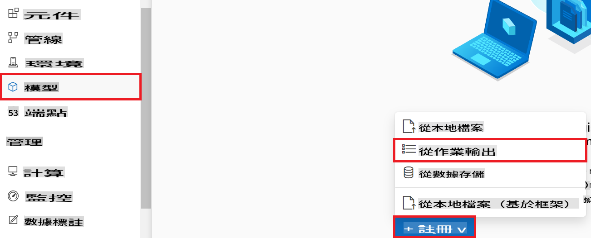

1. သင်ဖန်တီးထားသော job ကိုရွေးပါ။

    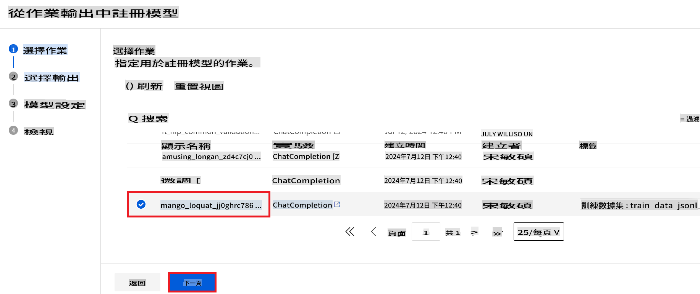

1. **Next** ကိုရွေးပါ။

1. **Model type** ကို **MLflow** သို့ရွေးပါ။

1. **Job output** ရွေးထားပြီးဖြစ်ရမည်။ ၎င်းကို အလိုအလျောက်ရွေးထားမည်။

    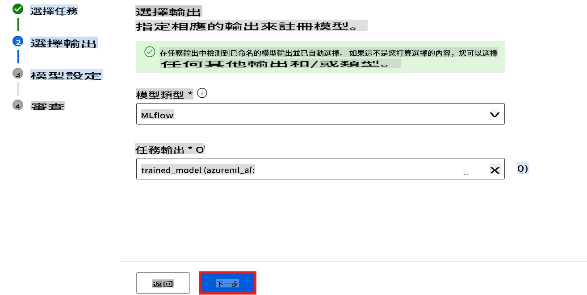

2. **Next** ကိုရွေးပါ။

3. **Register** ကိုရွေးပါ။

    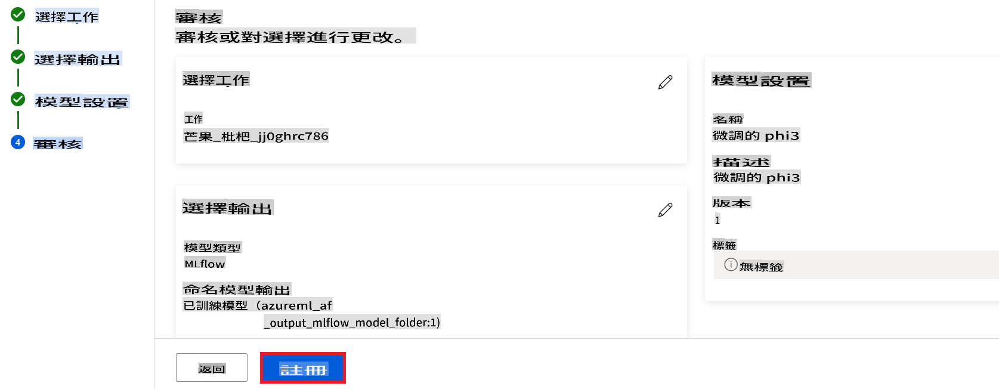

4. **Models** menu သို့သွား၍ သင်၏ Register လုပ်ထားသော မော်ဒယ်ကို ကြည့်ရှုနိုင်သည်။

    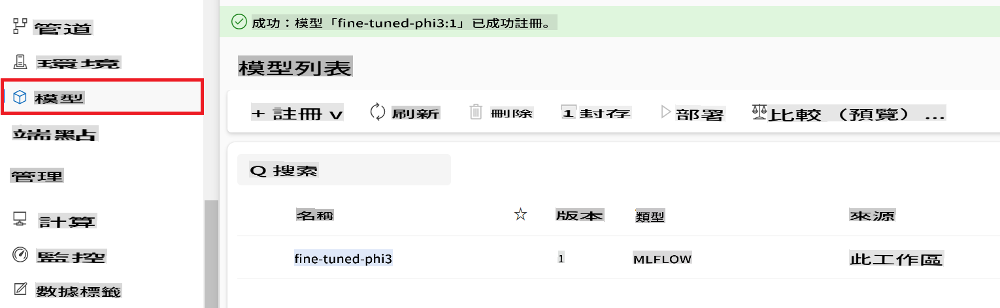

#### Fine-tuned မော်ဒယ်ကို Deploy ပြုလုပ်ပါ။

1. သင်ဖန်တီးထားသော Azure Machine Learning workspace သို့သွားပါ။

1. ဘယ်ဘက်ဘောင်မှ **Endpoints** ကိုရွေးပါ။

1. Navigation menu မှ **Real-time endpoints** ကိုရွေးချယ်ပါ။

    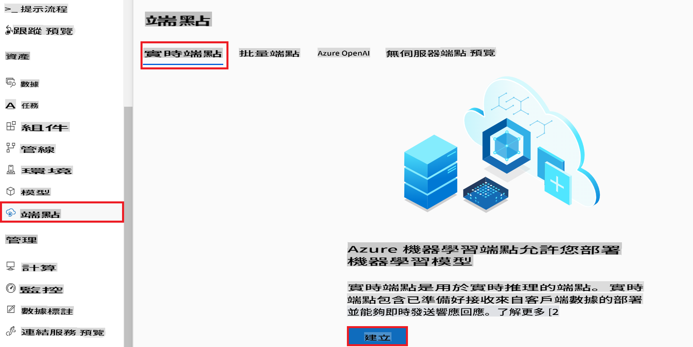

1. **Create** ကိုရွေးပါ။

1. သင်ဖန်တီးထားသော registered model ကိုရွေးပါ။

    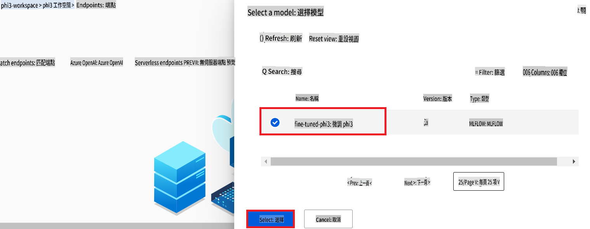

1. **Select** ကိုရွေးပါ။

1. အောက်ပါအလုပ်များကို ဆောင်ရွက်ပါ။

    - **Virtual machine** ကို *Standard_NC6s_v3* သို့ရွေးပါ။
    - သင်အသုံးပြုလိုသော **Instance count** ကိုရွေးပါ။ ဥပမာ - *1*။
    - **Endpoint** ကို **New** သို့ရွေးပြီး endpoint တစ်ခုဖန်တီးပါ။
    - **Endpoint name** ထည့်ပါ။ ၎င်းသည် ထူးခြားသောတန်ဖိုးဖြစ်ရမည်။
    - **Deployment name** ထည့်ပါ။ ၎င်းသည် ထူးခြားသောတန်ဖိုးဖြစ်ရမည်။

    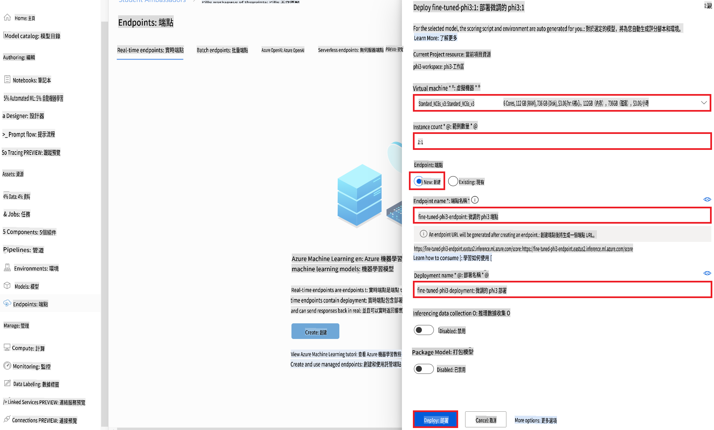

1. **Deploy** ကိုရွေးပါ။

> [!WARNING]
> သင်၏အကောင့်တွင် အပိုဝန်ဆောင်မှုကြေးမဖြစ်စေရန် Azure Machine Learning workspace တွင် ဖန်တီးထားသော endpoint ကို ဖျက်သိမ်းပါ။
>

#### Azure Machine Learning Workspace တွင် Deployment Status ကို စစ်ဆေးပါ။

1. သင်ဖန်တီးထားသော Azure Machine Learning workspace သို့သွားပါ။

1. ဘယ်ဘက်ဘောင်မှ **Endpoints** ကိုရွေးပါ။

1. သင်ဖန်တီးထားသော endpoint ကိုရွေးပါ။

    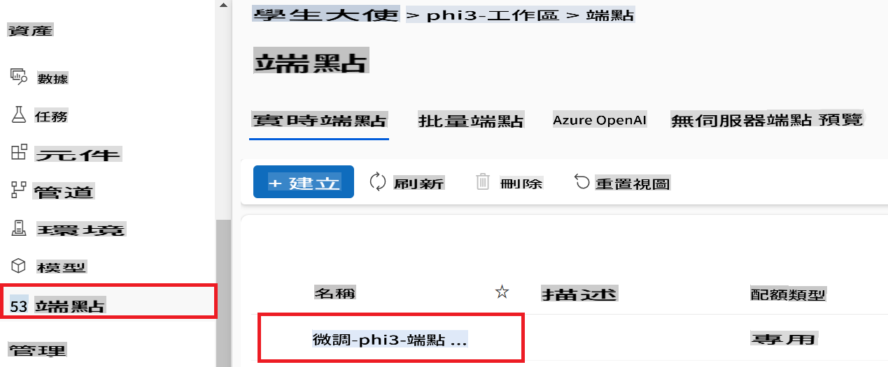

1. ဤစာမျက်နှာတွင် Deployment လုပ်ငန်းစဉ်အတွင်း Endpoints ကို စီမံခန့်ခွဲနိုင်သည်။

> [!NOTE]
> Deployment ပြီးဆုံးပြီးနောက် **Live traffic** ကို **100%** သို့ထားထားပါ။ မဟုတ်ပါက **Update traffic** ကိုရွေးပြီး traffic setting ကို ပြင်ဆင်ပါ။ Traffic ကို 0% သို့ထားပါက မော်ဒယ်ကို စမ်းသပ်၍မရနိုင်ပါ။
>
> 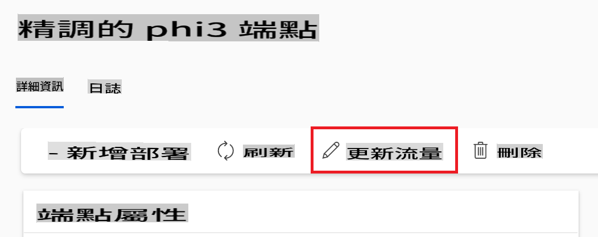
>
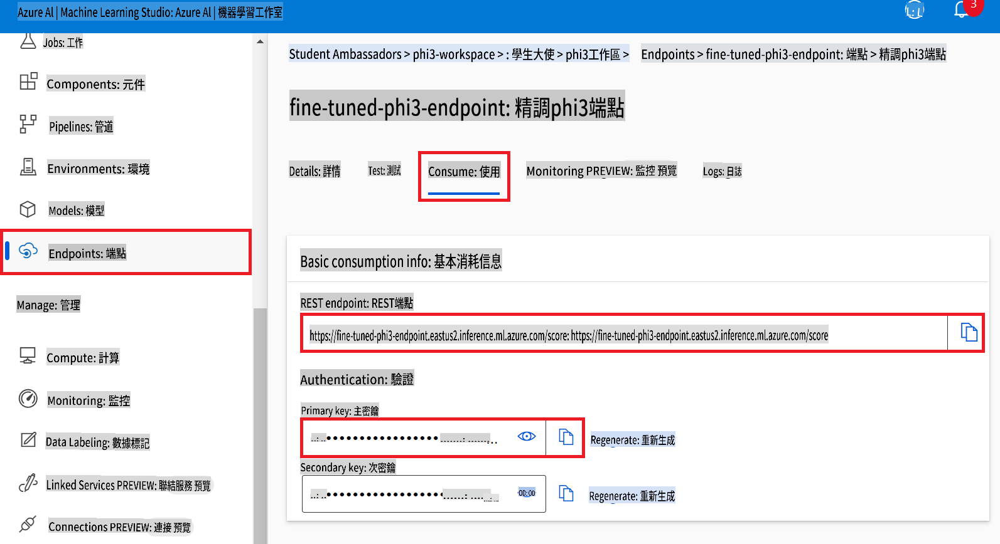

#### Add the Custom Connection

1. ไปที่ [Azure AI Foundry](https://ai.azure.com/?WT.mc_id=aiml-137032-kinfeylo)

1. เข้าสู่โปรเจกต์ Azure AI Foundry ที่คุณสร้างไว้

1. ในโปรเจกต์ที่คุณสร้าง ให้เลือก **Settings** จากแท็บด้านซ้าย

1. เลือก **+ New connection**

    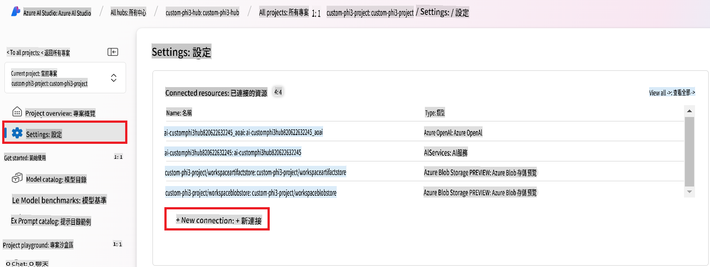

1. เลือก **Custom keys** จากเมนูนำทาง

    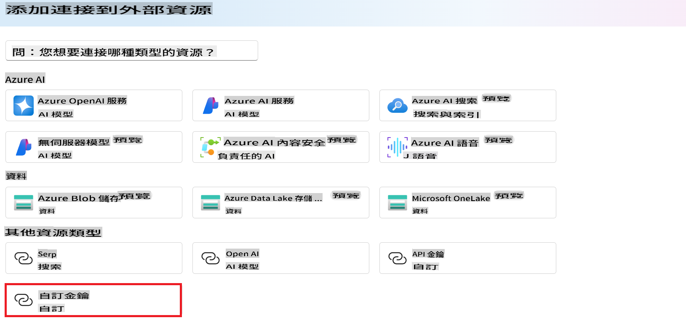

1. ทำตามขั้นตอนดังนี้:

    - เลือก **+ Add key value pairs**
    - ในช่อง key name ให้ป้อน **endpoint** และวาง endpoint ที่คัดลอกจาก Azure ML Studio ลงในช่อง value
    - เลือก **+ Add key value pairs** อีกครั้ง
    - ในช่อง key name ให้ป้อน **key** และวาง key ที่คัดลอกจาก Azure ML Studio ลงในช่อง value
    - หลังจากเพิ่ม keys แล้ว ให้เลือก **is secret** เพื่อป้องกันไม่ให้ key ถูกเปิดเผย

    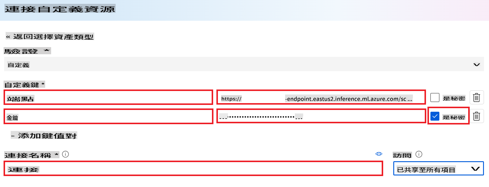

1. เลือก **Add connection**

#### Create Prompt flow

คุณได้เพิ่ม Custom Connection ใน Azure AI Foundry แล้ว ตอนนี้เราจะสร้าง Prompt flow โดยทำตามขั้นตอนต่อไปนี้ และคุณจะเชื่อมต่อ Prompt flow นี้เข้ากับ Custom Connection เพื่อใช้งานโมเดลที่ปรับแต่งแล้วภายใน Prompt flow

1. ไปที่โปรเจกต์ Azure AI Foundry ที่คุณสร้างไว้

1. เลือก **Prompt flow** จากแท็บด้านซ้าย

1. เลือก **+ Create** จากเมนูนำทาง

    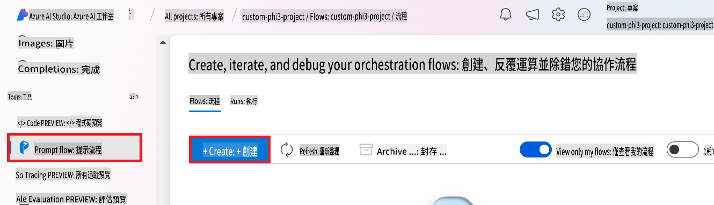

1. เลือก **Chat flow** จากเมนูนำทาง

    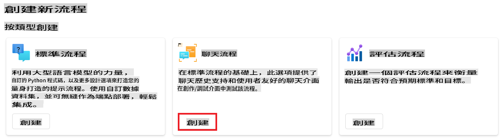

1. ป้อน **Folder name** ที่ต้องการใช้

    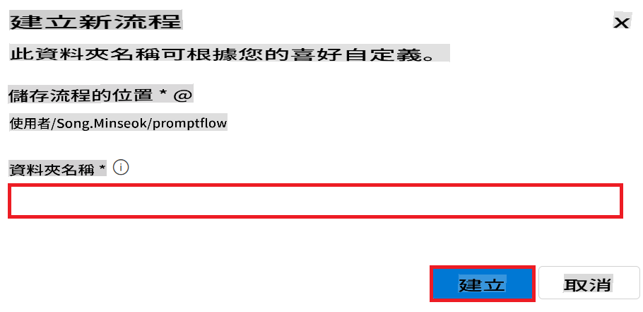

2. เลือก **Create**

#### Set up Prompt flow to chat with your custom Phi-3 model

คุณจำเป็นต้องผสานโมเดล Phi-3 ที่ปรับแต่งแล้วเข้ากับ Prompt flow อย่างไรก็ตาม Prompt flow ที่มีอยู่เดิมไม่ได้ออกแบบมาเพื่อจุดประสงค์นี้ ดังนั้นคุณต้องปรับปรุง Prompt flow ใหม่เพื่อรองรับการผสานโมเดลที่ปรับแต่งแล้ว

1. ใน Prompt flow ให้ทำตามขั้นตอนต่อไปนี้เพื่อปรับปรุง flow ที่มีอยู่:

    - เลือก **Raw file mode**
    - ลบโค้ดทั้งหมดในไฟล์ *flow.dag.yml*
    - เพิ่มโค้ดต่อไปนี้ลงในไฟล์ *flow.dag.yml*

        ```yml
        inputs:
          input_data:
            type: string
            default: "Who founded Microsoft?"

        outputs:
          answer:
            type: string
            reference: ${integrate_with_promptflow.output}

        nodes:
        - name: integrate_with_promptflow
          type: python
          source:
            type: code
            path: integrate_with_promptflow.py
          inputs:
            input_data: ${inputs.input_data}
        ```

    - เลือก **Save**

    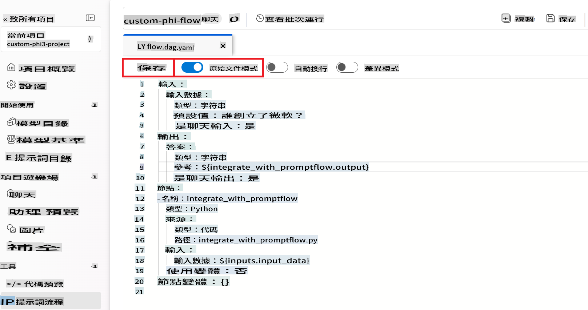

1. เพิ่มโค้ดต่อไปนี้ลงในไฟล์ *integrate_with_promptflow.py* เพื่อใช้งานโมเดล Phi-3 ที่ปรับแต่งแล้วใน Prompt flow

    ```python
    import logging
    import requests
    from promptflow import tool
    from promptflow.connections import CustomConnection

    # Logging setup
    logging.basicConfig(
        format="%(asctime)s - %(levelname)s - %(name)s - %(message)s",
        datefmt="%Y-%m-%d %H:%M:%S",
        level=logging.DEBUG
    )
    logger = logging.getLogger(__name__)

    def query_phi3_model(input_data: str, connection: CustomConnection) -> str:
        """
        Send a request to the Phi-3 model endpoint with the given input data using Custom Connection.
        """

        # "connection" is the name of the Custom Connection, "endpoint", "key" are the keys in the Custom Connection
        endpoint_url = connection.endpoint
        api_key = connection.key

        headers = {
            "Content-Type": "application/json",
            "Authorization": f"Bearer {api_key}"
        }
        data = {
            "input_data": {
                "input_string": [
                    {"role": "user", "content": input_data}
                ],
                "parameters": {
                    "temperature": 0.7,
                    "max_new_tokens": 128
                }
            }
        }
        try:
            response = requests.post(endpoint_url, json=data, headers=headers)
            response.raise_for_status()
            
            # Log the full JSON response
            logger.debug(f"Full JSON response: {response.json()}")

            result = response.json()["output"]
            logger.info("Successfully received response from Azure ML Endpoint.")
            return result
        except requests.exceptions.RequestException as e:
            logger.error(f"Error querying Azure ML Endpoint: {e}")
            raise

    @tool
    def my_python_tool(input_data: str, connection: CustomConnection) -> str:
        """
        Tool function to process input data and query the Phi-3 model.
        """
        return query_phi3_model(input_data, connection)

    ```

    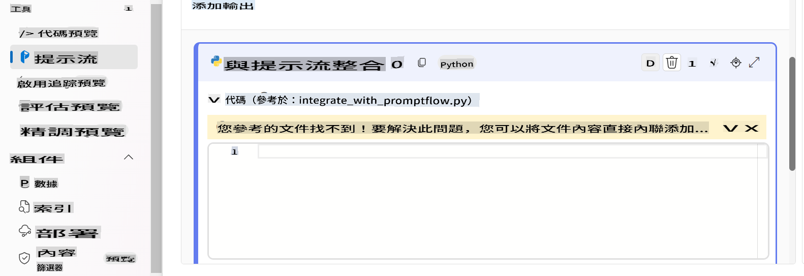

> [!NOTE]
> สำหรับข้อมูลเพิ่มเติมเกี่ยวกับการใช้ Prompt flow ใน Azure AI Foundry สามารถดูได้ที่ [Prompt flow in Azure AI Foundry](https://learn.microsoft.com/azure/ai-studio/how-to/prompt-flow)

1. เลือก **Chat input**, **Chat output** เพื่อเปิดใช้งานการแชทกับโมเดลของคุณ

    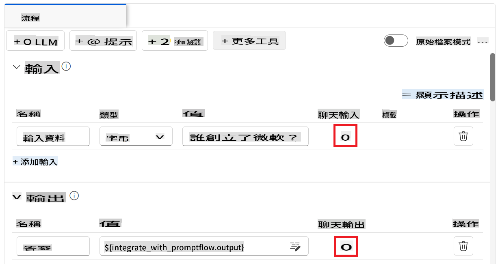

1. ตอนนี้คุณพร้อมที่จะเริ่มแชทกับโมเดล Phi-3 ที่ปรับแต่งแล้ว ในขั้นตอนถัดไป คุณจะได้เรียนรู้วิธีเริ่มต้น Prompt flow และใช้งานเพื่อแชทกับโมเดล Phi-3 ที่ปรับแต่งแล้วของคุณ

> [!NOTE]
>
> Prompt flow ที่ปรับปรุงแล้วควรมีลักษณะดังภาพด้านล่าง:
>
> 
>

### Chat with your custom Phi-3 model

ตอนนี้คุณได้ปรับแต่งและผสานโมเดล Phi-3 ที่ปรับแต่งแล้วเข้ากับ Prompt flow คุณพร้อมที่จะเริ่มต้นใช้งานและแชทกับมันแล้ว ขั้นตอนนี้จะแนะนำวิธีการตั้งค่าและเริ่มต้นการแชทกับโมเดลของคุณโดยใช้ Prompt flow โดยการทำตามขั้นตอนนี้ คุณจะสามารถใช้งานความสามารถของโมเดล Phi-3 ที่ปรับแต่งแล้วได้อย่างเต็มที่สำหรับงานและการสนทนาต่างๆ

- แชทกับโมเดล Phi-3 ที่ปรับแต่งแล้วของคุณโดยใช้ Prompt flow

#### Start Prompt flow

1. เลือก **Start compute sessions** เพื่อเริ่มต้น Prompt flow

    

1. เลือก **Validate and parse input** เพื่อรีเฟรชพารามิเตอร์

    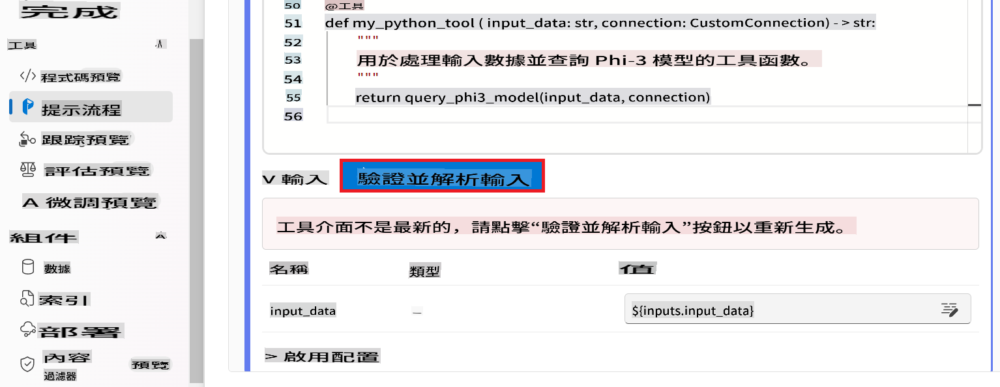

1. เลือก **Value** ของ **connection** ที่เชื่อมต่อกับ Custom Connection ที่คุณสร้างไว้ ตัวอย่างเช่น *connection*

    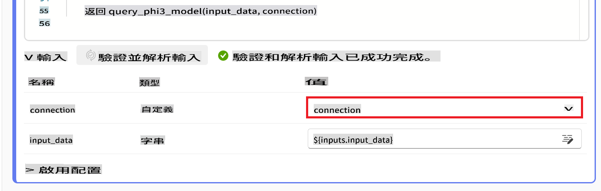

#### Chat with your custom model

1. เลือก **Chat**

    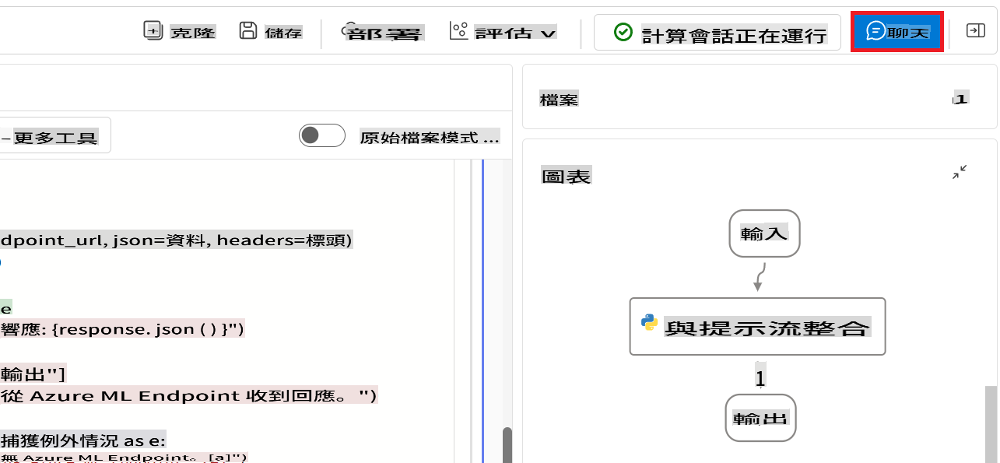

1. ตัวอย่างผลลัพธ์: ตอนนี้คุณสามารถแชทกับโมเดล Phi-3 ที่ปรับแต่งแล้วของคุณได้ แนะนำให้ถามคำถามที่เกี่ยวข้องกับข้อมูลที่ใช้ในการปรับแต่ง

    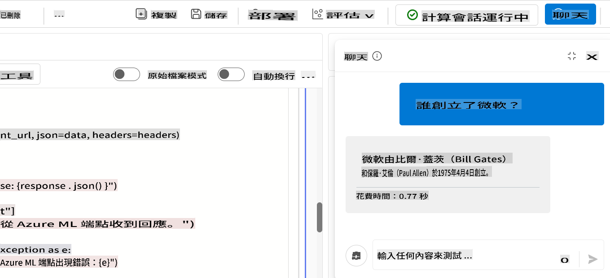

It seems you may be asking for a translation into "mo," but it’s unclear what specific language or context "mo" refers to. Could you clarify the target language or provide more details? For example, are you referring to Maori, Mongolian, or something else? Let me know so I can assist you better!