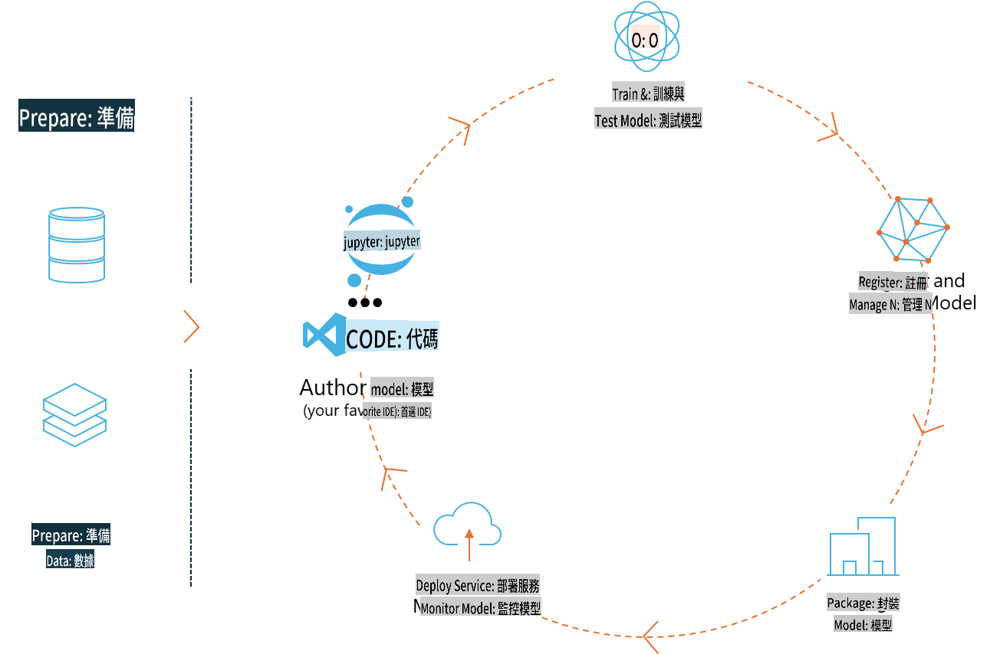
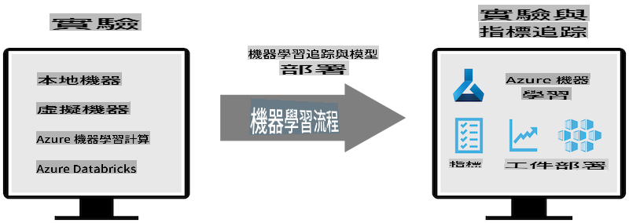
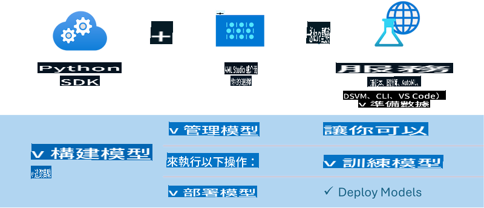

# MLflow

[MLflow](https://mlflow.org/) jẹ pẹpẹ orisun-òfuurufú ti a ṣe apẹrẹ lati ṣakoso igbesi aye ẹrọ ẹkọ lati ibẹrẹ de opin.



MLFlow ni a lo lati ṣakoso igbesi aye ẹrọ ẹkọ, pẹlu idanwo, atunṣe, iṣafihan ati iforukọsilẹ awoṣe aarin. MLFlow lọwọlọwọ nfunni awọn eroja mẹrin. 

- **MLflow Tracking:** Ṣiṣakiyesi ati ibeere awọn idanwo, koodu, data config ati awọn abajade.
- **MLflow Projects:** Ṣakojọpo koodu imọ-jinlẹ data ni ọna kika lati tun ṣe awọn iṣẹ ṣiṣe lori eyikeyi pẹpẹ.
- **Mlflow Models:** Ṣafihan awọn awoṣe ẹrọ ẹkọ ni awọn agbegbe iṣẹ oriṣiriṣi.
- **Model Registry:** Tọju, ṣe akọsilẹ ati ṣakoso awọn awoṣe ni ibi-ipamọ aarin kan.

O pẹlu awọn agbara fun ṣiṣakiyesi awọn idanwo, ṣiṣakojọpo koodu sinu awọn iṣẹ ṣiṣe atunṣe, ati pinpin ati ṣiṣafihan awọn awoṣe. MLFlow ti ṣepọ sinu Databricks ati ṣe atilẹyin ọpọlọpọ awọn ile ikawe ML, ṣiṣe ni ti ominira ile ikawe. O le ṣee lo pẹlu eyikeyi ile ikawe ẹrọ ẹkọ ati ni eyikeyi ede siseto, bi o ṣe pese REST API ati CLI fun irọrun.



Awọn ẹya pataki ti MLFlow pẹlu:

- **Ṣiṣakiyesi Idanwo:** Ṣiṣakiyesi ati ṣe afiwe awọn paramita ati awọn abajade.
- **Iṣakoso Awoṣe:** Ṣafihan awọn awoṣe si awọn pẹpẹ iṣẹ ati asọtẹlẹ oriṣiriṣi.
- **Iforukọsilẹ Awoṣe:** Ṣiṣakoso papọ igbesi aye awọn awoṣe MLFlow, pẹlu awọn ẹya ati awọn akọsilẹ.
- **Awọn iṣẹ akanṣe:** Ṣakojọpo koodu ML fun pinpin tabi lilo iṣelọpọ.
MLFlow tun ṣe atilẹyin fun iyika MLOps, eyiti o pẹlu igbaradi data, iforukọsilẹ ati iṣakoso awọn awoṣe, ṣiṣakojọpo awọn awoṣe fun ṣiṣe, ṣiṣafihan awọn iṣẹ, ati ṣiṣakoso awọn awoṣe. O pinnu lati dẹrọ ilana ti gbigbe lati awoṣe si iṣẹ ṣiṣe iṣelọpọ, paapaa ni awọn agbegbe awọsanma ati eti.

## E2E Eto - Ṣiṣẹda aṣọ wrapper ati lilo Phi-3 bi awoṣe MLFlow

Ninu apẹẹrẹ E2E yii a yoo fihan awọn ọna meji ti o yatọ lati ṣe aṣọ wrapper ni ayika awoṣe ede kekere Phi-3 (SLM) ati lẹhinna ṣiṣe bi awoṣe MLFlow boya ni agbegbe tabi ni awọsanma, fun apẹẹrẹ, ni aaye iṣẹ Ẹkọ Ẹrọ Azure.



| Iṣẹ akanṣe | Apejuwe | Ipo |
| ------------ | ----------- | -------- |
| Transformer Pipeline | Transformer Pipeline jẹ aṣayan ti o rọrun julọ lati ṣe aṣọ wrapper ti o ba fẹ lo awoṣe HuggingFace pẹlu adun transformers idanwo MLFlow. | [**TransformerPipeline.ipynb**](../../../../../../code/06.E2E/E2E_Phi-3-MLflow_TransformerPipeline.ipynb) |
| Custom Python Wrapper | Ni akoko kikọ yii, laini ọkọ ayọkẹlẹ transformer ko ṣe atilẹyin iranṣẹ wrapper MLFlow fun awọn awoṣe HuggingFace ni ọna kika ONNX, paapaa pẹlu package Python optimum idanwo. Fun awọn ọran bii eyi, o le ṣe aṣọ wrapper Python aṣa fun MLFlow mode | [**CustomPythonWrapper.ipynb**](../../../../../../code/06.E2E/E2E_Phi-3-MLflow_CustomPythonWrapper.ipynb) |

## Iṣẹ akanṣe: Transformer Pipeline

1. O yoo nilo awọn idii Python ti o yẹ lati MLFlow ati HuggingFace:

    ``` Python
    import mlflow
    import transformers
    ```

2. Nigbamii, o yẹ ki o bẹrẹ laini ọkọ ayọkẹlẹ transformer nipa tọka si awoṣe Phi-3 ti o wa ni ibi iforukọsilẹ HuggingFace. Gẹgẹbi a ti le rii lati kaadi awoṣe _Phi-3-mini-4k-instruct_, iṣẹ rẹ jẹ ti iru “Ẹda ọrọ”:

    ``` Python
    pipeline = transformers.pipeline(
        task = "text-generation",
        model = "microsoft/Phi-3-mini-4k-instruct"
    )
    ```

3. O le bayi fi laini ọkọ ayọkẹlẹ transformer awoṣe Phi-3 rẹ sinu ọna kika MLFlow ki o pese awọn alaye afikun bii ọna awọn nkan arọwọto, eto iṣeto awoṣe pato ati iru API asọtẹlẹ:

    ``` Python
    model_info = mlflow.transformers.log_model(
        transformers_model = pipeline,
        artifact_path = "phi3-mlflow-model",
        model_config = model_config,
        task = "llm/v1/chat"
    )
    ```

## Iṣẹ akanṣe: Custom Python Wrapper

1. A le lo API [ONNX Runtime generate()](https://github.com/microsoft/onnxruntime-genai) ti Microsoft fun asọtẹlẹ awoṣe ONNX ati awọn koodu ifihan / fifin. O gbọdọ yan package _onnxruntime_genai_ fun kọnputa ti o fojusi rẹ, pẹlu apẹẹrẹ ti o wa ni isalẹ ti o fojusi CPU:

    ``` Python
    import mlflow
    from mlflow.models import infer_signature
    import onnxruntime_genai as og
    ```

1. Kilasi aṣa wa n ṣe awọn ọna meji: _load_context()_ lati bẹrẹ awoṣe **ONNX** ti Phi-3 Mini 4K Instruct, **generator parameters** ati **tokenizer**; ati _predict()_ lati ṣe agbejade awọn aami jade fun ibeere ti a pese:

    ``` Python
    class Phi3Model(mlflow.pyfunc.PythonModel):
        def load_context(self, context):
            # Retrieving model from the artifacts
            model_path = context.artifacts["phi3-mini-onnx"]
            model_options = {
                 "max_length": 300,
                 "temperature": 0.2,         
            }
        
            # Defining the model
            self.phi3_model = og.Model(model_path)
            self.params = og.GeneratorParams(self.phi3_model)
            self.params.set_search_options(**model_options)
            
            # Defining the tokenizer
            self.tokenizer = og.Tokenizer(self.phi3_model)
    
        def predict(self, context, model_input):
            # Retrieving prompt from the input
            prompt = model_input["prompt"][0]
            self.params.input_ids = self.tokenizer.encode(prompt)
    
            # Generating the model's response
            response = self.phi3_model.generate(self.params)
    
            return self.tokenizer.decode(response[0][len(self.params.input_ids):])
    ```

1. O le lo bayi iṣẹ _mlflow.pyfunc.log_model()_ lati ṣe iranṣẹ wrapper Python aṣa (ni ọna kika pickle) fun awoṣe Phi-3, pẹlu awoṣe ONNX atilẹba ati awọn ohun elo pataki:

    ``` Python
    model_info = mlflow.pyfunc.log_model(
        artifact_path = artifact_path,
        python_model = Phi3Model(),
        artifacts = {
            "phi3-mini-onnx": "cpu_and_mobile/cpu-int4-rtn-block-32-acc-level-4",
        },
        input_example = input_example,
        signature = infer_signature(input_example, ["Run"]),
        extra_pip_requirements = ["torch", "onnxruntime_genai", "numpy"],
    )
    ```

## Awọn aami ti awọn awoṣe MLFlow ti a ṣe

1. Ni igbesẹ 3 ti iṣẹ akanṣe Transformer Pipeline loke, a ṣeto iṣẹ awoṣe MLFlow si “_llm/v1/chat_”. Aṣẹ bẹẹ n ṣe iranṣẹ wrapper API awoṣe, ibaramu pẹlu API Chat ti OpenAI bi a ti fihan ni isalẹ:

    ``` Python
    {inputs: 
      ['messages': Array({content: string (required), name: string (optional), role: string (required)}) (required), 'temperature': double (optional), 'max_tokens': long (optional), 'stop': Array(string) (optional), 'n': long (optional), 'stream': boolean (optional)],
    outputs: 
      ['id': string (required), 'object': string (required), 'created': long (required), 'model': string (required), 'choices': Array({finish_reason: string (required), index: long (required), message: {content: string (required), name: string (optional), role: string (required)} (required)}) (required), 'usage': {completion_tokens: long (required), prompt_tokens: long (required), total_tokens: long (required)} (required)],
    params: 
      None}
    ```

1. Nitorinaa, o le fi ibeere rẹ silẹ ni ọna kika atẹle:

    ``` Python
    messages = [{"role": "user", "content": "What is the capital of Spain?"}]
    ```

1. Lẹhinna, lo ilana atẹle API OpenAI, fun apẹẹrẹ, _response[0][‘choices’][0][‘message’][‘content’]_, lati ṣe ẹwa abajade rẹ si nkan bii eyi:

    ``` JSON
    Question: What is the capital of Spain?
    
    Answer: The capital of Spain is Madrid. It is the largest city in Spain and serves as the political, economic, and cultural center of the country. Madrid is located in the center of the Iberian Peninsula and is known for its rich history, art, and architecture, including the Royal Palace, the Prado Museum, and the Plaza Mayor.
    
    Usage: {'prompt_tokens': 11, 'completion_tokens': 73, 'total_tokens': 84}
    ```

1. Ni igbesẹ 3 ti iṣẹ akanṣe Custom Python Wrapper loke, a gba package MLFlow laaye lati ṣe iranṣẹ aami awoṣe lati apẹẹrẹ titẹ sii ti a fun. Aami wrapper MLFlow wa yoo dabi eyi:

    ``` Python
    {inputs: 
      ['prompt': string (required)],
    outputs: 
      [string (required)],
    params: 
      None}
    ```

1. Nitorinaa, ibeere wa yoo nilo lati ni bọtini “prompt” ni ọna kika atẹle:

    ``` Python
    {"prompt": "<|system|>You are a stand-up comedian.<|end|><|user|>Tell me a joke about atom<|end|><|assistant|>",}
    ```

1. Abajade awoṣe naa yoo pese lẹhinna ni ọna kika okun:

    ``` JSON
    Alright, here's a little atom-related joke for you!
    
    Why don't electrons ever play hide and seek with protons?
    
    Because good luck finding them when they're always "sharing" their electrons!
    
    Remember, this is all in good fun, and we're just having a little atomic-level humor!
    ```

It seems you've mentioned "mo" as the target language. Could you please clarify what "mo" refers to? Are you referring to a specific language, such as Maori, Mongolian, or something else? Let me know so I can assist you accurately!