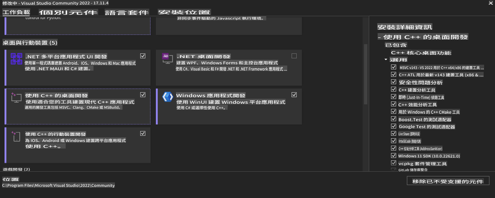
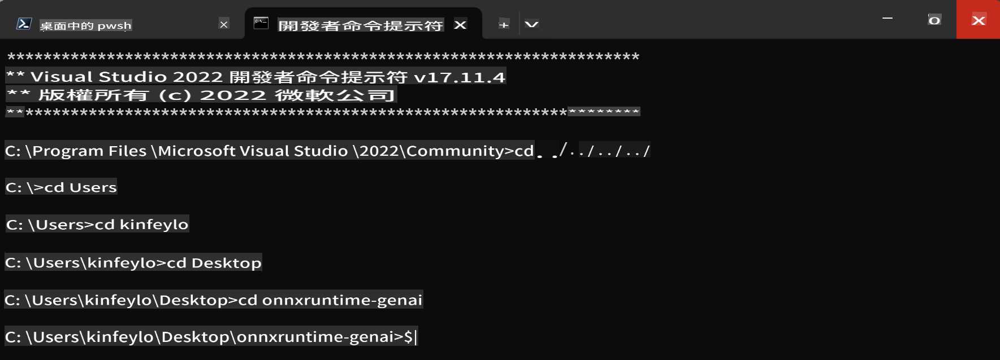

# **OnnxRuntime GenAI Windows GPU ကိုယ်ပိုင်လမ်းညွှန်**

ဤလမ်းညွှန်သည် Windows တွင် GPU များနှင့် ONNX Runtime (ORT) ကို အသုံးပြုရန်အဆင့်များကို ပေးသည်။ GPU acceleration ကို အသုံးပြု၍ မော်ဒယ်များ၏ စွမ်းဆောင်ရည်နှင့် ထိရောက်မှုကို တိုးတက်စေရန် အထောက်အကူပြုသည်။

ဒီစာရွက်စာတမ်းတွင် ညွှန်ကြားချက်များပါရှိသည်-

- ပတ်ဝန်းကျင် ပြင်ဆင်ခြင်း: CUDA, cuDNN, ONNX Runtime ကဲ့သို့သော လိုအပ်သော အခြေခံပစ္စည်းများကို ထည့်သွင်းရန် ညွှန်ကြားချက်များ။
- ဖွဲ့စည်းမှု: GPU ရင်းမြစ်များကို ထိရောက်စွာ အသုံးပြုနိုင်ရန် ပတ်ဝန်းကျင်နှင့် ONNX Runtime ကို ဖွဲ့စည်းနည်း။
- အာနိသင်များ တိုးတက်စေရန် အကြံဉာဏ်များ: စွမ်းဆောင်ရည်အကောင်းဆုံးရရှိရန် GPU ဆက်တင်များကို Fine-tune ပြုလုပ်နည်း။

### **1. Python 3.10.x /3.11.8**

   ***မှတ်ချက်*** [miniforge](https://github.com/conda-forge/miniforge/releases/latest/download/Miniforge3-Windows-x86_64.exe) ကို သင့် Python ပတ်ဝန်းကျင်အဖြစ် အသုံးပြုရန် အကြံပြုသည်။

   ```bash

   conda create -n pydev python==3.11.8

   conda activate pydev

   ```

   ***သတိပေးချက်*** သင့်တွင် Python ONNX library မည်သည့်အမျိုးအစားကိုမဆို ထည့်သွင်းထားပါက၊ အဲဒါကို အရင်ဆုံး ဖယ်ရှားပါ။

### **2. winget ဖြင့် CMake ထည့်သွင်းပါ**

   ```bash

   winget install -e --id Kitware.CMake

   ```

### **3. Visual Studio 2022 - Desktop Development with C++ ထည့်သွင်းပါ**

   ***မှတ်ချက်*** သင့်အား Compile လုပ်ရန် မလိုပါက၊ ဤအဆင့်ကို လွှဲမသွားနိုင်ပါ။



### **4. NVIDIA Driver ထည့်သွင်းပါ**

1. **NVIDIA GPU Driver** [https://www.nvidia.com/en-us/drivers/](https://www.nvidia.com/en-us/drivers/)

2. **NVIDIA CUDA 12.4** [https://developer.nvidia.com/cuda-12-4-0-download-archive](https://developer.nvidia.com/cuda-12-4-0-download-archive)

3. **NVIDIA CUDNN 9.4** [https://developer.nvidia.com/cudnn-downloads](https://developer.nvidia.com/cudnn-downloads)

***သတိပေးချက်*** Installation flow အတွက် Default settings ကို အသုံးပြုပါ။

### **5. NVIDIA ပတ်ဝန်းကျင်ကို ပြင်ဆင်ပါ**

NVIDIA CUDNN 9.4 lib, bin, include ကို NVIDIA CUDA 12.4 lib, bin, include သို့ ကူးပါ။

- *'C:\Program Files\NVIDIA\CUDNN\v9.4\bin\12.6'* ဖိုင်များကို *'C:\Program Files\NVIDIA GPU Computing Toolkit\CUDA\v12.4\bin'* သို့ ကူးပါ။

- *'C:\Program Files\NVIDIA\CUDNN\v9.4\include\12.6'* ဖိုင်များကို *'C:\Program Files\NVIDIA GPU Computing Toolkit\CUDA\v12.4\include'* သို့ ကူးပါ။

- *'C:\Program Files\NVIDIA\CUDNN\v9.4\lib\12.6'* ဖိုင်များကို *'C:\Program Files\NVIDIA GPU Computing Toolkit\CUDA\v12.4\lib\x64'* သို့ ကူးပါ။

### **6. Phi-3.5-mini-instruct-onnx ကို ဒေါင်းလုပ်ဆွဲပါ**

   ```bash

   winget install -e --id Git.Git

   winget install -e --id GitHub.GitLFS

   git lfs install

   git clone https://huggingface.co/microsoft/Phi-3.5-mini-instruct-onnx

   ```

### **7. InferencePhi35Instruct.ipynb ကို Run လုပ်ပါ**

   [Notebook](../../../../../../code/09.UpdateSamples/Aug/ortgpu-phi35-instruct.ipynb) ကို ဖွင့်ပြီး အဆင့်ဆင့် လုပ်ဆောင်ပါ။


### **8. ORT GenAI GPU ကို Compile လုပ်ပါ**

   ***မှတ်ချက်*** 
   
   1. ပထမဦးဆုံး ONNX, ONNX Runtime, onnxruntime-genai ဆိုင်ရာ library အားလုံးကို ဖယ်ရှားပါ။

   ```bash

   pip list 
   
   ```

   ထို့နောက် ONNX Runtime libraries အားလုံးကို ဖယ်ရှားပါ။

   ```bash

   pip uninstall onnxruntime

   pip uninstall onnxruntime-genai

   pip uninstall onnxruntume-genai-cuda
   
   ```

   2. Visual Studio Extension အထောက်အပံ့ကို စစ်ဆေးပါ။

   C:\Program Files\NVIDIA GPU Computing Toolkit\CUDA\v12.4\extras တွင် C:\Program Files\NVIDIA GPU Computing Toolkit\CUDA\v12.4\extras\visual_studio_integration ရှိမရှိ စစ်ဆေးပါ။ 

   မရှိပါက၊ အခြား CUDA toolkit driver ဖိုလ်ဒါများကို စစ်ဆေးပြီး visual_studio_integration ဖိုလ်ဒါနှင့် ဖိုင်များကို C:\Program Files\NVIDIA GPU Computing Toolkit\CUDA\v12.4\extras\visual_studio_integration သို့ ကူးပါ။

   - Compile လုပ်ရန် မလိုပါက၊ ဤအဆင့်ကို လွှဲမသွားနိုင်ပါ။

   ```bash

   git clone https://github.com/microsoft/onnxruntime-genai

   ```

   - [https://github.com/microsoft/onnxruntime/releases/download/v1.19.2/onnxruntime-win-x64-gpu-1.19.2.zip](https://github.com/microsoft/onnxruntime/releases/download/v1.19.2/onnxruntime-win-x64-gpu-1.19.2.zip) ကို ဒေါင်းလုပ်ဆွဲပါ။

   - onnxruntime-win-x64-gpu-1.19.2.zip ကို ဖြေပြီး **ort** ဟု အမည်ပြောင်းပြီး၊ ort ဖိုလ်ဒါကို onnxruntime-genai ထဲသို့ ကူးပါ။

   - Windows Terminal ကို အသုံးပြု၍ Developer Command Prompt for VS 2022 သို့ သွားပြီး onnxruntime-genai သို့ ရောက်ပါ။



   - သင့် Python ပတ်ဝန်းကျင်နှင့်အတူ Compile လုပ်ပါ။

   ```bash

   cd onnxruntime-genai

   python build.py --use_cuda  --cuda_home "C:\Program Files\NVIDIA GPU Computing Toolkit\CUDA\v12.4" --config Release
 

   cd build/Windows/Release/Wheel

   pip install .whl

   ```

It seems you are asking for a translation into "mo." Could you clarify what "mo" refers to? For instance, are you referring to the Mongolian language, Maori, or something else? Let me know so I can assist you accurately!