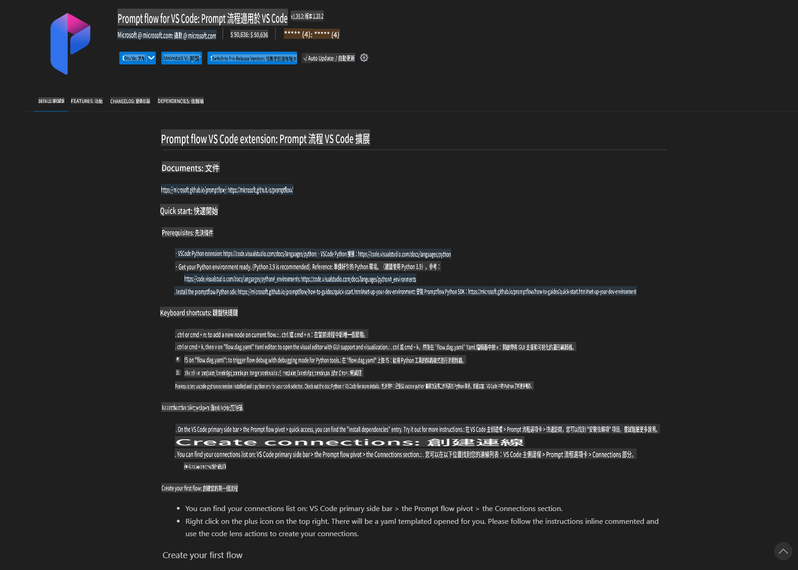
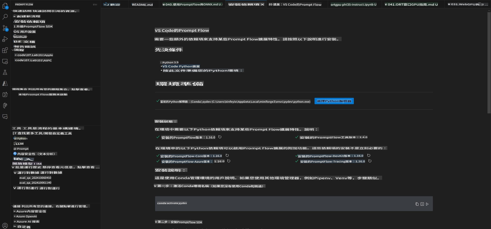
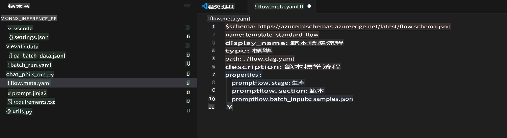
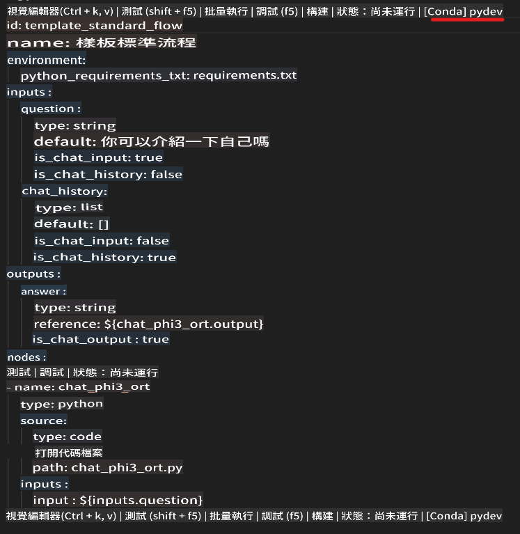
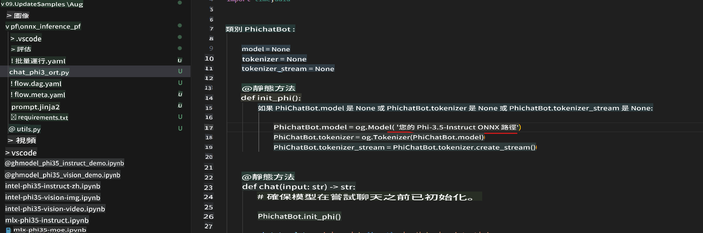
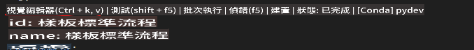
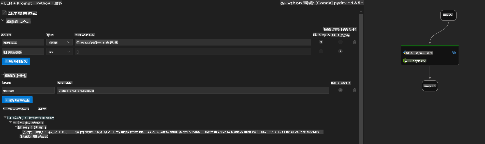
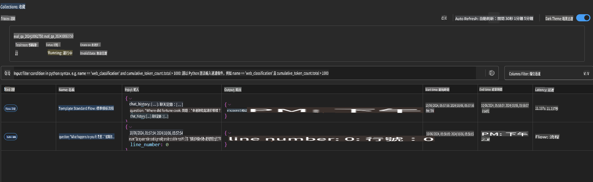

# Windows GPU ব্যবহার করে Phi-3.5-Instruct ONNX এর সাথে Prompt Flow সমাধান তৈরি করা

এই ডকুমেন্টটি একটি উদাহরণ হিসেবে দেখানো হয়েছে কিভাবে Phi-3 মডেলের উপর ভিত্তি করে AI অ্যাপ্লিকেশন তৈরি করার জন্য PromptFlow এবং ONNX (Open Neural Network Exchange) ব্যবহার করা যায়।

PromptFlow একটি ডেভেলপমেন্ট টুলের সংকলন যা LLM-ভিত্তিক (Large Language Model) AI অ্যাপ্লিকেশনগুলোর সম্পূর্ণ ডেভেলপমেন্ট সাইকেলকে সহজতর করে, যা ধারণা তৈরি থেকে শুরু করে প্রোটোটাইপিং, পরীক্ষা এবং মূল্যায়ন পর্যন্ত বিস্তৃত।

PromptFlow এবং ONNX একত্রিত করে ডেভেলপাররা নিম্নলিখিত সুবিধা পেতে পারেন:

- **মডেলের পারফরম্যান্স অপ্টিমাইজ করা**: ONNX ব্যবহার করে কার্যকর মডেল ইনফারেন্স এবং ডিপ্লয়মেন্ট সম্ভব।
- **ডেভেলপমেন্ট সহজতর করা**: PromptFlow ব্যবহার করে ওয়ার্কফ্লো পরিচালনা এবং পুনরাবৃত্ত কাজগুলো স্বয়ংক্রিয় করা যায়।
- **সহযোগিতা বৃদ্ধি করা**: একটি অভিন্ন ডেভেলপমেন্ট পরিবেশ প্রদান করে দলের সদস্যদের মধ্যে আরও ভালো সহযোগিতা নিশ্চিত করা যায়।

**Prompt flow** একটি ডেভেলপমেন্ট টুলের সংকলন যা LLM-ভিত্তিক AI অ্যাপ্লিকেশনগুলোর ধারণা তৈরি, প্রোটোটাইপিং, পরীক্ষা, মূল্যায়ন থেকে শুরু করে প্রোডাকশন ডিপ্লয়মেন্ট এবং মনিটরিং পর্যন্ত সম্পূর্ণ প্রক্রিয়াকে সহজতর করে। এটি প্রম্পট ইঞ্জিনিয়ারিংকে অনেক সহজ করে তোলে এবং প্রোডাকশন মানের LLM অ্যাপ্লিকেশন তৈরি করতে সক্ষম করে।

Prompt flow OpenAI, Azure OpenAI Service এবং কাস্টমাইজেবল মডেল (Huggingface, স্থানীয় LLM/SLM)-এর সাথে সংযোগ স্থাপন করতে পারে। আমরা Phi-3.5 এর কোয়ান্টাইজড ONNX মডেলকে স্থানীয় অ্যাপ্লিকেশনে ডিপ্লয় করতে চাই। Prompt flow আমাদের ব্যবসার পরিকল্পনা করতে এবং Phi-3.5 এর উপর ভিত্তি করে স্থানীয় সমাধান সম্পন্ন করতে সাহায্য করতে পারে। এই উদাহরণে, আমরা Windows GPU ভিত্তিক Prompt flow সমাধান সম্পন্ন করতে ONNX Runtime GenAI লাইব্রেরি ব্যবহার করব।

## **ইনস্টলেশন**

### **Windows GPU এর জন্য ONNX Runtime GenAI**

Windows GPU এর জন্য ONNX Runtime GenAI সেটআপ করতে এই নির্দেশিকা পড়ুন [এখানে ক্লিক করুন](./ORTWindowGPUGuideline.md)

### **VSCode-এ Prompt flow সেটআপ করুন**

1. Prompt flow VS Code Extension ইনস্টল করুন



2. Prompt flow VS Code Extension ইনস্টল করার পরে, এক্সটেনশনটি ক্লিক করুন এবং **Installation dependencies** নির্বাচন করে এই নির্দেশিকা অনুসরণ করে আপনার পরিবেশে Prompt flow SDK ইনস্টল করুন।



3. [নমুনা কোড](../../../../../../code/09.UpdateSamples/Aug/pf/onnx_inference_pf) ডাউনলোড করুন এবং VS Code ব্যবহার করে এই নমুনাটি খুলুন।



4. **flow.dag.yaml** খুলুন এবং আপনার Python পরিবেশ নির্বাচন করুন।



   **chat_phi3_ort.py** খুলুন এবং আপনার Phi-3.5-instruct ONNX মডেলের অবস্থান পরিবর্তন করুন।



5. আপনার Prompt flow চালান এবং পরীক্ষা করুন।

**flow.dag.yaml** খুলুন এবং ভিজ্যুয়াল এডিটর ক্লিক করুন।



এটি ক্লিক করার পরে, চালান এবং পরীক্ষা করুন।



1. টার্মিনালে ব্যাচ চালিয়ে আরও ফলাফল পরীক্ষা করতে পারেন।

```bash

pf run create --file batch_run.yaml --stream --name 'Your eval qa name'    

```

আপনার ডিফল্ট ব্রাউজারে ফলাফল পরীক্ষা করতে পারেন।



It seems like you're asking to translate the text into "mo," but could you clarify what "mo" refers to? Are you referring to a specific language, such as Moldovan (Romanian), Maori, or something else? Providing more context will help me assist you better!