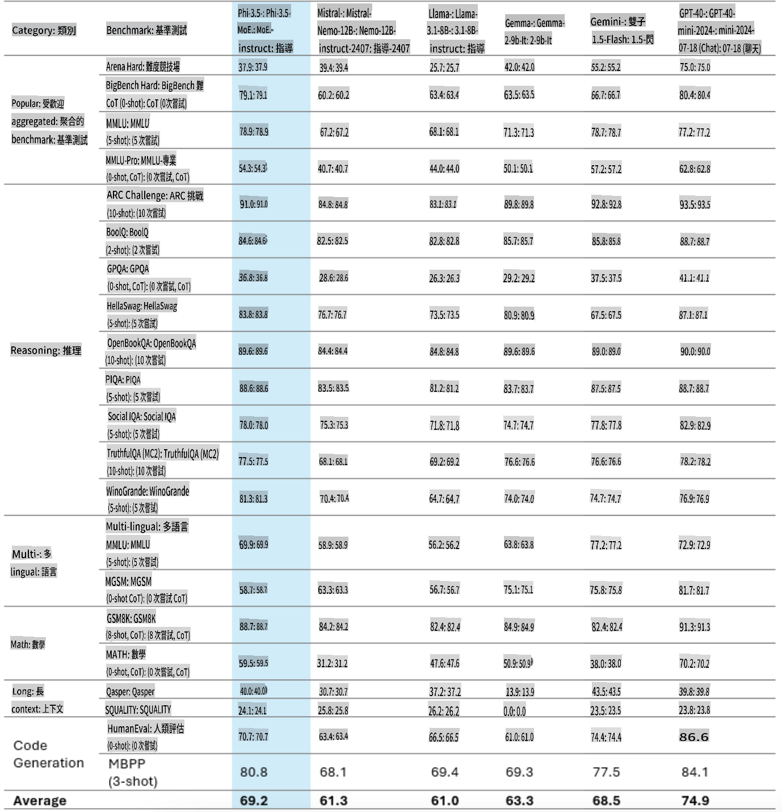
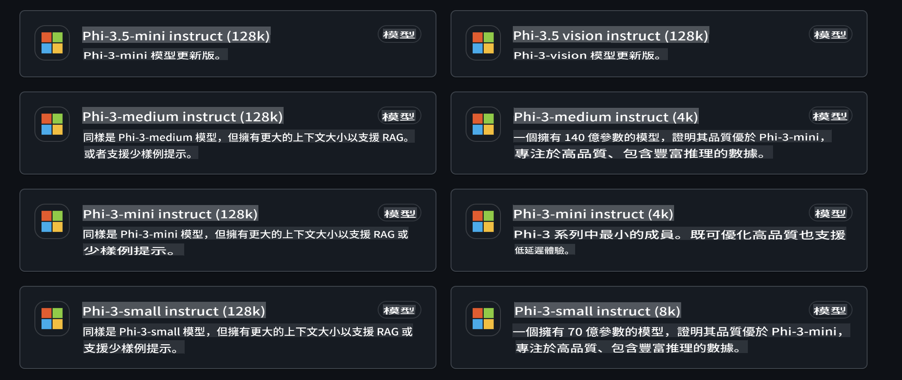
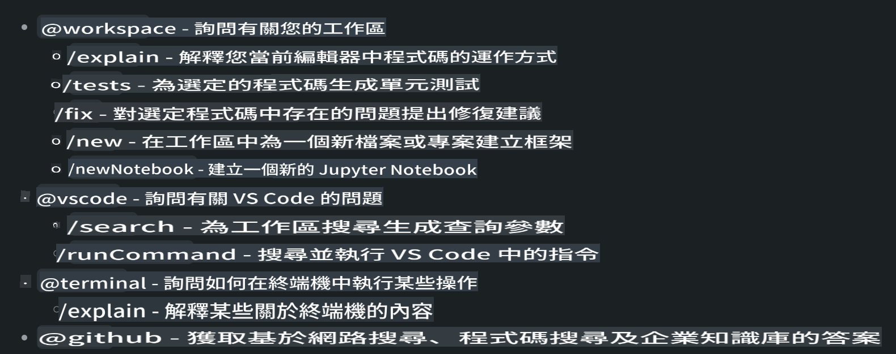
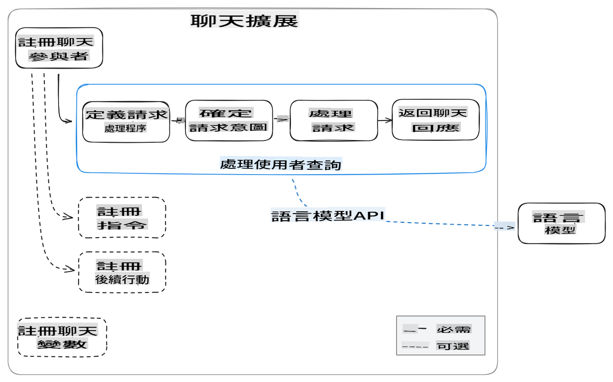
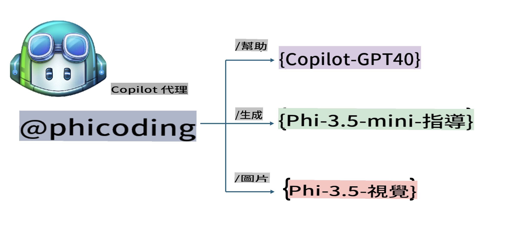
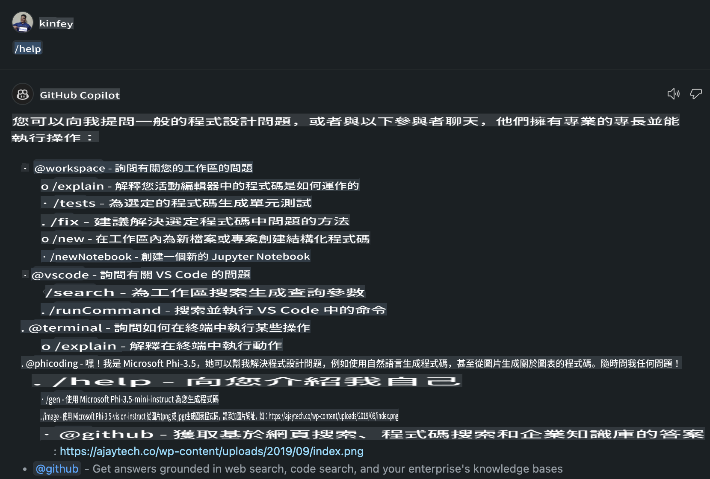
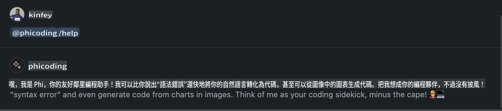
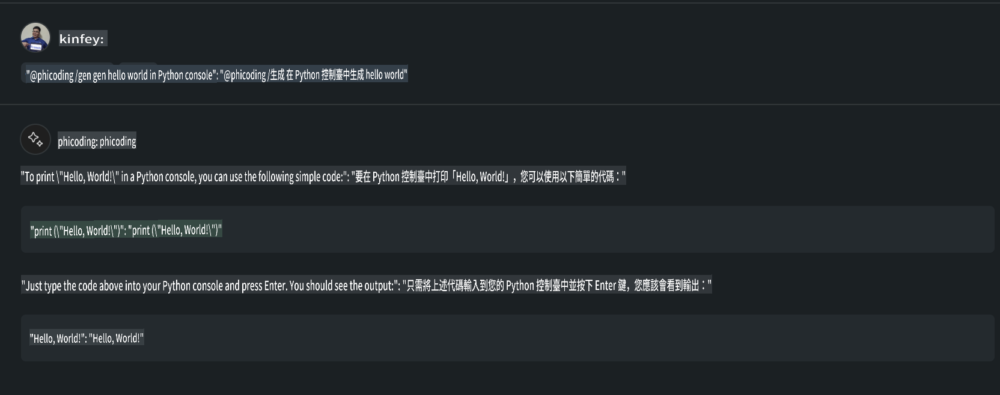
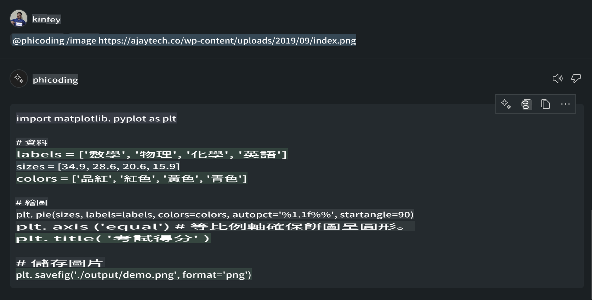

# **Phi-3.5 GitHub Models-ээр өөрийн Visual Studio Code Chat Copilot Agent үүсгэх**

Та Visual Studio Code Copilot ашигладаг уу? Ялангуяа Chat-д, та өөр өөр агентуудыг ашиглан Visual Studio Code-д төслүүдийг үүсгэх, бичих, засварлах чадварыг сайжруулж болно. Visual Studio Code нь компаниуд болон хувь хүмүүст өөрсдийн бизнесийн хэрэгцээнд нийцүүлэн агентуудыг үүсгэх API-г санал болгодог бөгөөд энэ нь тодорхой салбаруудад тэдний чадамжийг өргөжүүлэх боломжийг олгодог. Энэ нийтлэлд бид GitHub Models-ийн **Phi-3.5-mini-instruct (128k)** болон **Phi-3.5-vision-instruct (128k)** дээр төвлөрч, өөрийн Visual Studio Code Agent үүсгэх талаар авч үзнэ.

## **GitHub Models дээрх Phi-3.5-ийн тухай**

Phi-3/3.5 Family-ийн Phi-3/3.5-mini-instruct нь кодыг ойлгох, үүсгэх тал дээр өндөр чадвартай бөгөөд Gemma-2-9b болон Mistral-Nemo-12B-instruct-2407 загваруудаас давуу талтай гэдгийг бид мэднэ.



GitHub Models-ийн хамгийн сүүлийн хувилбарууд нь **Phi-3.5-mini-instruct (128k)** болон **Phi-3.5-vision-instruct (128k)** загваруудыг ашиглах боломжийг олгож байна. Хөгжүүлэгчид эдгээрт OpenAI SDK, Azure AI Inference SDK болон REST API ашиглан хандаж болно.



***Тэмдэглэл:*** Үйлдвэрлэлийн орчинд Azure Model Catalog-той илүү хялбар холбогдох боломжтой тул энд Azure AI Inference SDK-г ашиглахыг зөвлөж байна.

Доорх нь GitHub Models-той холбогдсоны дараах **Phi-3.5-mini-instruct (128k)** болон **Phi-3.5-vision-instruct (128k)** загваруудын код үүсгэх хувилбар дахь үр дүн бөгөөд дараагийн жишээнүүдэд бэлтгэл болно.

**Жишээ: GitHub Models Phi-3.5-mini-instruct (128k) Prompt-аас код үүсгэх** ([энд дарна уу](../../../../../../code/09.UpdateSamples/Aug/ghmodel_phi35_instruct_demo.ipynb))

**Жишээ: GitHub Models Phi-3.5-vision-instruct (128k) Зургаас код үүсгэх** ([энд дарна уу](../../../../../../code/09.UpdateSamples/Aug/ghmodel_phi35_vision_demo.ipynb))

## **GitHub Copilot Chat Agent-ийн тухай**

GitHub Copilot Chat Agent нь код дээр үндэслэн төслийн өөр өөр нөхцөл байдалд олон төрлийн үүрэг гүйцэтгэж чадна. Систем нь workspace, github, terminal, vscode гэсэн дөрвөн агенттай.



Агентын нэрийг ‘@’ тэмдгээр нэмснээр та холбогдох ажлыг хурдан гүйцэтгэх боломжтой. Аж ахуйн нэгжүүдийн хувьд, хэрэв та өөрийн бизнесийн шаардлага, код бичих, тестийн үзүүлэлтүүд болон хувилбар зэрэг агуулгыг нэмэх юм бол GitHub Copilot дээр суурилсан илүү хүчирхэг хувийн функцүүдтэй болно.

Visual Studio Code Chat Agent нь одоо API-аа албан ёсоор гаргасан бөгөөд аж ахуйн нэгжүүд болон хөгжүүлэгчид өөрсдийн бизнесийн экосистемд нийцсэн агентуудыг хөгжүүлэх боломжтой болсон. Visual Studio Code Extension хөгжүүлэлтийн аргачлал дээр суурилан, та Visual Studio Code Chat Agent API-ийн интерфэйст хялбархан хандаж болно. Бид дараах үйл явцын дагуу хөгжүүлэлт хийх боломжтой.



Энэхүү хөгжүүлэлтийн нөхцөл нь гуравдагч талын загварын API-ууд (GitHub Models, Azure Model Catalog, нээлттэй эхийн загварууд дээр суурилсан өөрийн үйлчилгээ гэх мэт)-ийг дэмжих боломжтой бөгөөд GitHub Copilot-оос өгсөн gpt-35-turbo, gpt-4, gpt-4o загваруудыг ашиглах боломжтой.

## **Phi-3.5 дээр суурилсан @phicoding агент нэмэх**

Phi-3.5-ийн программчлалын чадварыг нэгтгэн, код бичих, зурагнаас код үүсгэх болон бусад үүргийг гүйцэтгэх боломжтой агент @PHI-г бүтээе. Доорх нь зарим функцууд юм:

1. **@phicoding /help** командыг ашиглан GitHub Copilot-оос өгсөн GPT-4o дээр үндэслэн өөрийгөө танилцуулах текст үүсгэх.

2. **@phicoding /gen** командыг ашиглан **Phi-3.5-mini-instruct (128k)** дээр үндэслэн өөр өөр програмчлалын хэлний код үүсгэх.

3. **@phicoding /image** командыг ашиглан **Phi-3.5-vision-instruct (128k)** дээр үндэслэн код үүсгэх болон зурагны гүйцэтгэл хийх.



## **Холбогдох алхмууд**

1. npm ашиглан Visual Studio Code Extension хөгжүүлэлтийн дэмжлэг суулгах.

```bash

npm install --global yo generator-code 

```

2. Visual Studio Code Extension залгаас үүсгэх (Typescript хөгжүүлэлтийн горим ашиглан, phiext нэртэй).

```bash

yo code 

```

3. Үүсгэсэн төслийг нээгээд package.json-ийг засах. Энд GitHub Models-ийн зааварчилгаа, тохиргоо болон таны GitHub Models token-ийг нэмэх шаардлагатай.

```json

{
  "name": "phiext",
  "displayName": "phiext",
  "description": "",
  "version": "0.0.1",
  "engines": {
    "vscode": "^1.93.0"
  },
  "categories": [
    "AI",
    "Chat"
  ],
  "activationEvents": [],
  "enabledApiProposals": [
      "chatVariableResolver"
  ],
  "main": "./dist/extension.js",
  "contributes": {
    "chatParticipants": [
        {
            "id": "chat.phicoding",
            "name": "phicoding",
            "description": "Hey! I am Microsoft Phi-3.5, She can help me with coding problems, such as generation code with your natural language, or even generation code about chart from images. Just ask me anything!",
            "isSticky": true,
            "commands": [
                {
                    "name": "help",
                    "description": "Introduce myself to you"
                },
                {
                    "name": "gen",
                    "description": "Generate code for you with Microsoft Phi-3.5-mini-instruct"
                },
                {
                    "name": "image",
                    "description": "Generate code for chart from image(png or jpg) with Microsoft Phi-3.5-vision-instruct, please add image url like this : https://ajaytech.co/wp-content/uploads/2019/09/index.png"
                }
            ]
        }
    ],
    "commands": [
        {
            "command": "phicoding.namesInEditor",
            "title": "Use Microsoft Phi 3.5 in Editor"
        }
    ],
    "configuration": {
      "type": "object",
      "title": "githubmodels",
      "properties": {
        "githubmodels.endpoint": {
          "type": "string",
          "default": "https://models.inference.ai.azure.com",
          "description": "Your GitHub Models Endpoint",
          "order": 0
        },
        "githubmodels.api_key": {
          "type": "string",
          "default": "Your GitHub Models Token",
          "description": "Your GitHub Models Token",
          "order": 1
        },
        "githubmodels.phi35instruct": {
          "type": "string",
          "default": "Phi-3.5-mini-instruct",
          "description": "Your Phi-35-Instruct Model",
          "order": 2
        },
        "githubmodels.phi35vision": {
          "type": "string",
          "default": "Phi-3.5-vision-instruct",
          "description": "Your Phi-35-Vision Model",
          "order": 3
        }
      }
    }
  },
  "scripts": {
    "vscode:prepublish": "npm run package",
    "compile": "webpack",
    "watch": "webpack --watch",
    "package": "webpack --mode production --devtool hidden-source-map",
    "compile-tests": "tsc -p . --outDir out",
    "watch-tests": "tsc -p . -w --outDir out",
    "pretest": "npm run compile-tests && npm run compile && npm run lint",
    "lint": "eslint src",
    "test": "vscode-test"
  },
  "devDependencies": {
    "@types/vscode": "^1.93.0",
    "@types/mocha": "^10.0.7",
    "@types/node": "20.x",
    "@typescript-eslint/eslint-plugin": "^8.3.0",
    "@typescript-eslint/parser": "^8.3.0",
    "eslint": "^9.9.1",
    "typescript": "^5.5.4",
    "ts-loader": "^9.5.1",
    "webpack": "^5.94.0",
    "webpack-cli": "^5.1.4",
    "@vscode/test-cli": "^0.0.10",
    "@vscode/test-electron": "^2.4.1"
  },
  "dependencies": {
    "@types/node-fetch": "^2.6.11",
    "node-fetch": "^3.3.2",
    "@azure-rest/ai-inference": "latest",
    "@azure/core-auth": "latest",
    "@azure/core-sse": "latest"
  }
}


```

4. src/extension.ts файлыг засах.

```typescript

// The module 'vscode' contains the VS Code extensibility API
// Import the module and reference it with the alias vscode in your code below
import * as vscode from 'vscode';
import ModelClient from "@azure-rest/ai-inference";
import { AzureKeyCredential } from "@azure/core-auth";


interface IPhiChatResult extends vscode.ChatResult {
    metadata: {
        command: string;
    };
}


const MODEL_SELECTOR: vscode.LanguageModelChatSelector = { vendor: 'copilot', family: 'gpt-4o' };

function isValidImageUrl(url: string): boolean {
    const regex = /^(https?:\/\/.*\.(?:png|jpg))$/i;
    return regex.test(url);
}
  

// This method is called when your extension is activated
// Your extension is activated the very first time the command is executed
export function activate(context: vscode.ExtensionContext) {

    const codinghandler: vscode.ChatRequestHandler = async (request: vscode.ChatRequest, context: vscode.ChatContext, stream: vscode.ChatResponseStream, token: vscode.CancellationToken): Promise<IPhiChatResult> => {


        const config : any = vscode.workspace.getConfiguration('githubmodels');
        const endPoint: string = config.get('endpoint');
        const apiKey: string = config.get('api_key');
        const phi35instruct: string = config.get('phi35instruct');
        const phi35vision: string = config.get('phi35vision');
        
        if (request.command === 'help') {

            const content = "Welcome to Coding assistant with Microsoft Phi-3.5"; 
            stream.progress(content);


            try {
                const [model] = await vscode.lm.selectChatModels(MODEL_SELECTOR);
                if (model) {
                    const messages = [
                        vscode.LanguageModelChatMessage.User("Please help me express this content in a humorous way: I am a programming assistant who can help you convert natural language into code and generate code based on the charts in the images. output format like this : Hey I am Phi ......")
                    ];
                    const chatResponse = await model.sendRequest(messages, {}, token);
                    for await (const fragment of chatResponse.text) {
                        stream.markdown(fragment);
                    }
                }
            } catch(err) {
                console.log(err);
            }


            return { metadata: { command: 'help' } };

        }

        
        if (request.command === 'gen') {

            const content = "Welcome to use phi-3.5 to generate code";

            stream.progress(content);

            const client = new ModelClient(endPoint, new AzureKeyCredential(apiKey));

            const response = await client.path("/chat/completions").post({
              body: {
                messages: [
                  { role:"system", content: "You are a coding assistant.Help answer all code generation questions." },
                  { role:"user", content: request.prompt }
                ],
                model: phi35instruct,
                temperature: 0.4,
                max_tokens: 1000,
                top_p: 1.
              }
            });

            stream.markdown(response.body.choices[0].message.content);

            return { metadata: { command: 'gen' } };

        }


        
        if (request.command === 'image') {


            const content = "Welcome to use phi-3.5 to generate code from image(png or jpg),image url like this:https://ajaytech.co/wp-content/uploads/2019/09/index.png";

            stream.progress(content);

            if (!isValidImageUrl(request.prompt)) {
                stream.markdown('Please provide a valid image URL');
                return { metadata: { command: 'image' } };
            }
            else
            {

                const client = new ModelClient(endPoint, new AzureKeyCredential(apiKey));
    
                const response = await client.path("/chat/completions").post({
                    body: {
                      messages: [
                        { role: "system", content: "You are a helpful assistant that describes images in details." },
                        { role: "user", content: [
                            { type: "text", text: "Please generate code according to the chart in the picture according to the following requirements\n1. Keep all information in the chart, including data and text\n2. Do not generate additional information that is not included in the chart\n3. Please extract data from the picture, do not generate it from csv\n4. Please save the regenerated chart as a chart and save it to ./output/demo.png"},
                            { type: "image_url", image_url: {url: request.prompt}
                            }
                          ]
                        }
                      ],
                      model: phi35vision,
                      temperature: 0.4,
                      max_tokens: 2048,
                      top_p: 1.
                    }
                  });
    
                
                stream.markdown(response.body.choices[0].message.content);
    
                return { metadata: { command: 'image' } };
            }


        }


        return { metadata: { command: '' } };
    };


    const phi_ext = vscode.chat.createChatParticipant("chat.phicoding", codinghandler);

    phi_ext.iconPath = new vscode.ThemeIcon('sparkle');


    phi_ext.followupProvider = {
        provideFollowups(result: IPhiChatResult, context: vscode.ChatContext, token: vscode.CancellationToken) {
            return [{
                prompt: 'Let us coding with Phi-3.5 😋😋😋😋',
                label: vscode.l10n.t('Enjoy coding with Phi-3.5'),
                command: 'help'
            } satisfies vscode.ChatFollowup];
        }
    };

    context.subscriptions.push(phi_ext);
}

// This method is called when your extension is deactivated
export function deactivate() {}


```

6. Ажиллуулах.

***/help***



***@phicoding /help***



***@phicoding /gen***



***@phicoding /image***



Та жишээ кодыг татаж авах боломжтой: [энд дарна уу](../../../../../../code/09.UpdateSamples/Aug/vscode)

## **Нөөцүүд**

1. GitHub Models-д бүртгүүлэх [https://gh.io/models](https://gh.io/models)

2. Visual Studio Code Extension хөгжүүлэлтийн талаар суралцах [https://code.visualstudio.com/api/get-started/your-first-extension](https://code.visualstudio.com/api/get-started/your-first-extension)

3. Visual Studio Code Coilot Chat API-ийн талаар суралцах [https://code.visualstudio.com/api/extension-guides/chat](https://code.visualstudio.com/api/extension-guides/chat)

It seems like "mo" could refer to a specific language or dialect. Could you please clarify which language you are referring to by "mo"? For example, it could mean Maori, Montenegrin, Mon, or something else. Let me know so I can assist you accurately!