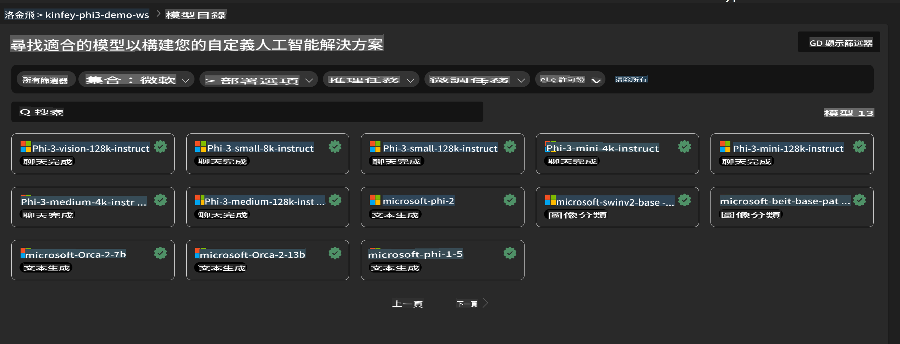
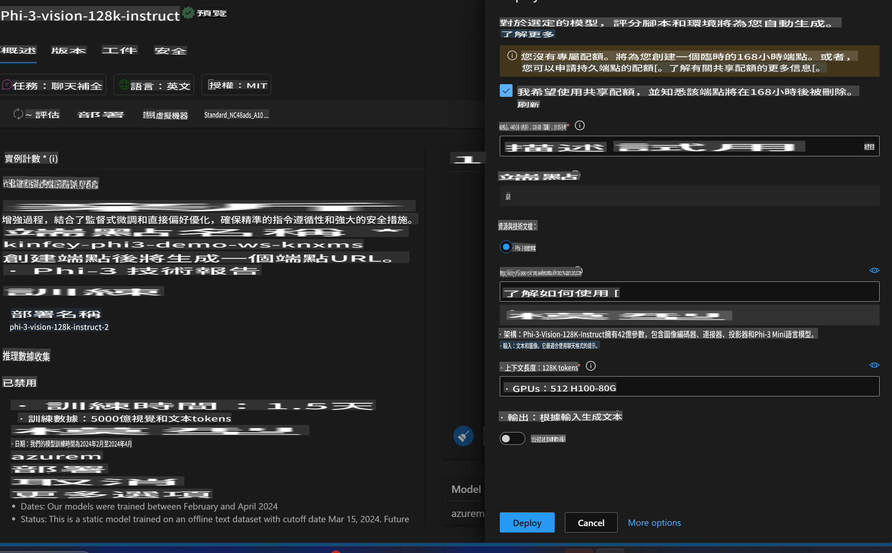
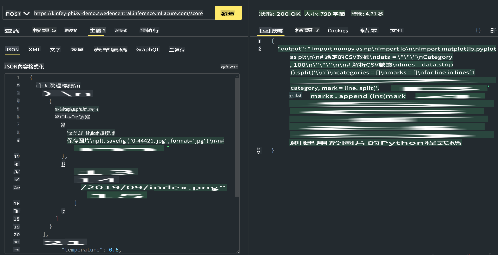

# **Lab 3 - Azure Machine Learning Service में Phi-3-Vision डिप्लॉय करें**

हम NPU का उपयोग करके लोकल कोड का प्रोडक्शन डिप्लॉयमेंट पूरा करेंगे, और फिर Phi-3-Vision की क्षमता को इसमें जोड़ने की कोशिश करेंगे ताकि तस्वीरों से कोड जनरेट किया जा सके।

इस परिचय में, हम Azure Machine Learning Service में तेजी से एक Model As Service Phi-3 Vision सेवा बना सकते हैं।

***Note***: Phi-3 Vision को तेज़ी से कंटेंट जनरेट करने के लिए कंप्यूटिंग पावर की आवश्यकता होती है। हमें इसे हासिल करने के लिए क्लाउड कंप्यूटिंग पावर की जरूरत है।

### **1. Azure Machine Learning Service बनाएं**

हमें Azure Portal में Azure Machine Learning Service बनानी होगी। अगर आप जानना चाहते हैं कि यह कैसे करें, तो कृपया इस लिंक पर जाएं: [https://learn.microsoft.com/azure/machine-learning/quickstart-create-resources?view=azureml-api-2](https://learn.microsoft.com/azure/machine-learning/quickstart-create-resources?view=azureml-api-2)

### **2. Azure Machine Learning Service में Phi-3 Vision चुनें**



### **3. Azure में Phi-3-Vision डिप्लॉय करें**



### **4. Postman में Endpoint टेस्ट करें**



***Note***

1. भेजे जाने वाले पैरामीटर्स में Authorization, azureml-model-deployment, और Content-Type शामिल होना चाहिए। आपको इसे प्राप्त करने के लिए डिप्लॉयमेंट की जानकारी जांचनी होगी।

2. पैरामीटर्स भेजने के लिए, Phi-3-Vision को एक इमेज लिंक भेजनी होगी। कृपया GPT-4-Vision के तरीके का संदर्भ लें और पैरामीटर्स भेजें, जैसे:

```json

{
  "input_data":{
    "input_string":[
      {
        "role":"user",
        "content":[ 
          {
            "type": "text",
            "text": "You are a Python coding assistant.Please create Python code for image "
          },
          {
              "type": "image_url",
              "image_url": {
                "url": "https://ajaytech.co/wp-content/uploads/2019/09/index.png"
              }
          }
        ]
      }
    ],
    "parameters":{
          "temperature": 0.6,
          "top_p": 0.9,
          "do_sample": false,
          "max_new_tokens": 2048
    }
  }
}

```

3. **/score** को Post मेथड का उपयोग करके कॉल करें।

**बधाई हो**! आपने तेजी से PHI-3-VISION का डिप्लॉयमेंट पूरा कर लिया है और यह आज़माया कि तस्वीरों का उपयोग करके कोड कैसे जनरेट किया जा सकता है। अब हम NPU और क्लाउड के संयोजन से एप्लिकेशन बना सकते हैं।

It seems like "mo" might refer to a specific language or abbreviation, but it's not clear which one you mean. Could you clarify the language you'd like me to translate this text into? For example, do you mean Maori, Mongolian, or something else? Let me know so I can assist you accurately!