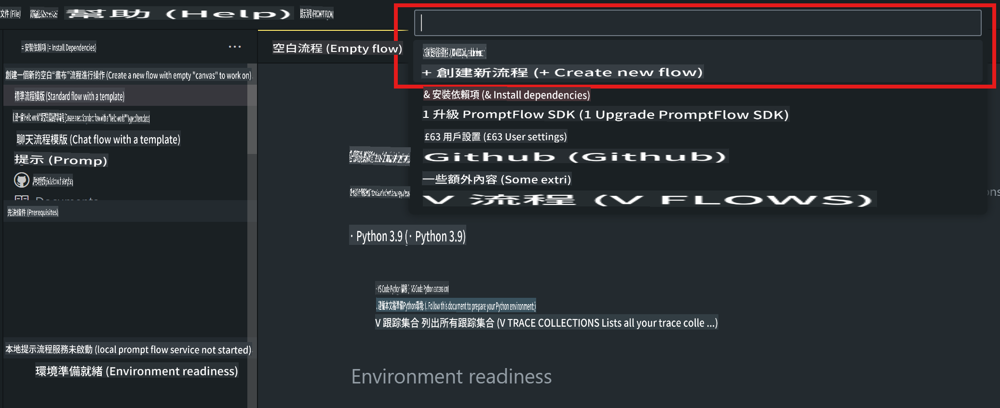
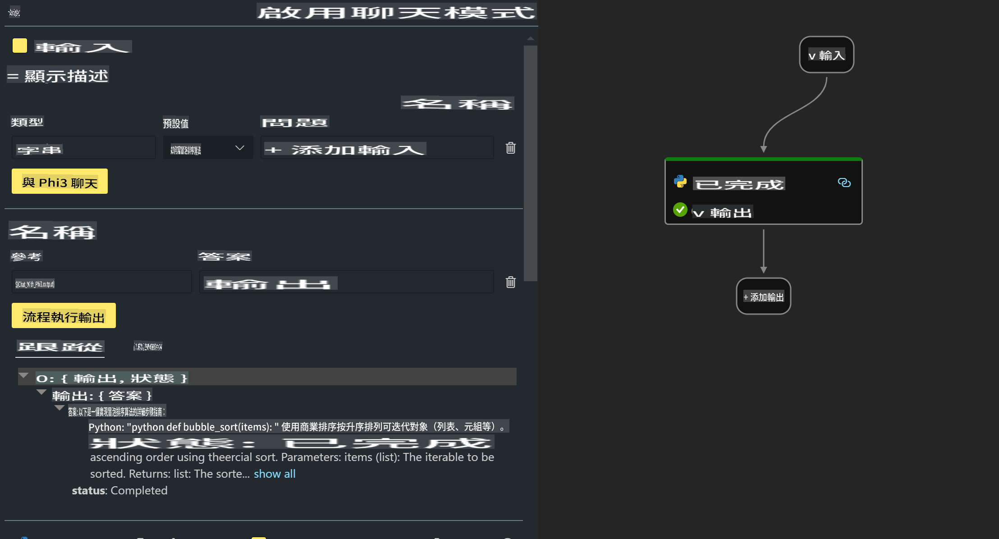

# **Lab 2 - Prompt flow ကို AIPC တွင် Phi-3-mini နှင့် အသုံးပြုရန်**

## **Prompt flow ဆိုတာဘာလဲ**

Prompt flow သည် LLM အခြေခံ AI အက်ပ်များအား စိတ်ကူးထုတ်ခြင်း၊ ပုံစံဆွဲခြင်း၊ စမ်းသပ်ခြင်း၊ အကဲဖြတ်ခြင်းမှ စတင်၍ ထုတ်လုပ်မှုအဆင့်နှင့် စောင့်ကြည့်မှုအထိ အဆုံးမီ တိုးတက်မှုဆိုင်ရာ လုပ်ငန်းစဉ်ကို သက်သာစေသော တိုးတက်ရေးကိရိယာများ စုစည်းမှုတစ်ခုဖြစ်သည်။ ၎င်းသည် prompt engineering ကို ပိုမိုလွယ်ကူစေပြီး LLM အက်ပ်များကို ထုတ်လုပ်မှုအဆင့်အရည်အသွေးဖြင့် တည်ဆောက်နိုင်စေသည်။

Prompt flow အသုံးပြုခြင်းဖြင့် သင်သည် အောက်ပါအရာများကို ပြုလုပ်နိုင်မည်ဖြစ်သည် -

- LLMs, prompts, Python code နှင့် အခြားကိရိယာများကို ပေါင်းစပ်ထားသော workflow တစ်ခုအဖြစ် ဖန်တီးရန်။

- LLMs နှင့် ဆက်သွယ်မှုကို အလွယ်တကူ ပြုပြင်နှိင်ရန်၊ သင့် flows ကို debug နှင့် iterate ပြုလုပ်ရန်။

- flows များကို အကဲဖြတ်ပြီး၊ ပိုမိုကြီးမားသော dataset များဖြင့် အရည်အသွေးနှင့် စွမ်းဆောင်ရည် metrics များကိုတွက်ချက်ရန်။

- Testing နှင့် အကဲဖြတ်မှုကို သင့် CI/CD စနစ်ထဲတွင် ပေါင်းစပ်၍ flow ၏ အရည်အသွေးကို အာမခံရန်။

- flows များကို သင့် ရွေးချယ်သော serving platform သို့ deploy ပြုလုပ်ရန်၊ သို့မဟုတ် သင့် app ၏ code base ထဲတွင် လွယ်ကူစွာ ပေါင်းစည်းရန်။

- (ရွေးချယ်နိုင်သော်လည်း အကြံပြုထားသည်) Azure AI တွင် Prompt flow ၏ cloud version ကို အသုံးပြု၍ သင့်အဖွဲ့နှင့် ပူးပေါင်းဆောင်ရွက်ရန်။


## **Apple Silicon တွင် generation code flows တည်ဆောက်ခြင်း**

***Note*** ：Environment installation ကို မပြီးမြောက်သေးပါက [Lab 0 -Installations](./01.Installations.md) သို့ သွားပါ။

1. Visual Studio Code တွင် Prompt flow Extension ကိုဖွင့်ပြီး flow project အသစ်တစ်ခု ဖန်တီးပါ။



2. Inputs နှင့် Outputs parameters များ ထည့်သွင်းပြီး Python Code ကို flow အသစ်အဖြစ် ထည့်ပါ။



flow.dag.yaml ကို အောက်ပါဖွဲ့စည်းမှုအတိုင်း ကိုးကား၍ တည်ဆောက်နိုင်သည်။

```yaml

inputs:
  prompt:
    type: string
    default: Write python code for Fibonacci serie. Please use markdown as output
outputs:
  result:
    type: string
    reference: ${gen_code_by_phi3.output}
nodes:
- name: gen_code_by_phi3
  type: python
  source:
    type: code
    path: gen_code_by_phi3.py
  inputs:
    prompt: ${inputs.prompt}


```

3. phi-3-mini ကို quantify ပြုလုပ်ပါ။

SLM ကို ဒေသတွင်းစက်များတွင် ပိုမိုကောင်းမွန်စွာ လည်ပတ်စေရန် ငါတို့က generally မော်ဒယ်ကို (INT4, FP16, FP32) quantify ပြုလုပ်သည်။

```bash

python -m mlx_lm.convert --hf-path microsoft/Phi-3-mini-4k-instruct

```

**မှတ်ချက်:** default folder သည် mlx_model ဖြစ်သည်။

4. ***Chat_With_Phi3.py*** တွင် Code ထည့်ပါ။

```python


from promptflow import tool

from mlx_lm import load, generate


# The inputs section will change based on the arguments of the tool function, after you save the code
# Adding type to arguments and return value will help the system show the types properly
# Please update the function name/signature per need
@tool
def my_python_tool(prompt: str) -> str:

    model_id = './mlx_model_phi3_mini'

    model, tokenizer = load(model_id)

    # <|user|>\nWrite python code for Fibonacci serie. Please use markdown as output<|end|>\n<|assistant|>

    response = generate(model, tokenizer, prompt="<|user|>\n" + prompt  + "<|end|>\n<|assistant|>", max_tokens=2048, verbose=True)

    return response


```

4. Debug သို့မဟုတ် Run မှတစ်ဆင့် flow ကို စမ်းသပ်ပြီး generation code အဆင်ပြေမပြေ စစ်ဆေးပါ။


5. Terminal တွင် development API အဖြစ် flow ကို run ပြုလုပ်ပါ။

```

pf flow serve --source ./ --port 8080 --host localhost   

```

Postman / Thunder Client တွင် စမ်းသပ်နိုင်သည်။


### **မှတ်ချက်များ**

1. ပထမဆုံး run ပြုလုပ်ခြင်းသည် အချိန်ကြာသည်။ Hugging face CLI မှ phi-3 model ကို download ပြုလုပ်ရန် အကြံပြုသည်။

2. Intel NPU ၏ စွမ်းဆောင်ရည် အကန့်အသတ်များကို စဉ်းစား၍ Phi-3-mini-4k-instruct ကို အသုံးပြုရန် အကြံပြုသည်။

3. INT4 conversion အတွက် Intel NPU Acceleration ကို အသုံးပြု၍ quantize ပြုလုပ်သည်။ သို့သော် service ကို ပြန်လည် run ပြုလုပ်ရန် cache နှင့် nc_workshop folders ကို delete ပြုလုပ်ရန် လိုအပ်သည်။


## **Resources**

1. Promptflow ကို သင်ယူရန် [https://microsoft.github.io/promptflow/](https://microsoft.github.io/promptflow/)

2. Intel NPU Acceleration ကို သင်ယူရန် [https://github.com/intel/intel-npu-acceleration-library](https://github.com/intel/intel-npu-acceleration-library)

3. Sample Code ကို download ပြုလုပ်ရန် [Local NPU Agent Sample Code](../../../../../../../../../code/07.Lab/01/AIPC/local-npu-agent)

It seems you've requested a translation to "mo," but it's unclear what specific language or dialect "mo" refers to. Could you clarify the language you want the text translated into? For example, are you referring to Māori, Mongolian, or something else?