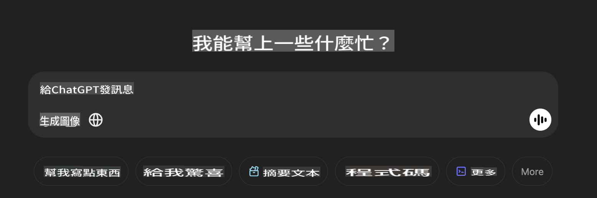

## **Phi-4-multimodal က အမြင်အာရုံပုံများ ဖတ်ပြီး ကုဒ်ဖန်တီးနိုင်ပါတယ်**

Phi-4-multimodal မှာ ပုံဖတ်ခြင်းဆိုင်ရာ အရည်အချင်းတွေ ပြင်းထန်ပါတယ်။ Python ကို သုံးပြီး အောက်ပါ လုပ်ဆောင်ချက်တွေကို ပြုလုပ်ကြည့်ရအောင်။ ပုံက ChatGPT စာမျက်နှာတစ်ခု ဖြစ်ပါတယ်။



### **နမူနာ ကုဒ်**

```python

import requests
import torch
from PIL import Image
import soundfile
from transformers import AutoModelForCausalLM, AutoProcessor, GenerationConfig,pipeline,AutoTokenizer

model_path = 'Your Phi-4-multimodal location'

kwargs = {}
kwargs['torch_dtype'] = torch.bfloat16

processor = AutoProcessor.from_pretrained(model_path, trust_remote_code=True)

model = AutoModelForCausalLM.from_pretrained(
    model_path,
    trust_remote_code=True,
    torch_dtype='auto',
    _attn_implementation='flash_attention_2',
).cuda()

generation_config = GenerationConfig.from_pretrained(model_path, 'generation_config.json')

user_prompt = '<|user|>'
assistant_prompt = '<|assistant|>'
prompt_suffix = '<|end|>'

prompt = f'{user_prompt}Can you generate HTML + JS code about this image <|image_1|> ? Please step by step {prompt_suffix}{assistant_prompt}'

image = Image.open("./demo.png")

inputs = processor(text=prompt, images=[image], return_tensors='pt').to('cuda:0')

generate_ids = model.generate(
    **inputs,
    max_new_tokens=4096,
    generation_config=generation_config,
)

generate_ids = generate_ids[:, inputs['input_ids'].shape[1] :]

response = processor.batch_decode(
    generate_ids, skip_special_tokens=True, clean_up_tokenization_spaces=False
)[0]

print(response)

```

It seems like you are asking to translate the provided text into "mo." Could you clarify what "mo" refers to? Are you referring to a specific language, such as Maori, Mongolian, or something else? Let me know so I can assist you accurately!