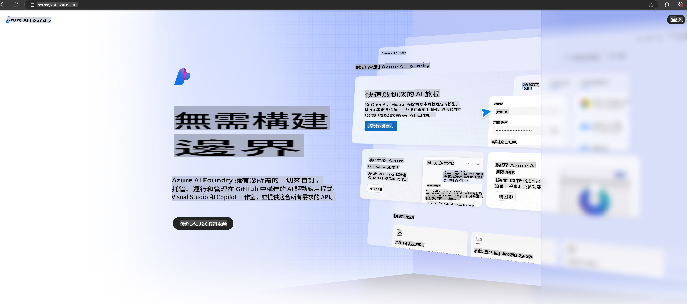

# **Phi-3-ийг Azure AI Foundry-д ашиглах**

Генератив AI хөгжүүлэлтийн ачаар, бид өөр өөр LLM болон SLM-ийг удирдах, байгууллагын өгөгдөлтэй интеграц хийх, нарийвчлан тохируулах/RAG үйлдлүүдийг гүйцэтгэх, мөн LLM болон SLM-ийг нэвтрүүлсний дараах байгууллагын бизнесийн үнэлгээг хийх зэрэг ажлуудыг нэг платформ дээр төвлөрүүлэн удирдах боломжийг эрэлхийлж байна. [Azure AI Foundry](https://ai.azure.com) нь байгууллагын түвшний генератив AI програмын платформ юм.

Azure AI Foundry-ийн тусламжтайгаар та томоохон хэлний загваруудын (LLM) хариу үйлдлийг үнэлж, prompt flow ашиглан prompt програмын бүрэлдэхүүн хэсгүүдийг зохицуулж, гүйцэтгэлийг сайжруулж чадна. Энэхүү платформ нь туршилтын концепцуудыг бүрэн хэмжээний үйлдвэрлэлийн програм болгон хувиргах явцыг хялбарчилж, өргөтгөх боломжийг олгодог. Үргэлжлэн хяналт тавих, сайжруулах үйл ажиллагаа нь урт хугацааны амжилтыг дэмждэг.

Бид Phi-3 загварыг Azure AI Foundry дээр хурдан байршуулж, дараа нь Azure AI Foundry ашиглан Phi-3 холбогдох Playground/Chat, нарийвчлан тохируулах, үнэлгээ зэрэг ажлуудыг гүйцэтгэж чадна.

## **1. Бэлтгэл ажил**

Хэрэв таны төхөөрөмж дээр [Azure Developer CLI](https://learn.microsoft.com/azure/developer/azure-developer-cli/overview?WT.mc_id=aiml-138114-kinfeylo) суулгасан бол энэ загварыг ашиглах нь шинэ хавтас дотор дараах командыг ажиллуулахтай адил энгийн.

## Гар аргаар үүсгэх

Microsoft Azure AI Foundry төсөл болон hub үүсгэх нь таны AI ажлыг зохион байгуулж, удирдахад маш сайн арга юм. Эндээс эхлэх алхмуудыг зааж өгье:

### Azure AI Foundry-д төсөл үүсгэх

1. **Azure AI Foundry руу орох**: Azure AI Foundry порталд нэвтэрнэ үү.
2. **Төсөл үүсгэх**:
   - Хэрэв та төсөл дээр ажиллаж байгаа бол, хуудасны зүүн дээд буланд байрлах "Azure AI Foundry"-г сонгож, Нүүр хуудас руу шилжинэ үү.
   - "+ Create project" товчийг сонгоно уу.
   - Төслийн нэр оруулна уу.
   - Хэрэв танд hub байгаа бол энэ нь анхдагчаар сонгогдох болно. Хэрэв танд олон hub-д хандах эрх байгаа бол доош унах цэснээс өөр нэгийг сонгож болно. Хэрэв та шинэ hub үүсгэхийг хүсвэл "Create new hub"-г сонгож, нэр оруулна уу.
   - "Create"-г сонгоно уу.

### Azure AI Foundry-д Hub үүсгэх

1. **Azure AI Foundry руу орох**: Azure бүртгэлээрээ нэвтэрнэ үү.
2. **Hub үүсгэх**:
   - Зүүн цэснээс Management center-ийг сонгоно уу.
   - "All resources"-ийг сонгож, дараа нь "+ New project"-ын хажууд байрлах сумыг дарж "+ New hub"-г сонгоно уу.
   - "Create a new hub" цонхонд hub-ийн нэр (жишээ нь, contoso-hub) оруулж, бусад талбаруудыг хүссэнээрээ өөрчилнө үү.
   - "Next"-ийг сонгож, мэдээллийг шалгасны дараа "Create"-г дарна уу.

Дэлгэрэнгүй заавар авахыг хүсвэл [Microsoft-ийн албан ёсны баримт бичиг](https://learn.microsoft.com/azure/ai-studio/how-to/create-projects)-ийг үзнэ үү.

Амжилттай үүсгэсний дараа та үүсгэсэн студио руугаа [ai.azure.com](https://ai.azure.com/) хаягаар нэвтрэх боломжтой.

Нэг AI Foundry дээр хэд хэдэн төсөл байж болно. AI Foundry дээр төсөл үүсгэж, бэлтгэлээ хангана уу.

Azure AI Foundry [QuickStarts](https://learn.microsoft.com/azure/ai-studio/quickstarts/get-started-code)

## **2. Azure AI Foundry-д Phi загварыг байршуулна**

Төслийн Explore хэсгийг сонгож, Model Catalog руу орж, Phi-3-ийг сонгоно уу.

Phi-3-mini-4k-instruct-ийг сонгоно уу.

Phi-3-mini-4k-instruct загварыг байршуулж, 'Deploy'-г дарна уу.

> [!NOTE]
>
> Байршуулах үед тооцоолох хүчин чадлыг сонгох боломжтой.

## **3. Azure AI Foundry дээр Phi-тай Playground Chat хийх**

Байршуулах хуудас руу очиж, Playground-г сонгоод Azure AI Foundry-ийн Phi-3-тай чатлах.

## **4. Azure AI Foundry-оос загвар байрлуулах**

Azure Model Catalog-оос загвар байрлуулахын тулд дараах алхмуудыг дагана уу:

- Azure AI Foundry-д нэвтэрнэ үү.
- Azure AI Foundry загварын каталогоос байрлуулахыг хүссэн загвараа сонгоно уу.
- Загварын Details хуудас дээр Deploy-г сонгож, дараа нь Serverless API with Azure AI Content Safety-г сонгоно уу.
- Загвараа байрлуулахыг хүссэн төслөө сонгоно уу. Serverless API-г ашиглахын тулд таны workspace East US 2 эсвэл Sweden Central бүсэд байх шаардлагатай. Deployment нэрийг өөрчлөх боломжтой.
- Байршуулах мастер цонхонд Pricing and terms-г сонгож, үнийн нөхцөлтэй танилцана уу.
- Deploy-г сонгоно уу. Байршуулах үйл явц дуусахыг хүлээгээд, Deployments хуудас руу чиглүүлэгдэх болно.
- Open in playground-г сонгож, загвартай харилцахыг эхлүүлнэ үү.
- Deployments хуудас руу буцаж очиж, байршилт сонгоод, Endpoint-ийн Target URL болон Secret Key-г тэмдэглэж авна уу. Эдгээрийг ашиглан байршилт руу хандаж, гүйцэтгэл үүсгэж болно.
- Endpoint-ийн дэлгэрэнгүй мэдээлэл, URL, хандалтын түлхүүрүүдийг Build таб руу орж, Components хэсгээс Deployments-г сонгосноор олж болно.

> [!NOTE]
> Эдгээр алхмуудыг гүйцэтгэхийн тулд таны бүртгэл Resource Group дээр Azure AI Developer role-ийн зөвшөөрөлтэй байх шаардлагатай.

## **5. Azure AI Foundry-д Phi API ашиглах**

Postman ашиглан https://{Таны төслийн нэр}.region.inference.ml.azure.com/swagger.json хаяг руу GET хүсэлт илгээж, Key-тэй хослуулан өгөгдсөн интерфэйсүүдийг шалгаж болно.

Хүсэлтийн параметрүүдийг болон хариу параметрүүдийг маш хялбархан авах боломжтой.

It seems like you are asking for a translation into "mo," but it's unclear what language or format "mo" refers to. Could you clarify or specify the target language or context for "mo"? For example, are you referring to Mongolian, Maori, or something else?