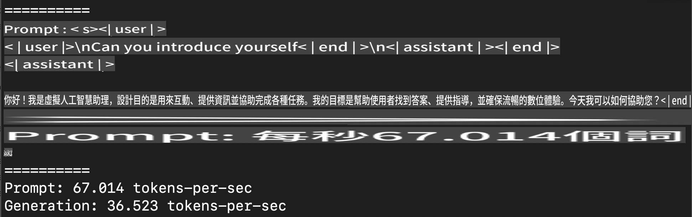
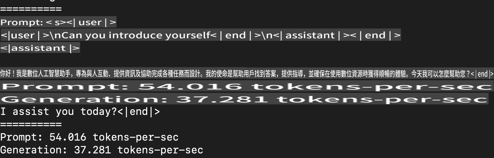
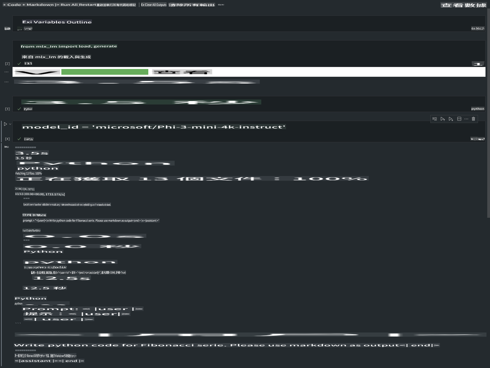

# **Inference Phi-3 miaraka amin'ny Apple MLX Framework**

## **Inona ny MLX Framework**

MLX dia rafitra ho an'ny fikarohana momba ny fianarana milina amin'ny Apple silicon, natsangan'ny ekipan'ny fikarohana momba ny fianarana milina ao Apple.

Natao ho an'ireo mpikaroka momba ny fianarana milina ny MLX, ary mikendry ny ho mora ampiasaina nefa mahomby amin'ny fampiofanana sy fampiharana modely. Tsotra ihany koa ny famolavolana ny rafitra, natao mba hahafahan'ny mpikaroka manitatra sy manatsara ny MLX haingana, mba hahafahana mamakafaka hevitra vaovao mora foana.

Ny LLMs dia azo ampitomboina haingana amin'ny fitaovana Apple Silicon amin'ny alalan'ny MLX, ary azo ampiasaina eo an-toerana ny modely, mora sy mahomby.

## **Fampiasana MLX hanatanterahana inference amin'ny Phi-3-mini**

### **1. Mametraka ny tontolo iainana MLX anao**

1. Python 3.11.x  
2. Mametraka ny tranomboky MLX  

```bash

pip install mlx-lm

```

### **2. Mampandeha Phi-3-mini ao amin'ny Terminal miaraka amin'ny MLX**

```bash

python -m mlx_lm.generate --model microsoft/Phi-3-mini-4k-instruct --max-token 2048 --prompt  "<|user|>\nCan you introduce yourself<|end|>\n<|assistant|>"

```

Ny vokatra (ny tontolo iainako dia Apple M1 Max, 64GB) dia toy izao  



### **3. Manova Phi-3-mini ho INT4 miaraka amin'ny MLX ao amin'ny Terminal**

```bash

python -m mlx_lm.convert --hf-path microsoft/Phi-3-mini-4k-instruct

```

***Fanamarihana：*** Afaka atao quantization ny modely amin'ny alalan'ny mlx_lm.convert, ary INT4 no quantization default. Amin'ity ohatra ity, ny Phi-3-mini dia ovaina ho INT4. 

Rehefa vita ny quantization dia voatahiry ao amin'ny lahatahiry default ./mlx_model ilay modely.  

Afaka mitsapa ilay modely efa natao quantization amin'ny alalan'ny MLX isika avy amin'ny terminal  

```bash

python -m mlx_lm.generate --model ./mlx_model/ --max-token 2048 --prompt  "<|user|>\nCan you introduce yourself<|end|>\n<|assistant|>"

```

Ny vokatra dia toy izao  



### **4. Mampandeha Phi-3-mini miaraka amin'ny MLX ao amin'ny Jupyter Notebook**



***Fanamarihana:*** Azafady vakio ity ohatra ity [tsindrio eto](../../../../../code/03.Inference/MLX/MLX_DEMO.ipynb)

## **Loharano**

1. Mianara momba ny Apple MLX Framework [https://ml-explore.github.io](https://ml-explore.github.io/mlx/build/html/index.html)

2. Apple MLX GitHub Repo [https://github.com/ml-explore](https://github.com/ml-explore)

It seems like you want the text translated into "mo," but could you please clarify what "mo" refers to? Are you referring to a specific language or dialect? For example, do you mean Mongolian, Maori, or something else? Let me know so I can assist you better!