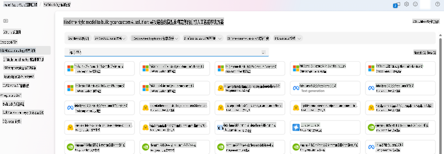
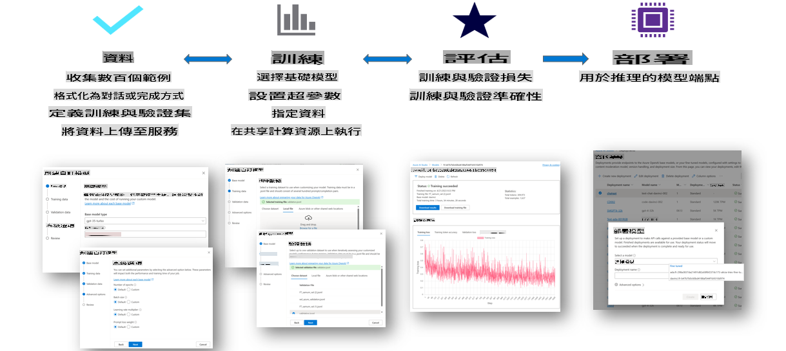
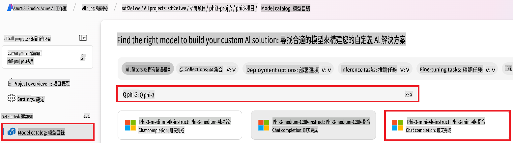
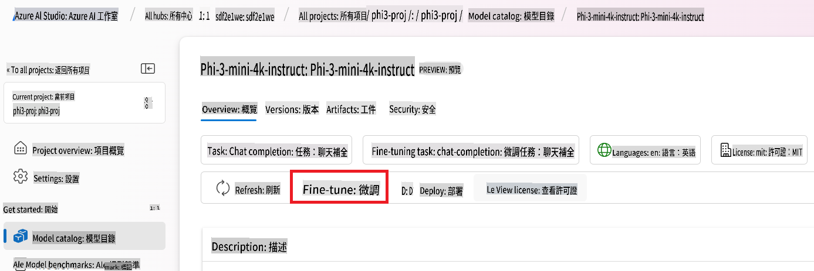
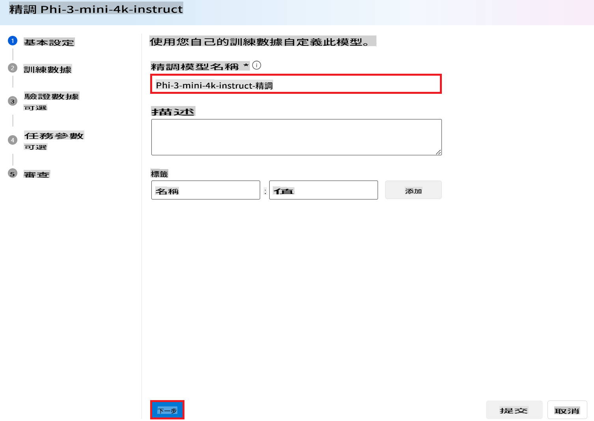
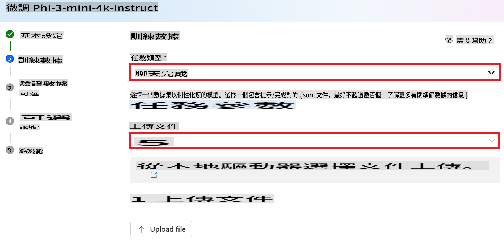
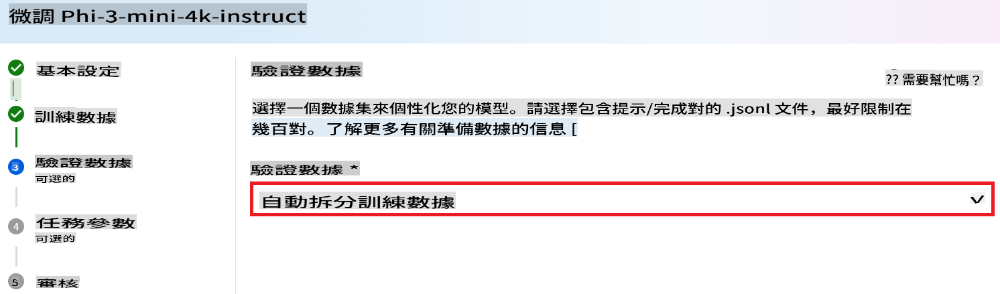
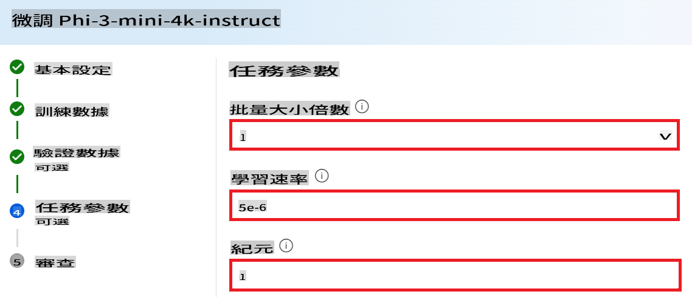
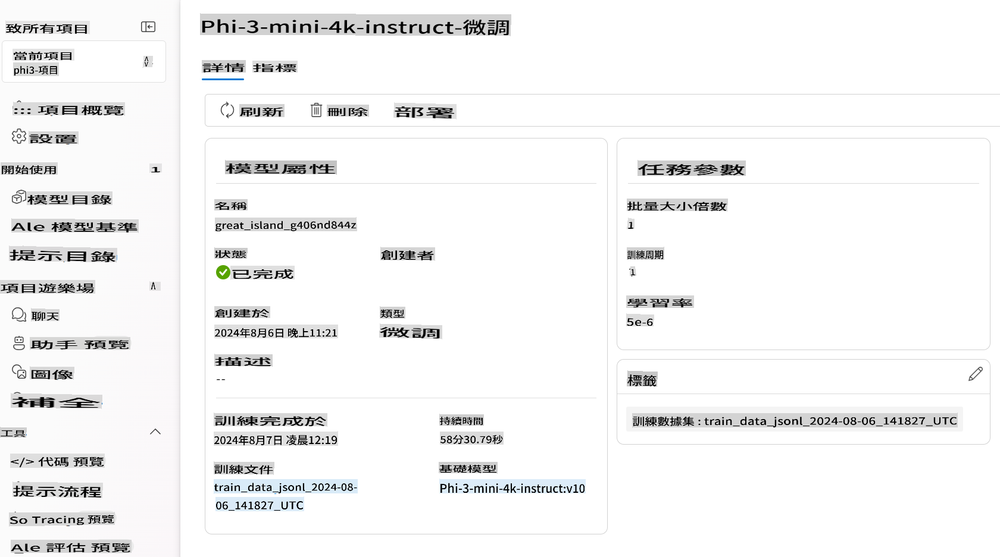

# Phi-3-ийг Azure AI Foundry ашиглан тохируулах нь

Microsoft-ийн Phi-3 Mini хэлний загварыг Azure AI Foundry ашиглан хэрхэн тохируулахыг судалцгаая. Загварыг тохируулах нь Phi-3 Mini-г тодорхой даалгавруудад илүү хүчирхэг, нөхцөл байдлыг ойлгодог болгоход тусалдаг.

## Анхаарах зүйлс

- **Чадварууд:** Ямар загваруудыг тохируулах боломжтой вэ? Суурь загварыг юунд тохируулах вэ?
- **Зардал:** Тохируулахад ямар үнийн загвар ашиглах вэ?
- **Өөрчлөх боломж:** Суурь загварыг хэр их өөрчилж болох вэ, ямар хэлбэрээр?
- **Тав тухтай байдал:** Тохируулах үйл явц хэрхэн явагддаг вэ – нэмэлт код бичих шаардлагатай юу? Өөрийн тооцоолох нөөцийг авчрах шаардлагатай юу?
- **Аюулгүй байдал:** Тохируулсан загварууд аюулгүй байдлын эрсдэлтэй гэж мэдэгддэг – хүсээгүй хор хөнөөлөөс хамгаалах ямар арга хэмжээ бий вэ?



## Тохируулахад бэлтгэх

### Урьдчилсан нөхцөлүүд

> [!NOTE]
> Phi-3 загваруудын хувьд "pay-as-you-go" тохируулах үйлчилгээ зөвхөн **East US 2** бүсэд үүсгэсэн хабуудад боломжтой.

- Azure захиалга. Хэрэв танд Azure захиалга байхгүй бол [төлбөртэй Azure данс](https://azure.microsoft.com/pricing/purchase-options/pay-as-you-go) үүсгэн эхлээрэй.

- [AI Foundry төсөл](https://ai.azure.com?WT.mc_id=aiml-138114-kinfeylo).
- Azure-ийн нөөцөд хандах эрхийг олгохын тулд Azure RBAC ашиглана. Энэ өгүүллийн алхмуудыг хийхийн тулд таны хэрэглэгчийн бүртгэлд __Azure AI Developer role__ эрхтэй байх шаардлагатай.

### Захиалгын үйлчилгээ үзүүлэгчийг бүртгэх

Захиалга `Microsoft.Network` үйлчилгээ үзүүлэгчид бүртгэгдсэн эсэхийг шалгаарай.

1. [Azure портал](https://portal.azure.com)-д нэвтрэх.
1. Зүүн талын цэснээс **Subscriptions** сонгох.
1. Ашиглахыг хүссэн захиалгаа сонгох.
1. Зүүн талын цэснээс **AI project settings** > **Resource providers** сонгох.
1. **Microsoft.Network** нөөц үзүүлэгчийн жагсаалтад байгаа эсэхийг шалгах. Хэрэв байхгүй бол нэмнэ.

### Өгөгдөл бэлтгэх

Загвараа тохируулахын тулд сургалтын болон баталгаажуулалтын өгөгдлийг бэлтгэнэ. Таны сургалтын болон баталгаажуулалтын өгөгдөл нь загвар хэрхэн ажиллахыг хүсэж буй оролт болон гаралтын жишээнүүдээс бүрдэнэ.

Сургалтын бүх жишээнүүд таамаглал хийхэд тохирох форматтай байх ёстой. Загварыг үр дүнтэй тохируулахын тулд тэнцвэртэй, олон янзын өгөгдлийн багц бэлтгээрэй.

Энэ нь өгөгдлийн тэнцвэрийг хадгалах, янз бүрийн нөхцөл байдлыг хамруулах, сургалтын өгөгдлийг бодит ертөнцийн хүлээлтэд нийцүүлэхийн тулд үе үе сайжруулахыг шаарддаг. Энэ нь эцсийн дүндээ илүү нарийвчлалтай, тэнцвэртэй хариултуудыг бий болгодог.

Өөр өөр загварууд өөр өөр форматтай сургалтын өгөгдлийг шаарддаг.

### Чат бүрэнгүүд

Таны ашиглах сургалтын болон баталгаажуулалтын өгөгдөл нь JSON Lines (JSONL) баримт бичиг хэлбэрээр байх **ёстой**. `Phi-3-mini-128k-instruct`-д зориулсан тохируулах өгөгдлийн багц нь Чат бүрэнгүүдийн API-д ашиглагддаг ярианы форматтай байх ёстой.

### Жишээ файл формат

```json
    {"messages": [{"role": "system", "content": "You are an Xbox customer support agent whose primary goal is to help users with issues they are experiencing with their Xbox devices. You are friendly and concise. You only provide factual answers to queries, and do not provide answers that are not related to Xbox."}, {"role": "user", "content": "Is Xbox better than PlayStation?"}, {"role": "assistant", "content": "I apologize, but I cannot provide personal opinions. My primary job is to assist you with any issues related to your Xbox device. Do you have any Xbox-related issues that need addressing?"}]}
    {"messages": [{"role": "system", "content": "You are an Xbox customer support agent whose primary goal is to help users with issues they are experiencing with their Xbox devices. You are friendly and concise. You only provide factual answers to queries, and do not provide answers that are not related to Xbox."}, {"role": "user", "content": "Can I play PC games on my Xbox?"}, {"role": "assistant", "content": "While Xbox consoles don't natively support PC games, they can play an array of Xbox games, many of which are also available on PC. Can I assist you with finding games compatible with your Xbox device?"}]}
    {"messages": [{"role": "system", "content": "You are an Xbox customer support agent whose primary goal is to help users with issues they are experiencing with their Xbox devices. You are friendly and concise. You only provide factual answers to queries, and do not provide answers that are not related to Xbox."}, {"role": "user", "content": "I'm having trouble connecting my Xbox to the Wi-Fi."}, {"role": "assistant", "content": "No worries, let's go through the network settings on your Xbox. Can you please tell me what happens when you try to connect it to the Wi-Fi?"}]}
```

Дэмжигдсэн файл төрөл нь JSON Lines юм. Файлуудыг үндсэн өгөгдлийн сан руу байршуулаад, төслийн хүрээнд ашиглах боломжтой болгодог.

## Phi-3-ийг Azure AI Foundry ашиглан тохируулах

Azure AI Foundry нь томоохон хэлний загваруудыг хувийн өгөгдлийн багцад тохируулах боломжийг олгодог. Энэ үйл явцыг тохируулах гэж нэрлэдэг. Тохируулах нь тодорхой даалгавар, хэрэглээнд зориулж загварыг өөрчлөх, оновчтой болгох замаар ихээхэн ач холбогдолтой байдаг. Энэ нь гүйцэтгэл, зардлын үр ашиг, хариу өгөх хурд, тохирсон гаралтыг сайжруулдаг.



### Шинэ төсөл үүсгэх

1. [Azure AI Foundry](https://ai.azure.com)-д нэвтрэх.

1. Azure AI Foundry-д шинэ төсөл үүсгэхийн тулд **+New project** сонгоно уу.

    

1. Дараах ажлуудыг хийнэ үү:

    - Төслийн **Hub name**. Давтагдашгүй утга байх ёстой.
    - Ашиглах **Hub**-ыг сонгоно уу (хэрэгтэй бол шинэ хаб үүсгээрэй).

    

1. Шинэ хаб үүсгэхийн тулд дараах ажлуудыг хийнэ үү:

    - **Hub name** оруулна уу. Давтагдашгүй утга байх ёстой.
    - Azure **Subscription**-аа сонгоно уу.
    - Ашиглах **Resource group**-аа сонгоно уу (хэрэгтэй бол шинэ үүсгээрэй).
    - Ашиглах **Location**-оо сонгоно уу.
    - Ашиглах **Connect Azure AI Services**-аа сонгоно уу (хэрэгтэй бол шинэ үүсгээрэй).
    - **Connect Azure AI Search**-ыг **Skip connecting** сонгоно уу.

    

1. **Next**-ийг сонгоно уу.
1. **Create a project**-ийг сонгоно уу.

### Өгөгдөл бэлтгэх

Тохируулахын өмнө чат заавар, асуулт-хариултын хос, эсвэл бусад холбогдох текст өгөгдөл гэх мэт даалгаварт тохирох өгөгдлийг цуглуулж эсвэл үүсгээрэй. Энэхүү өгөгдлийг цэвэрлэж, дуу чимээг арилгах, дутуу утгуудыг засах, текстийг токенчлох замаар урьдчилан боловсруулах хэрэгтэй.

### Azure AI Foundry дахь Phi-3 загварыг тохируулах

> [!NOTE]
> Phi-3 загваруудыг тохируулах нь одоогоор East US 2 бүсэд байрлах төслүүдэд дэмжигддэг.

1. Зүүн талын табаас **Model catalog** сонгоно уу.

1. **search bar**-д *phi-3* гэж бичээд ашиглах phi-3 загвараа сонгоно уу.

    

1. **Fine-tune** сонгоно уу.

    

1. **Fine-tuned model name**-ээ оруулна уу.

    

1. **Next**-ийг сонгоно уу.

1. Дараах ажлуудыг хийнэ үү:

    - **task type**-ыг **Chat completion** болгон сонгоно уу.
    - Ашиглах **Training data**-гаа сонгоно уу. Үүнийг Azure AI Foundry-ийн өгөгдлөөр эсвэл өөрийн орчноос байршуулах боломжтой.

    

1. **Next**-ийг сонгоно уу.

1. Ашиглах **Validation data**-гаа байршуулаарай эсвэл **Automatic split of training data** сонголтыг сонгоорой.

    

1. **Next**-ийг сонгоно уу.

1. Дараах ажлуудыг хийнэ үү:

    - Ашиглах **Batch size multiplier**-ээ сонгоно уу.
    - Ашиглах **Learning rate**-ээ сонгоно уу.
    - Ашиглах **Epochs**-ээ сонгоно уу.

    

1. Тохируулах үйл явцыг эхлүүлэхийн тулд **Submit**-ийг сонгоно уу.

    

1. Загвар тохируулагдаж дууссаны дараа статус нь **Completed** гэж харагдах болно. Одоо та загвараа байршуулж, өөрийн хэрэглээнд ашиглах, тоглоомын талбар эсвэл prompt flow-д туршиж үзэх боломжтой. Дэлгэрэнгүй мэдээллийг [Phi-3 загваруудыг Azure AI Foundry ашиглан хэрхэн байрлуулах талаар](https://learn.microsoft.com/azure/ai-studio/how-to/deploy-models-phi-3?tabs=phi-3-5&pivots=programming-language-python) үзнэ үү.

    

> [!NOTE]
> Phi-3-ийг тохируулах талаар илүү дэлгэрэнгүй мэдээлэл авахыг хүсвэл [Azure AI Foundry дахь Phi-3 загваруудыг тохируулах](https://learn.microsoft.com/azure/ai-studio/how-to/fine-tune-phi-3?tabs=phi-3-mini)-г үзнэ үү.

## Тохируулсан загваруудаа устгах

Тохируулсан загварыг [Azure AI Foundry](https://ai.azure.com)-ийн тохируулах загваруудын жагсаалтаас эсвэл загварын дэлгэрэнгүй хуудаснаас устгах боломжтой. Тохируулах хуудаснаас устгах загвараа сонгоод, Delete товчийг дарж устгана.

> [!NOTE]
> Хэрэв тохируулсан загвар нь идэвхтэй байршуулалттай байвал та түүнийг устгах боломжгүй. Загварын байршуулалтыг эхлээд устгах шаардлагатай.

## Зардал болон квотууд

### Үйлчилгээ болгон тохируулагдсан Phi-3 загваруудын зардал ба квотын талаар анхаарах зүйлс

Microsoft-аас санал болгож, Azure AI Foundry-д нэгтгэсэн Phi загваруудыг үйлчилгээ болгон тохируулж ашиглах боломжтой. Загваруудыг [байршуулж](https://learn.microsoft.com/azure/ai-studio/how-to/deploy-models-phi-3?tabs=phi-3-5&pivots=programming-language-python) эсвэл тохируулах үед үнийн мэдээллийг байршуулах мастерийн Pricing and terms табаас олж болно.

## Агуулгын шүүлтүүр

Pay-as-you-go горимоор үйлчилгээ болгон байршуулсан загварууд нь Azure AI Content Safety-аар хамгаалагдсан байдаг. Бодит цагийн төгсгөлүүдэд байршуулсан үед энэ боломжийг идэвхгүй болгох боломжтой. Azure AI агуулгын аюулгүй байдал идэвхтэй үед, оролт болон гаралт нь хор хөнөөлтэй агуулгыг илрүүлэх, урьдчилан сэргийлэх зорилгоор ангиллын загваруудаар шүүлтүүр хийгддэг. Агуулгын шүүлтүүрийн систем нь оролт болон гаралтын таамаглал дахь боломжит хор хөнөөлтэй агуулгын тодорхой ангиллуудыг илрүүлж, үйл ажиллагаа явуулдаг. [Azure AI Content Safety](https://learn.microsoft.com/azure/ai-studio/concepts/content-filtering) талаар илүү ихийг мэдэж аваарай.

**Тохируулах тохиргоо**

Гиперпараметрүүд: Суралцах хурд, багцын хэмжээ, сургалтын үеийн тоо зэрэг гиперпараметрүүдийг тодорхойлно.

**Алдагдлын функц**

Таны даалгаварт тохирсон алдагдлын функцыг сонгоно уу (жишээ нь, cross-entropy).

**Оновчлогч**

Сургалтын явцад градиент шинэчлэлт хийхэд зориулж оновчлогчийг сонгоно уу (жишээ нь, Adam).

**Тохируулах үйл явц**

- Урьдчилан сургасан загвар ачаалах: Phi-3 Mini-ийн checkpoint-ийг ачаалах.
- Захиалгат давхаргууд нэмэх: Даалгаварт тохирсон давхаргуудыг нэмэх (жишээ нь, чат зааврын ангиллын толгой).

**Загварыг сургах**
Бэлтгэсэн өгөгдлийн багцаа ашиглан загвараа тохируулаарай. Сургалтын явцыг хянаж, гиперпараметрүүдийг шаардлагатай тохиолдолд тохируулна.

**Үнэлгээ ба баталгаажуулалт**

Баталгаажуулалтын багц: Өгөгдлөө сургалтын болон баталгаажуулалтын багцуудад хуваах.

**Гүйцэтгэлийг үнэлэх**

Нарийвчлал, F1-үнэлгээ, эсвэл perplexity зэрэг үзүүлэлтүүдийг ашиглан загварын гүйцэтгэлийг үнэлнэ.

## Тохируулагдсан загварыг хадгалах

**Checkpoint**
Ирээдүйд ашиглахын тулд тохируулагдсан загварын checkpoint-ийг хадгална.

## Байршуулах

- Вэб үйлчилгээ болгон байршуулна: Тохируулагдсан загвараа Azure AI Foundry-д вэб үйлчилгээ болгон байршуулна.
- Төгсгөлийг турших: Байршсан төгсгөл рүү туршилтын асуултууд илгээж, түүний үйл ажиллагааг шалгана.

## Давтан сайжруулах

Давталт: Хэрэв гүйцэтгэл хангалтгүй байвал гиперпараметрүүдийг тохируулах, илүү их өгөгдөл нэмэх, эсвэл нэмэлт сургалтын үеийг тохируулах замаар дахин оролдоно.

## Хянах ба сайжруулах

Загварын зан төлөвийг тасралтгүй хянаж, шаардлагатай бол сайжруулна.

## Захиалж, өргөтгөх

Захиалгат даалгаврууд: Phi-3 Mini-г чат зааврын гадна олон төрлийн даалгаварт тохируулах боломжтой. Бусад хэрэгслүүдийг судлаарай!
Туршилт: Гүйцэтгэлийг сайжруулахын тулд өөр өөр архитектур, давхаргын хослол, техникүүдийг туршиж үзээрэй.

> [!NOTE]
> Тохируулах нь давтагдах үйл явц юм. Туршиж, суралцаж, загвараа тухайн даалгаварт хамгийн сайн үр дүнд хүргэхийн тулд тохируулж ашиглаарай!

It seems you are asking to translate the text into "mo." Could you please clarify what "mo" refers to? Are you referring to a specific language or dialect? If so, please provide more details so I can assist you accurately.