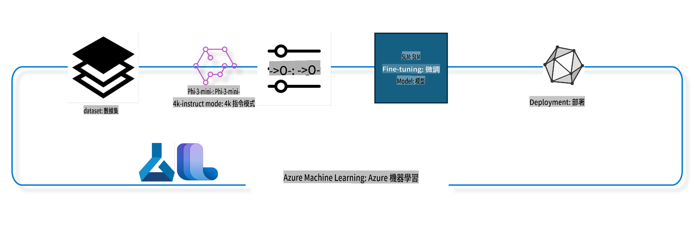

## كيفية استخدام مكونات إكمال المحادثة من سجل نظام Azure ML لتخصيص نموذج

في هذا المثال، سنقوم بتخصيص نموذج Phi-3-mini-4k-instruct لإكمال محادثة بين شخصين باستخدام مجموعة بيانات ultrachat_200k.



سيعرض هذا المثال كيفية تنفيذ التخصيص باستخدام Azure ML SDK وPython، ثم نشر النموذج المخصص إلى نقطة نهاية عبر الإنترنت للحصول على تنبؤات في الوقت الفعلي.

### بيانات التدريب

سنستخدم مجموعة بيانات ultrachat_200k. هذه نسخة مفلترة بشكل كبير من مجموعة بيانات UltraChat، وتم استخدامها لتدريب Zephyr-7B-β، وهو نموذج محادثة متقدم يحتوي على 7 مليارات معلمة.

### النموذج

سنستخدم نموذج Phi-3-mini-4k-instruct لشرح كيفية تخصيص نموذج لمهمة إكمال المحادثة. إذا فتحت هذا الدفتر من بطاقة نموذج محددة، تذكر استبدال اسم النموذج المحدد.

### المهام

- اختيار نموذج للتخصيص.
- اختيار واستكشاف بيانات التدريب.
- تكوين مهمة التخصيص.
- تشغيل مهمة التخصيص.
- مراجعة مقاييس التدريب والتقييم.
- تسجيل النموذج المخصص.
- نشر النموذج المخصص للحصول على تنبؤات في الوقت الفعلي.
- تنظيف الموارد.

## 1. إعداد المتطلبات المسبقة

- تثبيت التبعيات.
- الاتصال بمساحة عمل AzureML. تعرف على المزيد في إعداد مصادقة SDK. استبدل <WORKSPACE_NAME> و<RESOURCE_GROUP> و<SUBSCRIPTION_ID> أدناه.
- الاتصال بسجل نظام AzureML.
- تعيين اسم تجربة اختياري.
- التحقق من الحوسبة أو إنشاؤها.

> [!NOTE]
> المتطلبات: يمكن أن تحتوي عقدة GPU واحدة على عدة بطاقات GPU. على سبيل المثال، تحتوي عقدة واحدة من Standard_NC24rs_v3 على 4 وحدات معالجة رسومات NVIDIA V100، بينما تحتوي Standard_NC12s_v3 على وحدتين. راجع المستندات للحصول على هذه المعلومات. يتم تعيين عدد بطاقات GPU لكل عقدة في المعامل gpus_per_node أدناه. تعيين هذه القيمة بشكل صحيح سيضمن الاستفادة من جميع وحدات معالجة الرسومات في العقدة. يمكن العثور على وحدات الحوسبة GPU الموصى بها هنا وهنا.

### مكتبات Python

قم بتثبيت التبعيات عن طريق تشغيل الخلية أدناه. هذه الخطوة ليست اختيارية إذا كنت تعمل في بيئة جديدة.

```bash
pip install azure-ai-ml
pip install azure-identity
pip install datasets==2.9.0
pip install mlflow
pip install azureml-mlflow
```

### التفاعل مع Azure ML

1. هذا البرنامج النصي Python يُستخدم للتفاعل مع خدمة Azure Machine Learning (Azure ML). إليك ما يقوم به:

    - استيراد الوحدات اللازمة من الحزم azure.ai.ml وazure.identity وazure.ai.ml.entities. كما يتم استيراد وحدة time.

    - محاولة المصادقة باستخدام DefaultAzureCredential()، الذي يوفر تجربة مصادقة مبسطة لبدء تطوير التطبيقات التي تعمل في السحابة Azure بسرعة. إذا فشلت، يتم الرجوع إلى InteractiveBrowserCredential()، الذي يوفر مطالبة تسجيل دخول تفاعلية.

    - محاولة إنشاء مثيل MLClient باستخدام طريقة from_config، التي تقرأ التكوين من ملف التكوين الافتراضي (config.json). إذا فشلت، يتم إنشاء مثيل MLClient يدويًا من خلال توفير subscription_id وresource_group_name وworkspace_name.

    - إنشاء مثيل آخر لـ MLClient، هذه المرة لسجل Azure ML المسمى "azureml". يحتوي هذا السجل على النماذج وخطوط التخصيص والبيئات.

    - تعيين experiment_name إلى "chat_completion_Phi-3-mini-4k-instruct".

    - إنشاء طابع زمني فريد عن طريق تحويل الوقت الحالي (بالثواني منذ العصر، كرقم عشري) إلى عدد صحيح ثم إلى سلسلة نصية. يمكن استخدام هذا الطابع الزمني لإنشاء أسماء وإصدارات فريدة.

    ```python
    # Import necessary modules from Azure ML and Azure Identity
    from azure.ai.ml import MLClient
    from azure.identity import (
        DefaultAzureCredential,
        InteractiveBrowserCredential,
    )
    from azure.ai.ml.entities import AmlCompute
    import time  # Import time module
    
    # Try to authenticate using DefaultAzureCredential
    try:
        credential = DefaultAzureCredential()
        credential.get_token("https://management.azure.com/.default")
    except Exception as ex:  # If DefaultAzureCredential fails, use InteractiveBrowserCredential
        credential = InteractiveBrowserCredential()
    
    # Try to create an MLClient instance using the default config file
    try:
        workspace_ml_client = MLClient.from_config(credential=credential)
    except:  # If that fails, create an MLClient instance by manually providing the details
        workspace_ml_client = MLClient(
            credential,
            subscription_id="<SUBSCRIPTION_ID>",
            resource_group_name="<RESOURCE_GROUP>",
            workspace_name="<WORKSPACE_NAME>",
        )
    
    # Create another MLClient instance for the Azure ML registry named "azureml"
    # This registry is where models, fine-tuning pipelines, and environments are stored
    registry_ml_client = MLClient(credential, registry_name="azureml")
    
    # Set the experiment name
    experiment_name = "chat_completion_Phi-3-mini-4k-instruct"
    
    # Generate a unique timestamp that can be used for names and versions that need to be unique
    timestamp = str(int(time.time()))
    ```

## 2. اختيار نموذج أساسي للتخصيص

1. Phi-3-mini-4k-instruct هو نموذج مفتوح متقدم يحتوي على 3.8 مليار معلمة، ويستند إلى مجموعات البيانات المستخدمة في Phi-2. ينتمي النموذج إلى عائلة نماذج Phi-3، وتأتي النسخة المصغرة منه في نوعين: 4K و128K، وهو طول السياق (بالرموز) الذي يمكن أن يدعمه. نحتاج إلى تخصيص النموذج لغرضنا المحدد لاستخدامه. يمكنك استعراض هذه النماذج في كتالوج النماذج في AzureML Studio، مع تصفية المهمة إلى إكمال المحادثة. في هذا المثال، نستخدم نموذج Phi-3-mini-4k-instruct. إذا فتحت هذا الدفتر لنموذج مختلف، استبدل اسم النموذج والإصدار وفقًا لذلك.

    > [!NOTE]
    > خاصية model id للنموذج. سيتم تمريرها كمدخل لمهمة التخصيص. هذه الخاصية متاحة أيضًا كحقل Asset ID في صفحة تفاصيل النموذج في كتالوج النماذج في AzureML Studio.

2. هذا البرنامج النصي Python يتفاعل مع خدمة Azure Machine Learning (Azure ML). إليك ما يقوم به:

    - تعيين model_name إلى "Phi-3-mini-4k-instruct".

    - استخدام طريقة get للخاصية models من الكائن registry_ml_client لاسترداد أحدث إصدار من النموذج بالاسم المحدد من سجل Azure ML. يتم استدعاء طريقة get بوسيطين: اسم النموذج وعلامة تشير إلى أنه يجب استرداد أحدث إصدار.

    - طباعة رسالة إلى وحدة التحكم تشير إلى اسم وإصدار ومعرف النموذج الذي سيتم استخدامه للتخصيص. يتم استخدام طريقة format للسلسلة النصية لإدراج اسم وإصدار ومعرف النموذج في الرسالة. يتم الوصول إلى اسم وإصدار ومعرف النموذج كخصائص للكائن foundation_model.

    ```python
    # Set the model name
    model_name = "Phi-3-mini-4k-instruct"
    
    # Get the latest version of the model from the Azure ML registry
    foundation_model = registry_ml_client.models.get(model_name, label="latest")
    
    # Print the model name, version, and id
    # This information is useful for tracking and debugging
    print(
        "\n\nUsing model name: {0}, version: {1}, id: {2} for fine tuning".format(
            foundation_model.name, foundation_model.version, foundation_model.id
        )
    )
    ```

## 3. إنشاء حوسبة لاستخدامها مع المهمة

تعمل مهمة التخصيص فقط مع الحوسبة التي تحتوي على GPU. يعتمد حجم الحوسبة على حجم النموذج، وفي معظم الحالات، يصبح من الصعب تحديد الحوسبة المناسبة للمهمة. في هذه الخلية، نوجه المستخدم لاختيار الحوسبة المناسبة.

> [!NOTE]
> الحوسبات المدرجة أدناه تعمل مع التكوين الأكثر تحسينًا. أي تغييرات في التكوين قد تؤدي إلى خطأ Cuda Out Of Memory. في مثل هذه الحالات، حاول ترقية الحوسبة إلى حجم أكبر.

> [!NOTE]
> عند اختيار compute_cluster_size أدناه، تأكد من أن الحوسبة متوفرة في مجموعة الموارد الخاصة بك. إذا لم تتوفر حوسبة معينة، يمكنك تقديم طلب للحصول على الوصول إلى موارد الحوسبة.

### التحقق من دعم النموذج للتخصيص

1. هذا البرنامج النصي Python يتفاعل مع نموذج Azure Machine Learning (Azure ML). إليك ما يقوم به:

    - استيراد وحدة ast، التي توفر وظائف لمعالجة أشجار قواعد النحو المجردة في Python.

    - التحقق مما إذا كان الكائن foundation_model (الذي يمثل نموذجًا في Azure ML) يحتوي على علامة باسم finetune_compute_allow_list. العلامات في Azure ML هي أزواج مفتاح-قيمة يمكن إنشاؤها واستخدامها لتصفية وفرز النماذج.

    - إذا كانت العلامة finetune_compute_allow_list موجودة، يتم استخدام وظيفة ast.literal_eval لتحليل قيمة العلامة (سلسلة نصية) بأمان إلى قائمة Python. يتم تعيين هذه القائمة إلى المتغير computes_allow_list. ثم يتم طباعة رسالة تشير إلى أنه يجب إنشاء حوسبة من القائمة.

    - إذا لم تكن العلامة finetune_compute_allow_list موجودة، يتم تعيين computes_allow_list إلى None ويتم طباعة رسالة تشير إلى أن العلامة ليست جزءًا من علامات النموذج.

    - باختصار، يتحقق هذا البرنامج النصي من وجود علامة معينة في بيانات تعريف النموذج، ويحول قيمة العلامة إلى قائمة إذا كانت موجودة، ويوفر تعليقات للمستخدم وفقًا لذلك.

    ```python
    # Import the ast module, which provides functions to process trees of the Python abstract syntax grammar
    import ast
    
    # Check if the 'finetune_compute_allow_list' tag is present in the model's tags
    if "finetune_compute_allow_list" in foundation_model.tags:
        # If the tag is present, use ast.literal_eval to safely parse the tag's value (a string) into a Python list
        computes_allow_list = ast.literal_eval(
            foundation_model.tags["finetune_compute_allow_list"]
        )  # convert string to python list
        # Print a message indicating that a compute should be created from the list
        print(f"Please create a compute from the above list - {computes_allow_list}")
    else:
        # If the tag is not present, set computes_allow_list to None
        computes_allow_list = None
        # Print a message indicating that the 'finetune_compute_allow_list' tag is not part of the model's tags
        print("`finetune_compute_allow_list` is not part of model tags")
    ```

### التحقق من مثيل الحوسبة

1. هذا البرنامج النصي Python يتفاعل مع خدمة Azure Machine Learning (Azure ML) ويقوم بعدة تحققيات على مثيل الحوسبة. إليك ما يقوم به:

    - محاولة استرداد مثيل الحوسبة بالاسم المخزن في compute_cluster من مساحة عمل Azure ML. إذا كانت حالة توفير مثيل الحوسبة "فشلت"، فإنه يرفع خطأ من نوع ValueError.

    - التحقق مما إذا كانت computes_allow_list ليست None. إذا لم تكن كذلك، يتم تحويل جميع أحجام الحوسبة في القائمة إلى أحرف صغيرة والتحقق مما إذا كان حجم مثيل الحوسبة الحالي موجودًا في القائمة. إذا لم يكن كذلك، فإنه يرفع خطأ من نوع ValueError.

    - إذا كانت computes_allow_list هي None، يتم التحقق مما إذا كان حجم مثيل الحوسبة موجودًا في قائمة أحجام GPU غير المدعومة. إذا كان كذلك، فإنه يرفع خطأ من نوع ValueError.

    - استرداد قائمة بجميع أحجام الحوسبة المتاحة في مساحة العمل. ثم يتم التكرار على هذه القائمة، ولكل حجم حوسبة، يتم التحقق مما إذا كان اسمه يتطابق مع حجم مثيل الحوسبة الحالي. إذا كان كذلك، يتم استرداد عدد وحدات معالجة الرسومات لهذا الحجم وتعيين gpu_count_found إلى True.

    - إذا كان gpu_count_found هو True، يتم طباعة عدد وحدات معالجة الرسومات في مثيل الحوسبة. إذا كان gpu_count_found هو False، فإنه يرفع خطأ من نوع ValueError.

    - باختصار، يقوم هذا البرنامج النصي بتنفيذ عدة تحققيات على مثيل الحوسبة في مساحة عمل Azure ML، بما في ذلك التحقق من حالة التوفير، وحجمه مقابل قائمة السماح أو قائمة المنع، وعدد وحدات معالجة الرسومات التي يحتوي عليها.

    ```python
    # Print the exception message
    print(e)
    # Raise a ValueError if the compute size is not available in the workspace
    raise ValueError(
        f"WARNING! Compute size {compute_cluster_size} not available in workspace"
    )
    
    # Retrieve the compute instance from the Azure ML workspace
    compute = workspace_ml_client.compute.get(compute_cluster)
    # Check if the provisioning state of the compute instance is "failed"
    if compute.provisioning_state.lower() == "failed":
        # Raise a ValueError if the provisioning state is "failed"
        raise ValueError(
            f"Provisioning failed, Compute '{compute_cluster}' is in failed state. "
            f"please try creating a different compute"
        )
    
    # Check if computes_allow_list is not None
    if computes_allow_list is not None:
        # Convert all compute sizes in computes_allow_list to lowercase
        computes_allow_list_lower_case = [x.lower() for x in computes_allow_list]
        # Check if the size of the compute instance is in computes_allow_list_lower_case
        if compute.size.lower() not in computes_allow_list_lower_case:
            # Raise a ValueError if the size of the compute instance is not in computes_allow_list_lower_case
            raise ValueError(
                f"VM size {compute.size} is not in the allow-listed computes for finetuning"
            )
    else:
        # Define a list of unsupported GPU VM sizes
        unsupported_gpu_vm_list = [
            "standard_nc6",
            "standard_nc12",
            "standard_nc24",
            "standard_nc24r",
        ]
        # Check if the size of the compute instance is in unsupported_gpu_vm_list
        if compute.size.lower() in unsupported_gpu_vm_list:
            # Raise a ValueError if the size of the compute instance is in unsupported_gpu_vm_list
            raise ValueError(
                f"VM size {compute.size} is currently not supported for finetuning"
            )
    
    # Initialize a flag to check if the number of GPUs in the compute instance has been found
    gpu_count_found = False
    # Retrieve a list of all available compute sizes in the workspace
    workspace_compute_sku_list = workspace_ml_client.compute.list_sizes()
    available_sku_sizes = []
    # Iterate over the list of available compute sizes
    for compute_sku in workspace_compute_sku_list:
        available_sku_sizes.append(compute_sku.name)
        # Check if the name of the compute size matches the size of the compute instance
        if compute_sku.name.lower() == compute.size.lower():
            # If it does, retrieve the number of GPUs for that compute size and set gpu_count_found to True
            gpus_per_node = compute_sku.gpus
            gpu_count_found = True
    # If gpu_count_found is True, print the number of GPUs in the compute instance
    if gpu_count_found:
        print(f"Number of GPU's in compute {compute.size}: {gpus_per_node}")
    else:
        # If gpu_count_found is False, raise a ValueError
        raise ValueError(
            f"Number of GPU's in compute {compute.size} not found. Available skus are: {available_sku_sizes}."
            f"This should not happen. Please check the selected compute cluster: {compute_cluster} and try again."
        )
    ```

## 4. اختيار مجموعة البيانات لتخصيص النموذج

1. سنستخدم مجموعة بيانات ultrachat_200k. تحتوي المجموعة على أربع تقسيمات، مناسبة للتخصيص الموجه (sft).
pipeline ke display name ko alag-alag parameters ke aadhaar par dikhana aur print karna. ```python
    # Define a function to generate a display name for the training pipeline
    def get_pipeline_display_name():
        # Calculate the total batch size by multiplying the per-device batch size, the number of gradient accumulation steps, the number of GPUs per node, and the number of nodes used for fine-tuning
        batch_size = (
            int(finetune_parameters.get("per_device_train_batch_size", 1))
            * int(finetune_parameters.get("gradient_accumulation_steps", 1))
            * int(gpus_per_node)
            * int(finetune_parameters.get("num_nodes_finetune", 1))
        )
        # Retrieve the learning rate scheduler type
        scheduler = finetune_parameters.get("lr_scheduler_type", "linear")
        # Retrieve whether DeepSpeed is applied
        deepspeed = finetune_parameters.get("apply_deepspeed", "false")
        # Retrieve the DeepSpeed stage
        ds_stage = finetune_parameters.get("deepspeed_stage", "2")
        # If DeepSpeed is applied, include "ds" followed by the DeepSpeed stage in the display name; if not, include "nods"
        if deepspeed == "true":
            ds_string = f"ds{ds_stage}"
        else:
            ds_string = "nods"
        # Retrieve whether Layer-wise Relevance Propagation (LoRa) is applied
        lora = finetune_parameters.get("apply_lora", "false")
        # If LoRa is applied, include "lora" in the display name; if not, include "nolora"
        if lora == "true":
            lora_string = "lora"
        else:
            lora_string = "nolora"
        # Retrieve the limit on the number of model checkpoints to keep
        save_limit = finetune_parameters.get("save_total_limit", -1)
        # Retrieve the maximum sequence length
        seq_len = finetune_parameters.get("max_seq_length", -1)
        # Construct the display name by concatenating all these parameters, separated by hyphens
        return (
            model_name
            + "-"
            + "ultrachat"
            + "-"
            + f"bs{batch_size}"
            + "-"
            + f"{scheduler}"
            + "-"
            + ds_string
            + "-"
            + lora_string
            + f"-save_limit{save_limit}"
            + f"-seqlen{seq_len}"
        )
    
    # Call the function to generate the display name
    pipeline_display_name = get_pipeline_display_name()
    # Print the display name
    print(f"Display name used for the run: {pipeline_display_name}")
    ```

### Pipeline Ko Configure Karna

Yeh Python script Azure Machine Learning SDK ka upyog karte hue ek machine learning pipeline ko define aur configure kar raha hai. Iska vivran yeh hai:

1. Yeh Azure AI ML SDK se zaruri modules import karta hai.  
2. Registry se "chat_completion_pipeline" naam ka ek pipeline component fetch karta hai.  
3. `@pipeline` decorator and the function `create_pipeline`. The name of the pipeline is set to `pipeline_display_name`.

1. Inside the `create_pipeline` function, it initializes the fetched pipeline component with various parameters, including the model path, compute clusters for different stages, dataset splits for training and testing, the number of GPUs to use for fine-tuning, and other fine-tuning parameters.

1. It maps the output of the fine-tuning job to the output of the pipeline job. This is done so that the fine-tuned model can be easily registered, which is required to deploy the model to an online or batch endpoint.

1. It creates an instance of the pipeline by calling the `create_pipeline` function.

1. It sets the `force_rerun` setting of the pipeline to `True`, meaning that cached results from previous jobs will not be used.

1. It sets the `continue_on_step_failure` setting of the pipeline to `False` ka use karte hue ek pipeline job define karta hai, matlab agar koi step fail hota hai to pipeline ruk jayega.  

Saankshep mein, yeh script ek chat completion task ke liye Azure Machine Learning SDK ka upyog karte hue ek machine learning pipeline define aur configure karta hai.  
```python
    # Import necessary modules from the Azure AI ML SDK
    from azure.ai.ml.dsl import pipeline
    from azure.ai.ml import Input
    
    # Fetch the pipeline component named "chat_completion_pipeline" from the registry
    pipeline_component_func = registry_ml_client.components.get(
        name="chat_completion_pipeline", label="latest"
    )
    
    # Define the pipeline job using the @pipeline decorator and the function create_pipeline
    # The name of the pipeline is set to pipeline_display_name
    @pipeline(name=pipeline_display_name)
    def create_pipeline():
        # Initialize the fetched pipeline component with various parameters
        # These include the model path, compute clusters for different stages, dataset splits for training and testing, the number of GPUs to use for fine-tuning, and other fine-tuning parameters
        chat_completion_pipeline = pipeline_component_func(
            mlflow_model_path=foundation_model.id,
            compute_model_import=compute_cluster,
            compute_preprocess=compute_cluster,
            compute_finetune=compute_cluster,
            compute_model_evaluation=compute_cluster,
            # Map the dataset splits to parameters
            train_file_path=Input(
                type="uri_file", path="./ultrachat_200k_dataset/train_sft.jsonl"
            ),
            test_file_path=Input(
                type="uri_file", path="./ultrachat_200k_dataset/test_sft.jsonl"
            ),
            # Training settings
            number_of_gpu_to_use_finetuning=gpus_per_node,  # Set to the number of GPUs available in the compute
            **finetune_parameters
        )
        return {
            # Map the output of the fine tuning job to the output of pipeline job
            # This is done so that we can easily register the fine tuned model
            # Registering the model is required to deploy the model to an online or batch endpoint
            "trained_model": chat_completion_pipeline.outputs.mlflow_model_folder
        }
    
    # Create an instance of the pipeline by calling the create_pipeline function
    pipeline_object = create_pipeline()
    
    # Don't use cached results from previous jobs
    pipeline_object.settings.force_rerun = True
    
    # Set continue on step failure to False
    # This means that the pipeline will stop if any step fails
    pipeline_object.settings.continue_on_step_failure = False
    ```

### Job Ko Submit Karna

1. Yeh Python script ek machine learning pipeline job ko Azure Machine Learning workspace mein submit karta hai aur job ke complete hone ka intezaar karta hai. Iska vivran yeh hai:

   - `workspace_ml_client` ke jobs object ke `create_or_update` method ko call karke pipeline job ko submit karta hai. Chalane wali pipeline `pipeline_object` dwara specify ki gayi hai, aur experiment ka naam `experiment_name` dwara specify kiya gaya hai.  
   - `workspace_ml_client` ke jobs object ke `stream` method ko call karke pipeline job ke complete hone ka intezaar karta hai. Intezaar karne wala job pipeline_job object ke `name` attribute dwara specify kiya gaya hai.  

Saankshep mein, yeh script ek machine learning pipeline job ko Azure Machine Learning workspace mein submit karta hai aur job ke complete hone ka intezaar karta hai.  
```python
    # Submit the pipeline job to the Azure Machine Learning workspace
    # The pipeline to be run is specified by pipeline_object
    # The experiment under which the job is run is specified by experiment_name
    pipeline_job = workspace_ml_client.jobs.create_or_update(
        pipeline_object, experiment_name=experiment_name
    )
    
    # Wait for the pipeline job to complete
    # The job to wait for is specified by the name attribute of the pipeline_job object
    workspace_ml_client.jobs.stream(pipeline_job.name)
    ```  

## 6. Fine-Tuned Model Ko Workspace Mein Register Karna

Hum fine tuning job ke output se model ko register karenge. Yeh lineage ko track karega jo fine-tuned model aur fine tuning job ke beech hota hai. Fine tuning job lineage ko foundation model, data aur training code ke saath bhi track karta hai.  

### ML Model Ko Register Karna

1. Yeh Python script ek machine learning model ko register kar raha hai jo Azure Machine Learning pipeline mein train kiya gaya tha. Iska vivran yeh hai:

   - Azure AI ML SDK se zaruri modules import karta hai.  
   - Pipeline job ke `outputs` attribute ko access karke trained_model output ki uplabdhata check karta hai.  
   - Trained model ka path banata hai jo pipeline job ke naam aur output naam ("trained_model") ke saath format kiya gaya hai.  
   - Fine-tuned model ke liye ek naam define karta hai jo original model naam ke saath "-ultrachat-200k" jodta hai aur kisi bhi slash ko hyphen se replace karta hai.  
   - Model ko register karne ki tayari karta hai aur Model object banata hai jo kai parameters ke saath hai, jaise model ka path, model ka type (MLflow model), model ka naam aur version, aur model ka description.  
   - `workspace_ml_client` ke models object ke `create_or_update` method ko call karke model ko register karta hai.  
   - Registered model ko print karta hai.  

Saankshep mein, yeh script ek machine learning model ko register karta hai jo Azure Machine Learning pipeline mein train kiya gaya tha.  
```python
    # Import necessary modules from the Azure AI ML SDK
    from azure.ai.ml.entities import Model
    from azure.ai.ml.constants import AssetTypes
    
    # Check if the `trained_model` output is available from the pipeline job
    print("pipeline job outputs: ", workspace_ml_client.jobs.get(pipeline_job.name).outputs)
    
    # Construct a path to the trained model by formatting a string with the name of the pipeline job and the name of the output ("trained_model")
    model_path_from_job = "azureml://jobs/{0}/outputs/{1}".format(
        pipeline_job.name, "trained_model"
    )
    
    # Define a name for the fine-tuned model by appending "-ultrachat-200k" to the original model name and replacing any slashes with hyphens
    finetuned_model_name = model_name + "-ultrachat-200k"
    finetuned_model_name = finetuned_model_name.replace("/", "-")
    
    print("path to register model: ", model_path_from_job)
    
    # Prepare to register the model by creating a Model object with various parameters
    # These include the path to the model, the type of the model (MLflow model), the name and version of the model, and a description of the model
    prepare_to_register_model = Model(
        path=model_path_from_job,
        type=AssetTypes.MLFLOW_MODEL,
        name=finetuned_model_name,
        version=timestamp,  # Use timestamp as version to avoid version conflict
        description=model_name + " fine tuned model for ultrachat 200k chat-completion",
    )
    
    print("prepare to register model: \n", prepare_to_register_model)
    
    # Register the model by calling the create_or_update method of the models object in the workspace_ml_client with the Model object as the argument
    registered_model = workspace_ml_client.models.create_or_update(
        prepare_to_register_model
    )
    
    # Print the registered model
    print("registered model: \n", registered_model)
    ```  

## 7. Fine-Tuned Model Ko Ek Online Endpoint Par Deploy Karna

Online endpoints ek durable REST API dete hain jo applications ke saath model ka upyog karne ke liye integrate kiya ja sakta hai.  

### Endpoint Ko Manage Karna

1. Yeh Python script ek registered model ke liye Azure Machine Learning mein ek managed online endpoint bana raha hai. Iska vivran yeh hai:

   - Azure AI ML SDK se zaruri modules import karta hai.  
   - Online endpoint ke liye ek unique naam define karta hai jo "ultrachat-completion-" string ke saath ek timestamp jodta hai.  
   - ManagedOnlineEndpoint object banata hai jo endpoint ke naam, description, aur authentication mode ("key") ke saath hai.  
   - `workspace_ml_client` ke `begin_create_or_update` method ko call karke online endpoint banata hai aur `wait` method ko call karke creation operation complete hone ka intezaar karta hai.  

Saankshep mein, yeh script ek registered model ke liye Azure Machine Learning mein ek managed online endpoint banata hai.  
```python
    # Import necessary modules from the Azure AI ML SDK
    from azure.ai.ml.entities import (
        ManagedOnlineEndpoint,
        ManagedOnlineDeployment,
        ProbeSettings,
        OnlineRequestSettings,
    )
    
    # Define a unique name for the online endpoint by appending a timestamp to the string "ultrachat-completion-"
    online_endpoint_name = "ultrachat-completion-" + timestamp
    
    # Prepare to create the online endpoint by creating a ManagedOnlineEndpoint object with various parameters
    # These include the name of the endpoint, a description of the endpoint, and the authentication mode ("key")
    endpoint = ManagedOnlineEndpoint(
        name=online_endpoint_name,
        description="Online endpoint for "
        + registered_model.name
        + ", fine tuned model for ultrachat-200k-chat-completion",
        auth_mode="key",
    )
    
    # Create the online endpoint by calling the begin_create_or_update method of the workspace_ml_client with the ManagedOnlineEndpoint object as the argument
    # Then wait for the creation operation to complete by calling the wait method
    workspace_ml_client.begin_create_or_update(endpoint).wait()
    ```  

> [!NOTE]  
> Deployment ke liye supported SKU's ki list yahan mil sakti hai - [Managed online endpoints SKU list](https://learn.microsoft.com/azure/machine-learning/reference-managed-online-endpoints-vm-sku-list)  

### ML Model Ko Deploy Karna  

1. Yeh Python script ek registered machine learning model ko Azure Machine Learning mein ek managed online endpoint par deploy kar raha hai. Iska vivran yeh hai:  

   - `ast` module ko import karta hai jo Python abstract syntax grammar ke trees ko process karne ke liye functions deta hai.  
   - Deployment ke liye instance type ko "Standard_NC6s_v3" set karta hai.  
   - Foundation model ke inference_compute_allow_list tag ki uplabdhata check karta hai. Agar tag hai, to uska value ek Python list mein convert karta hai; agar nahi hai, to inference_computes_allow_list ko None set karta hai.  
   - Instance type ko allow list mein hone ki confirm karta hai; agar nahi hai, to user ko allow list se ek instance type select karne ka message print karta hai.  
   - ManagedOnlineDeployment object banata hai jo deployment ke naam, endpoint ke naam, model ke ID, instance type aur count, liveness probe settings, aur request settings ke saath hai.  
   - `workspace_ml_client` ke `begin_create_or_update` method ko call karke deployment banata hai aur `wait` method ko call karke operation complete hone ka intezaar karta hai.  
   - Endpoint ke traffic ko "demo" deployment ki taraf 100% direct karta hai.  
   - `workspace_ml_client` ke `begin_create_or_update` method ko call karke endpoint ko update karta hai aur `result` method ko call karke update operation complete hone ka intezaar karta hai.  

Saankshep mein, yeh script ek registered machine learning model ko Azure Machine Learning mein ek managed online endpoint par deploy karta hai.  
```python
    # Import the ast module, which provides functions to process trees of the Python abstract syntax grammar
    import ast
    
    # Set the instance type for the deployment
    instance_type = "Standard_NC6s_v3"
    
    # Check if the `inference_compute_allow_list` tag is present in the foundation model
    if "inference_compute_allow_list" in foundation_model.tags:
        # If it is, convert the tag value from a string to a Python list and assign it to `inference_computes_allow_list`
        inference_computes_allow_list = ast.literal_eval(
            foundation_model.tags["inference_compute_allow_list"]
        )
        print(f"Please create a compute from the above list - {computes_allow_list}")
    else:
        # If it's not, set `inference_computes_allow_list` to `None`
        inference_computes_allow_list = None
        print("`inference_compute_allow_list` is not part of model tags")
    
    # Check if the specified instance type is in the allow list
    if (
        inference_computes_allow_list is not None
        and instance_type not in inference_computes_allow_list
    ):
        print(
            f"`instance_type` is not in the allow listed compute. Please select a value from {inference_computes_allow_list}"
        )
    
    # Prepare to create the deployment by creating a `ManagedOnlineDeployment` object with various parameters
    demo_deployment = ManagedOnlineDeployment(
        name="demo",
        endpoint_name=online_endpoint_name,
        model=registered_model.id,
        instance_type=instance_type,
        instance_count=1,
        liveness_probe=ProbeSettings(initial_delay=600),
        request_settings=OnlineRequestSettings(request_timeout_ms=90000),
    )
    
    # Create the deployment by calling the `begin_create_or_update` method of the `workspace_ml_client` with the `ManagedOnlineDeployment` object as the argument
    # Then wait for the creation operation to complete by calling the `wait` method
    workspace_ml_client.online_deployments.begin_create_or_update(demo_deployment).wait()
    
    # Set the traffic of the endpoint to direct 100% of the traffic to the "demo" deployment
    endpoint.traffic = {"demo": 100}
    
    # Update the endpoint by calling the `begin_create_or_update` method of the `workspace_ml_client` with the `endpoint` object as the argument
    # Then wait for the update operation to complete by calling the `result` method
    workspace_ml_client.begin_create_or_update(endpoint).result()
    ```  

## 8. Sample Data Ke Saath Endpoint Ko Test Karna  

Hum test dataset se kuch sample data fetch karenge aur inference ke liye online endpoint par submit karenge. Phir scored labels ko ground truth labels ke saath dikhayenge.  

### Results Ko Read Karna  

1. Yeh Python script ek JSON Lines file ko pandas DataFrame mein read karta hai, ek random sample leta hai, aur index reset karta hai. Iska vivran yeh hai:  

   - File `./ultrachat_200k_dataset/test_gen.jsonl` ko pandas DataFrame mein read karta hai. JSON Lines format mein hone ke karan `read_json` function ka `lines=True` argument use kiya gaya hai.  
   - DataFrame se ek random sample leta hai. `sample` function ka `n=1` argument ek random row select karne ke liye use kiya gaya hai.  
   - DataFrame ka index reset karta hai. `reset_index` function ka `drop=True` argument original index ko drop kar deta hai aur ek nayi default integer index set karta hai.  
   - DataFrame ke first 2 rows ko display karta hai. Lekin sampling ke baad sirf ek row hone ke karan wahi row display hoti hai.  

Saankshep mein, yeh script ek JSON Lines file ko pandas DataFrame mein read karta hai, ek random sample leta hai, index reset karta hai, aur pehli row ko display karta hai.  
```python
    # Import pandas library
    import pandas as pd
    
    # Read the JSON Lines file './ultrachat_200k_dataset/test_gen.jsonl' into a pandas DataFrame
    # The 'lines=True' argument indicates that the file is in JSON Lines format, where each line is a separate JSON object
    test_df = pd.read_json("./ultrachat_200k_dataset/test_gen.jsonl", lines=True)
    
    # Take a random sample of 1 row from the DataFrame
    # The 'n=1' argument specifies the number of random rows to select
    test_df = test_df.sample(n=1)
    
    # Reset the index of the DataFrame
    # The 'drop=True' argument indicates that the original index should be dropped and replaced with a new index of default integer values
    # The 'inplace=True' argument indicates that the DataFrame should be modified in place (without creating a new object)
    test_df.reset_index(drop=True, inplace=True)
    
    # Display the first 2 rows of the DataFrame
    # However, since the DataFrame only contains one row after the sampling, this will only display that one row
    test_df.head(2)
    ```  

### JSON Object Banana  

1. Yeh Python script kuch specific parameters ke saath ek JSON object banata hai aur usse ek file mein save karta hai. Iska vivran yeh hai:  

   - `json` module ko import karta hai jo JSON data ke saath kaam karne ke liye functions deta hai.  
   - Ek dictionary `parameters` banata hai jisme "temperature", "top_p", "do_sample", aur "max_new_tokens" keys hain aur unke corresponding values hain: 0.6, 0.9, True, aur 200.  
   - Ek aur dictionary `test_json` banata hai jisme "input_data" aur "params" keys hain. "input_data" ki value ek aur dictionary hai jo "input_string" aur "parameters" keys ke saath hai. "input_string" ki value test_df DataFrame ka pehla message hai aur "parameters" ki value `parameters` dictionary hai. "params" ki value ek empty dictionary hai.  
   - Ek file `sample_score.json` ko open karta hai.  
   ```python
    # Import the json module, which provides functions to work with JSON data
    import json
    
    # Create a dictionary `parameters` with keys and values that represent parameters for a machine learning model
    # The keys are "temperature", "top_p", "do_sample", and "max_new_tokens", and their corresponding values are 0.6, 0.9, True, and 200 respectively
    parameters = {
        "temperature": 0.6,
        "top_p": 0.9,
        "do_sample": True,
        "max_new_tokens": 200,
    }
    
    # Create another dictionary `test_json` with two keys: "input_data" and "params"
    # The value of "input_data" is another dictionary with keys "input_string" and "parameters"
    # The value of "input_string" is a list containing the first message from the `test_df` DataFrame
    # The value of "parameters" is the `parameters` dictionary created earlier
    # The value of "params" is an empty dictionary
    test_json = {
        "input_data": {
            "input_string": [test_df["messages"][0]],
            "parameters": parameters,
        },
        "params": {},
    }
    
    # Open a file named `sample_score.json` in the `./ultrachat_200k_dataset` directory in write mode
    with open("./ultrachat_200k_dataset/sample_score.json", "w") as f:
        # Write the `test_json` dictionary to the file in JSON format using the `json.dump` function
        json.dump(test_json, f)
    ```  

### Endpoint Ko Invoke Karna  

1. Yeh Python script ek online endpoint ko invoke karke ek JSON file ko score karta hai. Iska vivran yeh hai:  

   - `workspace_ml_client` ke online_endpoints property ke `invoke` method ko call karta hai. Yeh method ek online endpoint ko request bhejne aur response lene ke liye use hota hai.  
   - Endpoint aur deployment ke naam ko `endpoint_name` aur `deployment_name` arguments ke saath specify karta hai. Yahan endpoint ka naam `online_endpoint_name` variable mein store hai aur deployment ka naam "demo" hai.  
   - JSON file ke path ko `request_file` argument ke saath specify karta hai. File ka path `./ultrachat_200k_dataset/sample_score.json` hai.  
   - Endpoint se response ko `response` variable mein store karta hai.  
   - Raw response ko print karta hai.  

Saankshep mein, yeh script ek online endpoint ko invoke karke ek JSON file ko score karta hai aur response print karta hai.  
```python
    # Invoke the online endpoint in Azure Machine Learning to score the `sample_score.json` file
    # The `invoke` method of the `online_endpoints` property of the `workspace_ml_client` object is used to send a request to an online endpoint and get a response
    # The `endpoint_name` argument specifies the name of the endpoint, which is stored in the `online_endpoint_name` variable
    # The `deployment_name` argument specifies the name of the deployment, which is "demo"
    # The `request_file` argument specifies the path to the JSON file to be scored, which is `./ultrachat_200k_dataset/sample_score.json`
    response = workspace_ml_client.online_endpoints.invoke(
        endpoint_name=online_endpoint_name,
        deployment_name="demo",
        request_file="./ultrachat_200k_dataset/sample_score.json",
    )
    
    # Print the raw response from the endpoint
    print("raw response: \n", response, "\n")
    ```  

## 9. Online Endpoint Ko Delete Karna  

1. Online endpoint ko delete karna mat bhooliye, nahi to endpoint dwara use hone wale compute ke liye billing meter chalu rahega. Yeh Python code ka ek line ek online endpoint ko delete kar raha hai. Iska vivran yeh hai:  

   - `workspace_ml_client` ke online_endpoints property ke `begin_delete` method ko call karta hai. Yeh method ek online endpoint ke deletion ko start karne ke liye use hota hai.  
   - Delete hone wale endpoint ke naam ko `name` argument ke saath specify karta hai. Yahan endpoint ka naam `online_endpoint_name` variable mein store hai.  
   - `wait` method ko call karke deletion operation complete hone ka intezaar karta hai. Yeh ek blocking operation hai, matlab script deletion complete hone tak aage nahi badhega.  

Saankshep mein, yeh line ek online endpoint ko delete karne ki process start karta hai aur operation complete hone ka intezaar karta hai.  
```python
    # Delete the online endpoint in Azure Machine Learning
    # The `begin_delete` method of the `online_endpoints` property of the `workspace_ml_client` object is used to start the deletion of an online endpoint
    # The `name` argument specifies the name of the endpoint to be deleted, which is stored in the `online_endpoint_name` variable
    # The `wait` method is called to wait for the deletion operation to complete. This is a blocking operation, meaning that it will prevent the script from continuing until the deletion is finished
    workspace_ml_client.online_endpoints.begin_delete(name=online_endpoint_name).wait()
    ```  

It seems you have requested a translation to "mo," but it's unclear what language or context "mo" refers to. Could you clarify if "mo" stands for a specific language, such as Māori, Mongolian, or something else? I'd be happy to assist further once I have more details!