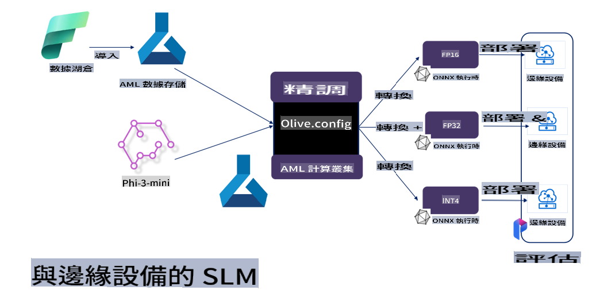

# **Phi-3-ийг Microsoft Olive ашиглан нарийвчлан тохируулах**

[Olive](https://github.com/microsoft/OLive?WT.mc_id=aiml-138114-kinfeylo) нь загвар шахалт, оновчлол, болон компиляцийн чиглэлээр салбартаа тэргүүлэгч аргуудыг нэгтгэдэг, тоног төхөөрөмжид зориулсан оновчлолын хэрэгсэл юм.

Энэхүү хэрэгсэл нь машин сургалтын загваруудыг тодорхой тоног төхөөрөмжийн архитектурт хамгийн үр дүнтэй ашиглахад зориулагдсан бөгөөд оновчлолын процессыг хялбаршуулдаг.

Та үүлэн суурьтай програм эсвэл захын төхөөрөмж дээр ажиллаж байгаа эсэхээс үл хамааран Olive нь таны загваруудыг үр дүнтэй, хялбархан оновчлох боломжийг олгоно.

## Гол онцлогууд:
- Olive нь зорилтот тоног төхөөрөмжид зориулсан оновчлолын аргуудыг автоматжуулж нэгтгэдэг.
- Нэг арга бүх нөхцөлд тохирдоггүй тул Olive нь салбарын мэргэжилтнүүдэд өөрсдийн инновацуудаа нэгтгэх боломжийг олгодог.

## Инженерийн ажлыг багасгах:
- Хөгжүүлэгчид загвар бэлтгэх, оновчлоход зориулсан олон төрлийн тоног төхөөрөмжийн хэрэгслүүдийг судалж ашиглах шаардлагатай болдог.
- Olive нь энэ туршлагыг автоматжуулснаар оновчлолын аргуудыг хялбаршуулдаг.

## Бэлэн E2E оновчлолын шийдэл:

Olive нь интеграцчлагдсан аргуудыг бүрдүүлж, нарийвчлан тохируулснаар төгсгөлийн оновчлолын нэгдсэн шийдлийг санал болгодог.
Загварыг оновчлохдоо нарийвчлал, хоцрогдол зэрэг хязгаарлалтуудыг харгалзан үздэг.

## Microsoft Olive ашиглан нарийвчлан тохируулах

Microsoft Olive нь нээлттэй эхийн, ашиглахад хялбар загвар оновчлолын хэрэгсэл бөгөөд үүнийг үүсгэгч хиймэл оюуны салбарт нарийвчлан тохируулах болон лавлагаанд ашиглаж болно. Зөвхөн энгийн тохиргоо хийхэд хангалттай бөгөөд нээлттэй эхийн жижиг хэлний загварууд болон холбогдох runtime орчинтой (AzureML / локал GPU, CPU, DirectML) хослуулан ашигласнаар загварыг автоматаар оновчлон нарийвчлан тохируулах, үүлэнд эсвэл захын төхөөрөмж дээр байрлуулахад тохиромжтой загварыг олох боломжтой. Ингэснээр байгууллагууд өөрсдийн салбарын босоо чиглэлийн загваруудыг локал болон үүлэн орчинд бүтээх боломжтой.


## Phi-3-ийг Microsoft Olive ашиглан нарийвчлан тохируулах 



## Phi-3 Olive жишээ код ба жишээ
Энэ жишээнд Olive ашиглан дараах ажлуудыг хийнэ:

- LoRA адаптерыг нарийвчлан тохируулж өгүүлбэрийг Гуниг, Баяр, Айдас, Гайхах гэсэн ангилалд хуваах.
- Адаптерын жинг үндсэн загварт нэгтгэх.
- Загварыг int4 болгон оновчлох ба тоон болгох.

[Жишээ код](../../code/03.Finetuning/olive-ort-example/README.md)

### Microsoft Olive-г тохируулах

Microsoft Olive-г суулгах нь маш хялбар бөгөөд CPU, GPU, DirectML болон Azure ML-д зориулан суулгаж болно.

```bash
pip install olive-ai
```

Хэрэв та ONNX загварыг CPU ашиглан ажиллуулахыг хүсвэл:

```bash
pip install olive-ai[cpu]
```

Хэрэв та ONNX загварыг GPU ашиглан ажиллуулахыг хүсвэл:

```python
pip install olive-ai[gpu]
```

Azure ML ашиглахыг хүсвэл:

```python
pip install git+https://github.com/microsoft/Olive#egg=olive-ai[azureml]
```

**Анхааруулга**
Үйлдлийн системийн шаардлага: Ubuntu 20.04 / 22.04 

### **Microsoft Olive-ийн Config.json**

Суулгасны дараа Config файлыг ашиглан загвар тус бүрийн тохиргоог хийх боломжтой. Үүнд өгөгдөл, тооцоолол, сургалт, байршуулалт, загвар үүсгэх тохиргоо орно.

**1. Өгөгдөл**

Microsoft Olive дээр локал болон үүлэн өгөгдөл дээр сургалт хийхийг дэмждэг бөгөөд тохиргоонд тохируулж болно.

*Локал өгөгдлийн тохиргоо*

Нарийвчлан тохируулахад шаардлагатай өгөгдлийн багцыг json форматад тохируулан тохируулахад хангалттай. Энэ нь загварын шаардлагад (жишээ нь Microsoft Phi-3-mini-д шаардлагатай форматад тохируулах) үндэслэн тохируулах шаардлагатай.

```json

    "data_configs": [
        {
            "name": "dataset_default_train",
            "type": "HuggingfaceContainer",
            "load_dataset_config": {
                "params": {
                    "data_name": "json", 
                    "data_files":"dataset/dataset-classification.json",
                    "split": "train"
                }
            },
            "pre_process_data_config": {
                "params": {
                    "dataset_type": "corpus",
                    "text_cols": [
                            "phrase",
                            "tone"
                    ],
                    "text_template": "### Text: {phrase}\n### The tone is:\n{tone}",
                    "corpus_strategy": "join",
                    "source_max_len": 2048,
                    "pad_to_max_len": false,
                    "use_attention_mask": false
                }
            }
        }
    ],
```

**Үүлэн өгөгдлийн тохиргоо**

Azure AI Studio/Azure Machine Learning Service-ийн өгөгдлийн санг холбоход үүлэн өгөгдлийг холбох боломжтой. Microsoft Fabric болон Azure Data-г ашиглан өөр өөр өгөгдлийн эх үүсвэрийг Azure AI Studio/Azure Machine Learning Service-д холбож нарийвчлан тохируулах өгөгдөлд ашиглах боломжтой.

```json

    "data_configs": [
        {
            "name": "dataset_default_train",
            "type": "HuggingfaceContainer",
            "load_dataset_config": {
                "params": {
                    "data_name": "json", 
                    "data_files": {
                        "type": "azureml_datastore",
                        "config": {
                            "azureml_client": {
                                "subscription_id": "Your Azure Subscrition ID",
                                "resource_group": "Your Azure Resource Group",
                                "workspace_name": "Your Azure ML Workspaces name"
                            },
                            "datastore_name": "workspaceblobstore",
                            "relative_path": "Your train_data.json Azure ML Location"
                        }
                    },
                    "split": "train"
                }
            },
            "pre_process_data_config": {
                "params": {
                    "dataset_type": "corpus",
                    "text_cols": [
                            "Question",
                            "Best Answer"
                    ],
                    "text_template": "<|user|>\n{Question}<|end|>\n<|assistant|>\n{Best Answer}\n<|end|>",
                    "corpus_strategy": "join",
                    "source_max_len": 2048,
                    "pad_to_max_len": false,
                    "use_attention_mask": false
                }
            }
        }
    ],
    
```

**2. Тооцооллын тохиргоо**

Хэрэв танд локал орчин шаардлагатай бол локал өгөгдлийн нөөцийг шууд ашиглаж болно. Azure AI Studio / Azure Machine Learning Service-ийн нөөцийг ашиглах шаардлагатай бол холбогдох Azure параметрүүд, тооцооллын нэр зэргийг тохируулах хэрэгтэй.

```json

    "systems": {
        "aml": {
            "type": "AzureML",
            "config": {
                "accelerators": ["gpu"],
                "hf_token": true,
                "aml_compute": "Your Azure AI Studio / Azure Machine Learning Service Compute Name",
                "aml_docker_config": {
                    "base_image": "Your Azure AI Studio / Azure Machine Learning Service docker",
                    "conda_file_path": "conda.yaml"
                }
            }
        },
        "azure_arc": {
            "type": "AzureML",
            "config": {
                "accelerators": ["gpu"],
                "aml_compute": "Your Azure AI Studio / Azure Machine Learning Service Compute Name",
                "aml_docker_config": {
                    "base_image": "Your Azure AI Studio / Azure Machine Learning Service docker",
                    "conda_file_path": "conda.yaml"
                }
            }
        }
    },
```

***Анхааруулга***

Учир нь энэ нь Azure AI Studio/Azure Machine Learning Service дээрх контейнерээр ажилладаг тул шаардлагатай орчныг тохируулах шаардлагатай. Энэ нь conda.yaml орчинд тохируулагдсан байна.

```yaml

name: project_environment
channels:
  - defaults
dependencies:
  - python=3.8.13
  - pip=22.3.1
  - pip:
      - einops
      - accelerate
      - azure-keyvault-secrets
      - azure-identity
      - bitsandbytes
      - datasets
      - huggingface_hub
      - peft
      - scipy
      - sentencepiece
      - torch>=2.2.0
      - transformers
      - git+https://github.com/microsoft/Olive@jiapli/mlflow_loading_fix#egg=olive-ai[gpu]
      - --extra-index-url https://aiinfra.pkgs.visualstudio.com/PublicPackages/_packaging/ORT-Nightly/pypi/simple/ 
      - ort-nightly-gpu==1.18.0.dev20240307004
      - --extra-index-url https://aiinfra.pkgs.visualstudio.com/PublicPackages/_packaging/onnxruntime-genai/pypi/simple/
      - onnxruntime-genai-cuda

    

```

**3. SLM сонгох**

Та загварыг Hugging Face-ээс шууд ашиглах эсвэл Azure AI Studio / Azure Machine Learning-ийн Model Catalog-тай хослуулан ашиглах боломжтой. Доорх кодын жишээнд Microsoft Phi-3-mini-г ашигласан болно.

Хэрэв танд загвар локал орчинд байгаа бол дараах аргыг ашиглаж болно:

```json

    "input_model":{
        "type": "PyTorchModel",
        "config": {
            "hf_config": {
                "model_name": "model-cache/microsoft/phi-3-mini",
                "task": "text-generation",
                "model_loading_args": {
                    "trust_remote_code": true
                }
            }
        }
    },
```

Хэрэв та загварыг Azure AI Studio / Azure Machine Learning Service-ээс ашиглахыг хүсвэл дараах аргыг ашиглаж болно:

```json

    "input_model":{
        "type": "PyTorchModel",
        "config": {
            "model_path": {
                "type": "azureml_registry_model",
                "config": {
                    "name": "microsoft/Phi-3-mini-4k-instruct",
                    "registry_name": "azureml-msr",
                    "version": "11"
                }
            },
             "model_file_format": "PyTorch.MLflow",
             "hf_config": {
                "model_name": "microsoft/Phi-3-mini-4k-instruct",
                "task": "text-generation",
                "from_pretrained_args": {
                    "trust_remote_code": true
                }
            }
        }
    },
```

**Анхааруулга:**
Azure AI Studio / Azure Machine Learning Service-тэй интеграцчлагдсан байх шаардлагатай тул загварыг тохируулахдаа хувилбарын дугаар болон холбогдох нэршлийг харгалзан үзнэ үү.

Azure дээрх бүх загварыг PyTorch.MLflow хэлбэрээр тохируулах шаардлагатай.

Hugging Face-ийн данстай байх шаардлагатай бөгөөд үүнийг Azure AI Studio / Azure Machine Learning-ийн Key утгатай холбох шаардлагатай.

**4. Алгоритм**

Microsoft Olive нь LoRA болон QLoRA нарийвчлан тохируулах алгоритмуудыг маш сайн нэгтгэсэн. Та зөвхөн зарим холбогдох параметрүүдийг тохируулахад хангалттай. Энд QLoRA-г жишээ болгон авч үзье.

```json
        "lora": {
            "type": "LoRA",
            "config": {
                "target_modules": [
                    "o_proj",
                    "qkv_proj"
                ],
                "double_quant": true,
                "lora_r": 64,
                "lora_alpha": 64,
                "lora_dropout": 0.1,
                "train_data_config": "dataset_default_train",
                "eval_dataset_size": 0.3,
                "training_args": {
                    "seed": 0,
                    "data_seed": 42,
                    "per_device_train_batch_size": 1,
                    "per_device_eval_batch_size": 1,
                    "gradient_accumulation_steps": 4,
                    "gradient_checkpointing": false,
                    "learning_rate": 0.0001,
                    "num_train_epochs": 3,
                    "max_steps": 10,
                    "logging_steps": 10,
                    "evaluation_strategy": "steps",
                    "eval_steps": 187,
                    "group_by_length": true,
                    "adam_beta2": 0.999,
                    "max_grad_norm": 0.3
                }
            }
        },
```

Хэрэв та тоон хувиргалт хийхийг хүсвэл Microsoft Olive-ийн үндсэн салбар нь onnxruntime-genai аргыг дэмждэг. Та дараах байдлаар тохируулж болно:

1. адаптерын жинг үндсэн загварт нэгтгэх
2. ModelBuilder ашиглан загварыг шаардлагатай нарийвчлалтай onnx загварт хөрвүүлэх

жишээ нь int4 болгон тоон болгох:

```json

        "merge_adapter_weights": {
            "type": "MergeAdapterWeights"
        },
        "builder": {
            "type": "ModelBuilder",
            "config": {
                "precision": "int4"
            }
        }
```

**Анхааруулга** 
- Хэрэв та QLoRA-г ашиглаж байгаа бол ONNXRuntime-genai-ийн тоон хувиргалтыг одоогоор дэмжихгүй.

- Энд дурдсан алхмуудыг өөрийн хэрэгцээнд тохируулан тохируулах боломжтой. Эдгээр бүх алхмуудыг бүрэн тохируулах шаардлагагүй. Хэрэгцээнээс хамааран алгоритмын алхмуудыг шууд ашиглах боломжтой. Эцэст нь холбогдох хөдөлгүүрүүдийг тохируулах шаардлагатай.

```json

    "engine": {
        "log_severity_level": 0,
        "host": "aml",
        "target": "aml",
        "search_strategy": false,
        "execution_providers": ["CUDAExecutionProvider"],
        "cache_dir": "../model-cache/models/phi3-finetuned/cache",
        "output_dir" : "../model-cache/models/phi3-finetuned"
    }
```

**5. Нарийвчлан тохируулах ажлыг дуусгах**

Командын мөрөнд olive-config.json файлын байрлалд дараах командыг ажиллуулна:

```bash
olive run --config olive-config.json  
```

It seems you requested a translation to "mo," but it's unclear what "mo" refers to. Could you clarify the language or provide additional context? For example, do you mean Maori, Mongolian, or another language? Let me know so I can assist you accurately!