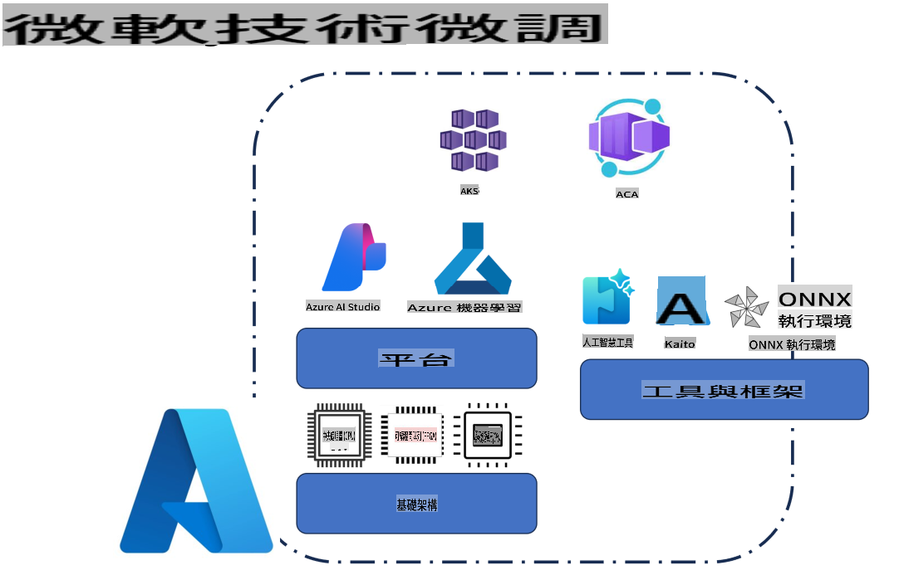
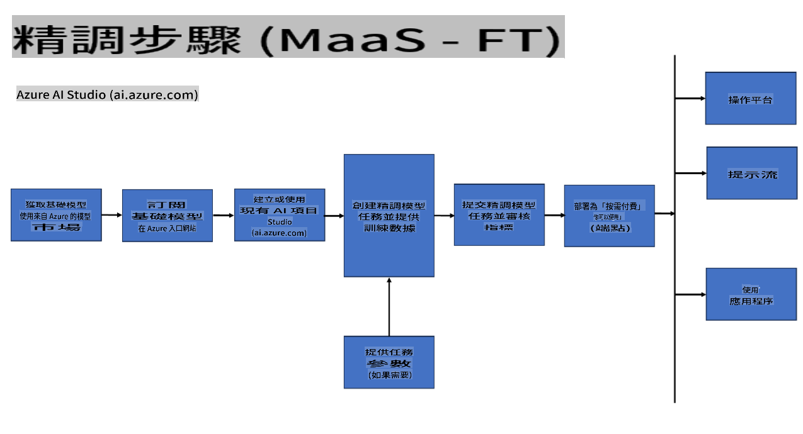
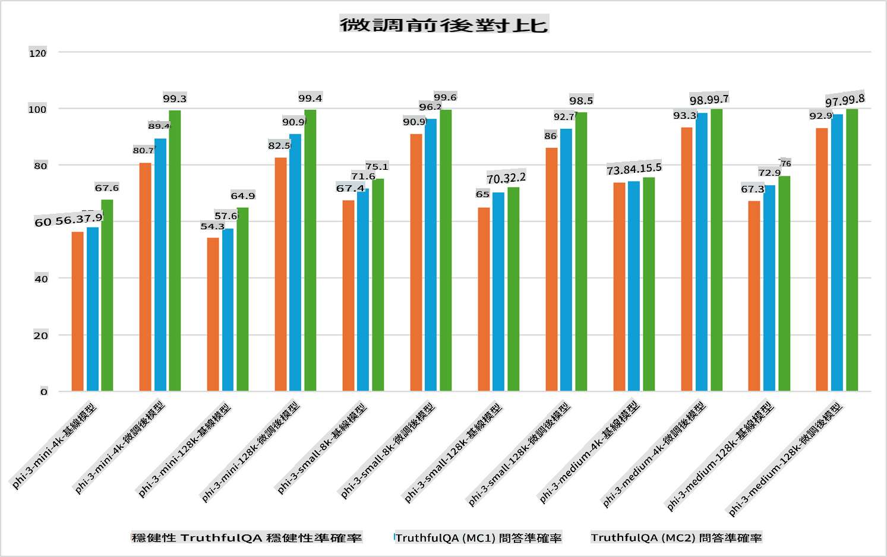

## ማስተካከያ ምሳሌዎች

**መድረክ** ይህ እንደ Azure AI Foundry, Azure Machine Learning, AI Tools, Kaito, እና ONNX Runtime ያሉ በርካታ ቴክኖሎጂዎችን ያካትታል። 

**አወላጅ መዋቅር** ይህ በማስተካከያ ሂደት ውስጥ አስፈላጊ የሆኑትን CPU እና FPGA ያካትታል። የእነዚህን ቴክኖሎጂዎች አዶች እናሳይላችሁ።

**መሣሪያዎች እና አብነት እቅፍ** ይህ በርካታ ጊዜ ONNX Runtime እና ONNX Runtime እንደሆነ ይወስዳል። የእነዚህን መሣሪያዎች አዶች እናሳይላችሁ።  
[Insert icons for ONNX Runtime and ONNX Runtime]

ከ Microsoft ቴክኖሎጂዎች ጋር የማስተካከያ ሂደት በተለያዩ አካላትና መሣሪያዎች ይደገፋል። እነዚህን ቴክኖሎጂዎች በመረዳትና በመጠቀም መተግበሪያችንን በተጠናከር ሁኔታ ማስተካከያ እና የተሻለ መፍትሄዎችን መፍጠር እንችላለን።

## አብነት እንደ አገልግሎት

አብነቱን ማስተካከያ በማስተናገድ እና ማስተዳደር ያልተፈለገ ኮምፒዩት ሳይፈጽም።

ሳርቨርሌስ ማስተካከያ ለ Phi-3-mini እና Phi-3-medium አብነቶች ይገኛል። ይህም አቅራቢዎችን ለደመና እና የጫና ሁኔታዎች በፍጥነት እና በቀላሉ ማስተካከያ እንዲያከናውኑ ያስችላቸዋል። እንዲሁም እንደ Phi-3-small የተባለው አሁን በእኛ የአብነት እንደ አገልግሎት እቅፍ ውስጥ እንዳለ አስታውቀናል። እንዲሁም አቅራቢዎች የመጀመሪያ ደረጃ የ AI ልምድን ማግኘት ሳላስቸግራቸው ማስተካከያ መሥራት ይችላሉ።

## አብነት እንደ መድረክ

ተጠቃሚዎች ራሳቸውን ኮምፒዩት በማስተዳደር አብነታቸውን ማስተካከያ ያከናውናሉ።

[Fine Tuning Sample](https://github.com/Azure/azureml-examples/blob/main/sdk/python/foundation-models/system/finetune/chat-completion/chat-completion.ipynb)

## ማስተካከያ ምሳሌዎች 

| | | | | | | |
|-|-|-|-|-|-|-|
|ምሳሌ|LoRA|QLoRA|PEFT|DeepSpeed|ZeRO|DORA|
|የተዘጋጀ የትምህርት አብነቶችን ለተወሰኑ ስራዎች ወይም ዘርፎች ማስተካከያ|አዎ|አዎ|አዎ|አዎ|አዎ|አዎ|
|ለጽሑፍ መደበኛ እንደ ጽሁፍ ምርመራ፣ የስም እንድታውቅ እና የትርጉም ትርጉም ያሉ የ NLP ስራዎች ማስተካከያ|አዎ|አዎ|አዎ|አዎ|አዎ|አዎ|
|ለጥያቄ መልስ ስራዎች ማስተካከያ|አዎ|አዎ|አዎ|አዎ|አዎ|አዎ|
|በቻቦትስ ውስጥ እንደ ሰው ቅርብ መልስ ማቅረብ ማስተካከያ|አዎ|አዎ|አዎ|አዎ|አዎ|አዎ|
|ሙዚቃ፣ ሥነ ጥበብ ወይም ሌሎች የፈጠራ አይነቶችን ማቅረብ ማስተካከያ|አዎ|አዎ|አዎ|አዎ|አዎ|አዎ|
|የኮምፒዩተር እና የገንዘብ ወጪዎችን መቀነስ|አዎ|አዎ|አይ|አዎ|አዎ|አይ|
|የማስተካከያ እንቅስቃሴን ማስቀላለጥ|አይ|አዎ|አይ|አዎ|አዎ|አዎ|
|እንደሚቻል በቀላሉ ማስተካከያ ማስፈጸም የሚያስችል አነስተኛ መለኪያ መጠቀም|አይ|አዎ|አዎ|አይ|አይ|አዎ|
|እንደ GPU መሳሪያዎች የጋራ ኮምፒዩት እንቅስቃሴ ማስተካከያ የሚያስችል የማስተካከያ ሂደት|አይ|አይ|አይ|አዎ|አዎ|አዎ|

## የማስተካከያ አፈጻጸም ምሳሌዎች

It seems like you want the text translated to "mo." Could you clarify what "mo" refers to? For instance, is it a specific language like Māori, Mongolian, or something else? Let me know so I can assist you accurately!